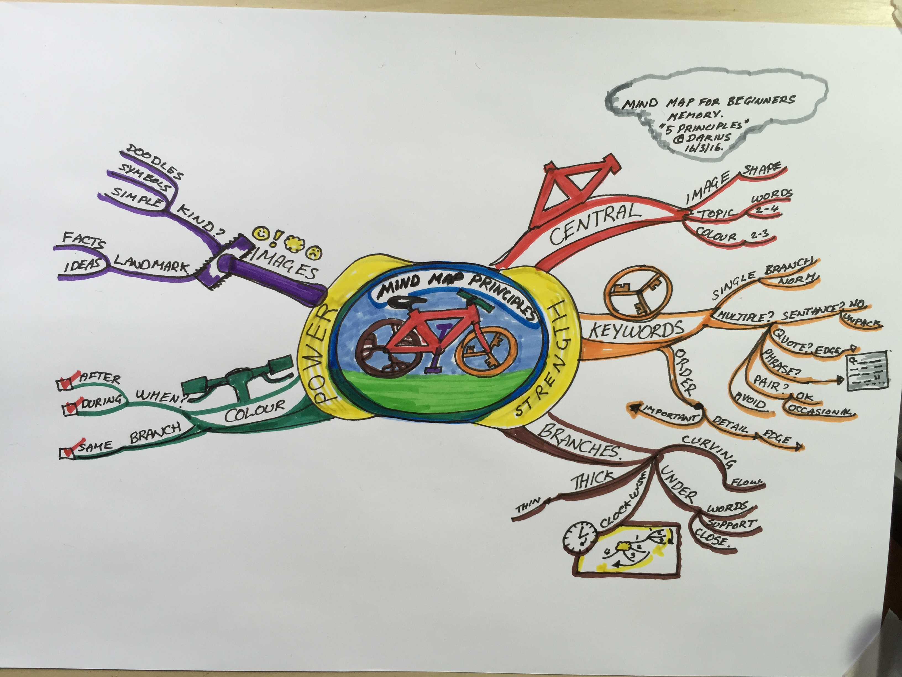
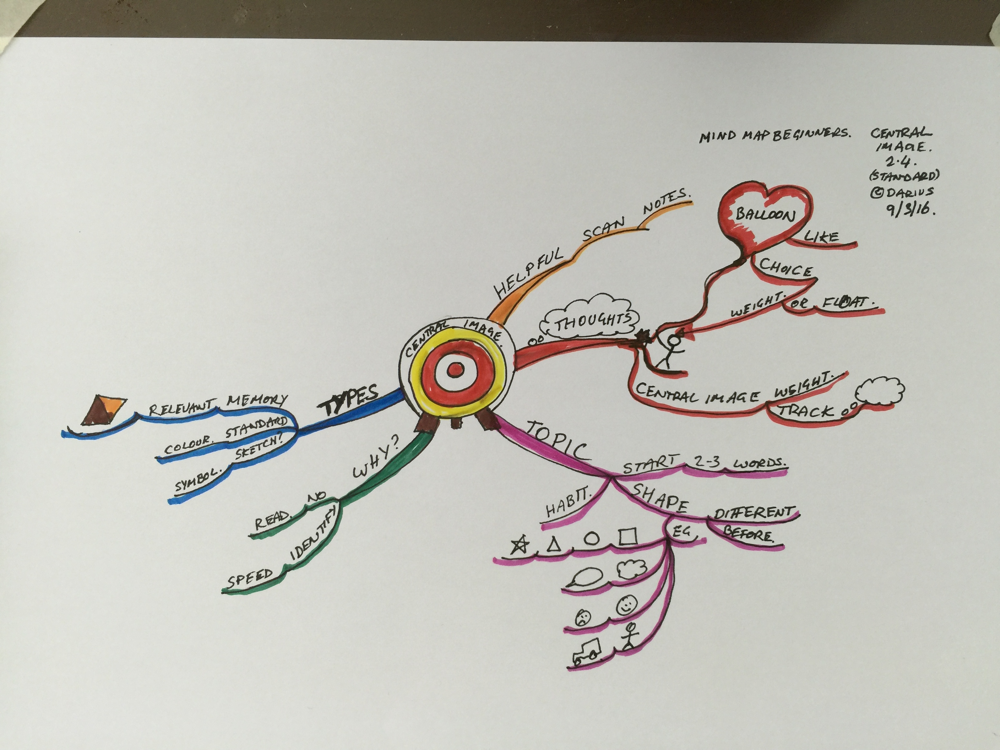
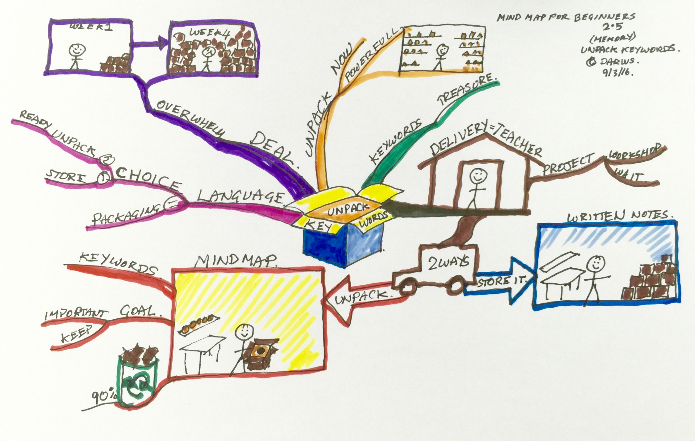
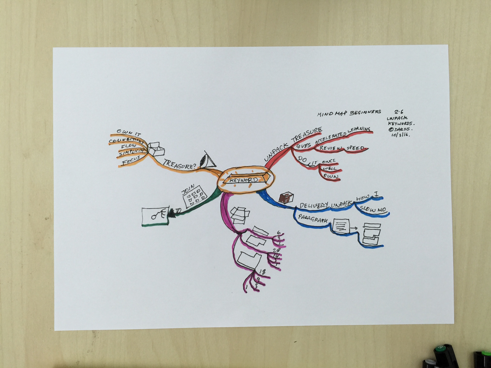
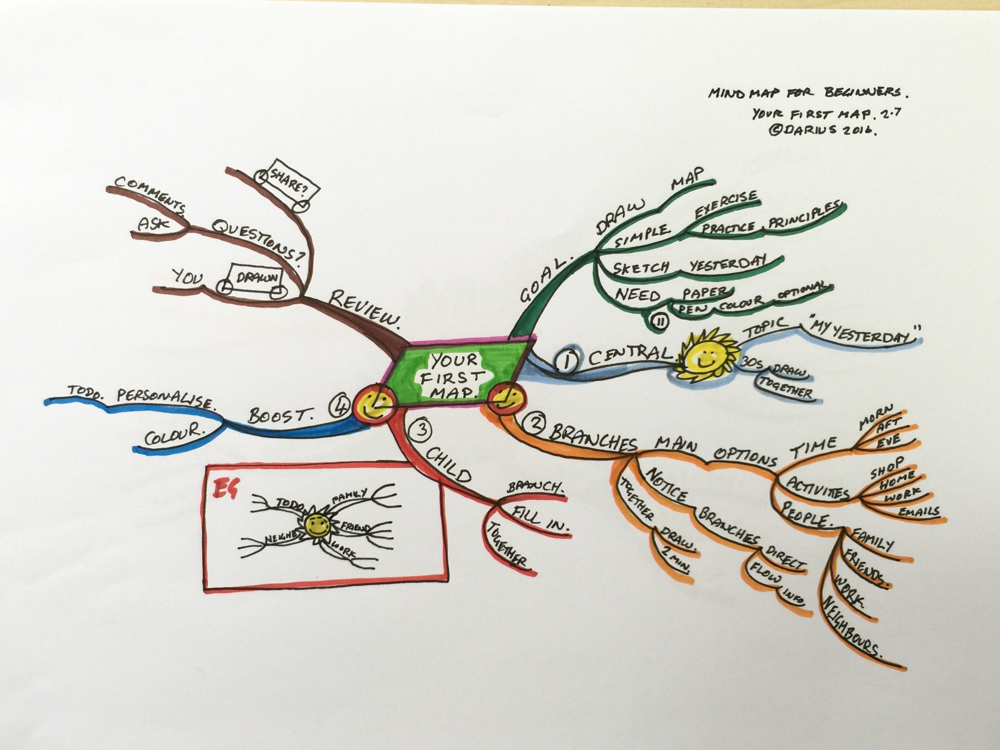
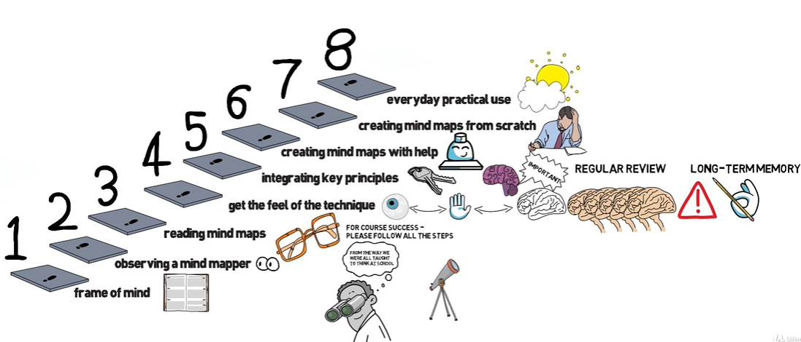
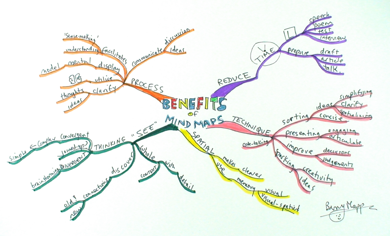

= Mind Maps
:toc: top
:toclevels: 5
:sectnums:
:sectnumlevels: 5

NOTE: NOTE

TIP: TIP

IMPORTANT: IMPORTANT

CAUTION: CAUTION

WARNING: WARNING

== Mind map for Beginners. How to make learning fun and fast - Darius Namdaran

=== Section 1: Introduction to the course

*How to Mind Map in 3 min :)*

In this video, I'm going to show you how to mind map in three minutes flat. It's a quick start overview of how to mind map with five main principles.*The five main principles are central image, keywords, curving branches, color and images*. I'm going to use a mind map to show you how to do that. The *first* principle is central image or a central shape. We take a topic with two to four keywords in that topic and surround it with an image or a shape. And then if we've got time, we use two or three colors to focus our minds on it. The *second* principle is the use of keywords. We use a single word on each branch not sentences. We unpack sentences down into their essential keywords, writing them down in capitals, and the order keywords are written down in mind maps are different from sentences. We order them, so the important words are towards the center, and the details are towards the edge. *Then* we use curving branches underneath the words to support them and connect them and keep them close to each other. The branches are ordered in clockwise order. Those are the first three principles of mind mapping. The next two principles give your mind map power. Those two principles are *color* and *images*. The *color* is used to color each branch the same. When do you do that? There's different ways you can do it, you can do it during your mind map, while you're drawing the branches. You can draw them in color, or you can do it in black and white. And you can color it in branch by branch, or at the end of the map. The *fifth* principle is images, and we use images to mark landmark ideas and facts. The kind of images we use are symbols, simple images and doodles. Those are the five main principles of mind mapping - in a nutshell. In the rest of this course, I'll be unpacking how those principles work. In the next video, I'm going to show you how this course works, how the time-lapse photography works and how to get the very most out of it. See there.

=== Section 2: How to Mind Map - Beginners Basic

*How to mind map: The Five core principles*

In this video, I'm going to show you how to mind map. Few videos back, I showed you the five principles of mind mapping with what I would call a standard map, and now I'm going to use a memory map. *Mind mapping has five principles: central image, keywords, curving branches, color and images*. Here you can see, there's the strength of a mind map on one side and the power on the other. The first three principles give your mind map strength. The second, to give it power. There's no point having power, if you don't have a strong structure. So, the first three principles are crucial. They are central image, keywords and curving branches. I've got a little bike here, and I'm using the bike as a little image for myself, to understand mind mapping. You've got a bike with a bike frame. The bike frame is crucial to the bike, and so is a central image, it's crucial to your mind map. Starting in the center of the page, and having some source of image or shape there, with your topic written out. And ideally, two or three colors, unless it's a sketch map. So you've got your central image. Principle two - we've got our keywords. Here, I've got a wheel and can you see the keys? The idea is that the keywords are a single word on each branch, that's the norm. People often ask, "Can I have multiple words?" Well, a sentence, no, not really. The idea is to unpack sentences into keywords, but maybe sometimes you want a quote, that's fine. You move it towards the edge, and maybe Instagram style it, put it in a box or something like that. What about a phrase? It's rare to have a phrase, and you know two or three or four words but you can put two or three or four words in, if it's like a short quote or something like that. Something really important. What about a pair of words? Yes, sometimes a keyword can be a pairing of words and occasionally that's fine too. Try and avoid multiple words as much as possible. Try and stick to single words on a branch. It's a really useful tip that gets you more out of the mind map. The next question is, what order do you put the keywords into? What position should we go into? You've stripped down the sentence into key words. We don't use sentence order, we order it according to importance. The really important words move towards the center like topic words, and the key words. And then the details move towards the edge. The third principle is curving branches, and the idea of curving branches is it maintains the flow of information and makes it quite attractive to your eye to engage you in reading your mind map. The branches go underneath the words to support them and keep them close. If you don't put your branches under the words, and you do a branch and then a word, a branch and then a word at the end of it, your mind map gets very spidery, very quickly and falls off the edge of the page. We put the branches in clockwise order, like this, and you do the main branches in clockwise order and then you also do the sub branches in clockwise order. Even once you get to nine o'clock, you do it in clockwise order, which can feel a bit counter intuitive at the beginning. Now if you want to do a different way then that's fine as well but make sure you consistently do it the same way each time. If you're showing your mind map to someone who's used to doing mind mapping, they will probably expect it to be in clockwise order all the way. Although some computer programs do it, from top to bottom and it just depends, but I would recommend sticking with the clockwise all the time, order. The branches go from thick to thin like a real tree. The thick shows the relative importance of those keywords compared to the thin details along the edge. So those are the three main principles of mind mapping. If you get them right, you have a really strong structure to your map, but the power of your mind map comes from adding in color and keywords. Obviously you've already got power in your mind map because you've got those key words, they're crucial, but to make it really memorable and engaging for your mind, color and images really help. So let's look at the fourth principle: using color. We color our branches the same color. We do that, either, as we do the branches or you can do it in black and white, and then color each branch system at a time or you can do the whole map in black and white and recolor, color the whole thing at the end. Each has its own advantages. The fifth principle is using images. Use the images as, for landmark ideas and facts. Landmark ideas and facts are those sorts of things that you know will be important at some point. Now you can mark them in very simple ways. The kinds of images we use are simple, often symbols or doodle. They might develop into something more artistic in the future, but don't get too caught up in being an artist. We've covered five principles of mind mapping and we're going to go into a few of those principles in a little bit more detail in the next videos. The next video, we're going to talk a bit about central image

*How Central images ancor ideas and keep your focus*

=== Section 3

*Effective mind mapping Core Skill- Target Keywords.*

*A fun little 'cut out' exercise to unpack valuable Keywords*

=== Section 4

=== Section 5

*Top 5 reasons people use mindmapping instead of written notes*

image::mind-maps/Map6.JPG[]

Hi! In this video, I'm going to look at why people choose mind mapping over and above written notes. It comes down to in my experience *five main reasons*. *I found I wanted to focus on the main subject while I was listening to lectures or reading books, I wanted to simplify the information but not dumb it down. I wanted to keep the flow of the information and keep the detail, not get lost in the detail. I wanted to identify the important connections in the information and not lose track of them. And then fifthly, I wanted to own it. I wanted to know it and understand it and be able to share it in my way*.

So, what I found is that mind mapping is a bit like a coach - that's constantly encouraging me into good habits of studying and learning, in all sorts of areas in my life. *I've used it for my law degree, for primary school teaching, for building some businesses. I've used it in public speaking, community work*. There's all sorts of ways to use this, so focus. When you're studying, I don't know if you've ever experienced this, but you can be listening to someone teaching and half the way through you start wondering, "What are we learning about here?" because you've got lost in the detail. *It's really important for mind mappers to keep the topic in the middle of the page*. And the reason we put it in the middle of the page, is it's like a target that we're constantly connecting everything to, *so it constantly reminds our mind that our focus is that topic and not to get distracted*. The *second thing* that makes people want to work with mind maps, is the *desire to keep things simple and to simplify things*. Einstein says, "A genius makes complex things simple." And what we're talking about here is distilling information but not dumbing it down. And the way mind mapping does that is through keywords. Now, keywords are the Cinderella of mind mapping. People look at mind maps and say, "Oh, it's all about the pictures, it's all about the colors, all about the branches." *Actually the most powerful thing about mind mapping is keywords*, because keywords help you simplify the information. Take a whole sentence, and bring it down into two or three keywords, and whole concepts can be summed up into keywords. It's made Google billions of pounds, the power of keywords. Take hashtags, those are keywords. Keywords are incredibly powerful and the ability to think about things with keywords is a really great skill and mind mapping is like a coach. *It's constantly coaching you to distill information down into the key words and the key concepts*. I love that about mind mapping because it's so easy to get lost in lots of words and lots of ideas but the skill in this world and this time is to simplify and distill things without dumbing them down and the way to do that is with key words.

*The third reason* that people use mind mapping is to find the flow of an argument, or flow of information. Now I don't know if you've ever been in a lesson or a lecture or reading a book where you started off with the main topic and then you get lost in details. Now details are really important but getting lost in details happen so often in the middle of a lecture because you've got out of the flow of the main track of information. How do you track the flow? Well, with written notes people often write a subtopic and then detail, subtopic, detail, subtopic, detail. Mind mapping does that with main branches and detail branches, so you can wherever you are in the detail you always look back and you can see where you are in the main flow of the argument.

The *fourth reason* why people mind map is to identify valuable connections. When you're learning, a lot of learning is about not just knowing something but understanding it, and key to understanding it is understanding how things connect. You'll see that, when you're listening to someone doing a talk, they want to start with an event, a fact, show you some things that happened in the middle and end with the conclusion. If it's a short talk or a short video, you get that very clearly. There's a start, there's a few points and then there's a strong conclusion. In a long lecture or in a full chapter, there can be four or five or eight of these, and it's very easy to get lost in amongst them and they can overlap a bit when they're discussing one thing and then flipping over into something else and you can get lost in this. How many times have you been taking notes and you end up thinking to yourself, I don't know what he's saying or she's saying, because I'm just concentrating on writing down as much as I possibly can. And how many times have you gone to the other extreme and said I'm not going to write any notes because it's just getting in the way. Now you know it's really important to write notes because while you're in the middle of it all makes sense but when you get out you start to think, Oh I need to remember that fact. *Now mind mapping is somewhere between writing tons of unnecessary notes and writing no notes*. It's in the middle of capturing what is essential. And so you end up finding, your owning the information, as you're hearing it. Mind mapping really helps you remember things too. I've got terrible memory. I really need mind mapping to remember things before an exam. In this video, I've shown you five reasons why people choose to mind map instead of written notes. Focusing on the main thing, simplifying things but not dumbing it down, keeping the flow of information, keeping in the flow of information and understanding, finding the valuable connections, and owning it while you're learning it. Now, I want to show you in the next section how to mind map. So see you in the next video.

=== Section 6

=== Section 7

---

image::mind-maps/Map8.JPG[]

== Mind Mapping Mastery Effective Mind Maps Step by Step - Barry Mapp

*Maximizing Value*

* [ ] *Fundamentals*: Learn the concepts
* [ ] *Information*: Do POC from the course
* [ ] *Skills*: Use / Implement it in Project
* [ ] *Innovation / Expert*: Value for next 2 Years

*Objective*

* [ ] *History*:
* [ ] *Agenda-While doing this course what is the Agenda [1,2,3,4,5..]*:
* [ ] Exam Notes
* [ ] *Why OneNote Notes*:
* [ ] *What is Pending*:

=== Section 1: Course Purpose & Structure

*Structure of the Course*

I'm going to talk about the structure of the course. Now when we learn anything new it's so much easier if we can break the process or technique down into simple steps. And this is the same whether you're learning to jog or ride a bicycle or in this case learning to become an effective mind mapper. The process of learning mind mapping on this course I've divided into *eight steps* and I'll quickly take you through these as an overview. 

*Step one* is getting us into the right frame of mind for the course being mentally prepared for new learning and putting time aside in your diary in order to do the course justice. 

*Step two* is observing a mind mapper at work observing the master at work has always been how an apprentice starts out in any of the crafting professions and mind mapping is a craft as much as it is a tool or a process. So observation is a tried and tested start up method. So in this step you will be standing over my shoulder watching me seeing me create my mind maps whilst at the same time through my running commentary, you'll be hearing the thought processes going on in my head as I create the map. Do please pay attention to this commentary and don't rush through these lectures as I am sharing with you the thought processes that are required in order to construct effective mind maps. And this is different from the linear piece by piece way we were taught to think at school. 

In the *third step* you'll be reading through a series of mind maps. What we are doing here is simply learning to read before we learn to write. Indeed I don't ask you to start creating drawing or writing your own mind maps until we get on to Step 6. So for now you are able to relax if all of this is new to you. 

*Step 4* is a further opportunity to get the feel of the technique and to practice eye-hand-brain coordination when it comes to creating mind maps. Now this is a copying step and as most of us are not good at copying you may find initially that what you are creating will look somewhat different from what you are copying. So do pay attention to this step and don't skimp it. Basically what you're doing here is grasping the technique through the use of your writing hand. 

In *Step 5* we spend some time ensuring that we've integrated the main key principles that underpin the construction of effective mind maps. So again don't leave out step 5. And whenever we review information we are telling our brain. This is important and I need to remember it. And it is this process of regular review which helps us to transfer new learning into our long term memory. 

Then when we get to *step 6* you'll actually be creating your first mind maps with a helping hand from me. 

And finally in *Step 7* you're creating your very own mind maps from scratch. And please don't be tempted to start drawing your mind maps until you get to this stage. Otherwise in my experience you'll find you'll have picked up some bad habits which can then be really difficult to rectify. 

*Step 8* is where you look to put mind mapping into everyday practical use in your work in your life and you'll be reflecting upon what you've learnt and planning out how best to make use of mind maps for you personally going forward. Practice makes permanent and good practice makes for effective mind mapping.

=== Section 2: Observer a Mind Mapper at Work

*Benefits of Mind Mapping*

Okay, I want to mind map the benefits of mind mapping. So let's see how we might go about that. Okay so what are some of the benefits of mind mapping it's great productivity tool. It helps us to reduce the times of certain things so want to put that on. And it's a very versatile technique and it's visual and spatial. The benefits of spatialness is to make visible certain stuff so it's to see stuff But if it's a mind map one of the key things is that it reduces the time again if you're artistic you can always put in some thing representing the time...it reduces the time to learn. an L plate saying that the L represents learning so reduces the time for learning. Well anything really so learning a speech a poem learning for a test. So on preparing for an interview reduces the time to prepare things like a draft an article talk as a technique. It's very useful for sorting stuff out for organizing and sorting. For presenting for improving. For sparking creativity. So If we do stuff spatially it makes clearer use memory that this is visual spatial. Can you see how we can work I can add detail here. Here I can I don't have to work in a linear way so it can go and have a think about sorting the fact that the technique helps us sort out. Any ideas or issues that we may have. Simplifying clarifying spatializing it sorts naturally helps us us to be quite concise about stuff with presenting we can deliver presentations that are engaging articulate improve our decision making judgements note taking and with a mind map it helps us to see the whole. And also with the detail. So it is very much context helps us to see the context as well as the detail and helps us discover new connections new ones and actually rediscover old ones and it helps us to see our thinking our thoughts very important because How often do we reflect upon our thinking. Thinking can be divergent which sort of is often referred to as brainstorming. In thinking we can see is it joined up or not. And important for me is what I call convergent thinking which is moving from the complex to simple. Say something about the actual process of mind mapping itself the process itself helps clarify and it helps us to use utilize brain better clarifies ideas and thoughts we are displaying what we could describe as a mental model of the world our mental model and the process facilitates the process facilitates our understanding and facilitates what can be called sense making. It's a process that helps us communicate ideas to other people. communicate is probably a good overview of some of the benefits of mind mapping and then to just finally enhance the map we can add colour.

*Mind Map an Article*

Okay this video is about looking at how we use my mapping to summarize an article or a book. Now I've taken an article that I wrote some years ago called cultivating the mind. The full title called cultivating the mind for positive health because I wrote it for the magazine. Positive health. And and I'm going to look at this as if I am mind mapping the article, now I would have created a mind map when I wrote the article. All those years ago. I haven't got the original. So what I've done is I've re-read the article and I've created a mind map Now at the moment I really want to show you just the main branches to the mind map and so I've coloured those in because one of the things that the colour does it it. It accentuates. And I'm going to read this as if This was just by an author that I'm not especially familiar with obviously as I said I wrote the article. Would I want to show you how it would look how you would read it if you were reading the mind map that was created as a summary of an article.

So what the author has done here *has chunked the topic into seven main areas*. And actually *chunking* is an important component of mind mapping and we'll be dealing with that in a later section of this course. So let's have a look. Just very briefly at the seven main chunks for the for the article and I've got the red laser pen here. There was uh exercise. So a section on exercising a section on. On learning. And how we learn a section on brain waves and their importance. A section on multiple intels and I've got here the I used an abbreviation. Intel is quite an interesting abbreviation for intelligence because we've all heard of the Intel inside. Microprocessors for computers. You know you have multiple Intels inside your brain. If you like inside your personal computer. And so that's quite a nice play on words. But multiple Intel's means multiple intelligences so there's a section on multiple intelligences a section on competence how we gain competence in a skill. A section on the architecture of the brain. And then at the very end of the article a little bit about mind mapping as this was actually part 1 of a two part article. Part 2 was on on mind mapping and so this article really sort of led into that so just a little bit of an introduction about mind mapping so so that gives a summary of the main headings if you like the main subheadings some of the article. What I'm going to do is I'm going to sort of read this for you. And I'm going to do this by actually colouring in. Now one of the great things about mind mapping is if you add the color later which is *what I actually recommend it's my preference to create a mind map in black and white and then colour in the branches. At the end is as we colour. We can review what we've what we've done*. Now given you a choice here you may have read this article already it's in the resources section of this course. So you may have already chosen to to read it in which case this is reviewing for you what you've read. Equally if you haven't read the article yet this is wetting your appetite to read up on if not the whole of the article on sections of the article which grab your interest as I point out the things that are dealt with in the various sections so. The first part is about we know about exercising the body we know about a healthy body and we sort of know about a healthy mind. But do we exercise the mind in the same way as we exercise the body so there's a section about that and how we might think about exercising the mind a sort of a brain gym as opposed to just having a body gym. Then there is learning. So then there is is learning. And in this section it's about learning how to learn the L plate there. I can put a key to that so that anybody can read this mind map. But a little L plate is the abbreviation I always use in my mind maps to signify learning. So learning how to learn and there's some very interesting stuff about learning cycle the learning cycle that I like to use is from a guy called Phil Race. And if we ever want to add any detail to a mind map that is not in the mind map form that should go in the very periphery of the of of the mind map. So I have just outlined there what the race cycle is and it doesn't matter if you cannot read it at the resolution of the camera because one of the things in the next little section where we focus on just one or two important aspects of cultivating the mind I will be talking briefly about the learning cycle in detail. There's a little bit about learning preferences what some people call learning styles. And the three main recognized learning styles have always been visual auditory and kinaesthetic, so there's something about that in the article. And also about learning rhythms and the rhythms are really to do is how we can maximize how we can use certain of the brain rhythms to maximize retention of information. And and recall. So for example as an optimal amount of time to review what you've learnt in order to transfer it from short term to long term memory, now brainwaves Now I had a senior moment when I was preparing this so I've already coloured in the the. The brainwaves there in brown. Use the marker now. So brainwave talk about the main brainwave states of which there are four. And these four are Beta Alpha Theta and Delta. As a quick summary B eta is the wave brain wave for alertness for escaping from the sabertooth tiger. Alpha wave is the wave for focussed attention. Theta wave is the wave for reverie and daydreaming which is particularly good for the digestion of learning and for long term memory and Delta wave which is sleep is also very important for long term memory. So a summary a very brief summary there of the four brain waves states. And one of the things that mind mapping is doing it is chunking in to what we will discover are levels of hierarchy so brain wave is the top level for this category. Beta, Alpha, Theta and Delta are the sub details and then more detail detail about Beta detail about our Alpha detail about Theta detail about Delta on the more on the periphery so the mind map is always moving from the key heading the key category through to low. What we can call lower levels of abstraction. So from the concept down to the detail in the periphery. There is also a section on multiple intelligences and it really just mentions what those main ones are and in how Gardner's original work. There were seven multiple intelligences and I can colour these in now. There's the yellow and the the seven intelligences are logical linguistic physical visual-spatial. musical. And two personal intelligences interpersonal. And intrapersonal intrapersonal is the intelligence about yourself within you. Within your own body and interpersonal intelligence is the intelligence the social intelligence of being able to communicate well with other persons. Then there's a section on competence and. We can be unconsciously. uncompetent which is the first stage and then. Consciously uncompetent and then consciously competent and then unconsciously competent, so these are numbered one two three four so that's the section on competence. Then there's a section on brain architecture. And this is subdivided into three sections. The individual cell which is the neuron there's a section about the triune brain. The fact that the architecture of the brain is such that it's almost like it's three brains in one. And McLean who came up with this model. Talked about reptilian mammalian. And human. So we got three brains. And there's also a section on the left and the right side of the brain so quickly summarizing the whole thing the brain cell is the neuron there's. It's not really known how many they are there are so many of them. Ten billion is one estimate. And each of those neurones scan have up to 20 thousand connections. If you look at the triune brain the reptilian brain is the brain of survival it's our survival brain our instincts brain and our habits brain. It's the brain where we store any new habits that we form the mammalian brain is our social and emotional brain and our human brain. We can think of as our thinking brain and this human brain is divided into the left and the right side. And this is the brain for the right side is synthesis and creativity and the left. is analysis and logic. So the thing about mind mapping is that it is a technique that is exceptionally brain friendly. mind mapping Helps us to structure information hierarchically which is the way the brain naturally likes to structure information. It's a spatial technique so it taps into our visual spatial and our spatial working memories and it helps us to work nonlinearly which again is the way the brain. Was programmed. To get it's best effort is to work in a nonlinear. Not in a linear fashion. Okay so there we are as I've coloured that in. I've sort of given an overview of the article so if you haven't read the article yet you may now like to to to read it and then use this as a review of what what you've read. The mind map can go out easily to one further level of abstraction. If you want to do that so by that I mean. That for example if you wanted. After you read up on brain waves if you wanted to add some stuff about Beta wave Alpha wave Theta wave or Delta wave there is room to add that without needing to. have a further map without needing to redraw the map and you can have any little doodles you can put out here on the periphery of the map. And if necessary put a little arrow to join them in so any real sort of detail should be right out here on the periphery. And a good map will also have white space in between the branches. As much as possible because again that helps the brain separate the various key ideas. So there you a mind map This is a way of summarizing an article or a book using the mind mapping technique. There you go.

---

Positive Health Online | Article
Exercising the Body-Mind
We are encouraged to exercise our physical body in order to maintain good health: To "use it or lose it". The current focus of this good sense is on our "body" and the heart. The same maxim, however, applies to the brain, the mind and the memory. If regular exercise of the body-heart reduces the incidence of physical ailments and heart disease, then logic dictates that regular brain exercise will help prevent failing minds and faltering memory. Every day of the week in every town across the country we can enrol on a body fitness programme but where are the "Brain Train" classes? There is "Adult Education" but, unfortunately, it continues to take the "reductionist" approach to learning that bored us to tears in school. As a consequence, however, we often take the same approach when it comes to our own personal development, and we also tend to continue training in areas in which we already feel reasonably competent. At college therefore we "exercise" the parts of our mind that are already well developed. What we need for brain fitness is a formula that will reach the parts that lie idle. New Age and Complementary Health workshops are a better place to start because they fire up the intuitive side of our nature. But spending some time first learning how to learn, is in my view the best possible investment for your future personal "brain fitness" programme.

Learning how to learn
In order to continually and effectively improve our minds we need first to become "mentally literate" a term first coined by Tony Buzan (and unfortunately not a skill taught in most schools). This is a literacy through which you come to understand your brain, and acquire the tools and techniques for learning. Anyone can become mentally literate, and if you enjoy reading, then the books Use Your Head by Tony Buzan and Accelerated Learning by Colin Rose are excellent starting points. If you prefer to learn by doing, there are many excellent workshops available on memory and learning. Some basic concepts which will help you on your journey are Learning Cycles, Learning Styles, Mind (Brain) States, Learning Rhythms, Multiple Intelligences, Competence Model, Brain Architecture, and Mind Mapping®.

The Learning Cycle
There are many "learning" cycles in the literature (such as the Kolb Cycle) and though all of them have their uses, many of them are unnecessarily complex. The importance about knowledge of a simple learning cycle is that it shows "learning" as a set of processes and that if a part of the process is missed out then true learning does not occur. The simplest, most effective, learning cycle that I have come across is that devised by Phil Race. This shows learning as requiring four processes:- Want, Do, Feedback, and "Digestion". This cycle is a process that the brain uses naturally (before we go to school and have a teacher) to achieve milestones like walking and talking. However, for some reason our schooling seems to drive into us a two stage cycle which is more like "Want-Do". The saying "If at first you don't succeed try, try, try again" does not hold true for the Want-Do fanatic. The "Want-Do" cycle is akin to the "bashing the head against a brick wall" approach (which I see so many people attempting regularly at work and play. It is a "No-Learn" cycle). Without monitoring the "feedback" from the "doing" and without "digesting" the meaning, implication, and lesson, from the "feedback" there can be no true learning, no brain stimulation and no new neuronal connections. In fact, "learning" based on Want-Do (i.e. no-learn) is what leads us into the "can't do" mentality and we build around ourselves a "box" of life constraints instead of one of never-ending possibilities.

Learning Styles and Preferences
We can acquire new information through visual (sight) auditory (sound) and kinesthetic inputs. (V.A.K) Kinesthetic input can be thought of as a "catch-all" for the non-sight and non-sound modes such as touch, taste, feeling and movement. Depending on a mix of genetic predisposition and early learning opportunity we may develop a preference for a particular learning style and people who feel that they only learn by "doing" are likely to have a preference for "kinesthetic" techniques, and would not learn easily with traditional school "chalk and talk" teaching methods. However, the literature tends to extrapolate from this the need for teachers to teach to the learning preference of each pupil and for the learner themselves to develop and emphasise their preferred style. Though this makes sense for enhancing learning in the short term, in the longer term in order to develop life-long learning and brain fitness, we should use this information about learning styles to ensure that we continually improve all our visual, auditory and kinesthetic skills. We need our teachers to take an holistic approach and always use a mix of V. A. K. sensations to make each lesson more memorable. Seeing, hearing and feeling simultaneously is the natural way to enhance memory and learning.

Learning Cycle

Brain Wave States
A simple understanding of the four brain wave states can be very helpful to devise strategies to make learning easier and "brain exercise" more effective. The highest frequency – " beta" wave – is maybe appropriate for fleeing from a band of hungry sabre-toothed tigers but is most often indicative of an "overload" and "confusional" state. Not of any use for learning, but seemingly present in great excess in the average classroom and workplace. The "alpha" wave is of lower frequency and represents a state of relaxed but alert awareness. It is an excellent frequency for learning. In this state your peripheral awareness is acute but soft and unfocussed, and the mind-body is in a more energy-efficient mode than with beta (utilising less overall energy), but learning is enhanced because it is concentrated around a single activity. If the surrounding environment is high in distracters or stessors it will be difficult to achieve enhanced alpha but equally the more adept you become at holding this state, the easier it is to shut out distraction. (This is also where the importance of the "want' in the learning cycle comes in – if you don't particularly want to do something in the first place it becomes very easy to be distracted.)

Techniques such as looking at a mandala and listening to baroque music enhance alpha wave production. The third state "theta" is a lower frequency still, and at this frequency the mind-body is focussed inwards and sensitivity to the outside world is temporarily lowered. We observe this state when people "day-dream" or are creating or recreating mental pictures in the mind such as when doing visualisation. The mind likes to work with pictures and theta state is therefore good for memory and recall, and whenever we are seeking to link new ideas to our existing mental database. Einstein attributed much of his "genius" to daydreaming and he insisted that his pupils spent time each day on this activity. (Note that the theta state is highly appropriate for the "digestion" stage of the learning cycle.)

Finally the lowest brain frequency is the "delta" wave state (equivalent to sleep) which also has importance in learning but will not be covered here.

From a simple understanding of our brain wave states we can see that mind-state is an important consideration for both teacher and learner. It is a waste of effort "exercising" the brain until we have quietened and focussed our minds, and setting aside time for mental imagery and imagination will give our little grey cells a good workout.

The Learning Rhythms
I will just touch here on "learning rhythms". Those who want to know more should refer to Tony Buzan's book "Use your Head". When you receive information from a typical spoken lecture, do you know how much and what information you recall during the lecture, at the end of the lecture and days or weeks afterwards? Each of these stages has typical, predictable "decay" curves for recall. Knowledge of these learning rhythms can enable both teacher and pupil to optimise the learning and review process and prevent "learning decay".

This has many implications. The corporate world for example could optimise its training budgets much more effectively if trainers and employees utilised this knowledge, and students studying could spend less time on revision yet achieve far better results in their examinations.

Multiple Intelligences
The pioneering work of Howard Gardner and Daniel Goleman's book Emotional Intelligence have hopefully finally debunked the idea that we all possess a single innate intelligence or "IQ". Gardner emphasises that we all have at least seven intelligences and each can be improved with practise. The "intelligences" are Logical/Mathematical, Linguistic, Physical /Kinesthetic, Musical, Visual/Spatial, Intrapersonal, and Interpersonal. The Logical/Mathematical relates to our ability to reason and calculate and is most developed in scientists, mathematicians, lawyers and judges. The Linguistic intelligence is our ability to read, write and communicate with words. Such intelligence is highly developed in authors, poets, orators, (some) politicians and "academics". Traditionally most so-called intelligence tests have focused on these two "talents", and most education systems around the world concentrate on these two abilities. Howard Gardner says that this has given us a warped and limited view of our learning potential. In particular we see little emphasis both at home and at school on the development of our intrapersonal and interpersonal abilities both of which are strongly interweaved with our emotional side. Our Intrapersonal intelligence is the introspective ability to know one's self and our Interpersonal intelligence is the ability to relate with others. Probably we developed these abilities in past times at home within the learning set of the extended family.

Today we have several generations of adults with low ability in these important skills which is a major problem. If parents, teachers and politicians worked on these intelligences within themselves, then these skills would diffuse to our children. Fortunately those of us interested in positive health (and consequently reading this magazine) are learning the wisdom of the ancient ones and the ancient traditions of the East and North America. We are thus beginning to understand how our emotions connect to the well-being of ourselves and our loved ones, and most importantly we are learning that to change something outside of ourselves we first need to change something inside ourselves. When the whole planet has learnt this, then the world will be a better place. When we have this congruence in our society then we will find it also in our children. The more that we all seek to develop these intelligences, the more that we will move away from a "blame" culture to one where we all accept responsibility for what happens through our interconnectedness with the outside world. The world is merely our reflection.

Each "intelligence" can be thought of as a separate "microprocessor" inside our head. Each intelligence improves with use. The phenomenon of true "genius" appears to come when many of these intelligences are well developed and used simultaneously. Each intelligence is subject to "use it or lose it". Part of the accelerated learning model is that information in a study session is presented in ways which address as many of the "intelligences" as possible. This not only makes retention and recall of information easier (there are many more "hooks" from which to get the information back out again) but it is continuously improving each intelligence skill.

The Competence Cycle
Phil Race points out that before we try a task we are "unconsciously uncompetent", a state where we may not be aware that such a task exists or if we are aware, we have never rehearsed it. The task is outside of our boundary of possibilities. (Many of us are reluctant to try new things but we should remember that "brain fitness" depends on performing such activities.)

When we "have a go" at something new, we step to the edge of our existing frame of reference and we take risks (for example of looking foolish) and we may "fail". We then become "consciously uncompetent". We are now aware that we do not yet have the ability to achieve the task. A baby for example is at this stage when it tries to take its first step and falls down. However, once baby takes the first few successful steps he has reached the "conscious competence" stage. Now over the next few weeks provided that baby consciously concentrates solely on the task, he can walk without failing. If, however, he gets a distraction which requires some attention he probably falls down. Gradually though the walking becomes automatic and distraction does not result in toppling over or sitting down. The baby is now "unconsciously competent". The lesson from the competence model is that anything that we do with perseverance, and continually receive and digest feedback to correct deficiencies, we will become excellent at (unconscious competence). But remember that the unconscious competence state requires little thought, so unless you are continually challenging yourself to learn new competences your thinking cap gets little exercise.

Brain Architecture
The Brain Cell Within the brain is at least 10 billion brain cells or neurons. Each of these neurons can make as many as 20,000 connections. A truly vast network of cosmic proportion. It is not the number of neurons that determines the power of our intelligences, it is the number of connections between the neurons which determines this. It is good to be "dense" (the more connected are the neurons the heavier is the brain). The memory capacity from this network is infinite and over a lifetime the average person uses up less than one tenth of one per cent of potential. Seemingly, the amount of potential capacity utilised over a life time is use-dependent.

Hemispheres of Left and Right Brain

The Triune Brain We have three-brains-in-one which represents an evolutionary inheritance. There is the "reptilian brain" which stems from the spinal column. This controls our basic instincts – breathing, heart rate, sense of territory. Then there is our "mammalian brain" or limbic system. This controls our emotions, sexuality, sleep and immune system, and plays an important role in long term memory. Finally there is our Neo-cortex or "thinking cap". This comprises a two-sided cerebrum the so-called left and right brain linked by a massive bundle of nerves, the corpus callosum, comprising some 200 million fibres. The left side of the brain specialises in logical, linear, analytical processes and the right side specialises in intuitive, holistic, imaginative processes (gross simplification). The real power of the brain to tackle a task is unleashed when left and right brains work together simultaneously and synergistically.

The Triune Brain

The Triune Brain model helps us to appreciate both possibilities and constraints. First, the brain has constraints on how much information can be processed simultaneously, and when the Body-Mind is on full alert (e.g. flight, fright or fight) the functioning of the lower (reptilian) brain and mid (mammalian) brain take precedence. This means that as the amount of "stress" in the moment increases so more of our thinking is suppressed. This happens probably because, in evolutionary terms, it was more important when being chased by the dinosaur to operate on "automatic response" mode, than to spend time thinking about it. Of course, today, the stress generated by a situation is not indicative of an immediate threat to life and limb and it is better often to think a solution (using alpha and theta states) than to fire-fight it. We can, in fact, learn to stay calm in volatile or distressing circumstances in which case we retain full ability to use the complete range of logical or intuitive power.

The second point from the model is that the functions of the mid-brain appear to be closely interconnected. We know that our emotions have a profound effect on memory and there is increasing evidence to suggest that our immune system also interacts with our emotions and our long-term memory. This has important implications for our understanding about Body-Mind and Health.

The Age-Brain Heresy
At school we learnt about the "what" of learning and not the "how". We thus go on to live out our lives without much knowledge of how we learn, how our mind or memory operates and therefore with little idea about how to keep the brain holistically active and healthy. The evidence suggests that if we have this know-how, and use it, our brain does not deteriorate with age and our mental abilities can continually improve. A Body-Mind fitness programme is therefore a programme for life, living and longevity.

The 90 year old who is studying for a GCSE is continually stretching the Mind-Body to new limits, and has reached a ripe age through an intuitive understanding of what to do to stay healthy. Living is learning. Learning is about continuous improvement and internal changes. Continuous Life-long learning keeps the brain active with each and every neuron striving to make new permanent connections. Learning is thus the exercise of the mind. Doing (what you have always done) is Body-Mind maintenance, not improvement. Simply doing things does not require much interplay between your neo-cortex and your memory database.

Mind Mapping® for Health
The traditional way that we write down ideas and thoughts (in a linear and logical fashion) is not a very effective way to make new and interesting connections. Lists of linear words does not engage the intuitive, right side of our brain. A much more effective way to do this is to use a technique called Mind Mapping®. Regular use of such visual, organic, branching techniques is brain-friendly, and encourages learning through visualisation and realisation of the interconnectedness of our internal and external worlds. In particular, Mind Mapping® can engage both sides of the brain – simultaneously. In the accompanying article Ian Woodrow describes the use of Mind Mapping® as a tool for therapists, and in a follow-up article I will talk about the concept of "Mind-Mapping® for Health" in much greater detail.

Being mentally literate and learning the skills of learning how to learn will help you manage your time, your life and your mind. One of the greatest benefits is that learning becomes so effortless that continuous change becomes a joyful challenge and not a stressful pain. Most of us are being dragged along by change hardly able to keep up and constantly feeling that we have no control. This is the recipe for dis-ease. Mental literacy can set you free, allow you to tap into the vast dormant potential within and to learn faster than the change in your outer world reality. Learning faster than change fosters a pro-active rather than a re-active lifestyle. This is the recipe for health.

Finally, Mental Literacy allows you to make informed choices about what you need to do to keep your brain in tip top shape.

References
Tony Buzan Use Your Head BBC Publications
Colin Rose Accelerated Learning
Howard Gardner Frames of Mind Fontana Press
Daniel Goleman Emotional Intelligence Bloomsbury Publishing
Tony Buzan and Raymond Keene The Age Heresy Ebury Press
Phil Race Never Mind the Teaching Feel the Learning SEDA Paper 80

== Numbered List

.Default
. Makes writing easy
.. Keep focus
.. Syntax
. Different output formats

// Start this list from 10.
[start=10]
.Start from 10
. Makes writing easy
// We can use it on all levels.
[start=10]
.. Keep focus
.. Syntax
. Different output formats

== Template for JIRA

* Why I am doing this course/topic
* Does it have long term or short term benefits
* Why is progress not happening in this course
* What is the expected output

