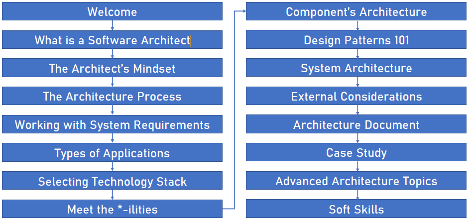
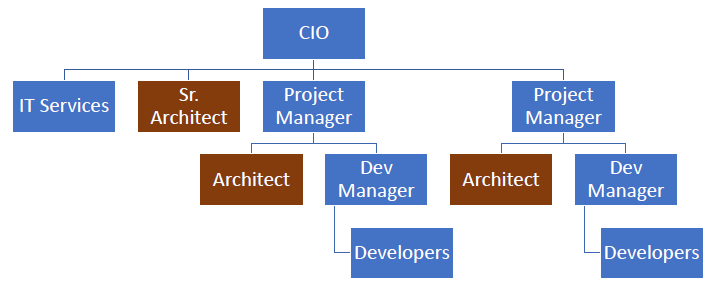

= Memi Lavi
:toc: left
:toclevels: 5
:sectnums:
:sectnumlevels: 5

NOTE: NOTE

TIP: TIP

IMPORTANT: IMPORTANT

CAUTION: CAUTION

WARNING: WARNING

[cols="1,3"]
|===
| Name | Description

| Asciidoctor
| Awesome way to write documentation

|===

== The Complete Guide to Becoming a Software Architect : Memi Lavi

* *History*
** 1. I did this earlier while preparing for Interviews
** 2. Doing it again for Job change / Becoming Architect

* *Agenda/Iteration 2*
** Started using the following
*** Anki

** Pending Use
*** Visual Markers
*** Association
*** Link System
*** Mind Maps
*** Peg System

* *Summary*

=== Section 1: Welcome

*Why You Should Become a Software Architect*

Before discussing the whole let's talk about the way, why is it a good idea to be a software architect,  what's so attractive about it?  Good question.  There are three very good reasons to be a software architect.

*One*, this is a really, really very interesting job.  As a software architect, your daily routine may include talking to CXO that CIOs, CFOs, CEOs in  the mall, discussing technology with development manager and conducting some research about new patterns  and platforms.  There truly is no other role in the software industry, which is as diverse, broad and spread across  the whole organization as the role of the architect, as we will see later in this course.  Good architects work in both business, technology, methodology, soft skills and the more I can promise  you this as an architect, you are not going to get bored ever

Reason number *two* career path and visibility,  being an architect to communicate with all levels of the organization that will make you quite visible  to management and will pave the way to future promotions.  One of my friends was a developer for five years and felt it's time to move on.  He wasn't sure what kind of job to look for, and knowing him and his abilities, I recommended him  to look for a junior architect position.  After a couple of weeks, he landed a job and was amazed by the amount of communication he had with  the CEO and CIO of the company.  Today, he's a senior architect in one of the largest companies on the planet.  So, yes, being a software architect can definitely push your career forward.

Reason number three, *money*.  Everyone wants it, but few are ready to talk about it.  But take a look at these numbers.  As you can see, the average salary of an architect is almost double the salary of a developer here.  And just be quiet for a few seconds while you're crunching the numbers.  But honestly, you should not go for the money.  A good architect is someone who loves what she does.  You should love the challenge, enjoy the discussions, embrace the research, and only then think about  the money.  So to recap, here are the three reasons to be an architect and believe me, these reasons are real.  If you're looking for an interesting, promising and rewarding role.  Go be a software architect.

*Agenda*

---

=== Section 2: What is a Software Architect

*Types of Architects*

So what is actually a software architect, what is his objective, what is he actually doing?  Who is he working with?  Will, all these questions are great, but before we will answer them, let's discuss other types of  architect who was the architect in the software world is an overloaded one.  There are quite a few types of architects.  And let's take a look at the most common ones, which are infrastructure architect, software architect  and enterprise architect.  There are some more types of architects, but they are more finished and we want to talk about them.  So let's see what those types of architects are.

First *infrastucture architect*.  The infrastructural architect is responsible for designing the infrastructure of a given system, and  by infrastructure, I mean all the non software related elements such as servers, virtual machines, network  storage, etc. He's responsible for all this and also to make sure they work nicely with the system,  developed the infrastructure architecture to be familiar with the systems requirements so he can make  sure the infrastructure he designs will support those requirements.  For example, if the system is expected to grow by three terabytes annually, the infrastructure architect  should make sure the storage for the system will be able to handle this load.  The career path for infrastructure architect goes through infrastructure experts.  You have to be well versed in infrastructure, design, implementation and configuration in order to  become a good infrastructure architect.

Next, the software architect, the *software architect* sometimes called also solution architect or system  architect, is responsible for the architecture of the software, since you will be dealing with a software  architect for the rest of this course.

I'll skip to the *enterprise architect*, the enterprise architect works, with the top management of  the organization to *make sure the IT of the organization is an enabler for the business and not a  hindrance*.  In many organizations, business decisions such as starting a new sale or entering a new business field,  is held back by the IT, which needs time to adapt to the new requirements.  *The enterprise architect usually walks with the CEO and CIO of the organization to find out what are  the main bottlenecks, what holds back the waiting and how it can be streamlined to support business  continuity.  Since the enterprise architect operates at a very high level in the organization, he has almost no  work relations with development oriented roles such as developers and team leaders.  #In order to become an enterprise architect, one has to be first a senior software architect or an experienced  project manager.  As I said earlier, the enterprise architect is not very technical, and you don't always have to have  a practical hands on experience in order to become one, although it's definitely a plus#*.  Great.  So having discussed other types of architects, let's meet our protagonist, the software architect.

---

*Responsibility of the Architect*

So let's talk about the responsibility of a software architect, one of the questions I often asked is what is the difference between a senior developer and an architect? After all, in a lot of companies, mainly small ones, there is not a function of an architect, just a team leader. What do we need an architect at all? #The short answer is this developer knows what can be done. Architect knows what should be done.# A senior developer knows the technology very well, knows what is the best way to implement loops, how to perform operations efficiently, what libraries to use to access a database, and so on. *A software architect is also quite familiar with the technology platform, although not as much as a developer. But his main goal is to make sure the software design implements the requirements of the system. He's less interested in his implementation details of the system. This is a developer's job. The architect looks at the macro level, infuses the technology with the requirement*.

*Baseline Requirements:*

* Fast
* Secure
* Reliable
* Easy To Maintain

We'll talk a lot about requirements later in this course, but let's lay the foundations for the requirements of almost any system in these are first secure, reliable, easy to maintain. In almost every system I've been involved, *this list was the holy grail of the architecture*. This is what the architecture was made for, to make the system first secure, reliable and easy to maintain. Of course, every system has its own definition of those items. First, in a world of application working with satellites, telemetry is not the same fast of a traditional information system geared towards end users. Likewise, reliability of mission critical application, which must have an uptime of 99, not 99 percent, is not the same as reliability of a charter application of a support system which would be available only during normal working hours. But still, this list is usually the defining list of every architecture. *Now it's important to note that this list has nothing to do with technology, architectural patterns or platforms you don't see here using micro services based architecture or use Java or don't use relational database*. That's because a good architect knows the technology patterns and all the other buzzwords just means to the end result. *The technology should serve the requirements and not the other way around*. So to summarize, a software architect is someone who designed the system to be fast, secure, reliable and easy, to maintain and select the optimal technology platforms and patterns to achieve these goals.

*The Architect in the Organizational Chart*

=== Section 3: The Architect's Mindset

*Introduction to the Architect's Mindset*

Welcome to the third section of this course, architects mindset, in this section, we will discuss  one of the most important aspects of being an architect, which is the architects mindset.  If your current job is a technical one, such as a developer or a team leader, then you are probably  thinking about the work you do for recording and development point of view.  But as you will see in this section, this is not always the most appropriate point of view for an architect.  The architect should often make a decision based on other factors which are sometimes for rent for developer.  *#But in order to be a really good architect, you have to adapt yourself to the new point of view, which  will make you a real asset for the organization#*.  So let's talk about this new mindset.

*Understand the Business*

The biggest mindset change you have to make in order to be a good architect is to *understand the business  your client or employer is involved in*.  Now, this might sound trivial.  Supposedly, everyone in the organization know what the company is doing, right?  Well, that's usually only partly true.  I'm sure every Microsoft employee knows that Microsoft developed software such as Windows and Office  in that it has one of the largest public clouds in the world.  I'm also sure that every Amazon employee knows that Amazon sells a huge selection of items from books  to fresh food.  But that is not enough.  And let me tell you a story.  A couple of years ago, I was approached by a company in the Beautiful.  It was a medium sized company with about 600 employees worldwide.  I was familiar with this company and I knew vaguely what it was doing, but I knew it wasn't enough.  So I grabbed my PC and began reading the day after we had the meeting.  To the surprise, I was able to tell them about the founders line of product, revenue and profit.  And bear in mind, the company was not publicly traded at that time, the competitors and so on.  This blew them out of the water and we agreed to work together on this very day.  But I must tell you this story to get you marketing tactics, although it's a very effective one.  The really important lesson here is that *in order to be of any value to the organization, you have  to have a deep understanding of the organizations business*.  You have to know what keeps the CEO awake at night.  You have to understand what its weaknesses and strengths are.  Who are they competing with in what is a growth strategy?  All you have to understand all this.  You can start talking architecture and technology.  One of the most common mistakes made by architects is that they are looking at the systems they are  working on as a stand alone system, isolated from the rest of the organization.  But it can't work that way.  Every organization is a living organism with a lot of moving parts, and the architect must understand  how the system integrates into this living organism.  And what role does this play?  So to recap.  *Remember, always understand the business before you begin walking on the architecture*.

*Define the System's Goals*

After we have understood the business and learned all there is to learn about it, it's time to look  at the specific system we are going to work on.  *The first thing to look at are the systems goals.  Now, it's important to note we are not talking here about what the system should do.  These are not goals.  These are requirements*.  And it's important to distinguish one from the other when talking about goals.  *We are talking about the effect the system will have on the organization.  This effect can be almost anything, but it should be clear how this will affect the bottom line of  the organization.  The reason we should be fully aware of the system's goals is that as architects, we must always think  about the big picture.  We must know what is the environment our system is going to be operating in and what are the main tasks  it is going to tackle.*  Usually the client should tell you what the system's goals are, but it is not always the case.  I once had a client that asked me to design the architecture of a specific system.  For him, the system specifications were clear, the value services and screens were already defined  and it looked like an easy task.  However, when we began discussing the place of the system in the organization, we found out almost  no one was going to use the system as it is.  There was many other systems which performed similar tasks, albeit in the less comfortable manner.  But the users were already used to those systems and there was simply not a strong enough incentive  for them to move to the new one.  We ended up changing almost all of the systems.  Scope and functionality in the final product was a much smaller but much more focused and effective  system.  Let's take a look at some examples of goals.  First, knew our system for a product oriented company.  The goal is to streamline the recruitment process, thus attracting better candidates.  This, of course, will help the company build better products more quickly, thus growing the revenue  two new information system for reporting and mapping criminal incidents in the city.  The goal here is to improve the police response time for every incident and to encourage new residents  to migrate to the city.  Of course, there is also a hidden agenda here.  This system will help them to be re-elected in the next elections.  Next, mobile application for flash sales, the organization who is a small and young startup with only  three developers.  The goal here is twofold.  One, your money as fast as possible and to attract investors.  OK, so we've talked about the system goes in, let's go on to another important aspect of the system,  which must be the architect mind.

*Work for Your Client's Clients*

One of the most important aspects of the architects work is to identify who the client is.  Now, that may sound a little stupid.  Of course, I know who my client is.  It's the one who pays me well.  Yes, but also no.  Let me explain.  In almost every organization, the architect is part of the IT department.  It doesn't matter what the architect is an employee of the organization or a consultant who works with  the organization.  He's hired by the people.  But the I.T. guys have clients.  And these are the end users of the application and these are the guys you should work for.  What does it mean?  *It means that your mindset should be geared towards your client's client*.  It means that with every decision you make, you must ask yourself what will be the effect of this decision  on your client client?  It means that the comfort of your client's client is prioritized over the comfort of your client.  Let's see an example.  One of the recent systems I worked on was a systems that display data based on the telemetry received  from remote stations.  All of the dilemmas we had is what to do with the database during telemetry is offline.  This was a scenario we had to consider.  Some selected department could not commit to a concrete display of the database.  The solution we came up with was to display a clear message to the end user that there is a problem  with the system and ask him to try again later.  This is quite a common behavior for such a scenario.  However, the client asked whether we can find an intermediate solution that will allow him to use the  data but not make any modifications.  We thought about it long and hard and came up with a solution that made architecture much more complicated.  We have introduced a dedicated caching layer that duplicated the data.  It was used when the database was offline.  My client, which was a development team, worked much harder.  But my client's client, the end user, was extremely satisfied with this solution and praised our willingness  to help him and think outside the box.  Now, you might say that walking with a client is a systems analyst job and not the architect.  *This is usually correct, but sometimes a project is carried out without a system analyst on board.  And even if there is one, you still have to understand the client's environment in order to make the  best decisions for him*.  In this case, the architect does not replace a system on the list, but it's a very good idea to join  her for some meetings and to meet a client personally.  Sometimes you see that your client, the IT department, does not use a client as a client, they will  refer to the end users as colleagues, co-workers, or even those annoying guys that always have demands.  In this case, your work might be a bit harder.  You have to not only change your mindset, but also them

*Talk to the Right People with the Right Language*

Another important aspect of the architect's job is to know how to speak to different persons in the  organization.  Here is the rule of thumb, always keeping in mind what is the thing that really matters to the person  you are talking to.  If you can adapt to language to the best interests of the person we are talking to, you will be able  to achieve much more.  By the way, this will is right not only for architects, of course, but for anyone who tries to achieve  something for someone.  Let's look at some examples.  *Here is Sophie, the project manager.  Sophie, because only for the project success, she doesn't care what technology will be used or how  amazing the architecture is.  When you talk to her about your plans for the architectural, always emphasize how it will contribute  to the project's success*.  Avoid sentences like this is the latest and greatest pattern and will be the first to test it out.  We can write a blog post about it.  This sentence will only frighten her and she will immediately imagine how this untested technology will  cause delays and compromises down the road.  Instead, try something along the lines of this.  *New technology can help us write the code twice as fast so we can cut our schedule and budget accordingly*.  This is a language a project manager understands, and she will be more than happy to help you, assuming  you are right.  Of course.  Now let's look at the team leader.  That is a hard core geek and he just loved programming.  He spent at least one hour every night reading through technical blog posts, and he always up to date  with the recent development in software industry.  If you want to bring Dave on board and make him a strong proponent of your architectural talk to him  using a technical language, tell him.  Listen, Dave, have you heard of the latest angular version?  We are going to use it or, you know, function as a service are pretty cool.  What do you say?  We will give it a try in this project?  Just says there will be more than happy to work with.  You will approach this.  We.  The last person we look at is surely the *CEO, Chile is a very business oriented person and she always  looks for the financial bottom line*.  If you want to explain her, what are the advantages of the architecture you are working on?  Never mentioned technical buzzwords.  Chile, the kind of person that when his micro services or kissing or even Gever, she immediately  loses interest and stops listening.  *However, if you will tell her this, the architecture of design will ensure the continuity of the business  and will be able to cope with the high load expected during Black Friday sales.  Then you got her*.  She will listen to you and will appreciate the work you are doing.  So to recap, always keep in mind what really matters to the person you are talking to.  Try to be in his shoes, not yours, and then show him how your work contributes to his interests.

=== Section 4: The Architecture Process

image::architecture-process.png[]

=== Section 8: Meet the *-ilities

* Scalability – Adding computing resources without any interruptions (Horizonal Scaling)
* Manageability – Know what’s going on and take actions accordingly (Monitoring etc.)
* Modularity – A system that is built from building blocks, that can be changed or replaced without affecting the whole system (replacing monoliths with micro services)
* Extensibility – A system that its functionality can be extended without modifying its existing code (API returning XML | JSON. It has to return CSV. Extend the code. Use dependency Injection)
* Testability – Independent modules and methods + single responsibility model for methods

=== Section 9: Component’s Architecture

* Layered Architecture

* SOLID
Liskov: If S is a subtype of T, then object of type T may be replaed with objects of type S, without altering any of the desirec properties of the program.

