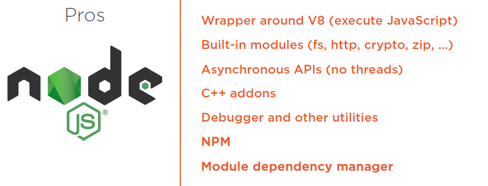

= Node.js
:toc: left
:toclevels: 5
:sectnums:
:sectnumlevels: 5

NOTE: NOTE

TIP: TIP

IMPORTANT: IMPORTANT

CAUTION: CAUTION

WARNING: WARNING

[cols="1,3"]
|===
| Name | Description

| Asciidoctor
| Awesome way to write documentation

|===

== Node.js: Getting Started By Samer Buna

https://github.com/jscomplete/ngs

=== Introduction

*What Is Node?*

Okay, so you can probably answer this question, but this is a first step course in Node, so let me start at the very beginning. What is Node.js? Here is probably the simplest definition of Node. *It's JavaScript on your back end servers*. Before Node, that was not a common or easy thing to do. JavaScript was mainly a front‑end thing. This isn't really a complete definition, because Node offers a lot more than executing JavaScript on the server. *In fact, the execution of JavaScript on the server is not done by Node at all. It's done with a virtual machine, VM, like V8 or Chakra*. Node is just the coordinator. It's the one who instructs a VM like V8 to execute your JavaScript. so *Node is better defined as a wrapper around a VM like V8*. I'm going to use the term V8 in this course, because that's the default VM in Node, but you can totally run Node with other VMs if you need to. So when you write JavaScript For Node, Node will pass your JavaScript to V8, V8 will execute that JavaScript, and tell Node what the result is, and Node will make the results available to you. That's the simple story, but Node is a bit more useful than just that. Besides the fact that enables us to execute JavaScript on a server, which is done through a seamless integration with V8, Node comes with some handy *built‑in modules providing rich features through easy‑to‑use asynchronous APIs*. In the next module, we'll talk about that and a few other reasons why developers are picking Node.js over many other options when it comes to creating servers on their back ends.

*Why Node*

* https://jscomplete.com/learn/why-node-for-react

---

---

Node, of course, has a few cons, which are, interestingly, the same pro points, if you just look at them with different bias. For example, the non‑blocking nature is just a completely different model of thinking and reasoning about code, and if you've never done it before, it is going to feel weird at first. You need time to get your head wrapped around this model and get used to it. And the big npm registry with so many options means that for every single thing you need to do, you have many options to pick from, and some people hate that. You need to constantly research these options and make mental effort to pick the better options. These options usually have major differences, and also npm enabled shipping smaller and smaller code, which means you need to use more and more packages. It's not unusual for a Node application to use 300 or more packages. This is both a good thing and a bad thing, depending on who you ask. I think it's a good thing. Smaller packages are easier to control and maintain and scale, but you do have to make peace with the fact that you'll be using a lot of them
