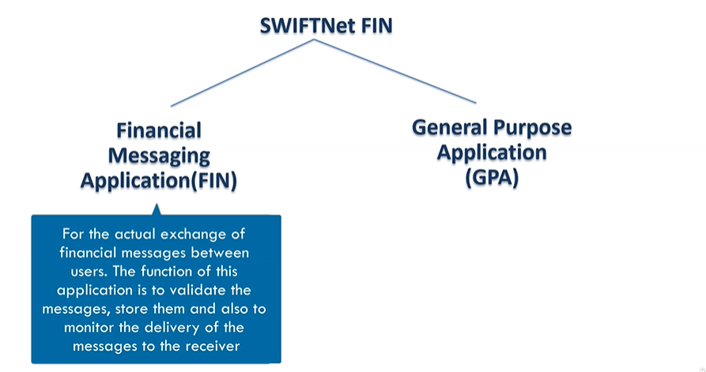
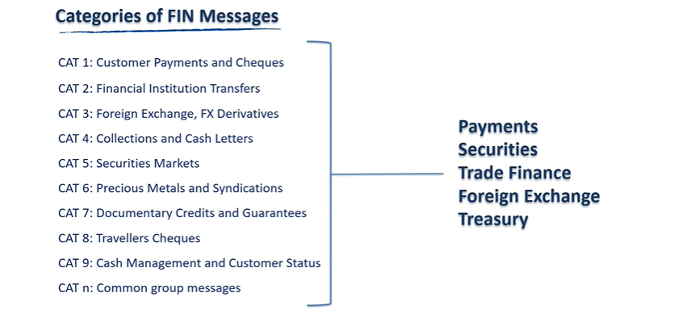
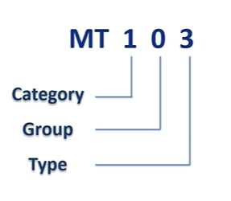
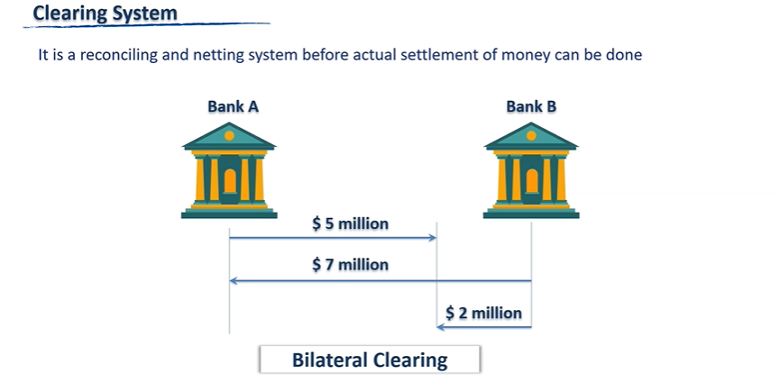
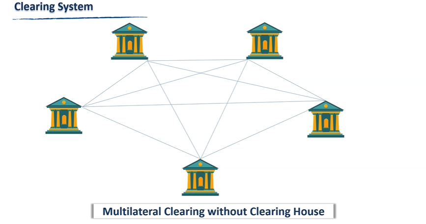
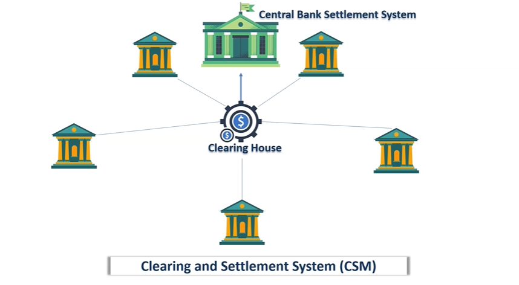
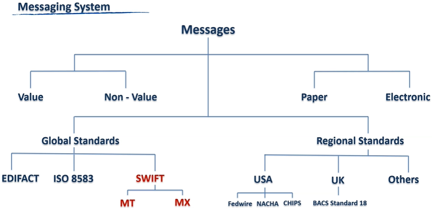

= SWIFT Anwesha Sengupta
:toc: top
:toclevels: 5
:sectnums:
:sectnumlevels: 5

NOTE: NOTE

TIP: TIP

IMPORTANT: IMPORTANT

CAUTION: CAUTION

WARNING: WARNING

*Maximizing Value*

* [ ] *Fundamentals*: Learn the concepts
* [ ] *Information*: Do POC from the course
* [ ] *Skills*: Use / Implement it in Project
* [ ] *Innovation / Expert*: Value for next 2 Years

*Objective*

* [ ] *History*:
* [ ] *Agenda-While doing this course what is the Agenda [1,2,3,4,5..]*:
** Make asciidoc notes in 1st iteration and use anki in 2nd iteration. The idea is also to finish off small courses quickly.
* [ ] Exam Notes
* [ ] *Why OneNote Notes*:
* [ ] *What is Pending*:

== SWIFT Message Types - MT and MX ISO 20022 - An Overview

=== Section 1: The Basics of SWIFT

==== Introduction

==== SWIFT, SWIFTNet and SWIFT Code/ BIC*

Banks located in different locations in the world *need to communicate* with each other to perform their everyday operations. That communication forms the basis of numerous transactions taking place globally on a daily basis. Before the advent of SWIFT, banks used to communicate using telex, fax or phone, but it was very slow and not a secure way to communicate at all. So in 1973, around 239 banks from 15 countries created a cooperative *headquartered in Belgium named Society for Worldwide Interbank Financial Telecommunication, or SWIFT*, to build a common messaging system. Slowly, the number of member banks grew, and today more than 11000 banks are part of SWIFT communicating with each other *using its network called SWIFTNet*.

*SWIFTNet is Swift's Secure IP Network*, which connects all these financial institutions and corporations around the world. It is a private and secure network which only members can access to communicate within themselves. *But how will one member identify another member of SWIFTNet? Using an ID*. This idea is called the *business identifier code or the SWIFT code*. Here B stands for business and not bank. You may wonder why, because *not only banks are financial institutions, but corporate can also become a member of SWIFT to communicate their instructions with financial institutions directly*. *SWIFT provides a separate product for corporate called the SWIFT code. The swift code acts not only as an entity or member identifier, but it also contains important information about the location of the entity*, which is used to redirect a SWIFT message to it. Let's understand how.

*SWIFT code are 8 to 11 correctors in length*, for example, let's see how a branch of Deutsche Bank in Germany gets identified using BIC. The first four alphabetical letters stand for that business entity. Here, DEUT stands for Deutsche Bank. So anywhere in the world, any SWIFT code for Deutsche Bank will start with DEUT. Next two alphabetical letters form the specific country code where the branch is located, DE stands for Deutschland or Germany. *The next two letters can be alphabetical or numeric and they stand for the institution head office in the country, or the head office in a particular region in the country*. Here, SS stands for Stuttgart, a city in Germany. So, DEUT DE SS is a valid eight characters SWIFT code. And if you don't add further characters to this code, it will indicate that it's the code of the Deutsche Bank main branch at Stuttgart city of Germany. Now suppose you need to reach a particular branch. Then a further three letter code is added to the code. Here, 648 denotes a particular branch in the Stuttgart region. Let's take another example, SBIN IN BB. SBIN stands for State Bank of India, IN stands for the country India, BB stands for Bombay. So SBIN IN BB is the SWIFT code of the main branch of State Bank of India in Bombay or Mumbai in India, which also happens to be the national headquarter of the branch. Whereas in SBIN US 33, the first four letters remain constant denoting the name of the member, US stands for the country, the USA, and 33 is the numerical location code of New York. So, SBIN US 33 is this SWIFT code of State Bank of India, New York branch.

---

==== SWIFT FIN and GPA Messages and MT Message Structure

Now that we understand the purpose of SWIFT and how member entities are identified in the SWIFT network. Next, let's understand how members communicate among each other in a SWIFT network. *Communication between members happened using standardized message formats*. You can imagine messaging standards as predefined format so that when such messages are exchanged between two parties following the same standard, they can decode and understand what the counterparty is trying to convey.

There are many kinds of messaging standards which are used globally to communicate among banks. The two standardized messages, which are supported by SWIFT are *MT and MX messages*. The MT messages are structured according to the specifications of the *ISO 15022* standard and the newer MX messages according to the ISO *20022 standard*. You may be wondering what this ISO is.

*ISO or International Organization for Standardization* is an independent, non-governmental international organization which develops standards which provide the best way of doing something. They have joined hands with SWIFT to create these messaging standards. We will learn about MX messages later.

---

---

#Pending#

First, let's concentrate on the *MT messages*. These standardized MT messages are exchanged under *SWIFTNet Fin service*. Fin stands for financial messaging application. The FIN service comprises of the following two applications, the Fin messaging application for the actual exchange of financial messages between the users. The function of this application is to validate the messages, store them, and also to monitor the delivery of the messages to the receiver. Another part of the Fin service is the general purpose application, or GPA. Its function is administration, access and control of Fin. It provides service related messages and functions and is not for a user to user communication. We will learn about the use of a few important GPA messages later in this tutorial.

---

So we learned that SWIFT MT messages follow ISO 15022 standard, but how does a real SWIFT message looks like? How is a SWIFT message structured? *SWIFT messages consist of five blocks*, the *first* block is called the basic header block. This is the only mandatory block in a SWIFT message. The basic header contains the general information that identifies the message and some additional control information. The Fin interface automatically builds the basic header block. The *second* block is called the application header and is optional. It contains information that is specific to the application. The application header for input SWIFT messages can contain up to six fields and for output messages may have up to seven fields. The *third* block is called the user header block. This is an optional block which can only be assigned by the sender of a message and if assigned, it will always appear on the output message copy. The *fourth* block is the text block. This is the block, which contains the main content of the message. The *last* block is the trailer of the message. This block either indicates special circumstances that relate to the message handling or contains security information related to the message. *Also, an input SWIFT message and an output SWIFT message are not identical*. Once the messages pass through the SWIFT system, several more technical information about the message gets added. And thus, the character length of an output message is longer than the corresponding input message.

==== SWIFT Message Categories and Rules/ Guidelines of Messages

So we learned about what is SWIFT and how entities become members of its network called SWIFTNet. They communicate with each other by first identifying each other, using the SWIFT code and then sending messages using either MT messaging standard or a MX messaging standard. We also saw the basic structure of a MT message and its five building blocks.

Now let us know what are the different categories of MT messages available under the FIN service? There are total nine categories and a separate category for common messages, which can be used under any category. Together, SWIFT covers messaging requirements for payment, securities, trade finance and foreign exchange and treasury. Interestingly, *SWIFT does not provide services for card payments*. The categories, along with the area of use, is shown on your screen. Under each category, there are several messages. For example, under category one messages, customer payments and cheques. There is MT 101, request for transfer, MT 103: Single customer credit transfer and so on. Each message is denoted using three digits. The first digit denotes the category it belongs to. The second digit denotes the group. For example, zero denotes electronic, one denotes paper-based. The third digit provides the specific function.

Now, to use these different types of messages correctly, SWIFT also provides some rules and guidelines to structure the messages. There are four kinds of rules and guidelines for structuring SWIFT messages. MT Network Validated Rules or and NVR. Network Validated Rules are rules for which an error code is defined in SWIFT. Then those rules specified affect more than one field in the message, thus placing a condition on one of the field specified, they are called CN or conditional rules. This is an example of a NVR for a MT 103 message, which is the message format used for customer credit transfer between banks. You can see how presence and absence of fields are dependent on each other. And if the rule is not followed, an error will be thrown by the software and you can't proceed without rectifying that error. MT usage rules, usage rules are not validated on the network, meaning rules for which no area code is defined but are still mandatory for the correct usage of the message. For example, usage rule for MT 103 message says, when the current method is used for customer credit transfer, the originating bank must copy the content of field 20 of the MT 103 unchanged into field 21 of the related MT 202 COV. We will learn what the COV method is soon. So, ignore the technicalities mentioned here for the timing. What the rule is trying to say is in the current method of customer payment, two messages are used simultaneously a MT 103 message and a MT 202 COV message, And the content of a particular field of the MT 103 should be copied as it is in another field of the MT 202 COV. Now that this is actually done on not, SWIFT has no method to check for itself because SWIFT has no way to compare two different messages automatically and generate any warning or error. That's why SWIFT has designed usage rules such as these to educate the user of the correct usage of each message. MT guidelines, guidelines are neither validated on the network nor are mandatory for the correct usage of the message. They basically concern group practices and can affect more than one field in a message or more than one SWIFT message. MT market practice rules. Market practice rules, as the name suggests, are a set of rules which are usually in practice or prevalent in the market. For example, the payments market practice group, or PMPG, is an independent body of payments subject matter experts from Asia Pacific, Europe and North America. It has published a set of market practice rules for category two messages proposing best practices and recommendations of structuring such messages.

=== Section 2: Brief Overview of Payment Systems

*What is Clearing, Settlement and Messaging?*

So we have got an overall idea of the background of SWIFT and the messages, but before we can start understanding the SWIFT payment messages, we need to have a brief idea about one more concept, how payments work. There are three main elements of a payment system or a clearing and settlement system. *Messaging, Clearing and Settlement*, let's understand what each means.

First, what is meant by a clearing system, in simple words, it is reconciling and netting system before actual settlement of money can be done. Let's take the simplest example of bilateral clearing. Two banks, A and B owe each other money. Bank A owes bank B, five million dollars and bank B owes bank A, seven million dollars. The two banks calculate between themselves and finally, bank B pays bank A two million dollars. *This act is called netting or offsetting*, and this amount of two million is called the final position.

Now, imagine the same thing with multiple banks, the more nodes you act in the system, the more complicated and cumbersome it becomes for the banks to do the calculations. This is multilateral clearing without a clearing house. Here comes the role of a clearing house, instead of connecting with each other, the banks instead connect with the clearing and settlement system.

In short, the CSM, comprising the clearing house and the central bank settlement mechanism. The clearing system calculates the final position of the participating banks once or several times daily and finally, pushes the actual settlement transaction through the central bank settlement mechanism. So you understand the difference in concept of clearing and settlement. *Clearing is reconciliation and netting process and settlement is the actual mechanism of moving the funds from one account to another*.

Let’s know a little more about settlement systems. The example I mentioned previously, where first netting of the transaction is done and then the final position amount is settled is called the *net settlement system*. There is another method called the *gross settlement system*. Here, no netting is done and each transaction is settled individually. So your first bank is customer will originate the payment of seven million dollars through bank A. Bank A pushes the transaction through the CSM where the settlement accounts of the two banks are debited and credited. Next, on receiving the credit on its settlement account, the receiving back finally credits the beneficiary seven million dollars. The same process will get repeated then bank B's customer wants to send bank A’s customer five million dollars. As no netting is involved in this process, it happens real time. Hence the name, *real time gross settlement*. This system is used then urgent transfers are to be made and also for high value transfers.

Another kind of settlement is a *real time final settlement system, or RTFS*. Unlike RTGS, where the ultimate beneficiary gets paid only after the sending bank and receiving banks settlement accounts in the CSM get settled. Here, first the ultimate beneficiaries account is credited after doing a transaction validation, and the settlement account of the banks are settled later. Examples of such systems are IMPS in India or CHIPS in the USA.

Now comes the last element, messaging. This intercommunication between banks and CSM happens using messages. This is where SWIFT comes in. *So, SWIFT is a messaging system*. It is only a information carrier. It has no role in either clearing, nor settlement. Let's learn a little more about messages. Depending on purpose, the messages can be of two types, *value messages* which are used to move money from one account to another and *non-value messages* which don't move money but more information. Messages can either be *paper or in electronic form*. The structure of messages follows standards. As we discussed earlier, standards I predefined formats which ensure that when such messages are exchanged between two parties following those standards, they can decode and understand what the counterparty is trying to convey. Some standards are followed regionally. For example, in the USA, regional standards are Fedwire, CHIPS and ACH format. In the UK, there is bankers automated clearing service or BACK standard 18 format. Now comes the Global Standards Act, EDIFACT or Electronic Data Interchange for administration, commerce and transport is another messaging standard. ISO 8583 messaging standard is used for exchanging electronic transaction initiated by cardholders using payment cards. Next comes the global messaging standard that is our point of attention, SWIFT with its two standard MT and MX. So, you now get the bigger picture of the three elements of a payment system messaging, clearing and settlement.

Some providers provide service for only one element, while some provide services from more than one. In reality, the payment system works as a combination of various providers. For example, SWIFT provide service for only the messaging part. CHIPS in the USA, STEP1, STEP2, EUR01 provide services for both messaging and clearing, but are not involved in settlement. Whereas CHAPS in the UK or Fedwire in the USA provide all the three services. So, we understood that the payment systems operate within a single country. They are denominated in the currency of that country. They are subject directly or indirectly to regulation by the government of that country. And of course, they enable multiple parties to transact with each other. So, a cross-border payment must pass through two payment systems. Banks of one payment system needs to access banks in the other payment system. But how to do that? Here comes the role of correspondent accounts. Let’s continue discussing correspondent account in the next tutorial.

*Correspondent Accounts and RMA*

=== Section 5

