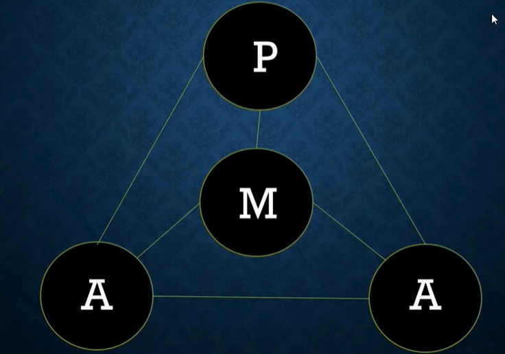

= Goal Setting
:toc: left
:toclevels: 5
:sectnums:
:sectnumlevels: 5

NOTE: NOTE

TIP: TIP

IMPORTANT: IMPORTANT

CAUTION: CAUTION

WARNING: WARNING

[cols="1,3"]
|===
| Name | Description

| Asciidoctor
| Awesome way to write documentation

|===

== Goal Setting Mastery Course

*Maximizing Value*

* [ ] *Fundamentals*: Learn the concepts
* [ ] *Information*: Do POC from the course
* [ ] *Skills*: Use / Implement it in Project
* [ ] *Innovation / Expert*: Value for next 2 Years

*Objective*

* [ ] *History*:
* [ ] *Agenda-While doing this course what is the Agenda [1,2,3,4,5..]*:
* [ ] Exam Notes
* [ ] *Why OneNote Notes*:
* [ ] *What is Pending*:

=== Section 1: Introduction

*About your instructor*

Well, hello there and welcome to the goal setting mastery course. My name is Himesh and I am truly honored to be your instructor for this course. First things first, I would just like to congratulate you for taking this course. I feel that very, very few people in the world actually take their goals seriously. They let life go by before it's actually too late and without actually pursuing what what they what their goals are, what goals are. So I'd just like to congratulate you on that. Now, before we get started, I just thought that I would introduce myself as your instructor. I think it's important that we know each other. So, you know, the voice behind a lot of the slides that will be coming through on this course. So I just thought I would start off this this course with a little bit about myself. So as you are aware, my name is Himesh Tragedy, and I was actually born in Zimbabwe. And for those of you don't know where Zimbabwe is, it's in the southern part of Africa. It's the small t part shaped country just above South Africa. And that's where I was. That's where I was born. It was such a beautiful country. I did my primary and my secondary education in my high school. And then I, I was I then moved to South Africa to pursue my bachelor's degree. So I'm a bachelor of I have a bachelor of pharmacy degree. So I am a pharmacist by profession. I still practice pharmacy on the side. But teaching is my passion. Inspiring people is my passion. And that's why I decided to actually create this course. The goal setting mastery course. Now, let's I just thought I would give you a bit of a brief background on how, you know, I was as a person when I was in high school, sorry, in university. So during the first and second year of university, I was diagnosed with anxiety and depression. I had this, I would say disorder. I'm not sure whatever you want to call it, it was put it this way. My my I wasn't in the right mental state. And there were a number of factors to it. When I was young, my father went through a health, a very scary health episode multiple times, and he was diagnosed with a brain tumor. And then he had a lot of brain surgery. And this really sort of affected me. And I was I was diagnosed with this and I was given medication and I wasn't really at the peak of where I should be from mental state. And and I you know, judging from where I come from, it was nobody would have thought that I was really fully equipped to deal with the realities of life and put it that way. Now, after I graduated, I thought that, you know, I was I was, you know, armed with this beautiful degree, this powerful degree. And I had education behind me. And I'm going to go on and I'm going to conquer the world and all my goals are going to be fulfilled. That's what most of us think when you come out into the the so-called real world. Unfortunately for me, that that really wasn't the case. Life had its own set of plans. And when I went back to my home country of Zimbabwe, we were plagued with a massive, massive economic crisis that hit Zimbabwe. Now, this wasn't like a recession of any sort that we've seen in recent times. It was what we characterized as hyper inflation. And in fact, because of the hyper inflation situation, both myself and my family, we essentially went broke. So whatever we had all our life savings, everything, we we literally lost it over a span of about a year and we were literally broke. The the only thing that sort of kept us afloat was, I mean, we had a roof over our heads and I sort of had a job that was giving in some income, but we were just, you know, keeping our head above water. And I just thought I'd show you. So this was if you if you look at the slide here, it was the worst hyperinflation situations of all time where you can see that those are actually that's actually legal currency for Zimbabwe. And the highest denomination note was at that time was one hundred billion dollars. But it did get worse than that. I'll show you on the next slide. It was absolutely. Mind boggling where, you know, you had a certain amount of money in the bank account and overnight that money used to just inflate and the inflation figures were were in the triple, if not four digit categories was something that was really unheard of. So for free, if you sort of read up on the Great Depression that happened in the 1920s, it was exactly like that, except I would feel that it was far more worse than that. The sorry I beg your pardon, the highest denomination note was actually a 100 trillion dollar note. So one hundred trillion dollars was the highest denomination. And that would pretty much purchase you probably a loaf of bread. And that's how it was. So the stories that you see, the stories that you read about or hear about Zimbabwe and the hyperinflationary situation are all actually true. We used to go with wheelbarrows full of money to the supermarket and my salary was was paid essentially like this. And your salary is worth so much during today. But then when you decide to go to the supermarket, say tomorrow, the price of the item is actually inflated. And so how do you sort of run your life? And the reason that the point that I'm actually trying to to illustrate here is that I went through a fair amount of adversity when I was young. I was diagnosed with anxiety, depression, and then all of a sudden this massive economic crisis hits Zimbabwe, but the story goes on. So because of all of the situation, I was actually forced to move to another country because they I had to make ends meet. I had to support my family. So I actually had to move to another country to support my family there. I had to actually procure groceries, basic groceries and actually drive across the border. So I worked in a country known as Botswana. I used to work there, drive across the border with some groceries so that we can replenish the groceries at home because they were simply not available in Zimbabwe and things were very, very tough. Now, the interesting part was while I was working in Botswana, the the economy then reverted to a United States based dollar system. So we we used the US dollar as our official currency and things immediately sort of stabilized. And if I could say literally within 24 to 48 hours, they stabilized. But the funny thing, we had all this money that we had earned and we're trying to sort of save it up. And overnight there, you know, the the banking system came and came across a a conversion factor where they said, right. You know, we need to because we're dollar rising. We're going to convert whatever money you have into a US dollar based currency. And the conversion rate is there was actually no calculation, in my opinion. There was no calculation on how they did it. So Somsak they converted all the currency that we had in the bank account into a US dollar currency. And again, literally overnight, all the trillions of dollars that we had in the account literally reverted to maybe a couple of hundred dollars. And that was over a span of like one or two years that literally, you know, we're saving up. And all of a sudden now we're back to square one where we have nothing. So we went broke once and we went broke again. But things were looking up. We went broke again, but things were sort of looking up. And I managed to get a full time job and things were trickling along well. We managed to sort of make ends meet because things were sort of improving. But then I sensed that things were not things were actually going to go back to where they were. And so essentially I decided together with my wife that I had to emigrate to New Zealand. So I'm now based in New Zealand. In case you're wondering where all the life savings that I had accumulated over those number of years, I actually spent, you know, with the cost of the flights and I came here as a student. And so essentially everything that I had, I made a conscious decision and I said, right, that's it. I need to create a new life for myself. And I and I migrated to New Zealand, so. I used all my life savings for that, and I remember arriving in New Zealand, I had two bags and I think I had a couple of thousand. I think it was about five thousand dollars with me enough to buy me a car and just get me for the first sort of month. Now, the reason why I thought I would tell you that is just to give you guys a bit of a gist of where I'm going with this course. *And it's so so judging from my past, you know, you would think I was not really equipped to deal with all the complexities that that life was throwing at me, all these sort of curveballs*. And I just thought to myself, if there has to be a better way. And I started going about setting goals for myself and, you know, they started off as small goals. And then I started to to accomplish a few of them here. And then I thought to myself, I said, you know, this is this is wonderful. And so the reason why I've created this course is that I want to show you a pathway on not only setting your goals, but also achieving them, which is what this is all about. So what I'll do is I'll continue with my story, I'll continue with my story and its goals. So most of this will make sense once you go through the course. #*But in a nutshell, what I what I actually did was I prioritise three areas of my life. One was my family. One was my job. And most importantly, was my part time business. And I think the part time business is the most sort of important thing, because it was the only way that I could get out of the financial rut that I was in*#.

---

image::c:/nc/bookmark.png[]

---

Now, I just want to take a pause here. The exact strategy that I used to start working on my goals to try to start achieving anything was the exact blueprint, the map technique that I'm actually going to take you through this course. So I followed the step by step and I was able to accomplish many of my goals. *So what then happened was I dedicated two hours a day to the part time business using what we call a compartmentalization technique*. And I'm going to take you through the compartmentalisation technique later on in the course. And that was the technique that actually helped me gain momentum. Now, due to this, I created three part time businesses, maybe the goal of my dreams, and I was able to replenish my my parents retirement fund. Now, that was that's just sort of a small aspect to to my to my overall goals at that particular. I'm sharing this because at that particular moment in time, my financial situation was was in need of a desperate I was in need of desperate help. And so that's why I focused on this. Later on, I, I did my mission in life. And I'm going to teach you about mission statements. And my mission was to actually inspire and teach as many people around the world to in order to have for them to have better lives. And which is why this course has come up. So in a nutshell, that that is my story. And I just want to let you know that this this technique that I'm about to teach you works if you put in the work. And I think that's that's the most important thing. And one thing I also want to mention is that I did all of this while having a full time job. So if you are one of those people who have a full time job and you're finding out how am I going to do this, I did it while having a full time job. And I'm going to teach you exactly how you do all of this, even though you you you may be very, very busy. I thought I have a quick section on why I feel I'm qualified to teach you as as your as your instructor. So so throughout these years, I've actually immersed myself in personal development and have developed strategies that have enabled me to get through adversity. I'll be using all of that knowledge that I have gained. I'll be teaching you the specific techniques to know and to gain what you want in life and also techniques on how to get what you want using what we call an advanced gold setting formula, which is the technique that I'm actually going to teach you about and putting in the action. I've put in the action myself and I've seen results. So I feel that I'm able to teach that. And by teaching that, I hope to develop a specific action plan to reach your goals using a step by step time management technique that I'm also going to teach you. So I really look forward over the next hour, hour and a half to take you to. All of this.

*What This Course Will Offer You* - #Good Read!#

What this course will offer you. Enabling you to know exactly what you want in life by helping you find your way, another way to phrase this is to find your true purpose in life. A lot of people don't know what the purpose is. You may be one of them. People get so inundated with their daily routine of life, they simply wake up, go to work or their business, come home. And the next day is the exact same as the previous day.

*This course aims to help you find your true purpose and break the mundane routine of life. This course, we'll take you through a careful goal setting and planning process in this course, there is a comprehensive chapter that outlines a detailed goal setting process. We will talk about smart goals and we'll do an extensive brainstorming session with the use of the workbook. Converting each goal into a set of actionable steps, using something known as a compartmentalisation technique*. These are part of a chapter that outlines this technique. The idea behind this is that each aspect of your life will be divided into different compartments. This will enable you to plan your life accordingly and also eliminate the feeling you get when you get overwhelmed with so many things to do. Organizing each day to fit those actionable steps, something known as the compounding effect, we will come across the principle known as the compounding effect, which is in essence a principle that states that in order to achieve your goals, small, incremental actions towards your goals are necessary. The course will take you through formulating your own action plan towards your goals. And most importantly, highlighting the mindset that is actually required to live the life of your dreams, itemised current mental programming mindset will play a very important part in achieving your goals. This is the most important aspect that you will need to master, which is why I have dedicated a big chapter on helping you get the right mindset. The single most important factor that distinguishes successful individuals who have achieved their goals is their mindset, which is why I will include aspects such as your current mental programming. In other words, what is your current mindset and where do you need to get to in order to be successful?

*Bridging The Gap* - #Good Read!#

Bridging the gap. The cat that I'm referring to here is the gap between where you are and where you want to be and the necessary steps that will help you cover this gap. After considerable research and using my own experience, there are four key components that are required to achieve your goals. These are as follows, so firstly, knowing where you are and where you want to be, this is a pretty obvious statement and you might be thinking, I know where I am in life, but you'll be surprised that the vast majority of people don't know where they are in life. They don't know how far away they are from achieving their goals, if they have any in the first place. They also don't know what their purpose is. You may be one of them. The second aspect is how you plan to bridge that gap and achieve your goals, planning is a fundamental process that one has to do in order to achieve the goals. The third aspect is how you train your mind to achieve your goals. I have mentioned before that mindset required for achieving success is one of the most crucial factors. And the fourth aspect is how you everything action is usually what separates a person from achieving anything in life, massive, determined and consistent action is the name of the game. There is a saying that I have always lived by, and it was taught to me by one of my mentors. And and the same goes as follows. *Thoughts will determine what you want, but action ultimately determines what you get*. We will delve deeper into these four aspects in the chapters to follow.

*Introduction To The MAAP Technique*

So in this chapter, I just want to give you an introduction to the map technique, early on, I spoke about the four key elements that are required for you to go from where you are to where you want to be. I have abbreviated these into something called map. I feel this is a perfect acronym or abbreviation because in its core essence, this is essentially a map to achieve your desired life. So let's go through what map stands for.

The M stands for *mindset*, as mentioned before, mindset is a key component that I have highlighted already.

The A stands for *awareness* awareness is knowing exactly what you want out of life, and again, I have spoken about this in detail previously.

The A stands for *action*, so these are the small, incremental actions that you need to do on a daily basis, actions that are in line with your goals.

And finally, the P, which stands for *Planning*, and again, as highlighted previously, what planning is required to achieve your goals?

=== Section 2: Awareness - Knowing What Your Goals Are

*Introduction To Awareness*

I would now like to move on to the awareness part so early on when I spoke about the map technique, the first ace stands for awareness. *So awareness, as mentioned before, is knowing exactly what you want out of life. And not only that, knowing where you stand currently is also part of that awareness*.

*Awareness is something that comes from deep within. It's your inner desires of what you want out of life*. Some of you listening already know what your inner desires are for your life. However, some don't. For those of you who don't. The question that probably comes to your mind is how will I know?

So let's turn to the workbook that I've attached in the section. If you already know what you what you want out of life, it'll still be worthwhile to do this exercise. So from the worksheet, you need to answer the following questions. Or question, what do you want out of life and by this, *I don't mean anything materialistic, like a new car, a new house or any other materialistic things, I mean something that's deeper. And I need you to think long and hard about it. I want you to write. The first few things that actually popped into your mind, and that's where you write it in this section. So just take time out, pause this video and just do a little bit of brainstorming and what you actually want out of life*.

Welcome back. So from hereon, we will implement something called the Why questioning technique. Now, this technique is very simple and self-explanatory. After you write your first statement, you need to ask yourself, why this? Why do you want what you said you want? Then you need to think again long and hard and write your answers in the next paragraph. So you written your initial statement. Ask yourself this. Why this? And instead of with because. And so on and so forth. After writing the next statement, again, repeat the process, as I said, and keep repeating the process until you find out what you exactly want out of your life, how will you know that this is what you want? It's by following your gut instinct, you will get an inner satisfaction. Or a sort of like a tube line type of moment or an aha moment. Now, keep that statement in mind, the last statement that you've actually written here. Keep that in mind. And we will go on into the next section to define your personal mission statement.

*Defining Your Mission Statement*

You would have probably come across the phrase mission statement before when you worked at an organization. So most organizations have this mission statement, which is basically a statement that best describes an organization's key purpose and value and what is committed to doing. *Similarly, you yourself should have a mission statement that clearly describes what you feel like. Your purpose in life is it clearly separates what's important and what's not in your life. And it also describes your values*. So your mission statement is an expansion of the last statement that you wrote in the previous section in the workbook. Which is that statement over there. So for for this purpose, I just want to give you a few examples of how you can do this. So let's say hypothetically that you're in a desire is to become a musician. You want to become one because you. Obviously love music, so why do you want to become a musician, because you love music. Why do you love music? You love music because it brings joy to you. If you notice, I keep asking myself that question that the why statement. So because it brings joy to you. Why does it bring joy to you? It brings joy to everyone else listening to your music, that is why it brings joy to you. So your mission statement could go something like this, My mission in life is to create music, music that taps into a person's soul and brings them everlasting joy. Notice that nothing in this analysis is materialistic. So in other words, in this particular example, the person didn't state they want to become a musician because they wanted to become rich and famous. So in other words, making money or gaining anything materialistic is a product of your efforts but shouldn't be part of your overall mission, you will find that by pursuing your mission, the money will come in automatically. So I want you to refer back to the notebook, the workbook. And just do a little bit of analysis of your statements here in this last statement that you've written is most likely the most inner desire that you have what you want out of life. And then come up with your own personal mission statement. I'll give you my mission statement, for instance, so my personal overall mission statement is as follows to teach and inspire as many people in the world as possible through the lessons that I've learned in life so that I can go on to become better human beings and fulfill their desires to the fullest. And this is what I'm currently doing right now. This course of a year, I'm hoping to actually teach and inspire as many people as I can to lead better lives. That is my personal overall mission statement. It's time to make yours what's your mission statement? You can stop this recording before we go into the next section and do an in-depth analysis and come up with your own mission statement.

*Introduction To Goals*

I just want to take you through exactly what a goal is, so a goal is a stepping stone towards your overall purpose in life, another way of defining goals, ambitions. Yes. The other small little steps that will lead you to the bigger picture. Now, you may have come across a term known as *smart goals*, so what exactly are smart goals before we go into the actual goal setting process? Let's go through this in detail.

*So the s stands for specific*, the lesson here is that the goals that you set should not be too broad. An example of a broad term goal is a goal such as I would like more money in my life or I would like a promotion at work. These goals are too broad and should be more specific. So, for example, being more specific, being more specific with the I want more money goal, this could be converted to. I would like to earn ten thousand dollars more this year than last year, or if you're looking at the promotion at work, then a goal such as I would like to be promoted to the position of general manager or head of communications, etc. Those are more specific goals. *To help you draft more specific goals, asking questions such as what, who, where, how and which will aid you*.

*The M stands for measurable, your goals should have some form of monitoring or tracking*. So in other words, you should be able to know how far you are away from achieving your goals, whether you're on track and ultimately finding out when you have finally achieved your goals.

*The A stands for achievable*. So, in other words, how realistic are your goals? Are you able to accomplish it based on your current constraints, such as financial factors or time constraints or resource constraints? Also, is this the right time for you? So, for example, I will go back to the example of wanting a promotion at work. You may you may need to step back and ask yourself questions such as do you have the right qualifications or experience to suit that role? If you don't, then maybe setting another goal, such as developing the experience and qualifications necessary to get that promotion before you actually set the goal of getting a promotion.

Also to highlight the example of, for example, wanting more money, you may need to step back and ask yourself, how will you get more money? You won't get more money by doing the same thing that you're doing now. So you may need to re-evaluate your goal and change it to having a goal of developing, for example, a second stream of income. That would be a goal prior to having more money.

*The R stands for relevant*, this means that the goal that you have sent have said should be worthwhile and full of meaning to you. Also, is this the right time for you? So, for example, if you would like a promotion at work and your overall goal is to be financially free, then is it worth gaining that extra qualification that you need for gaining that experience? Or should you utilize your time in developing another stream of income? Those are the types of questions that you need to ask yourself.

*The T stands for time based*, you need to set a date or some sort of timeline to achieve your goal. It is absolutely critical to assign this date, this deadline date, as mentally you are now under a deadline to achieve that goal. So the main question that you need to ask yourself is by when should I accomplish this goal? So now that you've had an introduction to what goals are in the next section, we will move on to the actual goal setting process.

*Goal Setting - Part A*

This part of the chapter will cover goal setting, so this is part one of goal setting. This particular part will require the use of the workbook that is included in the previous link, please download that workbook if you haven't already. *So the first part of goal setting is what we call a brain dump, a brain dump is essentially dumping, for lack of a better word, all your thoughts onto a piece of paper*. In this case, I have provided you with the workbook in the workbook, I have divided goals into four different categories which are as follows. So this adventure, financial, family and health. This here is the workbook. And we'll just scroll through.

So these are the four categories of goals. So let's briefly describe the category of call. Now, the *adventure goals*, these will include aspects such as your travel goals, for example, it could be visiting the Seven Wonders of the World.

*Then you move on to family goals*. I just scroll down, so Femi goes, these include aspects such as your *relationships*, what goals do you have with your partner or with your family?

Then there's *financial goals*, so this is self-explanatory, basically goals that deal with money, so an example could be goals for your financial well-being. It could be opening a business for for having a second stream of income. That's such as that.

And then there's also *health goals*, again, self-explanatory if you're wanting to lose weight, for example, or just be fit, these are the types of goals that should be included in this section here.

Now, in the workbook, you'll notice that I've also included another category called *Other Goals*, I have left the section for you to also complete if you feel that the goals that you have don't fit any of the above criteria. So they don't slide into adventure goals or family goals of financial or health. Then please feel free to fit them into this category.

Now, the the type of goals, the classification of goals that I have used here are mere guideline for you to use if you feel that. For example, these categories you would want to change, then please feel free to do so at the start of this course under the chapter of a way, as I explain the process of finding your way or your purpose in life. It's important now to include certain important goals that will also lead to your overall purpose in life. This is not to say that your other goals don't matter. They do, but it's best to prioritize goals that will be used as stepping stones to achieve what your mission is. So now it's time to pause this video and it's time for action. I want you to start listing all your goals that come to your mind, it will be a good idea to first list everything that pops into your head onto a separate piece of paper, and then later on, you can transcribe those goals into the different categories that I spoke about, namely the adventure goals or the financial goals, et cetera. So please pause this video now and let's do that Brain-Dump.

Welcome back. I certainly hope that you have done the brain dumping exercise, if you haven't, then I strongly suggest that you do it now or else the rest of the chapters become meaningless. So assuming you have done the brain dump and have categorized the goals into the different categories, *the next stage is to determine which goals are short term, medium term or long term. It's time to be realistic at this stage, not all goals can be short term*. We live in an in an environment where everything is available at the touch of a button and as a result, we expect things fast. This is not the case with life in general and we have to be patient. Everything that we want in life cannot be achieved until within six months or a year. So it's time for reflection. At the stage, you will need to analyze each goal that you wrote down. And the important part here is to prioritize which goals need to be worked on immediately and which goals can be worked on at a later stage. So going back to the workbook, each goal that you have listed down, you will need to go   and classify the goal into either a short term goal or a medium term goal goal or a long term goal. A simple tick in any of these boxes will suffice. So short term goals are the zero to six month goals. Those are the immediate type of goals. And if you want to concentrate on those, any of the goals that that you want to achieve quicker, then classify them under the short term goal. The medium term goals are roughly goals that you want to achieve within six to 18 months. And then the long term goals are goals that are still important. But they can wait and then goals that you want to achieve probably after the next 18 to 24 months. So please proceed with this and we will take the goal setting process further in next section.

*Goal Setting - Part B*

Welcome back. I certainly hope that the previous chapter and the previous exercise has been eye opening and certainly brought a lot of things into perspective for you. So in this section, we will proceed to make your gold smarter. So I spoke about smart goals earlier on and I will help you make your smarter in the section. *The first step in this is to choose at least five to seven short term goals that you feel are priority for each category. Now, the amount of goals that you choose is entirely up to you. You can choose less or more. The important thing here is that it should be comfortable for you and not too overwhelming and at the same time, not too less*. You can fill these goals into the worksheet, provided I will take you through the smart process now. So I'll just flick through. To the worksheet. So let's have the worksheet I've just said, choose top three short term goals, it could be five to seven. It could be really any number that you feel is right for you. So let's say, for example, one of your. Adventure Goals was to visit Rome, for example, and that was actually a short term goal of yours. Or it could be an eagle. Now, just scrolling down, we want to make each call smarter. OK, and what do I mean by that? So once you've written down the goal here. We need to be now specific, so you need to ask the following questions. What do you want to accomplish or why do you want to accomplish this goal, who will be involved, ways it located and which resources are needed? These are just some of the questions that you need to ask yourself in order to be a little bit more specific about that goal and not making it too broad. The second one is measurable, so the question that you can ask yourself is how will you measure the progress and how will you know if you've attained your goal? Second is the third one is achievable. The question that you should ask yourself here is how can you achieve your goal? Is it realistic enough based on what resources you have? If not, what resources will you need? And let's say, for instance, that you find that you may need a lot of resources for it, then making those resources or achieving those resources as a goal could be the solution to this. They are relevant now. *The question here is, how relevant is your goal to your overall mission statement? Is it worthwhile? And is this what you really want in life? And time bound now*, this is also an important part, so state an exact time period that you will intend to fulfill this goal, state the exact amount of months because we're working with short term goals, it should be within months. So this is just. A guideline I mean, these questions are just a guideline to kind of zone into each goal and *make it more smarter, the more smarter your goals, the more specific, the more measurable, the more achievable, the more relevant. And the more time bound they are, the higher your chance of actually achieving your goals*. So on the workbook, you could see that I've just chosen goal one, goal two for your adventure goals, goal three. And then I've moved on to family goals and we've repeated the process. *So the key is just choose a few if it's three or five or seven, whatever you feel comfortable with. And the important thing here is that it should be the short term goals that you work on. Now, once you've achieved, for example, some of your short term goals or all of your short term goals, then your medium term goals immediately become now your short term goals and the long term goals that you had previously become, the medium term goals*. So they kind of keep shifting. So it's always important to actually have this template with you and then all you need to do is just strike out the goal that you've achieved. And then the medium term goals now become the short term goals. You have the advantage of having the workbook so you can actually print these out multiple times and keep doing the goal setting process as described further. In the next section, I'm going to take you through having an action plan for you, for your goals. So see you on the other side.

=== Section 3

==== The Myth Of Having No Time

So in the section, I just want to move now on to taking action and again, a very important chapter, as I mentioned before, *thoughts will determine what you what you want, but ultimately action determines what you get*. So this is, again, a very important chapter and it requires for you to take massive and consistent action. Now, before we get into the gist of of developing an action plan. I want to just cover something. I want to actually debunk the myth of having no time I thought would be a good idea to do this small exercise for you, as many of you probably have an objection. And that objection is that you don't have enough time in your life to actually fit your goals. And that is one of the when I do a bit of coaching with some of my clients, they say that, look, I don't have a lot of time. Now, once you have completed this exercise from the workbook, hopefully you'll get an idea of how much time you actually have. So just turn to turn to the the workbook that's entitled Taking Action Under Debunking the Myth of Having No Time. And I'll just show you that's the worksheet that I'm talking about over there. So there's a little exercise for you to do here, so to help you along, I have created a small example for you, which we will go through now. OK, so. How many hours in a week? That's one hundred and sixty eight hours, so it's 24 times seven, 24 hour days time seven, OK, on average you probably spend about 40 hours a week at work. Now, some of you. It may be more. It may be less. And then hours of sleeping. Now, what I've done here is I've just estimated that you you probably sleep maybe seven to eight hours a day, and that's for seven days. So it's about 56 hours. So how many hours do you then have left in the week, that is 72 hours. How I arrived at that is 168, minus 40, minus 56. So it's about 72 hours left. Now, let's take into account your travelling time, so let's say you take about an hour or so or two hours a day getting to work. Let's say you spent about seven hours of of seven hours on the road in travel. And then there's these adhoc hours that you spent, so let's say it's about two hours a day for seven days, that's about 14 hours. So those hours could be anything from daily chores to, you know, picking up your kids from school or whatever the case would be. OK, now, the remaining hours that you then have as 51 hours that are left in a week. So 51 hours. During the week. Now, when you. Multiply that, that'll be about two thousand six hundred and fifty two hours in a year. So how did I arrive at that? It's like it's 51 hours during the week, this 52 weeks on average in a year. So that's two thousand six hundred fifty two hours in a year, which is approximately 110 days in a year. And these are 24 hour days. Now, do you still think that you have no time after this? Just think about it. If we go back to the worksheet, if you fill out all these. Those faces and calculate the number of hours that you are actually spending, doing each task, you will arrive at a pretty much significant figure. And I hope that you get the realization that time can be can be wasted very easily. And it's important to manage this important resource that you do have. So what I would like you to do is go ahead and complete this worksheet, just the first part. Of taking action and see for yourself how much time do you actually have left during the week and then even during the year? Because if you multiply that that figure and you exponentially grow it within a year, you come to the realization that you do have time. So in many, like when I'm coaching people, one of the main objections that I get from people is I don't have time. *And when I do this exercise, it brings into perspective that, yes, they do have time. It's just how that time is managed and how you how you spend that time*. That's the important thing. So go on. And fill this, just to get an idea of how much time you may have to work on your goals.

==== Assigning Actionable Steps To Your Goals

Welcome back, guys. So it's certainly been so far an action packed couple of sections, there's been a lot of homework that you needed to do and that I hope you follow through on the worksheets. So speaking of worksheets, we're going to actually continue with the worksheets in this section as well. So for this particular part, it's all about assigning actionable steps to each of your short term goals that you have chosen in the previous sections. So I want to take you through an example of what I mean by assigning actionable steps, so let's say, for example, one of your short term goals in the finance section was to actually start a part time business. And it could be a part time business. I'm just using this as an example, so some of the actionable steps would be as follows.

The *first* one would be obviously researched, different competitors or products. The *second* one would be talking to people already in the industry, for example, so that is an actionable step. The *third* one would be, for example, selecting a supplier for the particular product that is linked to your your part time business. The *fourth*, for example, would be coming up with a marketing plan. So how are you going to get your your part time business out there, some kind of visibility? And then the last action point could be the launch date and launching it so there might be a launch plan that that's involved. So just going back to the worksheet. When you move down the worksheet, you. This is all about creating an action plan, so. It's all about creating at least three to five action points, and it may be more or it may be less that you that you need to do in order to achieve your goal. So the short term goals that we actually listed previously, you just you just need to write those goals down. And these are the the smarter goals we went through, the smarter goal setting process and then just write down the action plans for each of those goals. And this is where you need to take some time out to brainstorm to make it. Make a thorough action plan so that each actionable step will ultimately lead to achieving your goal. So on the worksheet you can see I've broken it down for you. So there's the adventure goals, the family goals. We have the financial goals, the health goals, and then there's the other goals, so we want to work at each goal bit by bit. No action is too small and I'm actually going to cover that in the next section known as a compounding effect. So it may require more points. It may require less action points. But go ahead and do this exercise and I'll see you on the other side.

==== The Compounding Effect - Small Actions Towards Your Goals

How would you describe a very important concept known as the compounding effect? So it's similar in principle to compounding interest where there is a gradual accumulation of money and funds over time over an initial investment? Well, the same principle applies to your own actions. So every action taken towards a task, no matter how small that action is, always adds up and results in an outcome. *So another example is simply reading, for example, 10 pages of a good book every day will equate to reading approximately 10 to 15 books a year*. So reading 10 pages a day seems rather an insignificant type of action that you're taking. But that adds up. That's the gradual add addition of all those 10 pages. That is what is known as the compounding effect. 10 to 15 books a year will be completed. Now, this is an interesting fact, and I've deliberately included this example to illustrate something. So if you want to get good at anything, be it investing business, real estate relationships, etc.,*then the key to becoming good at them is to know more than what 95 percent of the population know. And the best way to do this is to read books on that particular topic. So, again, if you read an average of 10 to 15 books on a particular topic, then you automatically become an expert in that field. So that's just food for thought. The reason I'm saying this is that every action that you take towards your goals, no matter how small or trivial they seem, will eventually add up to a bigger result, provided that you remain consistent and determined and that the action is in the right direction*.

Another example would be, for example, going to the gym every day for a year to get in shape. You may go to a gym, to the gym for a day, two days a week or a month and not see any significant results. But if you continue doing this on a on on a daily basis, you'll definitely see that within a year your physique improves. Your health improves. So. The reason why I wanted to include this is that whilst you're doing that exercise on assigning actionable steps, you may be thinking to yourself the step seems a little bit too small. I might need to do a little bit more. And I get that. When I was working on my goals, I thought that, you know, just taking a small bit of action is really not going to help, but it does in the long term. So keep at those actions, those action points. In the next year, we're going to go through the planning phase to fit those actionable steps into your everyday life. And what we're going to do is I'm going to teach you a process of how to diaries those actions so that you're more effective in executing them.

=== Section 4

==== Compartmentalization Planning Technique - Part A

So we've moved on now to the planning phase. What do I mean by planning? So planning is actually assigning those actionable steps into your daily routine. So we're planning for them. in this. section. I want to cover an aspect known as the *compartmentalization technique*.

Now, this particular technique you will find will help you *prioritize your daily tasks and also enable you to multitask*.

It will help you to be *more organized and productive and make you progress rapidly towards your goals*.

The idea behind this technique is to divide your life up into so-called compartments, such as a compartment for work, a compartment for fitting in your goals and so on and so forth. You will also need to assign different color codes for these compartments and then you will need to move on to planning your week. The idea behind assigning colors to these little compartments will become more apparent when I through the worksheet, so. Let's go to the worksheet here so I know that under the planning worksheet here, what we're doing is we're covering step one and that's what we're doing here, is assigning different colors to your goal categories. So there's green for adventure, for example, blue for family, a pink for financial. And the other goals. I've just put personal or self goals in yellow and note that have also included a compartment for your daily routine because every one of us is involved in some kind of daily routine. Now, you may be asking the question, why are we assigning colors to these compartments? Well, in the next section you're going to see that we're going to assign the actionable steps into your diary and. It becomes easier when each of those steps are actually color coded, so you know exactly which goal you're working on and it makes it more easier and more transparent, will cover step two in the next section. *But for now, just think of which colors that you want to assign to each of your goal categories*, and I'll see you on the other side.

==== Compartmentalization Planning Technique - Part B

The next stage of the planning phase is to now plug your action points to your daily routine. *It all relates to planning your week*. So let's go through this process in the worksheet. So in the previous section. We covered step one, now we're moving on to step two, so step two, sit down on a Sunday evening. At the start of the week, preferably to plan the week ahead, start by listing some of your action points that you have come up under the Taking Action module, also start listing the action items that you normally do as part of your daily routine. So an example is given below. So if you remember that under the financial goals, we I gave the example of opening a part time business. So one of those goals, the one of the actionable points honor those goals was to research different products to sell for the new business. OK, so that's an action point for the week. I've included routine action points, like, for example, picking the kids up from school. And I've also included health goals, so getting in shape, working out a minimum of one hour. That might be under my health goals. Now, the choice of of which actions that you put for the entirely up to you. You should, but then you should put and start listing those in this planning phase for the week. So where do you list those under the worksheet? Is the section where you start action points for the week. This is the section where you start plugging in all those action points that you listed previously and which action points that you want to action for this coming week. You start listing them down on this part of the worksheet. So we'll not move on to three, so this step is to plug all your action points into your diary. Now a template diary is provided in the next few pages and I'll go through those. You'll notice that this is not a standard template as a timing start very early and finish later on 5:00 a.m. till 1:00 p.m. So the template that I'm talking about here is under these action points for the week. You'll notice that starts at 5:00 a.m.. And it ends. At 10 p.m., you get a standard diary that's out there, you'll always find that the diary usually starts at not not five, but probably starts at about six, seven, some eight and ends at about five, 30. We want to make maximum use of time, which is why I've provided this template for you. So from five a.m. till 10:00 PM. Now, I'll just take you through an example. So the key here is to block our times and dedicate those times to the activities or those action points that you've listed below in those templates. So let's go through an example. OK, so as previously said, these are my action points of the week and there's probably a lot more. And so I've provided a template for you, a little example here. So. This is where the color coding actually comes into play. So working out a minimum of four, one hour per day, I block the time from 5:00 a.m. till 6:00 a.m. and I've collected it in yellow. Now here my daily routine items. So I know you may you may have kids so dropping off the kids at school between seven and seven thirty, and then you have work. We have work from from Italy all the way to 430. So that time is now blocked out. Now, you will notice here researching products for a new business, so these little action points are under my financial goals. And I've dedicated about two hours to that from five to about seven p.m., I've dedicated two hours for that. And then about an hour of downtime and then I'm at it again, where one of my other action points would be, start on a business plan for submission to the bank. That could be just one of the action plans that you may have come up for the week. So you'll notice that on this entire template here, the reason why I asked you to color code in the first place, it kind of gives you a perspective of of which goals that you're working on for the day. And it offers it's it's easier to to look at. And to plan so for Tuesday. Here we are, I know myself goals. This is just another example to undermine my personal or my self goals would be reading financial or personal development books. And I've dedicated an hour for that. So I've diaries that I've blocked that time out. So I know that on Tuesday between five and six a.m., that's what I'll be doing. Notice the routine still is still there. And then when I scroll down. I've included. The third action point under my my finance goals, so to complete the business proposal and I've dedicated about one and a half hours. Nanami, for example, your relationship goals would be, you know, to strengthen the relationship that you have with your significant other. For example, I'm just using these as hypothetical examples. So dinner date now that comes under my relationship goals, which I've coated in blue and a dinner date. So whilst planning, I mean, you could say, OK, well, I've blocked out time from from eight o'clock till nine thirty because I want to take my significant other for a dinner date and I want to spend time with him. So spending time with family could also be blocked out here. Now you're ready, *I know that you probably have quite a few questions that are now popping into your head, some of the questions, for example, will be this is a very kind of strict and stringent process. Well, I'm going to cover all those the objections that you might have or the questions that you might have in the next section*.

==== Compartmentalization Planning Technique - Part C

So in the section, I just want to highlight a few more points relating to the compartmentalisation compartmentalization technique and hoping that the points that I do highlight will answer some of the questions that you may have already. So the *first one* is, yes, it requires discipline. You will need to take this process very seriously and make sure that you're planning well in advance for the week. Yes, there will be times where there will be unexpected events or situations that may occur that'll upset the whole routine for, say. But after those are dealt with, it's important to go back and replan the week or resume the schedule. For those of you who have families, yes, it can be tough at times to adhere to the schedule. So it's always important to block out time for family or with your partner, with your husband or your wife. It'll always be important to make them understand what you're doing here. And I'm sure that when they get the bit, the bigger picture, they'll be more understanding. Some would argue that this is a very strict regiment of activities and it's sort of absurd to plan your routine life like this. Yes, I would agree with you to a certain extent. *However, if you carefully study most successful people that are out there. You will find that one of the most important reasons that they are successful. Is that they continuously kept working on their dreams, their dreams and and goals became a priority, and they actually managed to fit in all those action plans into their daily routines, their daily life*. Now, that being said, this style of planning may not suit you entirely and I completely understand it, if you are in this category, then I suggest developing your own style that is more or less in line with this methodology, per say. #*And what I mean by that, by fitting actionable steps into your routine*#. Each individual is different, and I do get that. But the main aim is to block out time to work on your goals and your activities. Now, last but not least, this process does require an element of sacrifice, and at this stage, you're giving away your time to work on something that is going to be bigger than yourself. So the main sacrifice here is time. We treat time as what we're doing in this process is we're treating time as a very scarce commodity, so it's important to use every hour of the day productively towards your goals.

=== Section 5: The Mindset Required To Achieve Your Goals

==== The Structure of the Human Mind

To begin to understand how your mind works, it's important to understand the structure of the mind. So in this chapter, I'm going to spend some time with you explaining the different concepts. So the mind in its entirety is actually divided into two different parts. This is the this is this is the conscious mind and then the subconscious mind. There are other texts and explanations that are out there that actually divide the mind into three different sections, namely the conscious, the subconscious and the and the unconscious, but for simplification purposes, we'll just concentrate on the conscious and the subconscious mind. So let's move on to the conscious mind, this is part of the brain or the mind that is actually responsible for receiving of information, the conscious mind does not have any form of filter. It actually collects whatever it sees, hears and feels. So in other words, the external messages that are coming from all the sense organs. And what it does is it makes mental notes of everything and then sends this information to what we call the subconscious mind. And they in essence, it's actually filed, so think of it as a filing cabinet, so for illustrative purposes, as mentioned before. The conscious mind is actually the person that sits at the door and records all information that it sees a hears, so if we were to take the mind as a as a big room, for example, the conscious mind is that person that actually sits at the door and records all this information that it sees and hears and feels, and it records us onto a piece of paper and then proceeds to file it away into a filing cabinet. Now, the filing cabinet is representative of your subconscious mind. Now, the subconscious mind is the pot of the mind that is actually responsible for most of your actions. These actions are derived from habits or thought patterns that have originated from the external messages that were recorded by your conscious mind. These are called belief systems, and I will cover that in the next section. It is the subconscious mind that has been responsible for most of your actions to date. The secret to getting anything that you want in life is to tap this part of the mind. Once you realize the enormous potential that your subconscious mind holds, then there are no limits, you will almost magically begin to see how things begin to unfold in your life. The subconscious mind cannot distinguish between what is the truth and what's fake, it simply does what it's programmed to do. And currently this programming is happening on a daily basis. *We will cover an extensive chapter on reprogramming your mind for success later on in this course*.

*Belief Systems*

*So belief systems, a simple definition of a belief system is that it is a set of habits which ultimately control an individual's behavior or actions, both consciously and unconsciously, towards a given task or as a reaction to a given situation*. So what I mean by this is simply this your personal beliefs revolving around aspects such as money, relationships, health and so on and so forth, have been molded due to your past experiences, bit of physical experience, what you have observed. And most importantly, what you were taught by your parents, your teachers, your guardians, your family or your friends, your conscious mind has recorded all of this and has embedded it into your subconscious mind, which then converts all this information into habits and actions, which we then act out as individuals. So beliefs are tied to emotions, emotions control your actions and actions ultimately control the outcome in your life. *So just to refer to the belief system work worksheet. I want you to make a list of your belief systems around the different gold categories once you have made the list of those beliefs, I want you to analyze whether that belief system is in line with your goals*. So that's the left hand section over here. And I just want to give you an example of one of my belief systems. So it obviously revolves around the money aspect and my belief system was that it was very difficult to have a lot of money and that you had to be born into wealth in order for you to be rich. When I did some analysis on this particular belief system. I realized that it came came about due to not only my past experiences, but also due to what was said to me when I was young. I was told that money was a very scarce commodity and that having a lot of it was impossible for my family and that I would only have been rich if my forefathers were rich before, which wasn't the case. The belief system was further cemented by the fact that I had personally observed the so-called rich people in inverted commas that were in fact born into this wealth. So what did this belief system do to me? Well, it certainly altered my actions, and for as long as I held that belief, money never really became abundant to me. After you will do this analysis, you will soon come to the realization that a lot of your belief systems are in fact distorted and have risen from often false perceptions. So going back at the slide, *your beliefs create your emotions, your emotions, create your actions and your actions ultimately control your outcome*. The trick here is to make the system work in your favor and to alter them, which we will cover in the next chapter.

---

image::c:/nc/bookmark.png[]

---

*Your Current Mental Programming*

I just want to move onto the section where I will describe to you how to change your belief systems, so in order for you to change your mental programming or the combination of your beliefs that we've been talking about, it will require a number of steps.

So the *first step* is actually noticing and being aware of your belief systems, I hope that this was a case where you identified some of your belief systems in the previous workbook. So for the belief systems that work in your favor, there's no there's no real need to actually change them. However, for the ones that are negative, which we will then refer to as disempowering beliefs, you will need to then assess each one carefully and ascertain how that belief system actually came up. So in other in other words, was it something that was told to you or was it something that you observed? It is often the emotion that is related to that belief that causes actions, that leads to the outcome.

The *second step* is changing those belief systems into a more empowering one by writing opposing statements. So I just want to refer back to the worksheet here. This is a worksheet that I'm actually talking about. So in the previous exercise, you filled out the left side of the column where you highlighted what your current beliefs are. So you just need to ascertain whether or disempowering ones. And what we need to do then is if there are disempowering one, you need to choose an alternative empowering belief. So, for example, I'll refer back to my example of my *disempowering belief of it's difficult to have money in my life. I simply identified this disempowering belief and I converted it to an empowering one, which was money is available to me in abundance*. So you need to take time out to pause this video and go back to this workbook that I'm referring to and begin to write opposing statements to your disempowering beliefs. Pauses Video now. Welcome back. So one of the questions that you may have been asking yourself is. How by simply just doing this exercise, how can simply writing an empowering statement change my mental programming? Well, simply writing something down doesn't. However, it actually forms a basis or a foundation for the positive change to begin to have to happen. The key to embedding a new empowering belief into your subconscious mind and to also use the. The number of techniques and routines, so let's go through each of them.

*The first is incorporating a daily routine of reading not only your goals, but your new belief systems each and every day reciting. You will find out that the more you recite, the more you begin to believe them*. New neural neuronal options actually begin to develop in your subconscious mind that will propel you towards new actions.

*The second technique* is to create a visualization board now to create this board, get a piece of board or a cardboard and stick pictures that are representative of your goals onto that card or that board. So, for example, stick pictures of your dream house, your dream car, your dream career and so on and so forth. You need to then close your eyes and begin to visualize all those things as if you are already in possession of them.

*The third technique is the utilization of the pain and pleasure principle*, so just to give you a background of what the pain and pleasure principle is, every action that a human takes is in order to either avoid pain or gain pleasure. So we can apply this principle to your beliefs, you need to associate massive pain to your current disempowering beliefs. So, for example, you need to picture yourself a few years down the line if you continue to act on your disempowering belief. So if you're limiting belief is that money is not abundant. And I keep referring back to the financial example because it's easier to explain, then picture yourself financially broke in the future. The thought itself is very painful and the next thing is that you should do what. What you should do is to picture yourself with a huge abundance of money. That causes your emotions to shift into what we call a pleasurable state, your natural behavior will be towards the pleasurable state. So. The final technique that I want to talk to you about is something known as the *emotional triad*. Now, I first came across this from Tony Robbins, who is the guru of self mastery. What we do and how we feel at any given moment is determined by our state. So the key to achieving what you want in life is to be in a peak state or a peak emotion. Now, there are three components that actually determine your state. The first one is focus. Now, this is self-explanatory. What you focus on expands or becomes your reality. The second one is the language that you use, the self talk that is constantly running in your mind, you need to become self aware of the constant negative questions or self talk that you say to yourself and change them to positive, proactive language. So this is an example. Some of the reactive language that you could be using is I cannot do anything or this is all that I know I'm stressed out if only or if only things were different. And that is reactive language. How can you change that self talk is to convert the reactive language essentially into what we call a proactive language. So, for example, I cannot do anything, the Proactiv would be let's look at what options I have. For the reactive language, this is all that I know. What else can I learn? If you get the gist of it, it's it's a very proactive approach that you're taking in life and it's proactive language that you take in life, I am stressed out. I have the power to choose my emotions. This is this is quite and we hear this very often, I myself have been guilty of saying this phrase, I'm stressed out. Stress is merely an emotion. And I have the power to choose my emotions. Reactive language, if only, and you hear this all the time, it's the the bottomless pit of self-pity. If only things were different, how can you change it? Well, I will make things different. How can I make things different? You begin to use proactive language to prompts your subconscious mind to begin to find the answers. We can apply this, too, to the worksheet. This one over here. So. Here's another small exercise that you can do. You can ask yourself, what reactive language are you using? And you can constantly monitor yourself doing that and just make a list of all the reactive language that you're using. So if you find yourself in an unbelievable state or let's say you you find yourself very stressed out, then you need a pause and you actually need to start writing down. What am I what language am I using subconsciously? What questions are are being set in my mind? What self talk am I going through? And that's how you actually become aware of what reactive language you're using and do this as an experiment. So the moment that you, for example, feel stressed out, you'll notice that the self talk is usually about I feel burnt out, I've got too much work or whatever the case may be. And if you change it to a proactive language to say, I'm actually feeling quite good. You will immediately find that is actually a change in your emotional state if you continue using the Proactiv language. So I'll just refer back to the slide. On the emotional triad. So. When you're describing yourself in a negative state, when you find yourself in a negative state, let's say, for example, you're stressed out. So in summary, I'll explain what happens. Your focus is on being stressed out. Your physiology will be that of a stressed out individual, so your shoulders may be slumped, your head might be forward, you're not focusing correctly, if you know what I mean. You're let's say your back is in in a in a slumped type of state. And the language that you might be using would be that of would be causing more stress. So, for example, I'm feeling burned out at work. There's a lot of work that I need to get through, etc. If you if you find yourself in that state, then you just need to pause and all you need to do is actually change any one of these. That is the beauty. That is the beauty of. The emotional try it, so if you're feeling stressed out, try this, why don't you walk up front, walk with your with with an erect back and smile, you'll immediately find that your emotional state begins to change because it's governed by these three and you change any of those three, you begin to change your state. Now, the person that actually came up with this was a gentleman by the name of Tony Robbins, who has been my mentor for a number of years now. So I strongly encourage you to to go and have a look at at his website and just get a get a bit more insight into the emotional trail. There's a lot of YouTube videos that are out there where he describes the emotional triad. And I strongly encourage you to actually visit his website. And I'm by no means financially being compensated by Tony Robbins. I'm not an affiliate marketer for him. I just feel that he is actually in a position to to help a lot of people. And I encourage you to actually visit his site. So in summary. If you want to be in the right emotion, at least the right actions, then work on the three components that I described. If you find that you're in the wrong emotional state, as I described, you just need to change your focus, your language or your physiology.

==== The 5 Monkey's Experiment

The fable of the Five Monkeys experiment, I came across a very interesting reading on an experiment that was conducted. Now, whether this is a work of fiction or if it was a true experiment, I'm unable to confirm that. But I think the deeper meaning is very relevant, which is why I wanted to share it with you. So the story your experiment goes like this. There was a monkey that was actually placed in a room and in this room there was a ladder which had some bananas on top of it. So each time the monkey climb the ladder to get the bananas, it was sprayed with water. This kept happening over and over again after some time, another monkey was introduced into the room and like all monkeys, it's Basic Instinct was to get to the bananas as it claimed the leader it was it wasn't the only one that was sprayed with water, but the first monkey was also sprayed, regardless of whether it tried to climb the ladder or not. The monkeys, by the way, hated being sprayed with this water. So both monkeys soon became accustomed to this water spraying and never attempted to get to the bananas there after a third and a fourth monkey were introduced and the same process was repeated. The monkeys were sprayed with water even when one monkey actually attempted to get to the bananas. So soon, all monkeys were used to getting sprayed and never attempted to get to the bananas. Finally, a fifth monkey was actually introduced into the room and something very interesting happened as it attempted to reach for the bananas, the rest of the monkeys began to get aggressive and prevented that monkey from from climbing the ladder as they knew that all monkeys will be sprayed with the water. So as I said before, I'm not entirely sure whether that's true, whether this story is based on fiction. But I believe that it is a fairly accurate interpretation of what our society is today. You yourself as an individual are representative of the monkey in inverted commas. I don't mean that in the literal sense. The other monkeys are your limiting beliefs. They can also be representing other people in your circle that are preventing you from reaching your goals. Now, those are the people may have the best of intentions, they may be close family, friends, your partner, your significant other with it may be. But they may be preventing you from reaching for that banana. They may have good intentions about it. But the outcome here is that you need to be aware of what those limiting beliefs are or who those limiting people or individuals are in your life. And the true reflection of society today, I mean, if you take, for example. The job market, so during the course of the 20th century, there was an industrial boom and education became the norm. So in other words, you were educated and still are being educated to go and get a good job. That is what the education system is. And what has happened of late is that. Earlier generations think and I'm not no in no way trying to disrespect them, but I'm just the thought patterns that are there. When I was growing up, I was told, go to school, get good grades. So you can go to university, get good grades. So you could graduate on the top of your at the top of your class so you can get a good job, and that was what the mantra, if you would like to say that was a mantra that was actually used on me. And it was just so happened that maybe the previous generation of people who have been telling you this and telling me this have never been there will never be able to step out of the box and and and let you explore the world in a different way. So getting the job, getting a job, a good job was the norm of the day. *But if you look at every successful individual that's out there, you would find that they've actually stepped out of this whole thinking pattern and taken a different approach to life*. So those and I put this in inverted, inverted commas, those were the monkeys in inverted commas who took a different approach to life. They although the other monkeys got aggressive, it kind of overcame that and reached for the bananas. *So that's what you really need to do in life. You need to step out*. And I'm going to take you through the next section, which is stepping out of your your comfort zone where the actual true growth comes from.

==== Where Does True Growth Come From

In the pursuit of your dreams, the journey will be followed with a roller coaster of emotions as you try fulfilling your goals. They will definitely come a point where you will feel extremely uncomfortable with your activities and the daily routine that you will have to do. Currently, as we speak, you are in what I call the comfort zone. That zone over the. We as you stand, you are comfortable with how your life is running, if you are comfortable doing something or living in a certain way. Why would you want to change? Change brings about new routines which are which are not currently used to. You begin to feel highly uncomfortable and you will find that your natural tendency will be to revert back to your old ways or back to your comfort zone, as is natural with human behavior,

*true growth. And this is the point that I want to make. True growth is not when you are in your comfort zone. True growth comes when you're out of your comfort zone*. It is in this uncomfortable zone where the true fun begins to take place. So over the course you will find yourself in situations where you may feel uncomfortable. *Rest assured that when this feeling arises within you, you are well on your way to achieving your dreams*.

==== Even Failure Plays A Part In Achieving Your Goals

So these are general misconception that people have the misconception is, is that when people assume they have failed, they think that the journey is over. They have assumed that the journey to success is over and done with. That is very well not the case. *Failure is something that is actually part of the journey and is essential* from personal experience and from studying successful people. I can safely say that failure is a must before you succeed. *The road to success is full of failure and therefore embracing it is key*. I just want to take you through some famous failures, people or individuals that have failed multiple times in their life and have gone on to become successes. So the first one first individual was completely broke, depressed a single mother and on welfare support that wrote a simple novel. And now one of the richest woman in the world, and that was J.K. Rowling. Who failed multiple times. Let's go through the second failure. So who who do you think this would be lost several elections before he was elected to office? And that was Abraham Lincoln, one of the greatest American presidents. So this quote is, I have missed more than 9000 shots in my career, I have lost almost 300 games on 26 occasions. I have to take the game winning shot. And I missed *I have failed over and over and over again in my life. And that is why I succeed*. Any guesses there? Probably right. Michael Jordan. Let's try another one. So this individual was actually fired from his job because he lacked imagination and had no good ideas. Any idea who that would be? Walt Disney. So the purpose of this module is to the section is to give you an understanding that failure is part of your journey and that you shouldn't be disheartened when you're on your way to achieving your goals. *If you encounter a failure along the way, then just know that you're on the right path*.

