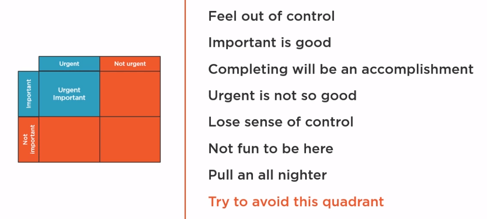
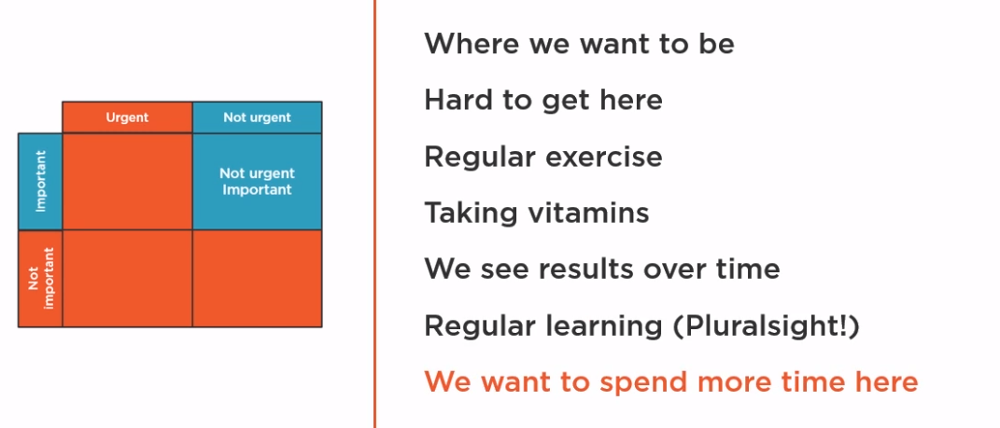
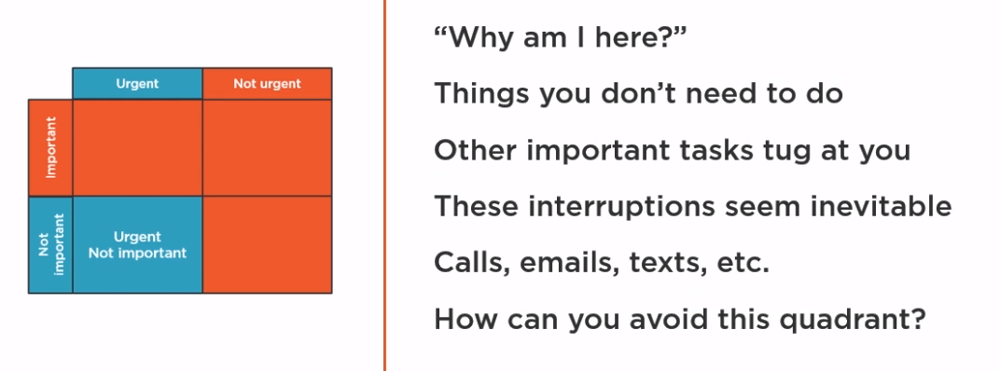
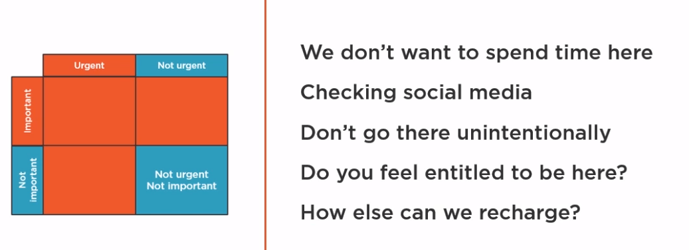
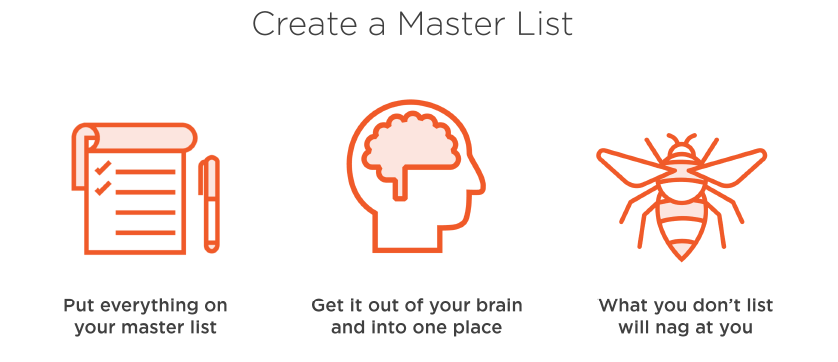
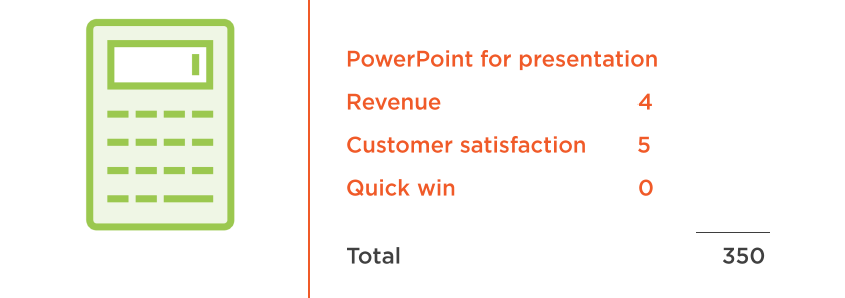
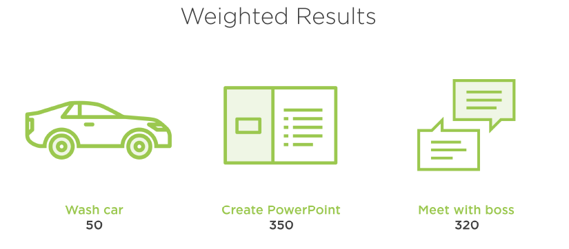
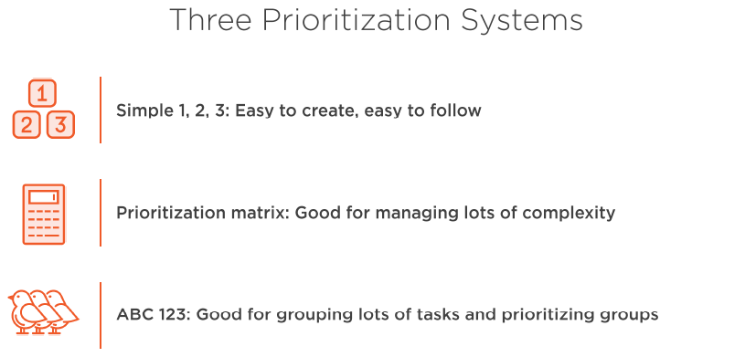
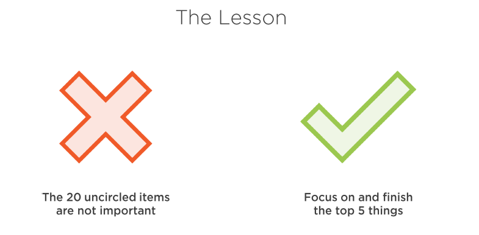

= Prioritizing Tasks and Managing - Jason Alba
:toc: top
:toclevels: 5
:sectnums:
:sectnumlevels: 5

== Prioritizing Tasks and Managing Time for Greater Productivity- Jason Alba

=== Course Overview

==== Course Overview

Hi everyone, my name is Jason Alba. Welcome to my course, Prioritizing Tasks and Managing Time for Greater Productivity. I run a website called jibberjobber.com, which is a Software as a Service model for job seekers and people who are passionate about networking. We're all interested in being a little more productive, right? Why is it that we try things that make us productive, but within a few weeks we're back to our same old habits. That's one of the challenges that we're going to address in this course. We'll talk about tactics to manage your time, tactics that you can really implement and actually use. We'll talk about prioritizing your tasks so you are working on the *most important, highest return tasks first and moving away from working on things you really shouldn't work on* #(Basketball Board Ring)#. The end result of these tactics is higher productivity. Implementing some of these tactics might give you marginal productivity improvements, but I've seen some of these tactics greatly increase the productivity of many people. By the end of this course, you'll know what you can do to greatly increase your own productivity. From there, continue your learning by diving into other soft skill courses like *Becoming a Better Listener and How to Get Your Next Promotion*. I hope you'll join me on this journey of improving your career and productivity with the Prioritizing Tasks and Managing Time for Greater Productivity course, at Pluralsight

=== Introducing Core Time Management Fundamentals

==== Introduction

In this course, we'll talk about strategies and tactics to increase our productivity. We'll talk about time management and how to prioritize our tasks and projects. *If we implement time management practices and properly prioritize our work, we should see significant productivity gains*. I think there is great power in managing our time and prioritizing our tasks. *If we just manage our time, but haven't prioritized what we need to do, we could find ourselves being very efficient working on the wrong things. If we have prioritized our tasks, but aren't good at managing our time, we will know what we have to do, but be frustrated because we just aren't getting to it* #(Visitor Parking - Time Managment)#. In this module, we'll talk about time management, which is not wasting time on things you shouldn't spend your time on. In the Prioritization module, we'll talk about continually *working on the right things first instead of just working through your list* #(Basketball Board Ring)#. In the Productivity module, we'll talk about *actually getting the right things done*. Let's go!

==== Productivity in Perspective

Before we jump into tactics and techniques, I want to talk about productivity from a manager's perspective. If I were to sit down with my team and ask why I want them to be productive, I'd expect them to say things like to get more work done, so we can take on more clients, so we can bill faster, so we can be faster to market to beat the competition, and things like that. All of those are good and true, however, from a manager's perspective, I want to add to the picture. I want my team to be productive because of what it does to my team and company culture. If you go to HR conferences, you'll see a lot of sessions on things that seem pretty fluffy, like organizational culture, employee satisfaction, and employee engagement. In fact, too often these concepts are fluffy and people just pay lip service to them while still having unreasonable expectations with unreasonable resources. If you have been a part of a bad culture or had low employee satisfaction, you know how disheartening it can be. I have worked for two organizations that have had outstanding, exceptional cultures. In both organizations, there was a feeling of peace, even while there were people hustling to get work done. *Having peace doesn't mean everything is slow and you aren't moving. For me, peace is a result of productivity. Peace comes from movement and progress*. Contrast that with an organization that hustles at the same level, but is mismanaged. Sales aren't coming in, finances are always a major concern, and employees are taking on a considerable amount of stress, passed down from managers who can barely hang on. The culture in that scenario is suffocating. *Productivity isn't just being active, productivity really means results. When you are productive, you feel a sense of pride in your work, which leads to satisfaction with your work*. Imagine a team or an entire company where people are getting the right results, where people have pride in what they work on, and have a high level of satisfaction at their job. Sounds like Nirvana, doesn't it? This is possible, and here's the beauty of it all. Productivity increases employee satisfaction, which in turn increases employee engagement. When you have a satisfied and engaged workforce, you have higher employee retention, which has a significant impact on the bottom line. When you have those things, you have team members who treat prospects and customers with respect, which leads to higher customer retention. This leads to a stronger employer brand, which can result in the right people lined up waiting to work at your organization. All of these benefits have a significant impact on your bottom line, which isn't fluffy at all. *Productivity is more than getting the right things done. It isn't just about delivering widgets or writing better code or being more focused, those things can contribute towards productivity, but productivity is more than that. Productivity impacts the heart of your organization and makes it healthier in many ways. Productivity is a critical component to culture*, which was one of those fuzzy concepts I was talking about. That is, culture is fuzzy until you have worked in a bad culture and can contrast that with working in an awesome culture. Once you know the difference, you know why culture is so important, just like those HR people say at conferences. This is why productivity, time management, and prioritization are so important.

---

image::c:/nc/bookmark.png[]

---

==== Time Management vs. You

As I was thinking about a good, real‑life time management scenario, I didn't have to look too far. I have plenty of personal time management examples. I thought about people I have worked with over the years and figured that pretty much everyone has a problem with time management. As I think about you and what you might want out of this course, I imagine you are doing things every day that rob you of your time. The last thing I want is to give a bunch of time management tips that are too hard to implement into your daily schedule. I know it's easy to slip back into old, bad habits, even when they are not efficient or productive. I was thinking about time management and you and realized it might be more descriptive to say, time management versus you.

Tell me if you relate to any of the following. *You know you have certain things you need to get done, but you never get to them. You are always putting out fires, which is exhausting. Highly related to that is always being in reaction mode. Instead of being proactive, working on tasks and projects you want to work on, you're always reacting to other things that come across your desk. Another symptom of battling and losing to time management is that people think you're disorganized. If we're struggling with time management, always reacting and putting out fires, not getting to the things we want or need to work on, we're going to appear disorganized to other people. When it is us versus time management, we feel out of control. We feel like we aren't getting ahead or working on the more important things we need to. Rather, we're working on urgent things that weren't important before, but seem to be critical now. As you put the right tools and tactics in place, you should shift from being reactive to being proactive, which is a beautiful shift.*

==== At the Heart of Time Management

Time management problems are not problems limited to people who are less smart, less educated, less skilled or less wealthy. Effective time management is a set of skills we can learn and improve on. Here are some issues at the heart of time management

#First#, we need to identify the things that are actually robbing us of our time. Sometimes I know I should work on a certain project, but I get lost in my email or I get lost on social media or reading the news[#Actionable-Items#]. Those things are easier to spend time on, especially when what I really need to work on takes a lot of effort or is simply hard. When I allow mindless things to rob me of my time, I have less time to work on tasks I need to finish.

Here's an important question. What are the most important tasks you need to work on? If I were to make a list of the top 10 things I need to do every day[#Actionable-Items#], [.line-through]#checking what my friends are up to on social media would not be on the list#. Why is it that I give #social media# and other distractions time on my schedule? Well, I do it to "#give myself a break#." When you identify your most important tasks, you can focus on getting those tasks done.

Another issue at the heart of time management is the #size or scope of our projects# [#Actionable-Items#]. I find when I take a large project and break it into smaller pieces, it's a lot easier for me to make real progress. I tend to stay on schedule instead of being overwhelmed by the scope of a huge, massive project that seems too big to finish.

I've found one of the biggest thieves of time management is having to do #rework# because a project wasn't done right the first time. Mistakes, large or small, can cause us to pause what we're doing and open up old projects. You know how hard it is to stop working on one thing, jump into something else, and then go back. This is one of the biggest time wasters and *could be avoided if we just do things right the first time*. It takes time for us to go back into the old project, try and remember what it was all about, decipher code and specs, and figure out how we need to fix what we didn't do right in the first place. Doing things right the first time might be the best time management tactic you employ.

Another issue at the heart of time management is really #defining productivity#, or what work is. You might define those things differently than how your customer or bosses define them. I've worked with people who think productivity means being at your desk a certain number of hours every day, others think it means finishing a certain number of tasks. Either, or neither, could be right. You need to define productivity and work for yourself.

==== Redefining Work and Productivity*

* #Let's further explore this idea of redefining work and productivity. Consider these questions#.
** How do you define what your job is?
** How is success measured in your job?
** What constitutes being productive?

As a business owner, I define my work and being productive completely different than when I was a full‑time employee. While my definition of work as an employee kind of made sense, I can see now I should have had a different perspective of work. If work and being productive means finishing assigned tasks, can we leave when our tasks are done? Do we have to stay late if we don't finish our tasks? Maybe, it would depend on your role. I've heard the phrases "warm bodies" and "butts in seats" to describe a workforce that doesn't need to put a lot of thought into what they're doing. These phrases are for people doing repetitive tasks, like putting together widgets. Unfortunately, when you describe a role that way, you are already defining what productivity means. Putting in hours, maybe hitting some quota. Much of the work I've done in my career has looked very different than that. You need to define work and productivity for your own job.

In my last role, I noticed the organization ran on quarterly and annual *KPIs*, that is *key performance indicators*. Some organizations call them targets, objectives or goals. These are the things you commit to doing in a planning meeting, and then you have regular check‑ins to make sure you are making progress. You might meet with your team weekly or monthly and with your boss more regularly to discuss your progress.

Here's the interesting thing. I had been an entrepreneur for 12 years before I took that job. As an entrepreneur, if I wanted to pay my bills, I had to produce. I had a sense of urgency verging on anxiety and was keenly aware of what I could do that would lead to bringing in revenue versus the time wasters that wouldn't help me pay my bills. Twelve years in that mindset, and then I went to a job where we had three or four KPIs that needed to be delivered in three months. Don't get me wrong. I could have spent a lot of time on those KPIs, but if I had to deliver any of them in a couple of weeks, I could have. The pace of work seemed frustratingly slow, but I recognized they wanted things done right the first time and well thought out. I had to change my thinking to accommodate their systems and expectations.

Honestly, it was nice to slow down a little and put a lot more thought into things rather than just get to market quickly. Productivity and work as an entrepreneur is different from productivity and work as an employee. I'll let you in on a secret. When I hire someone, I want them to think like an entrepreneur. *I want them to work hard and fast and work on things that will help my business increase revenue*. If you don't have that mentality, then we'll have some talks. It's what my business needs.

I remember in my early jobs people would brag about how they didn't do much work or how they hid from work. Pretty sad, really, because no one liked those jobs, but that was the mentality.

How you define work now might be how many hours you're actually creating stuff, maybe how many hours you code or how many tickets you complete or how many billable hours you submit. Some people measure their work by how many meetings they were in. How would an entrepreneur prioritize those things? There are many considerations, of course, but the main question is how well are you progressing towards your goals and objectives? *When you understand your value and why people pay you, you can better understand what your priorities should be. Maybe you would define your work based on your impact on the team*.

#*When you're a manager, you'll help other people do their job, but managing people and being in meetings while not getting any tickets done is definitely a paradigm shift. It can feel very unproductive. I came to realize my best contribution towards productivity was to help others become more productive. When I switched from ticket finisher to helping others finish tickets, I became more valuable in my role*.#

If you're struggling with what your work priority should be, go back to your job description. If you don't have a job description, go to a job board and look for postings with your title. How different is your job description from what you do and the outputs you're supposed to create? You might need to update your job description. This can be an important document for you and everyone around you to know what your responsibilities and expectations are. What I don't want you to do is feel like you have to put a lot of busy work into your schedule just to meet a certain number of hours.

*If you have a question about defining your work or your productivity, have a sincere conversation with your boss or your customers to understand what their expectations are. When you have a clear understanding of what your job is, you should be able to better manage your time*.

*Manage Expectations*

One of the most important things we can do to better manage our time is to manage expectations others have of the projects we're working on. When you manage expectations, you define everything that should be defined, from scope of deliverables to timeframes and deadlines. I was recently asked to do a webinar with a colleague. My colleague and I talked about various aspects of the webinar and what I would charge. When I saw his proposal to the customer, I was delighted to see he included a few clarifying points to manage expectations, points I never really thought about. In his proposal, he explicitly stated that the price would not include any editing or post‑production and that the background would be what you might commonly find in an office. I thought it was brilliant to manage those two expectations. I'm guessing he put those points of clarification in his proposal because he had a prior customer who expected editing, post‑production or perhaps a more professional background.

To manage expectations means you define and communicate everything that is reasonable. You don't have to think about every situation or scenario, and you can't imagine everything that could come up, but communicating what the customer could and should expect can help keep you from doing more work than necessary and help your customer feel satisfied with your work.

You and I both know defining a lot of things in detail can be a really big project, but if you haven't defined things to the right level of detail, you might find your customer saying this isn't what I asked for. I had something different in mind. The more you define, the closer you'll be to having the same or very similar expectations.

*#Poorly defined specs make for an uncomfortable conversation#. The results could cause your customer to lose confidence in you. When you don't manage expectations, you might take the blame for a perceived failure and assume costs. You might have to work harder to get something delivered by the deadline. These are mistakes you might make it the beginning of your career, but you should learn from them quickly. When I define project specifications, I like to understand what the MVP, or minimum viable product, is. I want to know what a successful product delivery would be and have that definition communicated properly to me and my customer. Too often, I have assumed what project priorities were. Instead of assuming, I would have been better to have the right conversations and ask the right questions*.

*The key to managing expectations is communication*. This helps when we're developing specifications, as well as sharing updates. As a manager, it frustrates me when I don't get regular updates for my team. I want to understand where they're at and how they're progressing. Constant communication and project updates help me understand if they've misunderstood specifications or if I need to update the customer. I want to know if we are still going to deliver the project on time. If we need to make adjustments, I want time to communicate that to the customer. Regular check‑ins are very important to managing expectations. When you're communicating, make sure you share the right information with the right party. *For example, if you have a conversation with your developer and find they are having technical challenges, you might not need to take that to your customer. Your customer usually doesn't care about your developer's technical challenges, they just want it done well and delivered on time. If your customer is having issues you can handle, you usually don't need to take those issues to your developers. Communicating the wrong things to the wrong people could make things more complex than they need to be.*

---here---

Finally, you need to understand your audience. You can have a very technical conversation with developers in a way you shouldn't with your customer. I'm not saying you need to dumb things down for your customer, some customers are technical and they want to have technical conversations. Just make sure you understand who your audience is, what information they need, and how much detail you should share with them. I found there are two things that can really ruin your attempts to manage expectations.

We've already talked about assumptions. The other is *scope creep*. Scope creep should be negotiated. For example, if new expectations are introduced, you might need to say something like we could do this, but it would mean we turn this project in a couple of months later, and it could add another $50,000 to the bill, or let them know you might need to reduce other specs to free up resources for new requirements, which is a good alternative when the due date or budget aren't negotiable. *When you're having these conversations, try to remove emotions. I know it can be hard to do this when you're deep into a project already headed one way and the customer asks for more or different things. That can be frustrating, but we don't need to bring undue emotion into these conversations*. *It is #your responsibility# to help the customer understand the impact of what their scope creep means.* This is a big part of managing expectations.

*Saying No*

One of the most important and effective things we can do to manage our time better is to simply say no. I know this can be hard to do, so let's talk about it. Warren Buffett said, "*The difference between successful people and really successful people is that really successful people say no to almost everything.*"

Time management guru Tim Ferriss, author of The 4‑Hour Workweek, says, "#What you don't do determines what you can do.#"

These are two immensely powerful quotes. Would you do me a favor and pause this video to write these quotes down and put them somewhere you will see them every day. In my research, I've found a lot of quotes on saying no. I invite you to search for quotes on saying no, then switch your search engine view to see images and look for quotes that inspire you to know and respect your boundaries. I invite you to do this because too many of us have a hard time saying no. When we don't say no, we might simply be overcommitting. For most of us, we are adding more things to our already busy schedule. Considering most of us already struggle with time management, overcommitting and adding to our list is not a good thing. I know saying no can be stressful. It's hard to tell someone you respect or someone you want to impress no. It feels like you are saying you aren't capable or you don't have your life in order. In some organizations, saying no can be out of place and seemingly inappropriate.

If we believe the customer is always right, saying no to them might feel taboo. It might even offend them. In some cases, saying no might lose a customer, which isn't necessarily bad. #There are plenty of reasons we find it so hard to say no, but let me tell you, saying no can also be extremely empowering#. I'd like to share language to help you say no. The whole purpose of this is so you can be more in control of your time.

A respectful and simple way to say no is, I'm sorry, I don't have the time, or resources, to do that right now. Or, you could say, that sounds like a very cool project. Unfortunately, I wouldn't be able to take it on until next year. This validates them and their ideas while communicating that we are so booked or in demand or just plain busy.

Here's another example. I'm not going to be able to do that, but I can recommend some colleagues that might be interested. This is a line I use when somebody asks me to speak at their event, but isn't willing to compensate me. I've found this is a great way to say no. I am regularly asked to do book reviews, which I normally turn down because I just don't have the time. My response has been, I'm about a year out on all of my book reviews. I could also say, as much as I want to take this on, which again validates how cool we think their project is, I can't do it until I deliver my other three projects. I could say, I've shifted my focus and don't do that type of work anymore. If I don't want to hurt a relationship, I might add, I can introduce you to some people who might be able to help you.

Let me finish with three bonus ideas related to saying no. The first idea is regarding explanations. You do not owe anyone a detailed explanation of why you're saying no. Well, maybe you owe your boss or a certain customer an explanation, but you don't have to start out with an explanation of why you have to say no.

Bonus number two has to do with assertiveness. If the person continues to ask, even after you've said no, you can simply repeat in a calm voice your last statement. You would repeat the same language every time they ask. I've been in situations where I've seen this played out. One person is asking for a favor, or something along those lines, and the other person says the same sentence every single time. It's always a no, but they repeat it calmly until the other person finally stops asking.

The third bonus idea is from my previous *business coach and mentor, Mark LeBlanc*. Mark says, "#*Instead of making a to‑do list, you should make a won't‑do list*#." Have you ever thought of listing the things you won't do? Items might end up on this list because you don't have time to do them or you're not interested in doing them, or they simply don't align with what you really need to work on. #The idea of a won't‑do list empowers you to work on the things that need your attention. saying no is critical to time management#.

*Becoming a Finisher*

If you're like me, you probably have a list of things on your mind you feel you have to do or that you've started, but haven't finished. A few years ago, I was talking to a song writing coach who helps people finish writing their songs. He told me there are a lot of songwriters who have started a whole bunch of songs, but rarely finish writing a song.

I thought the concept of becoming a finisher was quite powerful. #Unfinished projects can really clutter our minds. They take up space and they nag at us#. This impacts our ability to focus on the things we really need to work on.

Sometimes, unfinished projects are simply hard to resume. It's hard to jump into something from 6 or 12 months ago and pick up where you left off. You have to remember where you were, why you did things a certain way. Figure out if the original specs are still applicable, etc.

Finishing something right the first time is usually faster and more efficient than delaying until later, which usually increases the amount of time needed to finish. So what do we do about unfinished projects? Well, the most obvious answer is to finish the project. I know this is sometimes easier said than done. Maybe we need to change the scope of the project and then finish the new scope. *Sometimes it'll make sense to, as Seth Godin says, pivot. Perhaps we need to evaluate the project and then just pull the plug. In this case, you would say, I'm not going to finish it, and then write it off and don't worry about it unless the outcome becomes relevant again*. You would do this to get closure on those projects, allowing you to concentrate on the things you need to concentrate on now. This also helps you protect your reputation. You don't want people to think, well, I can't give that project to her because she never finishes her projects. *Finally, you gain confidence as you finish and deliver your work*. I'd say these are some pretty good reasons to become a finisher

*Multitasking: Friend or Foe?*

We can't talk about time management without talking about multitasking. For most of my career, multitasking has been a skill people brag about. For example, I can code and listen to music at the same time. Or, I can work on an important email while watching a video. Multitasking has always been an issue, but it seems like with the technology we have at our fingertips, it is an issue that just doesn't go away.

At work, I have three monitors. I typically have a lot of tabs open on my browser windows. The last time I counted, I had over 100 tabs. At any given time, I can do work on my computer, my tablet, and my phone. With all of this technology and a feeling of needing to be responsive and available, it seems like we're expected to multitask. I'm always going to be working on multiple things at the same time. My wife says this is when I'm happiest, when I have a lot of things going on. Even if I carve out time to work on one project, I get distracted. Sometimes, those distractions are urgent enough that I have to pause what I'm doing to take care of them. However, if you spend any time learning about multitasking, you'll probably read that multitasking has a bad rap. On Brainscape it says, "The evidence on multitasking is overwhelmingly negative." What evidence? Some of the evidence from MRI machines measuring brain activity shows what happens in your brain when you multitask.

I learned multitasking has deeper impacts than what I thought. I already knew multitasking impacted the quality of my work, sometimes causing rework. I also knew multitasking impacted my productivity and, in general, made me slower on any given task. But get this, the numbers I'm reading online shows that #multitasking makes you 40% less efficient, not to mention multitasking has an impact on our memory. Multitasking impacts our stress level and a host of other things, including our IQ, our EQ, our creativity, our learning, and more#.

Why, then, do we continue to multitask? One of my favorite concepts I've read is that multitasking is simply task switching. In other words, we're not really working on two different things at the same time. Rather, we switch from task to task very quickly. This can be done so fast to the point where it looks like we're multitasking, but we're really only working on one thing at a time. When I'm drafting an important email and peek at my inbox to see what has come in, I'm not really multitasking. I've stopped drafting my email, started looking at my inbox, then finished looking at my inbox and started drafting my email again.

Of course, there are degrees of complexity in task switching. Let's talk about four scenarios. First, can you walk and chew gum at the same time? This is a joke in the United States where if you can't walk and chew gum, it basically means you're clumsy or uncoordinated. Most of us can walk and chew gum. Second, can you watch a movie and eat candy at the same time? I'm guessing you can. Some would say it's the only way to watch a movie. Third, can you write an email and talk on the phone or have an important conversation with someone in your office at the same time? This is probably a little harder. My fourth example is this. Can you watch a Pluralsight course and read blog posts at the same time? I would argue that you can't. I know I can't. I need to either concentrate on the course or the article, but I can't do both at the same time. I can't switch tasks because just missing a few seconds of a course would get me lost

When people tell me they can multitask, I think sure, you can multitask simple things that don't require concentration or recall, but when you're talking about tasks that use the same part of the brain or things that are complex, according to researchers, you're only able to do one thing at a time. You might make it look like you're doing two things at the same time, but you are really just switching tasks very quickly. This is such an issue that in my Becoming a Better Listener course, I have the audacity to ask you to turn off your email, close other browsers, apps, and games and just focus on the course.

I'll end with a phrase I've come to love. I work with jobseekers and apparently multitasking is a valued skill that employers think they want. I've coached people to say something like this and make this a part of their brand. I am really good at single tasking. That means I focus on one thing. *I do it right and I don't have to rework it once I'm done. I can get more high‑quality work done faster than people who say they can multitask*.

*Effective Calendaring*

I'm a fan of using my calendar to make sure I get the right things done. I use task lists and emails in my inbox, but if something is on my calendar, I will typically do it or I'll reschedule it. The reason a calendar is so important to me is that many times I'll schedule things for months down the road. A task list with things scheduled too far out is too hard to manage. Of course, your task management or ticket system most likely ties into your calendar.

Here are some ideas to help you effectively use calendars as a time management tool. First, understand that your calendar is indeed a tool. As a tool, it's not something that manages or drives you. You are the manager and driver. The calendar is your tool to help you. Don't get to the point where your calendar is so overwhelming and frustrating that it's not helping you manage your time. One of the things that got overwhelming and frustrating for me in my calendar was the task list. I got to the point where I would open Outlook and I would have a big list of overdue tasks that I had accumulated over months. I wasn't using tasks the way the product designers thought I would. I would use the calendar to block out time and schedule things, but not keep a running list of tasks I needed to cross off. Some people say you should schedule everything, from what time you wake up to what time you eat and what time you clean up from breakfast, even what time you brush your teeth. Personally, I don't schedule to that level, but I know some people do.

One of the most important things I put on my calendar is a block of time to work on certain projects. If I block out time on my calendar, I'm much more likely to actually spend the right time on it. If I need quiet time or I need to work on something that takes a lot of concentration, I put it on my calendar with the appropriate amount of time. I find this much more effective than just saying I need to work on something sometime.

*Managing Distracting Tools*

Let's talk about tools that can distract us. The most common used to be email, but I'd say the smartphone with all of the various communication tools has become the new distraction. The irony is that many of these tools are called productivity tools. I find that without proper management, they regularly pulled me away from being productive. Whether we're talking about your phone, your email, text messaging, chatting through your email client or LinkedIn or Facebook or Twitter or collaboration tools like Yammer, Slack or Teams, we can probably all agree that as powerful as any of these are, they can pull at our attention all day and all night.

How do we manage these tools that are supposed to help us be more productive? I'll share some ideas, but I recommend you bring this up with your team and talk about how you can manage these tools better. With your phone, use voicemail. Voicemail is a great way to capture information and messages you need, but only access them when you have time. Instead of allowing the phone to distract you during all hours of the day and night, let your calls go to voicemail.

Similarly, many people have found they're more productive when they turn off their email client and only check it two or three times a day. This is a weird habitual shift, especially if you are used to monitoring your email all day long, but I invite you to give it a try. Check your email at, say, 10 and 2 and 4 and see if you are able to concentrate better on the projects you're working on. If text messaging is a major distraction, either silence your phone or hide it so you're not tempted to check your messages all the time. Just as you turned your email client off, you can turn your chat off. The easiest way to do this is to find the status setting and set yourself to do not disturb or busy. I do this when I get on webinars, and it's really nice to not have a chat pop up while I'm in a meeting. Schedule certain times to check your collaboration tools. These really are great communication tools, but just like email, if you are watching for messages all day, you might find you're slower to work on your projects. Going back to the concept of multitasking, just schedule when you will watch these tools and then honor your schedule. Basically, if you're working on something you need to concentrate on, schedule time where you turn off distractions so you can be more effective.

*Making Distractions Rewards*

* Have you thought about the things that rob you of your time? I have a number of things robbing my time every day. These distractions are usually a way I take a break or what I do between finishing one task and starting another. For example, I check my favorite news sites or I see what my friends are doing on social media. I've found I'm more productive when I change these little distractions from something I squeeze in when I get bored to rewards for finishing or making progress on tasks. My distractions include Facebook and Twitter, news sites and memes. I spend time on those in the name of unwinding or clearing my head for the next project.

* The problem is what starts out as just a few minutes can easily turn into 30 or 60 minutes, or even longer. Whatever my intentions were, I allow these distractions to rob my time. One way I juggle my work with my need to take mental breaks is by changing my distractions to rewards. I set small achievement goals, whether it is finishing a certain task or working for a certain amount of time, and then I allow myself, say 5 or 10 minutes, to spend time on what I had previously labeled a distraction. If I make sure I spend time on my top priorities and then take those rewards, I consistently make progress without letting my distractions take too much time. I shift my distractions, which have sometimes gotten away from me, to rewards. To track this, you can use apps. Some time management app will tell you how much time you have spent on social media or whatever sites you visit. Getting a report like this can give you a better idea of how much time you spend on sites you use as rewards and determine whether they re robbing you of your time.

*Summary*

* In this module, we have talked about different aspects of time management. We rethought work and productivity. We talked about managing expectations. We talked about the power of saying no and becoming a finisher. We talked about the myth of multitasking. We talked about using technology to help us manage our time better. We also talked about how distractions can become rewards. In the next module, we'll talk about techniques and tactics to prioritize tasks and projects. Let's get started.

=== Benefiting from Prioritizing

*Introduction*

In this module, we talk about the power of prioritizing and the benefits we can get from prioritizing things we need to. I want to multiply the benefits we get from time management by adding prioritizing techniques. *If you're good at time management, but feel like you're constantly putting out fires, if you're always in a reactive mode, this module is for you.* I want you to feel more peace with your work because you feel more control. #I think peace comes from making sure you're working on things you need to work on# instead of things that are just busy work or just filling time, let's get started.

*Aligning Priorities*

As we talk about priorities, it's important to understand that your priorities are not the only priorities to consider. #The priorities others have can have a real impact on how you prioritize things#. Sometimes the priorities others have might be easy to define, other times you might have to really pay attention to figure out their priorities.

For example, #how do the priorities of your organization impact your priorities#? You might be able to figure out organizational priorities by reading the mission or vision statements or your organization's marketing website. Talking to executives or listening to what is emphasized in all‑hands meetings or in company‑wide emails can help you better understand their priorities.

Of course, priorities can shift based on the economy, market opportunities or threats, but generally, organizational priorities will be related to financial health, perhaps growth, and hopefully making a difference to customers or society in general.

The question then becomes, #how aligned are the things you are prioritizing with organizational objectives? It's important to consider your boss's priorities. Her priorities should be aligned with the company priorities, but might be more hyper focused on her boss's priorities.#

For example, if you work in engineering, priorities or objectives or KPIs, or whatever you call them for the year, might emphasize delivering cleaner code or fewer bugs or faster bug resolution or more user acquisition or increased conversion to paid customers or switching from B2C to B2B.

While your organization prioritizes sound and sustainable growth, your department might be focused on just a few parts of that, perhaps the parts that have to do with delivering a reliable and scalable user experience.

Again, how are your #personal priorities aligned with your team's priorities#? We could talk about your boss's boss's priorities and your team priorities, which are hopefully aligned with the team leader's priorities, otherwise things get real messy, real quick. We could talk about your customer's priorities and how all of those align with your priorities. We could also talk about how there are organizational goals and priorities, but each person might have personal objectives, like to just enjoy their work or to aggressively move towards their next promotion or to move to another department. They can still work on organizational or team priorities, but they might be working on a personal career goal that surprises everyone. As we come to understand organizational and personal priorities, it should be easier for us to better prioritize our tasks. *While organizational priorities are always important to support, it's worth noting that helping someone make progress with their personal priorities can pay off with stronger professional relationships that could help you later in your career*. Here are the two big questions, do you understand the priorities others have, and how aligned are your priorities with those priorities?

==== Covey's Four Quadrants

One of the most important and helpful models that helped me understand how to prioritize my work and figure out where I should spend my time was made popular in Stephen Covey's landmark book, The Seven Habits of Highly Effective People. Apparently, this model wasn't created by Stephen Covey. The credit goes to US President, Dwight D. Eisenhower, but I learned about this model when I read Stephen Covey's book. Since I read about this model, it's helped me figure out where I should spend my time. The two columns are urgent and not urgent, and the two rows are important and not important. The four boxes are commonly referred to as quadrants. Quadrant 1 is Urgent Important, quadrant 2 is Not urgent, but Important. Quadrant 3 is Urgent, but not Important. And quadrant 4 is Not urgent and Not important. We now have a framework to help us figure out what we should be working on

* When we are in quadrant 1, which is where most people spend a lot of time, we tend to feel more out of control. Things in that quadrant are important, so that's good. They have to get done, and getting them done will feel like an accomplishment; however, these tasks are also urgent. When things are urgent, we lose the sense of control over our time. From vast experience I can tell you, this is not a fun quadrant to be in. An example of this might be when the boss comes in and says, we need to pull an all‑nighter in order to save a client relationship. Clearly that's important and urgent. We can't completely avoid quadrant 1, but we want to stop going into quadrant 1 all the time.

* Quadrant 2 is really where we want to be. This is where we can work on things that are important, but they're not urgent. It's sometimes hard to go into quadrant 2 because when we're working on things that are not urgent, we feel like we really need to take care of the urgent things. Examples of this might include exercise or taking vitamins. #These are things that are really important to our health, but they're not necessarily going to make a huge impact on us in the next few minutes or by tomorrow.# Over time, though, they can have a great impact on everything in our life. Another example of something in quadrant 2 is learning, or, as Stephen Covey says, the seventh habit, sharpening your saw. For example, regularly watching Pluralsight courses is important. They're important for your career and your continuing education. They're not usually urgent, though. As we get better at time management and prioritizing, hopefully we'll find we spend more time doing quadrant 2 tasks.

* Quadrant 3 is urgent, but not important. #For example, that meeting you got pulled into where you wondered why you were there.# I can't help but remember the times the CEO of a company I worked at would walk pass my office on his way to the conference room and say, Jason, I need you in this meeting. I knew I didn't need to be in those meetings. I wasn't sure why he had me there. Maybe it was for moral support. All I knew was I had things that were urgent and important that I needed to work on, and I didn't need to be in those meetings. #These interruptions seemed inevitable, whether it's a phone call, email, text or somebody pulling us into a meeting, whatever it is, there are going to be plenty of opportunities where we have something that appears to be super urgent, but really isn't important.# How much time do you think you should spend in quadrant 3? #The question really is, how can we avoid getting sucked in to quadrant 3?# That sense of urgency is going to pull at us, but we've got to figure out how to resist the pull.

* Quadrant 4 is the Not urgent and Not important quadrant. Generally, we don't want to spend any time in the Not urgent, Not important quadrant. An example of this might be #checking social# media to see what your friends are doing. The bottom line for quadrant 4 is don't go there unintentionally. I think we sometimes feel entitled to be in quadrant 4. This is where I'm going to take a break. I want to rest my brain, I want to rest my body or whatever our excuse is. Perhaps we can find ways to recharge ourselves without doing Not urgent and Not important tasks. One thing to note is that tasks in one quadrant might move to another quadrant. Something important, but not urgent today, might become the most urgent thing on your list tomorrow. You can see how using this model can help you understand where you want to spend your time. Whether you're prioritizing tasks or not, I hope you think about whether what you have to do or what you are doing is important and/or urgent. The question is, are you spending time in the right place? I haven't found a better model to answer that question than these four quadrants.

*Step 1: Create the List*

Let's go through the methodical process to prioritize things we need to work on. The first step I recommend is to create a master list of your tasks. This master list has everything, not just things you are working on right now or the most important or most urgent deliverables. Put everything on your master list. I find value in getting things out of my brain and into one place, no matter how trivial they may seem. If I don't list something, it nags at me. I was reading a book on decluttering and cleaning years ago, and the author, Don Aslett, said *if we just move our clutter to an attic or a storage room, it still nags at us*. We need to properly take care of clutter, which many times means getting rid of it. Same thing with our tasks. For me, that means putting everything on my master list. Once we have this master list, we can create a daily list to work from. Considering tasks and projects can move from one quadrant to another and your priorities might change, it makes sense to spend a few minutes to calibrate daily. Your master list can help make sure important things don't get lost in your busy schedule. In addition to your daily list, you can create weekly and monthly lists, anything that helps you work on the right things. Completion of your big projects should show up on quarterly and annual lists. Most important, your lists should help you focus on what you should work on today. This is why your master list should include everything. As you write things down, don't worry about prioritizing each item, we'll get to that soon. You will exclude things from your list later. Remember the won't‑do list concept? Creating the won't‑do is simply a function of prioritizing. A good way to think about this is to think about creating your list as a brainstorming project. When you brainstorm, don't discount things before they get written on the board. Write everything down.

*Step 2: Define Factors*

Now that we have a master list, let's define factors that help us prioritize. The question we need to answer is, what is really important? We're talking about what is important to us, our boss, our team, the organization, any of those parties or stakeholders we talked about earlier. You should recognize that factors that are important right now might not be important later. This is critical to recognize. As situations and circumstances change, factors might change. Think about something in your Important, Not urgent quadrant. As it moves to the Urgent, Important quadrant, the factors have changed. Before, completion time wasn't important, but because it is now urgent, time is very important.

Factors to consider might include your budget, how much money you can spend on this project. You might consider how much testing your deliverable needs to have done. If your target audience sees this as an MVP or a prototype, it might not need much testing. But if you're pushing something out to an end user, you might want to have a lot more testing. You should consider the talent available to you. Do you have enough people with enough time and the right skills? Or, will there be learning curves that impact how and when projects are delivered? Perhaps you consider the impact this project will have on customers or prospects, which could impact your branding, your marketing, your ability to get new customers, and more. When I work on my product roadmap. I have three important factors that impact how I prioritize my projects. These are not absolutes, sometimes they're exceptions, but these three factors usually impact my roadmap significantly. As I talk about these, I'd like you to list what you think your most important factors would be.

#The first factor# is, how might this impact our revenue? Will delivering this feature help me close more deals? If I can help the sales team be more successful, that usually justifies a spot on my roadmap. If introducing a new feature increases customer retention, I am very interested in that. I suggest you talk to the sales team and the onboarding and CX team to learn about features they would love to see based on the conversations they have had and the requests they get.

#The second factor# is, how will this impact my customer relationships? I want my customers to be delighted. I want them to be happy they chose to go with us and feel confident in our relationship. Sometimes this means we fix things that weren't a big priority for us, but were a priority for our users. Bug fixes fall into this category. I can get considerable value from my customers when they value what we deliver and our relationship. That value might come from testimonials or them introducing our solutions to their friends, or even from the trust they have in us to share ideas or give invaluable product feedback.

#The third factor# might sound a little weird. It is, can we deliver this project quickly or is it relatively easy to deliver? I think this is important because many times my dev team is heads down on hard projects that take a while to finish. Every once in a while, usually right after delivering those hard projects, I like to give them a quick win. My team needs to have those quick wins and knock things off their list or else they might feel they're always behind. Furthermore, customers usually like seeing progress. If we have projects that take a while to deliver, at least we can talk about some small improvements. Those improvements help increase their confidence in our products. Even though these projects don't have a huge impact on revenue or on customers, the momentum of doing small, quick projects is valuable. Those are three of the more important factors I consider. What would you say your factors are? You can share those in the discussion area of this course.

*Step 3: Assigning Priorities*

---

---

*Step 4: Get to Work!*

* We've talked about creating your list, we've talked about defining important factors, and we've talked about methods to prioritize individual items. There's really nothing left to do except to get to work. Let me share a few ideas for getting things crossed off your list. As I mentioned earlier, you have spent time creating your system, now it's time to honor the system. Stop second guessing what you have created or how you came to your priority conclusions. Avoid the temptation to continually tweak your system. If that means you are avoiding your work, you risk getting stuck in analysis paralysis where you overanalyze your process or your tasks and don't get anything done. Just trust your system and work through the tasks as you have prioritized them. You might be tempted to finish a task you've assigned a low priority, even though you have higher priority tasks to work on. I'll actually work on low priority tasks if they're quick wins or they nag at me, but I do this as a mental refresher knowing I have higher priority tasks I'll get to soon. #If you find yourself continually ignoring higher priority items, it might be time to rethink your system#. Maybe you didn't identify the right influential factors, or you need time to come up with a different way to prioritize each task. An underlying idea is that you want to avoid quadrant 4 from Stephen Covey's four‑quadrant model. For example, when I cross a big project of my list, I am tempted to take a break, surf the web or play a game. I'm not saying you can't ever take breaks, but be careful to not spend too much time in quadrant 4. Stay focused on your tasks and enjoy the feeling of accomplishment when you cross things off your list. I love the feeling of closing out a project from my list. Each time I do that, I get a sense of completion. At the end of the day, I can look through my list and see all of the things I finished that move me towards my goals. I get satisfaction knowing I've been working on the right things, things that will make a difference.

image::satisfaction.png[]

*#Troubleshooting To-do Lists#*

*As I've thought about why to‑do lists have failed me in the past, I've come up with a few ideas that might help make to‑do lists a more effective productivity tool. In the past, I've had a tendency to work down my list from top to bottom instead of figuring out the priorities of each item. This would always result in working on things that were not a high priority before addressing the high priorities. Sometimes I would even skip higher priority tasks if they seemed like they would take too long or they required more concentration.*

*Working through a list from top to bottom does not ensure I work on the right things in the right order. Another way I've used my to‑do lists has been to focus on whatever feels like the most urgent task at the time, but that is stressful When we always work on urgent things, we stay in a reactive mode, continually putting out fires, but not really making progress. We sometimes focus on urgent, even when things aren't necessarily important. When we neglect important because we are in urgent, the important tasks build up. It's as if we are working away from our goals instead of towards them*.

*One of the things that has made my to‑do list ineffective is to take things I haven't finished from the day before and pile them onto today's list. This can become dangerous. It's important to focus on what we need to do, which can change daily. What was a high priority yesterday might not be a high priority today. The goal isn't to cross everything off the list, it is to work on the right things. If I bring non‑important things from yesterday or last week and add them to my list today, I risk cluttering today's list and becoming overwhelmed. The system becomes unsustainable and I'm more likely to not work the system.*

*When I used Microsoft Office to manage tasks, I was really good at putting tasks in, but I wasn't good at closing them. Even though I was getting work done, I became overwhelmed at the amount of open tasks. This was especially problematic when I realized it would take hours to go through the list just to cross things off I had already taken care of.*

*I admit I was sloppy, but I learned I needed to make closing things a part of my system. Having too many lists was another problem I had. I might have sticky notes on my monitor, a list on a document on my computer, a written list on my desk, and, of course, a few tasks that weren't written anywhere, I just had them in my head. I found the most effective way for me to manage my tasks is to have one place where you are working from, and this is my suggestion to you. Even if you have to consolidate to just one sticky note on your monitor or something written down on your desk, get down to one place to work from.*

*#Revisiting Covey's Four Quadrants#*

Because Stephen Covey's four quadrants have had such an impact on the way I think about prioritizing and time management, I want to spend a little more time here. As you remember, quadrant 1 is where we're working on Urgent, Important tasks. It's always good to work on important things, but we don't want working in quadrant 1 to be our normal. When we're always working on urgent things, we can feel out of control. *When I'm in quadrant 1, I get stuff done and I'm productive, but the stress level is not something I want to sustain. I'm guessing you spend more time here than you want*. Quadrant 2 is the goal. This is where we should try to spend most of our time. Quadrant 2 tasks are Important, but Not urgent. Quadrant 3 is Urgent, but Not important. It's weird to think we might spend any time here, but when things are urgent, they all of a sudden seem important, even if they're not. For example, leveling up on a video game might feel urgent, but for most of us, it's not important. Quadrant 4, where things are neither urgent, nor important, is generally where we waste time. We should try to avoid this quadrant completely. Here are two important questions

First, in which quadrant do you spend most of your time? Are you spending more time than you should in quadrant 1, 3 or 4? If you are, what can you do to move out of those quadrants? Second, where should you spend your time? I am not saying you should only ever be in quadrant 2, you're going to have to spend your time in 1 and 3 sometimes. Urgent is urgent, spending time in urgent will sometimes be out of your control. #But at the heart of the question is this. What can you do to spend your time in the quadrants where you need to be instead of where you have been?# This might be your most important takeaway from this course.

I want to make an important point about quadrant 4. There's a big difference between leisure time activities and activities that steal your time. Let's say leisure time is where you need to take a break. There's nothing wrong with taking a break. Sometimes we need to take a mental, physical or social break. We can recharge and refresh so we come back to our projects with more energy and better focus. Contrast that healthy break with something that doesn't give us a break or recharge or refresh us. I would argue the activities that help us work better are important, which puts them in quadrant 1 or quadrant 2, whereas activities that don't help us are not important, putting them in quadrant 4.

I guess what I'm saying is, don't feel guilty for taking care of yourself, even if you didn't have that on your task list. We haven't really talked about quadrant 3 yet. This is a weird quadrant. Why would you work on something that is not important, but urgent? #I think the quadrant 3 tasks I have the most are interruptions#. This could be someone walking into my office and chatting or getting engaged in an online chat or email conversation. These become urgent, but could easily be classified as not important. I saw a suggestion online that said, #if it's urgent, but not important, figure out a way to delegate the task to someone. You could also negotiate with others involved, the people who make the task urgent to see if their urgent task is more urgent or important than other things you need to do. Or, if someone comes into your office, you could kindly and assertively let them know that you want to talk to them, but you can't right now, and could they put something on your calendar? Do you have other ways to get out of the Not important, Not urgent quadrant 3? Share them in the discussion area of this course.#

*Priorities vs. Flexibility*

Have you ever spent time working on your priorities only to find out that something changed, impacting how you have prioritized your list? These changes, which are interruptions to your plan, are inevitable. There are too many things that can happen with your team, your boss, your company, your customers, your industry, the market, the economy, etc., to be too rigid.

There are even things that we bring to the equation that can create change. For example, if you or a family member gets sick, that might throw off all of your deadlines and priorities. Regardless of what pushes us to change, #we should be flexible with the priorities we've created#. I've been involved in projects where people have reprioritized what I was working on. I'm sure you've experienced this, too. I know how frustrating it can be, especially when you've made progress on your projects. Maybe you've been close to finishing and delivering the project only to have executives or customers say they're pausing the project, or worse, that they're terminating it. I know how frustrating that can be. Many times, the decisions that change our priorities are out of our control. If change is inevitable, the question becomes, what can we control? I try really hard to not change priorities on my developers, but every once in a while I'll have something happen, usually with a market opportunity or with a customer's experience that leads to a priority change. I'm careful to not change our direction often, but there are things outside of my control that impact our priorities. As someone who's worked under development managers and now manages developers, one of the most important bits of advice I can give is to just simply get your work done. I understand changing priorities can feel like the carpet is being pulled out from under you, and everything you've worked on might be trashed. I know that's frustrating, but know that people you work for and with are watching how you act and react to these changes. They want to know that they can trust you with projects, even if you don't deliver them because of priorities that have changed. I've seen people become so hesitant about doing their work because they think changes are inevitable, but the changes never happen. They were stuck, worried, and didn't work. The result is that people are hesitant about having them on their teams. *Even in an unstable, changing environment, work on your tasks to build trust from others you work with*. I should mention, there are some excellent courses on managing change in Pluralsight. Simply search for change or look for courses by *Alice Meredith or Kevin Miller*.

*When Everything Is a Top Priority*

* Have you ever created a to‑do list where everything was a top priority? If so, you aren't the only one to have that problem. My guess is, everything on your list was urgent. Doesn't just knowing about the four quadrants give you a new perspective on priorities? If you find everything on your list is a top priority, I have an idea for you. #First, focus on quadrant 1 tasks, that is Urgent and Important. You want to work your way out of quadrant 1 by finishing or *reevaluating* those items. Eliminate urgent items that are not important, quadrant 3 tasks, by either *reevaluating* or delegating them.# This should reduce a considerable amount of stress. There's a great anecdote I read about Warren Buffett having a conversation with his pilot. Warren asked his pilot about his career goals. He asked him to list 25 things important to those goals. He then asked his pilot to circle the five most important things from that list. Obviously, these were the top priority. When Warren asked about the other 20 things, the pilot said something like, well, the top 5 are my primary focus, but the other 20 come in a close second. They're still important, so I'll work on those intermittently as I see fit, at which point Warren Buffett said, "#No, you got it wrong. Don't work on those 20 things at all until you have the 5 you circled completely done.#" The lesson I learned is that the 20 uncircled items are not important until I finish the top 5 things. #If you can list 25 things you think are high priorities, circle the 5 highest items#. This will show you what your real important priorities are. Focus on those before you work on the others. By this point, you have enough information to create your system. Make sure you honor it. You will have spent a lot of time brainstorming your tasks. You will have spent a lot of time identifying factors to help you prioritize your tasks. Working through those tasks will take time and effort. Trust your system, honor the system, and you should see satisfying progress as you work through your tasks in the right order.

*Summary*

In this module, we've talked about a lot of things to help you create a list and prioritize each item so you know what you should work on, and when. We talked about understanding priorities, ours, and those of others, and aligning our priorities with others. We talked about Stephen Covey's four quadrants. We talked about creating your list of tasks, which is a brainstorming process. We talked about defining and understanding the important factors that will help us prioritize. We talked about actually getting the right work done. We talked about the need for flexibility, especially when there are things that happen outside of our control. We talked about creating a system that works for you and honoring the system you create. In the next module, we're going to combine the time management and prioritization ideas and figure out how to benefit at the intersection of these two concepts. Let's get started.

=== Becoming More Productive: Prioritizing and Managing Time

*Introduction*

In this module, we're going to talk about the results of effective time management and prioritizing. That is, becoming more productive. By this point, you have a good understanding of time management. You are ready to prioritize your work based on a system that works for you. You're doing the right things to get the right results and finally feel like you are making progress. Let's talk about a few more productivity tactics to go to the next level.

*Review of Tactics*

We'll start with a quick review of some time management and prioritizing tactics we talked about. As we go through these, write down the tactics you would actually implement. In the Time Management module, we talked about #*turning off your email and only checking it at certain times of the day. Same with social media and even chat and collaboration tools*#. I know this can be hard. I'm usually chatting with people throughout the day, but sometimes when I need to focus on a high priority project, I turn everything off, including my phone. We talked about the ever empowering tactic of saying no. We get requests to do things all the time, and it's okay if we actually say no to some of them. We talked about how to manage expectations by using negotiation and clear communication. We even talked about redefining what your job is, which is something I think we don't do often enough. In the prioritizing module, we talked about Stephen Covey's four quadrants. This is such an empowering concept. The four quadrants help us question and understand where we alare spending our time and contrast that with where we should spend our time. We talked about creating lists, including a master to‑do list, as well as a daily to‑do list. We talked about prioritizing each task on your list to ensure you're working on the most important things first. We talked about creating the system and then honoring the system. If I missed something that stuck out to you, please pause this course and go to the discussion area and share your top time management or prioritization tips. The purpose of implementing any of these tactics is to have more productivity. I'd like you to try an experiment in positive affirmations. Get a sticky note, write I am productive on it, and then put it where you will see it throughout the day. I want you to continually think about being productive and do things to make sure you're working on the right things.

*Inspiration from a Productivity Machine*

A few years into my career, I had the privilege of working directly for a CFO. I was the first IT manager the company had hired and reported to the CFO. He was a really nice person. As I got to know him better, I found he was a productivity machine. The amount of work he did was mind boggling. While he was the company CFO, he was also the operating CEO or C00 of a retail store and had volunteer and family responsibilities that required a considerable amount of time. It was amazing to watch how he could be so productive for so many years. Here are a few specific things I learned from him.

I remember when he switched from his Franklin Day Planner to a PalmPilot. Yeah, this was that long ago. If you haven't heard of a PalmPilot, it was a revolutionary precursor to the smartphone. As the only on‑site IT person, it became my job to help him set up his PalmPilot. I was amazed as I watched him transition from his day planner to the PalmPilot. I thought this transition would take weeks or months, I've seen people try to transition from one system to another, and usually it was long and painful. My CFO used his day planner religiously. I hadn't seen anybody use a day planner as much as he did. He did this transition, which is something that would have taken me weeks or months to go through, literally overnight. He committed to this new system and didn't look back. He could have spent a lot of time toying around and playing with the PalmPilot, #*not fully committed to moving away from his old system, but he jumped right in*#, saving a lot of time in what would have otherwise been spent on learning, maybe changing his mind or using two systems at the same time. The time he saved in this transition allowed him to avoid productivity losses and stay focused on his work. The CFO also prioritized creating time to be alone and do work that required quiet alone time. Because of his high profile, he was almost always in meetings between 8 and 5. He would come into work at 6 and get a solid 2 hours of work done before his meetings started. Don't get me wrong, he delegated a lot, but these were his 2 quiet hours with no distractions. He would also work for an hour or two after 5 when everyone else went home. #*He knew he wasn't going to get distraction‑free time between 8 and 5, so he created extra hours in his schedule to do the work he needed to do*.# This CFO knew how to run very effective and efficient meetings. Even if he wasn't in charge of the meeting, he would help the person running the meeting make sure we stayed on task. In addition to making sure we didn't waste time during meetings, he reinforced a culture where #*everyone knew what they were supposed to do through clear communication of expectations, as well as ensuring we knew how to follow up on our deliverables*#. He had a lot of projects going on, and he depended on his direct reports to let him know how our projects were progressing. Another productivity tactic I learned from this man who was known for being so productive was modeled in his work environment. One time he opened his pencil drawer, and the only thing in it was one pencil. It's funny because my pencil drawers have always had all kinds of things, from paperclips to twisty ties to gum, cough drops, batteries, and the most random items. It was interesting to see this person who focused on getting the right things done, who had so many things going on, and all he had was a single pencil.

lot of articles on productivity and time management say you need to declutter your workspace. I know some people can ignore the mess and thrive in what looks like a cluttered environment, but I'm sure having a clean and organized environment kept distractions down and helped him produce more. I remember a time we were at the airport together waiting for our plane. He spent the entire time cleaning out his laptop bag. He would pick out one piece of paper, read through it, and then stand up and throw that one piece of paper away. I thought it was interesting that he didn't make a pile, but #*I could tell he was focused on getting rid of every single thing that didn't have an impact on him or his current projects*#. Perhaps most important, this person was a productivity machine because he was consistent. *During all the years I worked with him, he had his systems and he honored his systems*. His consistency and the way he managed his time, prioritized his projects, and maintained his workplace was impressive. His systems were easy to do and sustainable over years. In my other courses, I share a powerful line from my friend, Mark LeBlanc, a business growth coach. "Consistency trumps commitment." You may be committed to being productive, but you're not going to be productive unless you work your system consistently. Have you observed someone who is a productivity machine? What can you share with us about their habits and tactics? Please share that in the discussion area of this course.

*Understanding Productivity*

Since we're talking about productivity as our end goal, let's spend a minute to define what productivity is and maybe what it isn't. Just because you're working doesn't mean you're being productive. The word produce is at the heart of productivity. Produce means output. There has to be some kind of output when you're producing something. A lot of times I hear people say I'm so busy. They either say this in a way that shows how tired they are because of how busy they are or because they seem to be so productive. #*But, really, busy is not necessarily the same thing as productive. Busy should not be our goal. Our goal should be to produce the right things*.# Imagine working on a project or being busy with a project, but never finishing. That's the difference between being busy or working a lot and actually being productive and having deliverables. let me share a story with you. When I was in school, I was working as an intern developing an intranet website for an awesome company. It was a great opportunity for me because I was treated as part of the dev team, not just as an intern. My internship was a fun, career changing experience. At the beginning of my senior semester, I sat down with a guy who was majoring in accounting. He had just finished an internship and I was excited to compare notes. I was shocked when he started telling me what he did as an intern. He said Jason, it was so easy for me to disappear during the day. All I would do was take envelopes and walk around the building. He would go one or two floors below where his office and boss were. Because he had the envelopes, it looked like he had a purpose and was busy, but he told me what he really did was sit around and talk with other people in the organization for hours. They weren't talking about work. They were just talking about interests and hobbies and maybe even how much they disliked their job. I was astonished at this person's attitude towards his internship. I got a perspective on what work ethic was and what he really valued. I was surprised at how he didn't understand how great an opportunity this internship could have been for his future. I had already seen how my internship had shaped my career and was shocked he wasn't taking advantage of such a cool opportunity. I share this story because it's a perfect example of not understanding the end goal. In his mind, the end goal was to clock in and clock out at certain hours, having been in the office for a certain amount of time. My end goal was not time‑based at all. When I was developing products, my end goal was to deliver the products. This helped shape my perspective on what productivity is. It's not as much time‑based as it is producing and getting a final product delivered. I invite you to think about what your output is. Is your output or your value to the organization that you're there from 8 to 5, or is it that you go to a lot of meetings or is it that you actually deliver things for customers? #*Think about what your value to the organization is*#. It's probably not that you can warm a chair in a meeting or that you clock in on time. As you define your output, or your value, I hope you'll find it is aligned with your organization's goals. #*If what you do is aligned with organizational goals, you will probably be known as someone who is highly productive*#.

*Aligning Goals and Objectives*

I talk about alignment multiple times in this course. #*If your goals and objectives are not aligned with the goals and objectives of your customer, which again could be an internal or external customer, you could be working on the wrong things*.# It doesn't matter if you produce a lot if what you produce are the wrong things. You should be able to communicate what the end goal of your project is, as well as what the end results should be. As long as you understand what the customer's goals and end results are, you can easily align your goals and end results with theirs.

If you are #*overwhelmed*# by the magnitude or scope of their goals and end results, #*simply break the project into bite‑size chunks that you can manage*#. Another way to approach being overwhelmed is to work backwards from the end result. You might not know exactly how to work forward from where you are at, but if you can define the end goal and then say, okay, what's the thing that needs to happen before we can accomplish the end goal and continue that process working backwards to where you are, you will be able to create a path moving forward. Can you imagine how much time you would waste if you worked backwards from an end goal that isn't aligned with your customer's end goal? As you work on each part of your project, you should be able to recognize if it is still aligned with the end goal. Perhaps each deliverable on your critical path, which is basically a step of the project you need to complete before you work on the next step, is a good place to reassess alignment. Make sure you communicate continually and clearly with your customers. Sometimes goals and objectives can change, and that communication can help you stay aligned and ensure you're working on the right projects.

*Do the Right Work at the Right Time*

Perhaps one of the most meaningful and impactful ideas I read while studying productivity and time management was that during the day, and even during the week, there are optimal times to do certain types of work. For example, there are probably times during the day when you're most productive with projects like coding or studying or writing, or whatever. Then, there are other times that are better for meetings or getting away from your desk. Think about when you have the most energy during your work day and when you are the most sluggish. I tend to write my blog post first thing in the morning, while others prefer to write it late at night. I love to have meetings with people on Friday afternoons because I feel like this is when I have zero productivity or motivation with what I call my quiet time projects. There are certain times of the day that are more optimal for me to talk to people.

I would rather not talk to people before lunch because that's when I'm more productive and can focus and think harder. But in the afternoon, around 2 or 3, I'm kind of out of gas on those projects, and talking to people gives me energy. I invite you to figure out what times of the day are optimal for different tasks you do. Then, block out times on your calendar to do the different tasks. You want to identify and schedule the best fit between your time and your tasks. For example, from 8 until 10, work on a certain type of project. Then, from 10 to 10:30, check email and respond to critical emails. From 10:30 until 12, block out time to do a different kind of task, such as meetings, and so on.

#*Just understanding when I'm optimized to do certain types of work and block out those times on my calendar has really helped me increase my productivity*#. When you create those blocks, try to honor them. I know you will have interruptions or things will come up, but if you have something you really need to make progress on, honor the blocks. Don't let quadrant 4, which are unimportant, not urgent things, and quadrant 3, which are urgent, but not important things steal time from you or sneak into the time you have blocked out for certain tasks. Protect your time so you find yourself in an ideal scenario, doing the right things at the right times. This definitely requires discipline because it means you'll have to say no to things that come up. And really, it's okay to do that. I give you permission to take control of your calendar and say, 10 o'clock doesn't work for me, can we do it at 2 instead? While this requires discipline, just remember, there are things outside of your control, so be flexible. If you have to fit an urgent task into one of your blocks, go ahead and do it. Hopefully, that becomes more of an exception than the rule.

*Body and Brain Hacks*

#Bookmark#

We talked about identifying the best times of the day to do certain types of work. What can we do when we feel like we're just not performing, when we don't feel motivated or productive? If this resonates with you, I invite you to learn about hacking your body and your brain to become more productive.

There are tons of resources online that talk about this. *Hacking your body and your brain is a really cool concept, because instead of being driven by how we feel at the time, which is a passive approach to productivity, we can do things proactively to change how we feel*. When you feel like you're in a mental or a physical slump, a time when you aren't effective and all you want to do is play a game or read an article or surf the web mindlessly, are there things you can do to impact your productivity?

#*Absolutely*#. Here are some ideas The first idea has to do with your diet. I know a lot of people use soda, coffee or energy drinks to help them feel awake and have more energy. I'm personally not a fan of using sugar for energy. Have you ever had to present in a meeting after lunch? I remember once I was on around 2 or 3 in the afternoon when the sugar crash was in full effect. There are healthier ways to impact your energy during your workday. The first step is to honestly evaluate your diet, specifically for energy management, and make changes to your meals and snacks. There are plenty of articles you can dive into about when and what you eat impacting mental and physical performance.

Another idea is something like mindful meditation or yoga, or something similar. *I've learned to love going on walks in the middle of the day*. I didn't think it was doing much for me physically, like running or cycling would, but #*when I come back from a walk, I feel more energized and awake. My mind is clear and I'm ready to focus on whatever I was working on*#. Whether I'm picking up on something I took a break from or diving into an entirely new project, going on walks has had a significant impact on my ability to perform at work.

Another idea I've found to be very effective is to make sure I get adequate sleep. This might mean I go to bed earlier or sleep in a little later. Sometimes I take a nap during the workday. I know napping might sound weird, but there are companies who have set up nap areas with sleep pods or private rooms and promote short power naps. I have been experimenting with my own sleep schedule over the years, and #*I've realized that I work best when I get a full night's sleep*#. I bring more of me to my work and am more productive. Sometimes during the mid‑afternoon I am just so tired I can't concentrate and don't make any progress on my work. I will usually go for a short walk, but there have been times when I recognized I just needed to lay down and take a 20‑minute nap. I've even done this in the parking lot in my car. Another idea to increase your productivity is to get natural sunlight.

If you work in an office where you don't get natural sunlight, #*consider taking a 5 or 10 minute break to go out and enjoy the sunshine*#. There are plenty of articles that talk about the physical and mental benefits of appropriate exposure to sunlight.

* #*Laughing is another thing you can do to impact your mental or physical productivity*#. When you laugh, you actually release chemicals in your brain. Laughing does something to your brain. It can be invigorating and change your mood. If you're looking for something to replace quadrant 4 activities, the Not urgent, Not important things that have been stealing of your time, consider the so‑called brain games you can find online. You can play these games on your phone or your computer. They are designed to stimulate your brain.

Another idea is to choose the right music. I pick music that's appropriate for the project I'm working on. Sometimes that means music with a faster beat or without lyrics. I like to have music that helps me be more productive or concentrate on my project. There's some music I use regularly and other music that, while I love, I avoid at work because I can't concentrate on work when I listen to it. Here's a mind trick I sometimes do on myself. I'll pretend I'm going out of town and only have a few hours to finish my work. I've realized right before a trip I'm super productive and get my important tasks done and delivered. Giving myself a short‑term deadline helps ensure I focus on the right tasks. If I only have, for example, 4 hours to work on a project, I feel an urgency to focus on and finish that project. *I'm still amazed how much more I get done when I give myself this kind of artificial deadline*.

I share these brain and body hacks because they have worked for me. I'd love to hear what works for you. Please share your thoughts in the discussion area of this course. The next step is to figure out the times during the day you would use any of these ideas. For me, if I get in to work around 7 o'clock, I'll do a lot of heavy and critical thinking work. By around 10 or 11, I need a break, which is when I go on a walk. Not only do I move around and get a change of scenery, I also get natural sunlight. When I come back, I'm more invigorated and ready to tackle the rest of my day. What ideas are you most likely to try?

*Understanding Your Value*

Understanding your value should help you be more productive. *Understanding your value should help you prioritize your tasks and manage your time better*. In my own career, I've found understanding my value helps me have higher job satisfaction because I align the tasks I work on with my highest value‑add. When you understand your value, you wonder if some things you have been doing should be done by others. Whether you outsource certain tasks or hire people depends on your circumstances, but even thinking about this shows you value what you bring to the table. This allows you to focus on your highest value‑add to your customers. Of course, sometimes you have to do the busy work or the work you would rather not do. If circumstances dictate, then just get it done, but perhaps work towards figuring out where your best value is and spending more time contributing there.

When I was in school, someone asked, should Michael Jordan mow his own lawn? The scenario presented was that Michael Jordan, the famous basketball player, of course, made X amount per hour. I don't know how much, but probably somewhere in the thousands or tens of thousands of dollars per hour. Let's say he had 5 acres of lawn. Should he get on a riding lawnmower and mow his lawn? The argument was that he was missing out on additional money he could have made doing something else. He should just pay someone else to do that work, right? I thought this was a flawed example because Michael Jordan was going to make that money whether he was mowing a lawn or not. Maybe he enjoyed getting on his riding lawnmower. This weird example came up as someone was making a point about valuing your worth and making sure your work is aligned with your worth. Now, you're not Michael Jordan, at least I'm pretty sure Michael Jordan isn't watching this course unless he's coming out of retirement. The question for you is, based on your productivity, what would you say you are worth? If you freelance, how much should you charge? Thinking through this can help you understand how to become more productive. Basing your value on hours you work might be the wrong way to look at this. When I coach new entrepreneurs, I find this is the biggest mistake they make. Too often, the new entrepreneur, freelancer, contract worker, or whatever, thinks, well, at my last job, I made $100,000 a year, divide that by 2080, the number of hours we typically work in a year, and I get around $50 an hour, so I'll just bill $50 an hour. There are two problems with this. First, most people don't realize the employer has what is called a burden rate, which is the cost an employer pays to have you on staff above your salary. It might cost the employer $75 an hour instead of $50, so right there you have misunderstood your value. The bigger issue, in my opinion, is that when you price yourself that way, you don't understand the value you bring to your customer. Is your value that you were in front of a computer for an hour or that you delivered what the customer wanted? If you deliver something to the customer that is worth $500,000 to them, what is your value? It's more than $50 an hour. Productivity is at the heart of these examples. I want you to value what you produce at least as much as your employers value you. *I want you to understand what you bring to the table. When you understand this, you begin to understand what you shouldn't work on, perhaps what you should say no to or what you should delegate. When you understand the value of your productivity and assign a dollar amount to that value, you can better understand how and where you should work*. Of course, you won't be able to say no to or delegate everything you feel like you should, but you can work towards focusing on your highest value contributions and become more productive.

*80/20 and Working on the Right Tasks*

Throughout this course, I've asked you to think about whether you are working on projects you should be working on or if you are spending time on things that are either not urgent or not important. I want to approach this question from a different angle. I'm sure you have heard of the Pareto principle, often called the 80/20 rule. You get 80% of your sales from 20% of your sales team. You get 80% of your bug reports from 20% of your users. You get 80% of your results from 20% of where you spend your time. The 80/20 rule has been used as justification for many things. I hear it cited regularly to describe cause and effect. *The basic idea is that there are certain things you'll do that will have a much higher impact on the end result than a lot of other things you do*. On the one hand, this is discouraging because it says 80% of what we do might matter. On the other hand, if we can figure out what the 20% that will have an impact is, we might know where to focus our time. This begs the question, what are the things in your best 20% that produce the most important results? This can be hard to answer because maybe you really enjoy coding, but your highest value is meeting with customers. When we think of ourselves by just our title and not the things we do to bring 80% of the overall value, we sometimes work on the wrong things. Another question is, should you ever actually spend time working on tasks that make up the other 80%? Of course, we can't completely ignore or neglect the other 80%, but maybe we look at it this way. Remember when we were talking about prioritizing and there was the ABC system? Maybe the A's are the 20%, and everything else, the other 80%, are the B's and C's. The 80/20 rule provides a good lens through which you can frame the question of outsourcing what you do. If you identify and focus on the 20% tasks, maybe you hire out or somehow offload the other 80%, you're really trying to look for the best use of your time and effort. Identifying the 20% of your tasks that impacts 80% of your results will help you know what you should work on. I'm not giving you permission to ignore or neglect the other 80%. A lot of it has to be done. It's just not going to have as big of an impact as what the 20% has. How does this 80/20 rule change how you look at productivity and prioritization?

*Mark LeBlanc's Daily HVAs*

One of the most impactful productivity systems I've come across is Mark LeBlanc's daily *HVAs, or high value activities*. It left such an impression on me that I created an entire job search system based around it. Here's how the HVA model works. Mark says to identify activities that are essential to helping you meet your goals. Mark's clients are small businesses whose common goal is to grow their business. My clients are job seekers whose common goal is to get a job. HVAs are tasks that are laser focused on accomplishing those goals. *Whatever your goals are, you can probably identify high value activities that will have a high impact on accomplishing your goal*. Then, every day you choose three high value activities you'll complete. There are a few other components to this system, including daily accountability, but that's the gist of it. #*When we consistently focus on completing our three HVAs every day, we should see measurable results*#. HVAs are never busywork, rather they are tasks that will really make a difference. Cleaning your desk would rarely be considered a high value activity. It's an activity, and it brings value to you, but to me it feels more like downtime compared to doing something that will get you closer to delivering code or designing a new network, or whatever you're working on. Remember, you are after productivity that gets you to the right end. The HVA system helps you do the right things over time. Mark emphasizes a critical point. *The magnitude of the HVA, or the time required to complete the task, doesn't necessarily matter*. What you're looking for are high impact tasks that will get you closer to your goals. Don't worry about HVAs taking hours or all day in order to be impactful. Many days, my high value activities are so small I can do them within 30 to 60 minutes. This system works because we aren't focusing on doing a lot of work. Rather, we're focusing on consistently every day doing things that get us closer to our objectives. This system has become one of the most important productivity tactics I use. #*Typically, I'll work on my three high value activities in the morning. Once I'm done with my high value activities, I almost don't care how the rest of my day goes. Of course, I still do things to help me be productive, but just knowing I got my three HVAs done gives me peace*#. I know I'm continually getting closer to my objectives. Another critical aspect of this system is consistency. The system doesn't work well if you do three high value activities one day and not do it again for a few weeks. *Mark says, if you're working on three high value activities every day, and that's the critical piece many people unintentionally mess up on, even if they're small activities, you're consistently moving towards your objectives*. Finally, Mark says every morning and every evening, ask yourself these questions. In the morning, you ask, what are the three high value activities I will complete today? In the evening, you ask, did I complete those three high value activities? These questions give you accountability and help ensure you're consistently working on activities that are indeed high in value.

*How to Be Flexible When Change Is Imminent*

I imagine some of you are watching this course thinking, Jason, these are all really nice ideas for other people, but where I work, I have too many things I'm not in control of. I feel like other people change my priorities regularly. In my last job, it was common for people to add meetings to coworker's calendars. Of course, the coworker had to approve the calendar entry, but I thought it was weird to allow others so much control over your calendar, even having the ability to see when you were "free." We all know we aren't going to get away from change in the workplace. The question then becomes, how do we manage change? There's a whole discipline around what experts call change management, and it's taught to leaders and non‑leaders alike. A core principle of change management is the idea of feeling in control. It's really hard to feel in control when things change, but I think if we shift our perspective on what being in control means, we can have that be much less stressful. I want you to think about change and control and how they impact your ability to be productive.

In Stephen Covey's book, The Seven Habits of Highly Effective People, he talks about the concept of your circle of influence. Your circle of influence includes things you have an influence on. Outside of your circle of influence are things you don't have an influence on. He calls this the bigger circle, or the circle of concern, He says too often we worry about or spend time on things that are in the circle of concern, but they're not in our circle of influence. Stephen says we need to make sure we're working on and worrying about things that are within our circle of influence. These are the things we have control over. We shouldn't spend hardly any time in the circle of concern. One of my personal goals has been to grow my circle of influence, which might mean getting into a position where I have more control over things happening around me. I've done this throughout my career as I've taken management and leadership roles, and as I volunteered for roles that have given me growth opportunities. This whole concept is very empowering and freeing. It basically says look, spend your time and energy where you can actually make an impact, and don't worry about all of that other stuff. Of course, even when you have expanded your circle of influence, there will be people or things that can change what you're working on. This includes internal or external customers, the market or economy, competitors, your boss, your family or your health. Think about who or what has power to pull you outside of your circle of influence. Because we work in highly volatile environments with so many changes in technology, we should understand and accept change. We need to understand we're not always going to be able to work on the things we want to work on. Understanding, accepting, and working within change are life skills that will help us at work. Having said that, when you become a master of time management, prioritizing and working within your circle of influence, you are in a position to stand your ground a little better and have more control over what you do. Instead of being controlled by the whims that seem to randomly come up, you can say, you know what, those look like great ideas, but they're not aligned with the organization's goals, or those are great ideas and I'll be able to work on them once I finish some of these other tasks. Becoming a master of where you spend your time helps empower you in those situations.

*Logging Your Time*

If you feel like your schedule is out of control or you're not making the progress you think you should, especially for the amount of work you do, I suggest you try a simple exercise. Start logging your time and analyze where you spend your time. You can do this manually with a spreadsheet or document, or even a piece of paper on your desk. Write down everything you do during the day. Even though you are in tech, manually writing this down might be a good way to figure out where you really spend your time. The key is to track everything, especially those 5‑minute breaks. You might learn that by the end of the day, the little breaks have added up. You could also look at time management or time logging apps. The benefit of these apps is that they can track what you do while on the computer. You might see you spend way more time on email or on certain websites than you thought. The report could even show how much time you spend working on billable or customer projects and give you great information to take back to the customer or help you estimate your projects more accurately. Basically, we're creating data to make proper conclusions and better decisions. Too often, we guesstimate how much time we spend on things, and if we're off on our guesstimates, we can't come to accurate conclusions, nor can we make informed decisions. Logging allows you to really know what you are doing. You can categorize each thing you do into one of the four quadrants and get an idea of how urgent things are driving your day or how often you work on important things. I imagine some people will be surprised by how many non‑urgent or non‑important things take over their calendar. Tracking can be so insightful. Once you have this information, you can ask yourself some important questions. Are you wasting time? If so, where? Are you spending more time on certain projects than what you thought? Are you allocating the right amount of time on projects you really need to work on? Maybe you estimated 6 hours for a certain project, but you really spent 18 hours on it. Either there was something wrong with the project, the specs changed, you're not as efficient as you thought you were or you didn't estimate well. Knowing this can have an impact on how you'll estimate the next project. Logging time is common practice if your work is billable. Project managers, estimators, managers, and sometimes customers want to know how accurate estimates were. They can use that information to see if the project could be delivered on time, as well as estimating the cost of future projects. Your logs can also justify your billing. Whether your work is billable or not, logging gives you insight into your productivity. In addition to logging things you have on your calendar, things you plan to do, log interruptions. You might be surprised by how many interruptions you had and how much time those interruptions took. If the data shows you had more interruptions than you thought, it might make sense to revisit what we've talked about before with saying no, managing expectations and negotiating. When I've logged my time, I've been surprised by how much time I've spent in certain places, but I've ended up with data to help me make the right changes to become more productive.

*Quality-based Productivity*

Let's talk about the impact the quality of our work has on productivity. The phrase that comes to mind, something I've heard a lot, is do it right the first time. Why is this such a popular phrase? Well, let's think about doing it right the first time in the context of coding, How much does a bug cost? This is a big question. The cost of a bug is different, depending on who finds it. If the developer spends weeks hunting down a bug, you've lost weeks of productivity. This might be called opportunity cost. If QA finds the bug and then reports it, now you have involved at least two people, the QA person and the developer. Hopefully, you have systems in place to track and reduce root bug causes, but what if a customer finds the bug? This could result in a loss of money, customers, and trust. What if a hacker finds the bug? Now we're talking about the kinds of costs that shut companies down. I'm not suggesting that bugs are a result of being sloppy or negligent. There are so many factors involved, and sometimes bugs are just inevitable. Thank goodness for QA professionals and systems, right? So, how can we do it right the first time? Like I said, there are so many factors. Perhaps you didn't have enough time to do everything you should have the right way. Perhaps specs were bad, you were underfunded or understaffed, perhaps scope creep was obnoxiously present. Each situation will be different. I think critical elements of doing something right the first time so you don't have to revisit and fix later comes down to really understanding what we need to accomplish, sometimes called a needs analysis and proper communication. This should help us and our stakeholders know what we're working on and ensure we're working on the right things. When we have proper communication, we should deliver what the customer expects. We should be able to have the right quality assurance as part of our process, whether we QA own work, like proofreading an email, for example, or we pass a deliverable off to the QA team. Meeting project deadlines is an important factor in doing things right the first time. If I'm late on my deadlines, I lose trust from others and from myself. Sometimes being late causes the specs or priorities to change. If being late has lowered the priorities of my projects, working on them might be less important or less urgent. Nobody wants to work on things that really aren't important. In order to do things right the first time, I need to have good systems and processes in place. I need to make sure I have the right tools and the proper training. If I don't have good processes, I can either take too long to do it or I can't deliver the right product. I know we all strive to deliver high‑quality work. When we do things right the first time, we accomplish more of the right projects. We don't have to spend time or money rebuilding trust when we don't have to do rework.

*Planning for Productivity*

Early in my career, I learned about the power of creating a plan for my next day's work. This actually has become one of the most powerful productivity tips I've implemented. Even today, I will check my calendar for the next day and make sure I know what's scheduled, as well as add anything I know I need to. *I've found there is a huge difference between doing this type of planning the night before versus the morning of*. I've tried both ways, and when I plan the night before, my next day goes so much better. I think it's because I can focus on what is important for the next day instead of what is urgent, which is what I focus on if I plan the morning of. When you make a list of tasks to work on for the next day, make sure you schedule those tasks at the right time of the day. We talked about this in the body and mind hacking video. When I get my tasks listed and scheduled, it's as if I release them and they don't keep me up at night. It releases some kind of mental stress, and I know I will not forget to do those things because they're written down. If I don't write them down, either in a list or on my calendar, they weigh me down. Planning the night before frees my mind of those tactical things and actually allows me to think more strategically. I'm not worrying about forgetting the details. Sometimes I think about how I'm actually going to tackle it, or I think about how it fits into any of my long‑term objectives. I've gone to bed many times pondering the projects I know I'm going to work on the next day, which has helped me get a head start on how I would address those problems. When I wake the next morning, I'm not wondering what I'm going to work on. Of course, I'm flexible. If something needs to change, I'll change it, but I don't have to get up the next morning and wonder what I'm going to work on. When I don't plan the night before, I find I can easily spend 30 minutes or more trying to figure out what I should really work on. I don't usually spend 30 minutes planning the night before, so already I've wasted more time, but it makes my morning start off kind of sluggish. I also find that in the morning I'm typically adding things to my list based on my emotions or whatever feels most urgent. *My morning planning is more whimsical. If I plan the night before, emotions and urgency are not major contributors to how I plan. Planning the night before helps me focus on what I really need to work on, what is really important*. If you haven't planned your next day the night before, I invite you to try it this week or this month. Let me know if that makes a difference in your productivity.

*Summary*

In this module, we talked about understanding productivity, defining our goals and objectives, and making sure they're aligned with the goals and objectives we need to align them with. We talked about identifying the best time of the day for different kinds of work. We talked about brain and body hacks to help us be more productive because of increased energy and focus. We also talked about understanding our value and making sure we're working on the right projects. We talked about the 80/20 rule, also known as the Pareto principle, and how this applies to what we work on.** We talked about choosing three high value activities to work on each day and the power of logging and analyzing our time, doing things right the first time and planning our day the night before**. If you've been taking notes, you might have written down some of these things to work on. Focus on production and outcomes. Figure out times of the day that are best for you to work on certain tasks. Make a plan to add exercise and a better diet into your schedule. Identify what 20% of your tasks will have the biggest impact on your outcome. Define high value activities to work on. Log your time for one week and analyze your log. I'd like you to think about saying no more often. Make and prioritize your daily list and work from that list. Focus on getting the right stuff done. Create a time management and prioritization system that works for you. If you find it's not working, adjust it. Once you have your system and it's working for you, then honor your system. I hope the ideas in this course will help you improve your productivity and feel more empowered and in control of your time. I'd love to hear what your takeaways were from this course or any tips you would like to add. Please share in the discussion area of this course. And now, it's time to put these ideas into practice. Good luck
