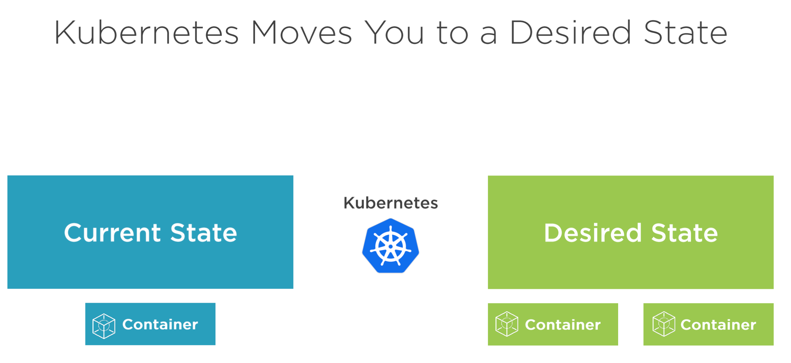
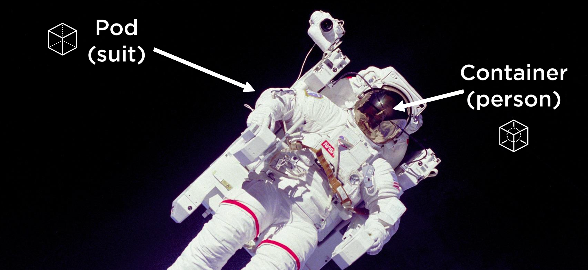
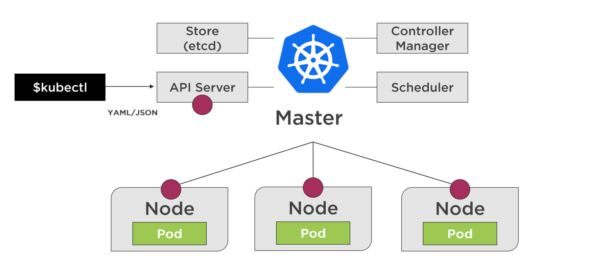
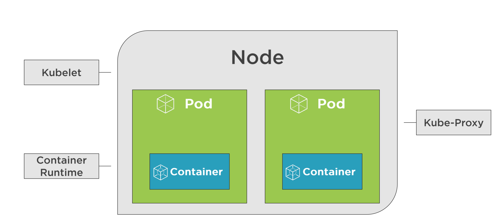
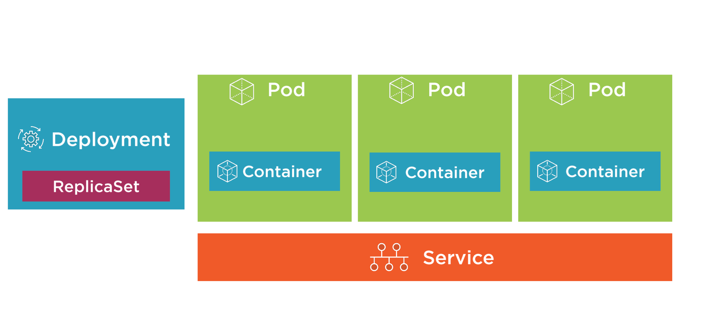
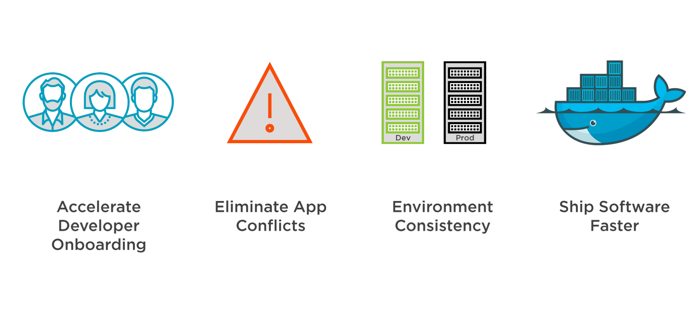
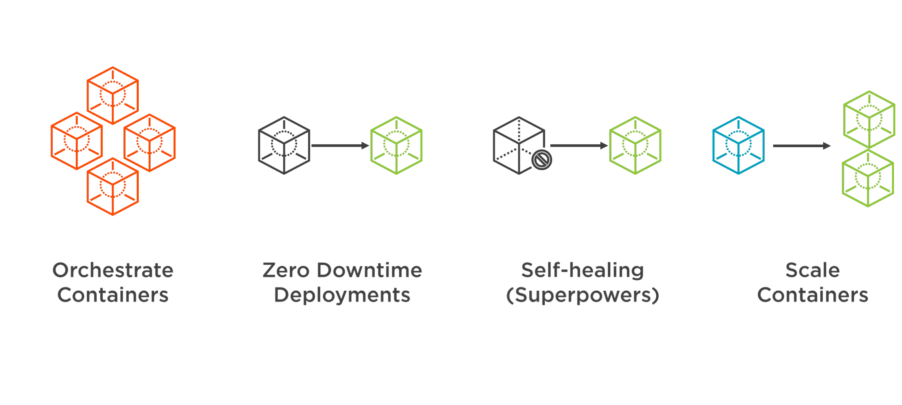
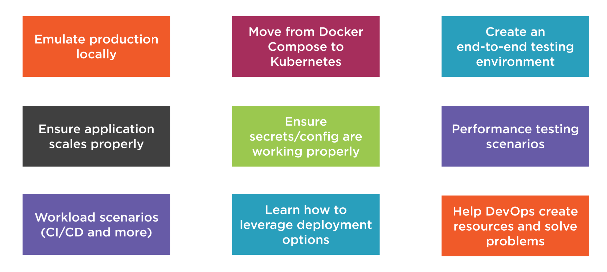

= Dan Wahlin K8s
:toc: left
:toclevels: 5
:sectnums:
:sectnumlevels: 5

== Kubernetes for Developers: Core Concepts by Dan Wahlin

----
k run my-nginx --image=nginx:alpine

k get pods

k port-forward my-nginx 8080:80

k deleted pod my-nginx
----

===  Course Overview

==== Course Overview

Welcome to the Kubernetes for Developers: Core Concepts course. My name's Dan Wahlin, I'm a software developer, architect, and trainer specializing in development and container technologies. Over the years, I've had the opportunity to work with containers extensively, and I'm excited to discuss how you can leverage your existing knowledge of containers while using Kubernetes. The goal of this course is to teach you about the core concepts of Kubernetes and the key resources it provides. Whether you're learning about Kubernetes for production or simply want to run it locally for testing or other scenarios, this course will provide the building blocks you need to get started. The course starts out by providing a big picture look at what Kubernetes is, what it's composed of, and different ways it can be used as a developer. One of the key resources provided by Kubernetes is Pods. You'll learn about what a Pod is and how multiple Pods can be used to host containers for an application. From there, you'll learn about how to create Pods using deployments and learn about services and how they can be used to provide networking functionality for your Pods throughout a Kubernetes cluster. As the course progresses, you'll also learn how to get configuration data into your application using config maps and handle sensitive information using secrets. Finally, you'll see how to put all of the concepts together to get an application up and running in a Kubernetes cluster. So let's get started by talking about what Kubernetes is and the benefits it can bring you as a developer.

=== Kubernetes from a Developer Perspective

==== Overview

Let's start things off by talking about what are we going to cover in this course. So we're going to start by talking about Kubernetes, but from a developer perspective. Why would you, as a developer, want to invest time learning Kubernetes? Well, you might already have a good reason just based on what you're doing at work, but if you don't, we'll discuss several of the benefits that knowing Kubernetes can bring to you as a developer. Now, from there, we're going to jump into some of the key building blocks of Kubernetes. So we're going to talk about Pods, how they can be used to run containers and how they work under the covers. From there, we'll talk about how we can deploy Pods and several different features that are really great when it comes to application deployment, including things like zero downtime deployment. From there, we're going to get into some networking concepts and talk about Kubernetes services. Many applications or containers might have storage requirements, so we're going to talk about those. And if you've ever worked with Docker volumes before, we're going to talk about it in the context of Kubernetes and how we can use things called persistent volumes, persistent volume claims, and much more. Now, just about every application out there needs configuration data, so how does that work as you move your app into Kubernetes? Well, that's going to get us into a discussion on config maps, which are key value pairs, and secrets for storing more sensitive data. Once we've covered all the building blocks, then, of Kubernetes, we're going to put it all together and run through an application that demonstrates how Pods and deployments and services and storage and more can all be used together in Kubernetes. And then we'll have a quick course summary to sum up everything we've done throughout the course.

I want to emphasize that this course is going to be presented in the context of a developer. We're not going to get into administrator‑type concepts because there's already courses out there on Pluralsight that are designed for administrators of a Kubernetes cluster. But, if you're a developer and looking to understand the core concepts of Kubernetes, you're in the right place. This is the course for you. Now, to get the most out of this course, here's what the prereqs would be. So first off, you do need to be comfortable using command line tools and virtual machines, you need, of course, to have a general familiarity with software development, and then an understanding of Docker containers and how they work, including things like building images and converting those images into running containers would definitely benefit you as you go through the course. So having introduced the agenda for the course and what you need to get the most out of it, let's go ahead and dive into this first module's introduction.

==== Introduction

Let's kick things off by talking about Kubernetes from a developer perspective. Now, if you're like me, you've probably heard about Kubernetes being used in production scenarios, and maybe wondered why would I even need to waste time on that? My DevOps team or someone else is going to handle that. Well, in this first module, I'm going to try to address some of those questions and talk about some scenarios where you might actually use Kubernetes in non‑production environments. So to start things off, we're going to talk about Kubernetes from a high level. I'll give you a quick overview. Then I'll provide a visual explanation of some of the key players involved with Kubernetes. From there, we're going to talk about, as a developer, what are the benefits and some of the different use cases where I might care about Kubernetes, a very important section I might add. And then we'll get into how to run Kubernetes locally, how to use a command line tool called kubectl, and then we're going to talk about how to get an extension to Kubernetes added in called the web UI dashboard, and this would give you insight visually into what's going on with Kubernetes, as well as the different containers that you're running. So let's jump in to our Kubernetes overview.

==== Kubernetes Overview

In this section, I'm going to introduce Kubernetes to you and kind of assume zero knowledge of what it is. Now first off, here's how they officially define it on their website. Kubernetes, or you'll see K8s as the abbreviation, *is an open‑source system for automating deployment, scaling, and management of containerized applications*. The first time I saw that, it actually sounded familiar with other products I've heard out there. So, let's talk a little bit more about what they mean here. So first off, how are you managing your containers today? Let's say, for example, that you've set up a load balancer and that goes out to some different nodes, some virtual machines or maybe even physical servers, and then on those servers, you have different containers running. Now that would work fine, and you could get this going all by yourself, actually, but what happens when one or more of these containers goes down? Now what are you going to do? Well, you'd need some process that could monitor that and hopefully bring it back up, and there's a lot of issues that come into play if we talk about doing this on our own. Now take take this a little further. Let's say that on your machine you were using Docker Compose to do something like the following, so you had a server which called into some APIs, that calls into some databases, maybe a Redis caching‑type server, and that's the application as a whole. Now, how would we manage all those containers? Well, locally, we could use Docker Compose, and that would work very well, but how do we do this in production and how are we going to update this later in production? We could use Docker Compose. That would run in production. It's not designed for that per se, but it would certainly work. Well, what happens when we need to scale these? We need to heal these if they go down, and there's a lot of other things like networking that can come into play, too. So, wouldn't it be nice if we could just package up an app and let something else manage it for us? Not worry about all the management of the containers, eliminate single points of failure in our application, scale containers easily, and update containers without actually even bringing down the running application. We'll talk about different ways to do that with something called deployments later. And then, finally, we want a robust networking infrastructure so that containers can talk to other containers, even across different machines. We might also need some storage options across machines as well. Well, all of those things I just mentioned can be done by Kubernetes, so you can think of it as a conductor of an orchestra.

image::dan-wahlin-k8s/k8s-orchestra.png[]

The conductor knows the music very well. It knows the different players, knows when they should start. If one of the players is sick, hopefully the conductor can find somebody to fill in for them. And if you think of it from that standpoint, Kubernetes really is the conductor of a container orchestra. And that's kind of how I like to think of it as. Some of the key features that this conductor can perform are shown here. First off, we can discover different services that are available within our Kubernetes cluster, we're going to call it, a group of machines working together to run our different containers. Load balancing can also take place within Kubernetes. Things like storage. And if you've done Docker much, you've heard of Docker Volumes. Think of that here. It can also be orchestrated across one or more machines in a Kubernetes cluster. As we deploy our applications, we can do a zero downtime deployment where a new app can be rolled out without actually taking down the previous app, and that alone can be worth its weight in gold if you've thought that before in production scenarios. If a container does go down, as I just described earlier, there's a self‑healing feature that can automatically bring up that container. How cool is that? Things like secrets, configuration, and other settings that we need to store for our Kubernetes cluster that maybe our different containers need and the applications in those containers. Those can be stored in a secrets area, and we also have something called ConfigMaps we're going to discuss that can be used to store key value pairs. Another thing Kubernetes can do is horizontally scale our containers. *So if one particular container is kind of overloaded, but the machine still has more power available such as memory and CPU, we can actually horizontally scale out those*. Now, I pick six of the key features available. There's even more it does, but from a developer standpoint, these are definitely six things that we would like to have, and they're things we're going to be talking about as we move throughout this module and others in the course.

==== The Big Picture - Bookmark

In the previous section, we took a look at a high‑level overview of Kubernetes, but let's dive into more of a visual exercise of what are the different players in Kubernetes, and how do they work together to provide this orchestra for containers. Now to start things off, let's give a quick history of where Kubernetes came from. So there was a need within Google for container and cluster management, and they decided to open source their project, which was used internally for over 15 years, and they open sourced it to this Cloud Native Computing Foundation. Well, ultimately, that became the Kubernetes that we can all use today and that we can use across pretty much every major cloud platform out there.

*Now in a nutshell, Kubernetes provides a declared of way to define a cluster's state. What does that mean exactly? Well, you have a scenario at work, and you have a current state. Maybe one container, for example, is running. But you would like to get to a desired state, and you would like two containers. Well, that's exactly what Kubernetes can do*. You can tell it, hey, here's where I'm at. Here's where I want to go. And it's almost like a GPS. It'll navigate to get you there. Now what this means is that we're going to have to have some servers, of course, for Kubernetes that can settle this up. Now the way it works is you'll have one or more master nodes, and think of this is the boss of the operation that knows how to manage the different employees, which we're going to call worker nodes. The worker nodes can be physical servers. They could be virtual machines, and most often these days, they are virtual machines. But together they create a cluster. Now what the master will do is start something on each of these nodes called pods. A pod, as you're going to see in a moment, is really just a way to host a container. Now a pod itself is really just the packaging, the box if you will, for the product. So if you go to the store and pull a box off a shelf, you're not going to run the box, you're going to open it and run whatever product is inside of the box. That's exactly what pods do. And we can have many pods if we'd like on a given machine. That's where Kubernetes comes into play for horizontally scaling pods, for example.

*So you can think of a pod as kind of like a space suit for the person or the container that's inside of this space suit. How do we talk to the person? Well, when they're in space, we don't talk to them directly. We have to go through the pod.* How does that happen? Through some of the different wireless or whatever navigation techniques they have with satellites. How do we know the person's vital statistics? Well, we got to go through some hardware and expose that through the pod. *The person doing the work obviously is inside of the space suit, and that would be like the container inside of these running pods*. Now pods don't exist on their own. There's other things that are needed to support them within Kubernetes. So while you could have many pods running containers on your different nodes of a Kubernetes cluster, you're going to need a way to deploy the pods. So we'll be talking about something called deployments and replica sets later in the course. You also need a way to enable pods to communicate possibly with the outside world or just amongst themselves within the cluster, and that would be done through something called Kubernetes Services. These are different types of resources that can be used to make sure that our pods are being deployed properly, that they're running, that the containers within them are healthy, and much more. A node, as mentioned earlier, is really just a virtual machine we'll say in this case, and it can run one or more pods as mentioned. The way that the master nodes of Kubernetes communicate to these worker nodes is shown here. We're going to have something called an etcd store on our master nodes, and kind of think of this is the database for everything the master node needs to track, that the boss needs to track, for our cluster. We're also going to have a controller manager, and this will be responsible for when a request comes in, the manager can act upon that request and schedule it using a scheduler. Now the scheduler will determine when the nodes and the different pods running on the nodes actually come to life or go away or whatever it may be. Now we as developers or DevOps and IT admin folks can interact with the master to give it instructions to go from one state to another by using a command line tool called kubectl. Now I've also heard this called kubectl, kube controller. It doesn't really matter. Just pick whatever it is you want to call it and go with it. But I'm going to be calling it kubectl as we go throughout this course. And it's just a command line tool that we can use to send different requests into the master, and those requests can then be scheduled to run on our different nodes within the cluster. You'll see that we can send you YAML. We're going to be talking about what that is later or even JSON if you wanted. But these are metadata files that we can send to the API server, and the API server is just a RESTful service. Kubectl is just making your different types of RESTful service calls to send these before and after state requests to the master. From there, the master is then going to communicate using the tools I just mentioned earlier with the different nodes.

Now each node, in addition to have the pods running, obviously needs a way to communicate back and forth to the master. So it has a little agent installed that's running on each node that registers that node with the cluster and reports back and forth to the manager. That's called the kubelet.

We also need to container runtime, of course, to run our containers within the pods. And then we need networking capabilities, and we have something called a kube‑proxy that can ensure that each pod gets a unique IP address, and this will tie into the services that I mentioned a little bit earlier. So that's a quick overview of the different building blocks of Kubernetes. Now is there more? There is always more. But these are the key things that you need to know right up front just to get started. So now that we've covered some of the different building blocks and players of Kubernetes, let's jump into the benefits and use cases of Kubernetes, but from a developer perspective.

==== Benefits and Use Cases

Before getting into Kubernetes, I ask the question, why do I need this? I'm a developer, I don't typically deal with the production setup of networking or servers or anything like that, and if I'm using the cloud, there's a lot of options out there that'll run containers. So why do we need Kubernetes? And I think that's a valid question to ask, actually, as a developer. Now as a quick review, in my Docker for Web Developers course, I talked about some of the container benefits to us as developers, and let's just review those really quickly. So first off, we know that locally I can get others up to speed very quickly. Could be new hires, contractors, or other folks on the team because we could use something like Docker Compose to get an entire environment up and running and then even use volumes to talk back to our local filesystem. We can eliminate app conflicts and run multiple versions of the same app very easily because we could have different containers. A big one, and this is a big stickler point of mine because I've fought this in many scenarios over the years, is having consistent environments where my code truly does work on my machine and in production and QA and whatever other environments you may have. And then, of course, we know containers just ship software faster. Now all of that's great, but what if your company has now decided to take it the next level, and they're going to run Kubernetes? Well, that's one use case, probably the most obvious use case, of why you want to learn this. But there's some others we're going to talk about in a moment. Now as far as the Kubernetes benefits, especially to us as developers, here's a few things to think about. It'll orchestrate our containers. Okay, that's very nice. We have Docker Compose, of course, but we know that's manly for local scenarios. So if we want to go kind of the big time, if you will, in production, then we could use Kubernetes for that. *A really, really big one is zero‑downtime employments*, and we're going to talk about this later in the deployments module of the course. But if you've ever stayed up until 2:00 in the morning, 4:00 in the morning, or maybe just were there 24 hours straight at work for a deployment, then this is pretty phenomenal, actually. *It also has self‑healing powers, almost like superpowers*. One of the containers goes down, it's like, all right, next person up, Michelle, over there, come help us out, or Jim, come help us out. And it can actually bring up a new container and replace the one or ones that were sick or ailing. Another thing is we can scale our containers very easily horizontally. So if I want to add more pods with containers on a given node, with just a simple command, I can change the state of the Kubernetes cluster to add these additional pods and containers.

---

*Key Container Benefit*

---

*Key K8s Benefit*

---

*Now, as far as developer use cases, why would we as developers want to learn Kubernetes? Well, the most obvious one that I've already mentioned is that you need to actually work like production on your machine and test out your environment*. You could use Docker Compose all you want, but Docker Compose doesn't have all the features of Kubernetes. *And so if you really want to run your app locally and try it out, then this is a good reason*.

*Developer Use Cases*

---

Maybe you do nothing with production except try to emulate that environment on your machine. Well, we can do that. It's also a big move from Docker Compose to Kubernetes if your company is using that in production. And so we'll address why we need to learn about things like pods and containers and deployments, ReplicaSets, services, and more. What about creating an end‑to‑end testing environment? Let's say that you'd like to bring up the exact environment for production, but now you're going to use and end‑to‑end testing tool, could be Selenium based, maybe cypress.io, or something like that. We could do that with Kubernetes. How do you know if your application actually is going to work, as different pods and contains are added and we scale out horizontally? Have you actually tested that? It's one thing to assume, and if your app is truly stateless, it probably will work fine. But it's always a good thing to actually validate that. And so whether it's local in development or maybe on a staging Kubernetes cluster, we would need to be able to know about that and know how it works. What about secrets and configuration? Are they being loaded properly across different containers that might be in our app? Maybe we're using Kubernetes to deploy multiple microservices and we want to make sure that the different config for each of those or any secrets are being loaded appropriately. Performance testing. We might want to see what are the limits of our application in a Kubernetes cluster, so to do that, we need to know things like how to scale out, how to scale back, and we can now run our tests against different scenarios. You can even use Kubernetes for your build servers. Maybe you have multiple builds across different technology products that you release, and you want to do that using Docker containers, which I highly recommend as part of the CI/CD pipeline. By doing that, number one, I can easily swap out different containers in the future as new versions of my tech product come out. But also now with Kubernetes, we could have a bunch of these orchestrated so that if one of them crashes and goes down during a build process, Kubernetes can just bring that up so that future requests to the pipeline keep working properly. We might also want to learn how to leverage different deployment options. We're going to talk about the zero‑downtime deployment I mentioned, but you can do something called canary testing, A/B, or blue‑green testing, all kinds of ways to make sure your app is actually going to work properly in production. And Kubernetes can make that a lot easier. And then finally, you might just be in that role where you have to help out DevOps or IT admin or whatever you call them at your job. And as a problem comes up in production with your application, you might need to help them troubleshoot what's actually going on. Well, if you don't know anything about Kubernetes, that's going to be a little bit challenging. Later in the course, as we talk about the different parts of Kubernetes, you're going to understand that. Plus, we're going to have a module just on troubleshooting and some different techniques you can follow to identify problems. Now are there more use cases than this? Absolutely. But these are some of the key ones that I've seen various companies using today or that you might need to use in the future and I think are good reasons to actually take the time to learn Kubernetes.

==== Running Kubernetes Locally

To use Kubernetes, we obviously need a way to run it, so we're going to take a look at several options that allow you to run Kubernetes locally on your machine. And that way, you can emulate as simple as a single master and a single node, or there's even options where you could do multiple and scale out if you'd like. So to install and run Kubernetes, there's different options out there. Minikube has been around for a long time and provides a really easy way to get a Kubernetes cluster up and running on your development machine. Now it does have some limitations like the next one I'm going to talk about, which is Docker Desktop, in that you can't just scale out like a production one. But it does provide the full functionality of kubectl, and you'll have your master node and worker node to work with. You can get instructions at the GitHub site, and it's pretty straightforward to get going. Now the one I'm going to be using throughout the course is Docker Desktop, mainly because of all the ones I'll mention, it's by far the easiest to get Kubernetes going on. You're probably going to have Docker anyway on your machine, and this is a matter of just a checkbox to get Kubernetes installed. #*Now you do have a limitation of one master node and one worker node, but to do just normal Kubernetes, pods, and deployments, and services, and things like that, this will also get the job done*#. And as mentioned, that's what I'll be using throughout the demos in the course. Now if you'd like the ability to scale out your worker nodes, you can use Kubernetes in Docker. This is fairly straightforward to get going actually on your machine, and it's certainly an option you can explore. You can get more information at the website. Now if you'd like to install the full Kubernetes, you can use kubeadm. This is something that's outside the scope of this course and would be targeted more towards administrators of a Kubernetes cluster, but there are other Pluralsight courses out there that'll give you more information about how you can get started with this. I put a link here to the website where you can get the step‑by‑step instructions. This one definitely would take the most work out of the other three that have shown up to this point. So now that we've talked about that, let's discuss how on Docker Desktop we can get Kubernetes up and running very quickly. So the first thing I'd have to do is get Docker Desktop installed as mentioned and get it up and running. Now once that's up and running, we can come to Preferences, and once the preferences dialog shows, then we can check a checkbox, and we can have Kubernetes running. So I'm going to go to Kubernetes, check the Enable Kubernetes here, and then we would just hit Apply & Restart. Now it will take a few moments for it to get going, but eventually it should come back and be up and running, and you'll see a message like this down in the left‑hand corner. Now, if you're on Windows, once you've installed Docker Desktop and have it running, you can right‑click and go to Settings. On the Settings, you can go to Kubernetes and again check the box and apply the settings. Like with the max side of the house, you'll see that Docker is running and Kubernetes is running once you get that checkbox checked and the cluster itself has been initialized and it's up and running. Now if you have any problems, because occasionally I've done Kubernetes and it just didn't ever come up, it kind of stayed in an orange icon, that's where you'll want to go check some of the forms out there, especially the Docker Desktop form and see what you could do. One of the easiest ways I've resolved that is come to Reset, and I can just Restart Docker Desktop. Just keep in mind, though, that's going to wipe out all your images and containers that you might have running. But if you have that problem, that's one place you could at least start. And that's how you get Kubernetes up and running on Mac and Windows.

==== Getting Started with kubectl

As you work with Kubernetes, you'll need to get good at the kubectl command line tool, and we're going to look at a few of the basic commands to help get you started here. So earlier we talked about how kubectl can interact with an API on the master node, and then that can cause the controller manager and the scheduler to perform different actions on the nodes. Some of the key ways to get started with kubectl are going to be shown here, and I'm not going to focus on them right now, but I'll run a few of them to get you started. So first off, if you want to get the version of the Kubernetes server you're running on, you can say kubectl version, one of the most basic commands you can run. You can get cluster information about the DNS for the cluster and the cluster in general through this cluster‑info command. One of the more useful commands is kubectl get, and this can be used to get all the resources, this would be Pods and services and deployments, or you can even use it to get specific resources. A quick and easy way to get a Pod up and running in a Kubernetes cluster is kubectl run. This isn't something that I use often, but we will use it in the next module as we talk about Pods because I want to show you how you can kind of get a hello world scenario up and running very quickly. Well, this would be the tool that can get you started. We can also make it so that the external world can call into a Pod. By default, a Pod has what's called a cluster IP, and so only the cluster and other nodes and Pods within it can talk to that particular Pod. If we want to expose it to be able to hit it from, say, a browser or a cURL command, then we could use kubectl port‑forward, and we'll be looking at that later in the course as well. We can also expose different ports through our expose command, very important as you work with services, and we'll be talking about different service types and the different nodes you can expose and ports there. Finally, as we go to work with Pods and deployments and services, you'll want to create those. So there's really two main ways to do that. You can do kubectl create, and if it's not there, it'll create it, or you can do kubectl apply, and it'll either create it if it's not there or it can modify it. It's a great way to move from one state in the Kubernetes cluster to another state. Before jumping to a command prompt and getting started using kubectl, let me show you a little trick that will save on typing, something I use all the time. First off, you can alias kubectl, and so what we could do if you're on PowerShell is we could use Set‑Alias, give it a name, we're going to do k in this case, and then we can give it the value of kubectl. So now as you typed k, it would be like typing kubectl. Now likewise, if you're on Mac or Linux you can use alias and you can just say k=kubectl and then go ahead and do that. Now, these would be temporary while your command shell is open, so I'll refer you to your own docs depending on what system you work on if you want to make it permanent, but this is definitely something worth looking into and I'm going to be demoing this momentarily. So with that, let's jump on into a command prompt. So first off, you'll see that I have Kubernetes running on this machine, and so now if I just type kubectl, I should get some commands back. Now this would be the same as running kubectl ‑‑help. And if you've done the aliasing that I talked about, you can just do k ‑‑help if you wanted, and this would get you some of the key commands that you can run. Now if you go to their website, they'll have even more. From here, we can do commands such as get version, so we can say what is the version of my Kubernetes cluster and the actual software that it's running? We can get cluster information, and there's some basic info about that. We could get all the resources, and right now all I have is the default Kubernetes service running, you'll see its cluster IP there, not much else is currently going. I don't have any Pods or deployments or services at this point, but later throughout the course we'll use the get command a lot to get things like show me all the Pods or show me all the services. And then finally, one we're going to be using a lot is the create command. Now this one takes a little more work. That's where we'll start talking about things like YAML files. But the create or the apply command are very, very common when you want to create a resource or maybe change a resource or modify that resource. So that's the basics of how you can get started with kubectl, and if you're using Docker Desktop, as I mentioned we're going to use throughout the course, they make it very, very easy to get started with it.

==== Web UI Dashboard

The final topic that we're going to take a look at in this module is something called the web UI dashboard. Now the dashboard is optional, but it'll give us a chance to play with some of the kubectl commands that you saw earlier. And it's kind of cool to get going actually because it provides a visual dashboard, as you see here, that allows you to inspect things like what are your nodes, what are your pods running, and the containers in those, and what's the status on your memory on those, and more details. To enable the web UI dashboard you can just follow a few basic steps that you can find at this website. I'm going to walk you through a few of those here and show you how we can get going with those steps. So the first thing we're going to do is we're going to call kubectl apply and give it a URL that's provided by the documentation to a YAML file. Now that YAML file URL has changed, I've noticed, over the years. So it may change again, but if you go to the docs you should be able to get the appropriate up‑to‑date one. The next thing we're going to do is to log in locally we're going to use a token. So we need to find that token so we can log in. And we're going to run this kubectl describe secret command. Basically, a token's going to be added into a special area of Kubernetes, and as an administrator we can get to that token. Now once we run the describe command we can then locate our token by looking for a kubernetes.io/service‑account‑token section. And I'll show you this in a moment. We're going to copy that token. We're then going to create a proxy so that we can open up getting to that particular application in our Kubernetes cluster through a kubectl proxy command. And then finally, we'll go to the dashboard URL provided by the documentation, and then we can log in with the token. So let's take a look at how we can do this. So, going to the documentation, if I scroll on down you'll notice they give us a kubectl apply command. And I'm just going to copy this entire command here. And this will apply that YAML to get everything set up so that we can run this. Now this will take a moment. We should see some output. And you can see quite a few things were done there, everything from security, to security roles, to secrets, and config maps, and services, and a lot of fun stuff, most of which we're going to talk about later in the course actually. And the next thing I'm going to do is it says run kubectl proxy, but you're going to need to, first off, run this kubectl describe command that I mentioned. We need to get a token if we're logging in locally. So, I'm going to go ahead and paste in the command that you just saw earlier, and that returns all these accounts. Now the one we want, as it turns out, is at the very top. And what I want to do is copy this full token into my clipboard. All right, now that I've done that we're going to run the command it showed, which was kubectl proxy. Now that makes it so we can get to this port 8001, that's going to be the port to get to our dashboard. Now going on back, they're going to give us a fairly long URL, one that you don't really want to type, so I'm just going to right‑click and Open Link in New Tab, and this should now try to get us into the dashboard. So let's go ahead and we'll do Token. I'm going to paste in my token and Sign in. And there we go. Now I don't have anything currently running, that's why there's no charts or graphs or anything like that, but you'll notice I can get to some security information, I can get to the Nodes, this one's called docker‑desktop. If I scroll on down we can get to Pods, nothing to display here of course, and more as we move on down. So this provides a nice dashboard look into the different resources that we have. And later, as we start to add pods and deployments and services and things like that, although I may not show the dashboard much moving forward, go back to the dashboard and take a look at what you see.

==== Summary

In this module, we started out our exploration of Kubernetes and saw that it provides container orchestration capabilities out of the box. That's really its main goal in life. While it's normally used for production, we also talked through different use cases from a developer perspective, and one of those was emulating production, but possibly locally or in just a completely separate environment, but also for things like testing, possibly building a CI/CD type process or others. We also talked about several different options that can be used to run Kubernetes locally, and although I'll be using Docker Desktop throughout the rest of the course, feel free to experiment with the other options as well. Finally, we took a look at the kubectl command available with Kubernetes so that we can interact with the API that the master nodes would provide. We saw several different commands, and we even used some of those commands to get the web UI dashboard going locally for our cluster. Now there's a lot more to cover, but at this point I hope you have a good idea about the major players. We talked about Pods, we talked about services for networking, deployments for possibly scaling out or just getting our Pods on the nodes. There's a lot more to cover there. So now we're going to dive into each of the players and describe how you can work with those, create some YAML files where appropriate, and use additional kubecL commands.

=== Creating Pods

==== Introduction

In this module, we're going to take a look at the role that pods play in Kubernetes. And up to this point, you've already seen that they can act really as the host for our containers, but there's a lot more that we can discuss here. So we're going to start things off by talking about some core concepts related to pods and then show how we can actually create a pod. We'll do that with kubectl, and then we're also going to learn about YAML fundamentals and how we can move from more of an imperative approach, which would be kubectl to more of a declarative approach, and that would be using YAML to define a pod and then running that with kubectl. We're also going to talk about a really, really important part of pods and something that you, as a developer, definitely need to know about, and that's how a pod can define how it determines if it's sick or not, how it determines if it should be replaced with another pod that's more healthy. This is really important because the master nodes in Kubernetes, as they talk to the worker nodes and the pods on those, need to know if a pod is healthy or not. And so we're going to talk about how we can influence that. So throughout this module, we're going to focus 100% on the pods and container section that you see here, and then later on, we'll move into some of the other resources that you can use with pods in Kubernetes.

==== Pod Core Concepts

All right, well let's jump into a little bit more about Pods and some of the core concepts that you need to know. So first off, Kubernetes defines a Pod this way. *A Pod is the basic execution unit of a Kubernetes application, the smallest and simplest unit in the Kubernetes object model that you create or deploy*. So, it's the basic building block, if you think of Kubernetes as a bunch of Legos, we're going to put those together, and kind of at the foundation of all this is Pods. Pods, as we've already seen up to this point, run containers. And we're going to talk about, it is possible for them to have more than one container, but we'll get to that in just a moment. So let's back up a little and start with, we know Pods at this point are the smallest object in Kubernetes, Pods act as an environment for containers, and it's really important then to think of Pods as a way to organize the different parts of your application. And as a developer, this absolutely can influence how you might write your Dockerfiles that generate the containers and what type of code you put in those. Normally we have a single process per container, and oftentimes we'll have a single container per Pod. And that would mean if you had a web server, caching server, maybe multiple APIs, and you could be even containerizing your databases, then each one of those parts would be a separate Pod, and that would be important to plan for, of course. *Now, a Pod has an IP address, memory, volumes, and all of that can be shared across multiple containers within the Pod if needed*. We can scale Pods out horizontally with a node. And Pods live and die, but they never come back to life. So if Kubernetes sees a Pod that's unhealthy or sick, it can automatically remove that and then replace it. And we're going to talk more about Pod health towards the end of this module, actually. So if we break it down, we've already talked about how a master node is going to schedule Pods on a node, and we call that node a worker node. Now if we kind of zoom into that, we know now that our Pods can be horizontally scaled as well, and so we can create what's called replicas, and these replicas, they're really just copies or clones of the Pods, and then Kubernetes can load balance between those. Now, if one of these Pods gets sick, Kubernetes will monitor that and can automatically take it out and then put something back that's a healthy Pod. Now, as I mentioned a moment ago, it's not bringing back to life the Pod. The Pod that was sick is removed from the node, and then a new one is brought to life, and that keeps everything healthy. *Now, Pods within a node are going to have a unique IP address, and this, by default, will be a cluster IP address it's called, and then the containers within Pods can then have their own unique ports. So Pod containers share the same network namespace, they share the same IP. Now, they are going to use the same loopback network interface within a Pod, that's localhost, so if one needs to talk to another, that's going to be very simple in just using that local loopback. Now containers processed within the same Pod need to have a different port. The Pod itself gets a unique IP address, but the ports, if you had multiple containers within a Pod, need to be unique*. Now in this example you can see off to the right that we have two Pods. Each container then has a port 80, and that's okay because they're in separate Pods, we have different IP addresses, and it's okay to have 80 and 80. Now, if you needed to have multiple containers within a Pod, which is more rare, but it is possible, the example would be if you have a container and then another one is very tightly coupled, it needs to be scheduled at exactly the same time because they work together, we call that oftentimes a sidecar container, then in that type of scenario each of those containers within that single Pod would need their own unique port. Throughout this course, we're going to go with the typical one container per Pod approach, but it is absolutely possible, as mentioned, to have multiple containers in a Pod, but you need to plan for that accordingly. Now, ports can be reused, as I've already mentioned, between containers in separate Pods, and that's not a problem at all. One thing that relates to IP addresses and Pods and containers is that Pods never span nodes, they're always on a single node, and they can't do something like this. That would be a little difficult, especially with IP address management and more. So, that doesn't happen within Kubernetes and isn't something you really ever have to worry about. So that's a quick look at some of the core concepts. Now let's jump into how do we work with creating a Pod?

==== Creating a Pod

So how do you get a Pod up and running in Kubernetes? Well, there's actually several different techniques that you can follow, and we're going to look at a few of those here. So one thing you can do to run a Pod is to run kubectl run. This is a quick and easy way to get it going, but it's more of what we call an imperative way. Later I'll show you how we can use YAML to actually define an official file and then use kubectl to move that deployment with the YAML to Kubernetes in more of a declarative way. That way you can check it into source control and things like that, whereas the kubectl run, that's just an imperative command. Now, the other one we're going to look at with the YAML file is going to be the create or apply commands of kubectl, and we'll get to that a little bit later in the course. Going back to the kubectl run command that you can see here, you'll notice that we can give it a Pod name, and this can be any valid name, and then we can give it the image of what we want to run. Now there's other command line switches as well, but these are the main things you need to know just to get started if you wanted to start up this Pod and then run this nginx:alpine container inside of it. Once you have one or more Pods running, you can then use kubectl get pods. A very simple command. And if you want to display all resources, you could use kubectl get all, which we talked about earlier in the course. *As a Pod is brought to life, it's going to get a cluster IP address. Now a cluster IP address is only exposed to the nodes and the Pods within a given cluster, and it's not accessible outside of the cluster*. So what do we do if we brought up NGINX, for example, or ASP.NET Core or Java, or whatever you're doing, and now you actually want to test that locally maybe from your machine into Kubernetes on, say, Docker Desktop or minikube? *Well, we need to expose the Pod port to be able to get to it. And in order to do that we can run a kubectl port‑forward command, give it that Pod name that you just saw earlier, and then we can give it ports*. Now, the ports here are very similar to how you work with ports in Docker. The 8080 would be the external port, what you would hit if you wanted to call this from a browser, for example, and the 80 would be the internal port, and that would be the port that the container is actually running on inside of the Pod. But what it does is it exposes that port through the node so that we can then call into it, and this is kind of the most basic way that you can do this port forwarding they call it. Now once a Pod is running, if you'd like to delete it, you can call kubectl delete, list the type of the resource, which is Pod, and then the name of the Pod. Now, what's interesting here is while the Pod will be deleted, if you go do a get all or get pod on kubectl, all of a sudden the Pod comes back to life. And if you didn't know about it the first time you do this, you kind of think, oh, the delete didn't work. But if you look closely at the IDs that are issued to the Pods, you'll see it did indeed change. Kubernetes just saw the deletion and automatically replaced it because, remember, it wants to keep you at the current state you're at. If you want to officially delete Pods and not have to come back, you'd have to delete the deployment that originally scheduled the Pod. Now we haven't covered deployments yet, that'll be upcoming in a later module in the course, but we could run kubectl delete deployment, that's the name of the resource, and then list the name of the deployment. So now that we've covered some of the basic commands, let's see if we can get a Pod up and running quickly with kubectl.

==== kubectl and Pods

Now let's take a look at how we can use some of these kubectl commands to get a Pod up and running. Then I'll also show you how we can delete it and a few other commands along the way. So I've opened up a PowerShell window, and the first thing I'm going to do is let's make sure Kubernetes is running appropriately. So I'm going to say kubectl, Enter. Let me scroll back to the top of the commands here. This will give you all the different commands, at least the key commands you can run. One of those is run. We're going to do that momentarily. If I scroll on down, you'll see delete. We're also going to delete a Pod. And then if we come on down a little further, you'll see port‑forward, and we're going to do a port forward as well so that we can actually load up an app in a browser that's running in Kubernetes. So, the first thing we can do is we can type kubectl, or if we use the alias like I talked about earlier, we can just say k, I've already configured that, and we can say get all. And right now there's really nothing going on. We have a cluster IP you'll see, we'll be talking about services a little later in the course, but really nothing going on as far as Pods go. So, what do we do to get a Pod going? Well, that's where we can use kubectl run. So I'm going to go ahead and type that, kubectl, or k, either way, and then we're going to go ahead and give it a name. I'm just going to call it nginx, or maybe my‑nginx, doesn't really matter. And then I'm going to say what is the image that we want to run? Well, I'm going to say ‑‑image, so we're going to give it a flag there, ==nginx:alpine. That's the specific Docker image that I want to run inside of this Pod. So let's go ahead and hit Enter. All right, now it says that Pod is being created, so let's verify that. We can do k get pods, and notice that we have my‑nginx, 1/1 is running, 0 restarts, we're kind of good to go. Now, I want to emphasize this is a command that's a quick and easy way to get a container running in a Pod. It's not something that more than likely you're going to use a lot, especially once we learn more about YAML and some other options. But if you just want to get something running, it's great for that. Now, let me go ahead and switch over to a browser and let's try to hit it on localhost because NGINX runs on port 80 inside the container, and let's just hit Enter and it's spinning, but it's not looking so good, and that's because it doesn't know how to get to this Pod because we've never exposed an external port at all. If we go on back here, and if we just do k get services, then you'll notice we have a cluster IP, but cluster IPs are internal only. You can't get to them externally, so we need to kind of poke a hole, if you will, in Kubernetes to expose a port that we can call in the browser, which then calls into our NGINX container in the Pod. We know that the Pod name is my‑nginx, so what we can do is a little port‑forward command. So I'm going to type k port‑forward, and then give it the Pod name, which is my‑nginx, and the next thing I want to do is very much along the lines of what you do in Docker where you have an external port and then the port for the container. So the external port is 8080, let's say, and it can be any available port on your machine, but we know that NGINX runs on 80 inside of the Pod in that Pods container. So I'm going to go ahead, hit Enter, and notice it sets up this 40 now from 8080 to 80. And let's change this now instead of trying to hit 80, let's go to 8080, and there we go. We obviously have NGINX running and we can access it directly through the browser, but that wouldn't have worked without the port‑forward. Because the IP address that the Pod is being assigned inside of Kubernetes is not accessible, but the port‑forward makes that possible. All right, so that's nice to get started. So let's go on back, and you'll notice it locks up the console. So, if I wanted to see my Pods or see what's happening, I'd have to actually open another console or I'd have to kill the port forwarding. So I'm going to do a Ctrl+C here to kill that. And then, the last thing we want to do is let's just get rid of the Pod. We know it's running, so we'll clear this real quick. Let's do k get pods again. There it is. We've already seen that. Now, the next thing I can do is delete the Pod. So, I can say kubectl, or k, delete pod, and then give it the name, my‑nginx. Let's go ahead and delete it. All right, now that's deleted. Let's do the get pods command, no resource are found. Let's verify that. We'll just go ahead and hit Enter here, and notice it's spinning and it will give it a few seconds here, but it'll fail, and there we go. Connection is refused because there's nothing listening on 8080. So that's a few of the basic commands to get you started. Let's review these commands really quickly here. So first off, we did kubectl run, we gave it the name of the Pod, whatever you want to call that Pod, and then we gave it the image that we want to use for the container that's running inside of that Pod. From there, we did kubectl get pods. We saw we had our Pod running, everything was good there. But, we saw that we couldn't access it directly because there was no IP and port that was exposed externally on our machine. So we fixed that with kubectl port‑forward, gave it the name of the Pod, my‑nginx in the example we just did, and then an external port, which is 8080, and an internal port, which is 80. And the last one we did was kubectl delete, we give it pod. Now you do have to put pod here because there's other resources that we're going to learn about throughout the course that you can also delete, so we have to be very specific that we want to delete a Pod, and then we gave it the name of the Pod, my‑nginx, in our demonstration. So those are some basic commands to get you started. And while you may not use kubectl run every day, it is good to know about it because it's a quick and easy way to get a Pod running. Now to wrap this up, I do want to mention one more thing. If you're on Kubernetes 1.18 or higher, then kubectl run will do exactly what I just showed you here. If you're on an older version, it will actually create other resources, like a deployment, and we're going to be talking about deployments coming up, so just kind of know that older versions of Kubernetes, this command was a little bit different. So if you're on, you know, 1.17 or something like that, you may actually see additional information generated, additional resources generated, whereas if you're on 1.18 or higher, a newer version of Kubernetes, it only creates the Pod, and that's it. So that's a few of the key commands to get started with. And while those are good, there is another way we can work with Pods, and so let's talk about YAML a little bit and how that plays into all of this.

=== YAML Fundamentals
Up to this point, you've seen a more command‑centric approach to creating pods in a Kubernetes cluster, and that's more of what we call imperative. What if you want to move to a more declarative approach, where we could actually use some type of a language to define our pods and other aspects of Kubernetes? Well, that gets us into something called YAML. Originally, this stood for Yet Another Markup Language, but nowadays it's called YAML Ain't Markup Language. That's the official terminology. Now YAML is nothing more than a text file that's composed of something called maps and lists. In fact, you'll see that YAML ties in very nicely to JSON, except for in JSON you would have things like brackets and commas. You don't have that in YAML, as you'll see in a moment, but the concept of a key and a value and then a sequence of items, an array, is very similar here to a map and a list. Now indentation is going to matter here, and you're going to need to use spaces for the indentation. There's no brackets, so there's no kind of I'm‑done‑with‑this‑section like we're used to in other languages. In YAML, you simply indent things, and that determines when a section ends and when another one starts. Now you can have key‑value pairs, we refer to those as maps, and maps can even contain other maps if you'd like to create more complex data structures. You can also have a sequence of items and that would be called a list. And then you could have a sequence of maps actually, in a list. So here's what YAML looks like from a high level. You'll notice first off, at the very top we have a key followed by a value. So this could be a firstName:dan, and that would be called a map. You can also have complex maps, and here would be an example of one called complexMap that has key1 and key2. Key1 is just a simple property, if you will, and then key2, you'll notice, has a sub, which is subKey and its value. Next thing we can have is a sequence of items, much like an array, and you put the dash in front of each item. And then finally, a list could be used to actually create a sequence of maps. In this case, I have a map1 with different properties and a map2 with different properties. Now I want to call your attention to the note at the bottom there, because, as I mentioned already, indentation really, really matters. This is probably the number one thing that will throw you off if you're new to YAML. And use spaces, not tabs, and once you pick how many spaces you want to go with, for instance, maybe I use two spaces, then make sure you're consistent at each level of your nesting. So now that we've covered the basics of YAML, let's see how we can use it to actually describe a pod.

=== Defining a Pod with YAML
Okay, so we've seen the basics of YAML, so let's put this into practice and apply it towards defining a pod. So the first thing we'll do is we'll create a YAML file for our pod, and I'm going to show you the format of that file in just a moment. But then we can run that through kubectl, run a specific command or commands, and then that will generate a pod running in our cluster. Now, I want to emphasize that what I'm going to show you here is certainly a viable way to create a pod, however, later, as we move into deployments and replica sets, I'm going to show you a different technique that's actually more commonly used. But since we haven't covered those yet, this is good to know, and it will give us some experience with YAML. Now, this would be a look at a very simple YAML file for an nginx pod. You'll notice I called the file nginx.pod.yml. The extension, by the way, can be y‑a‑m‑l or y‑m‑l; either one works. It's really just a text file anyway, but certain editors will give you better IntelliSense or code help or encode coloring based on that file extension. Now, in this example, you'll notice I have a map, apiVersion and v1. Now this is something that is defined in the Kubernetes documentation, so you would need to go dig into that to learn about all these different maps and the different lists that I'm going to show later as well. The kind is really important. What kind of resource are we trying to create in Kubernetes? Well, obviously we're creating a pod, so that's what we put in this case. Now we have a complex map called metadata, and we're going to name this my‑nginx. That will become the name of the pod. Next thing we're going to do is have what's called the spec. This is the specification, if you will, for what's going to go in this pod. Think of it as a blueprint. And in this case, we're going to have containers, just one, and it's going to be called my‑enginx as well, and the image is going to be nginx:alpine. So that would be a very basic definition for a pod, and you can see that it contains the major aspects. It has the names we need, as well as the image for the container that's going to run inside of that pod. From here, we can take that YAML file and use a kubectl create command, as you'll see here, but what we need to do is use either a ‑‑filename switch, or I just use the shortcut, ‑f switch. So in this case we're going to say ‑f, name of the file, .pod.yml, and then we can actually do some validation of the YAML. Now, this kind of is the default, where if you try to run some YAML that's invalid, it will actually give you some errors. But you can set ‑‑validate to false if you'd like, in cases where maybe you don't want to validate the YAML. I normally leave everything on as the defaults. Now, the dry‑run that you see will actually perform kind of a trial, if you will. So instead of actually affecting the cluster, you can try the command and see what it would generate in the output, see if it's valid, and then from there you could go ahead and run it if you'd like. So as mentioned, it'll validate by default, but I put this in here so you know how to turn that to false if you ever needed to for some reason. Once you're ready to actually run the command for real, then you can just remove the dry‑run and the validate, and do a create ‑f, give it the file name. What that will do is now take that YAML, send it up to the API service of our master node. Ultimately it gets converted, and then that will be stored inside of the master, and that will start the scheduling process via the controller. What happens, though, if you run kubectl create and that particular pod already exists? Well, in that case, you'll get an error. There is another option, though, which we're going to talk about in just a moment, and that will allow us to do the same type of thing but simply override the pod if it's already there, but a create will give you an error if that pod already exists. So an alternative to running kubectl create is kubectl apply, and then we can still use the same ‑f and give it the file name. I prefer this almost always, because this allows me to do two things. I can first off create the resource using this, but I can also update an existing resource using apply. Now in order for the update part to work, if somebody would have used to create that resource in the first place and they have that pod up and running, you would want to add ‑‑save‑config. And what this will do is create some annotations, which I'll show you next, so that when we do apply later, it will take whatever we're trying to apply, compare it to what was there in the first place, and then we can override specific settings, so a very important thing you'll want to do if you ever use create. As mentioned, I typically will just go with apply anyway when I create, but either technique works, and everybody has an opinion on this, of course. Now, if you do the create with the save‑config, what that will do is add some annotations which will have all the information about the YAML file that was last run. That way once that pod gets up and running for that first time we have the initial state. Then if you do an apply later, it can override that initial state, and it kind of knows what that state was. So that's an example of the save configuration, and then, as I mentioned, having this in place makes it easy to then work with this. Now there are other options here. There is a kubectl edit. This will actually let you edit the file for your resource, a pod, a deployment, a service, whatever it may be, right in the console. You can also do kubectl patch if you'd like to patch a particular property. Maybe you don't want to make multiple changes, you just want to update a very small subset of things, then kubectl patch could be used for that. Now we looked at how to delete a pod earlier, and you can do kubectl delete, give it the pod and the pod name, but if you did YAML, you could also do it this way. You could use kubectl delete, and then use the ‑f switch to give it that YAML file, and that would be an alternative way of deleting it if you don't want to worry about giving the name of the pod. So now that we've looked at how you can use YAML to create pods, let's look at a quick demonstration of taking a YAML file and applying it into our cluster using kubectl.

=== kubectl and YAML
We've seen how to create a pod YAML file and some of the commands, so let's experiment with those commands and a few others and see how we can get that YAML into the Kubernetes cluster so we can get a pod up and running. So I have a pod YAML file here for nginx already set up very similar to what you saw earlier, and notice the API version, the kind. I have some metadata, and then down below, I have specs, and I have my nginx:alpine container. Now the only thing that's really new here is I've added a labels in the metadata. Now right now, these labels aren't doing anything, but I want to bring it up because later they will. Once we get to things like deployments or services or even other resources in Kubernetes, we can link resources to each other through labels, so a deployment or a service could reference this label, and that would tie those two together. So later on, once we get to those topics, I'll go more into labels and how those are going to be used, but for now, I've just made up two labels, app and rel and given them values. Now the other thing is, I've defined ports here. Now the default port for nginx is 80, so this is kind of overkill, but I wanted to show that you can define the container port here as well. Now to get this running, we know that we can run our create command, and so we can come down and say kubectl create, and then we could run that if we'd like. So let's go ahead and do that. Now I'm going to abbreviate it, though, to just k create, and then we'll give it the path. Now, in this case, I'm kind of a little deeper, so I'd have to say samples/pods and then our file name. Now, I'm also going to add a ‑‑save‑config, and I'm going to show you why I'm doing that in just a moment, and we'll come back to that, though, so let's go ahead and do this, and we should now create a pod. Let's do k get pods, and there we go. We have the pod. We can't get to it right now, but you now know the port forward command with kubectl, so we could certainly make it accessible. Now the next thing I'm going to do before we go into the describe I'm going to show you is let's do a get again on the name of the pod, which I called my‑nginx, and, again, you'll see that name right up here, so we'll do that. But I'm going to add an output of yaml, or I could do json. Now, I think the yaml is actually a lot easier to read, in this case, so I'm going to output that. And notice, I get kind of a big output here. And at the very top, there's these annotations. Well, that's what the ‑‑save‑config did right here, was it added the current version of the YAML, converts it to JSON internally, but that way, if I ever make modifications, it knows the starting point. And so we could come in and, for instance, change the image, maybe to a different version of the image, and then we could apply those changes. It would then compare the image it currently has, which is just the current version of nginx‑alpine, and then override that and get a new pod and container up and running. Now another way I can get inside into our pods is through something called describe. So we could say kubectl describe pod, and this will give me a dump of information again and get all kinds of information about it, what node it's on, when it was started, and get things like the IP address of it, Docker Image, Container, more. But if we scroll on down to the bottom, you're going to notice some events. I'll give you a little hint. We're going to have a troubleshooting section at the very end of the course, but this is a really good one to look at because different failures that occur can also show up, and let's look at ours. We first off assigned this pod to the docker‑desktop cluster. It didn't need to pull the image, nginx‑alpine, because it's already present on the machine. It created the container inside of the pod, and then it started the container, and every little change we make to this will be tracked here. So describe is great for getting information, not only about the pod, and the container, and image, but also about the events that have occurred. So I use this quite a bit when I want to look at what's going on. Now, let's say that we did come in and we changed the image. I'm actually not going to here, but we could run this apply command. So I could say k apply file, and this could be used to either create the resource, create the pod, or to apply changes to that. Works either way. So in this case, I'm just going to go ahead, and we'll pretend that we made some changes. And now give it the same path, and we'll go ahead and run that, and notice it said it was configured, not created. Now what's nice about applies, if it wasn't there, it would create the resource. If it is there, it'll apply any changes to the resource. Pretty nice, actually. Now there are limits on what you can change. There are some things like ports. That's a different story, and you'll get an error if you try some of that. But you could definitely change things like the container image, and there's other settings as well you could change. Now moving on down, let's say we now have this pod running. If we do k get pods, we've already confirmed that. And now let's say that we'd like to get into the container of that pod. Now in Docker, you can use a docker exec command to do that. In Kubernetes, we do the same thing. We can say exec into the name of the pod, my‑nginx. I'm then going to use the interactive tty. This is basically a way to say I'd like to shell into it with an sh shell. And now, I am in there. And we could jump down in nginx to where the home page is loaded, for example. So we could say go to usr/nginx/html I believe it is, and then we could do an ls, and there we go. There's our index.html, and we could even modify that just to play around, but normally, you would redeploy the image in the container, of course. So let's exit out of there. Now we could even do an edit here if we wanted, and I'll show you what this command does. So k edit, we'll give it our path again, and you'll notice this actually popped open my editor. So I can now do an edit here live if I'd like. And, of course, what it opens will be different based on if you're on Mac, Linux, or Windows. But, in this case, I'm on Mac. So if I hit Ctrl+C, it would kind of tell me what I need to type to get out of Vim. So we can do this qa!, and now I'm out, but I could actually save it local and make changes. Now, the final thing is, we've already seen this, but if I do get pods again, we have our one, and if I want to delete it, this time because we don't have a deployment, it will delete the pod. Now I can actually delete it by the name, or I can give it the full path to the YAML again. I'm going to go ahead and do that just so you can see it works. And now you'll notice if I do a get pods, it's gone. We'll do a get all, and you can see I'm just back to my normal Kubernetes service. So to do a quick review, we talked about kubectl create, we'll create the resource, and then you can save the initial state of that with ‑‑save‑config. That way you can apply changes later if you'd like. Create is optional. You can also use apply, as I mentioned. Now kubectl describe, very important if you want to dive kind of deeper into what is the pod? What IP address does it have? What image did it use? What container ID does it have? And things like that, plus it has the events that I showed. Apply can be used to create or apply changes. Now if you're applying changes and somebody used create, you'll want to make sure they did the ‑‑save‑config again. We can exec or shell into a pod container. Very, very useful sometimes, especially if we want to debug or tweak something just for testing purposes. I showed you the live edit if you want to write in the console and make an edit to your YAML. And we know we can call kubectl delete and either give it the pod, or we can give it the YAML file that originally created it. So that's an example of several of the different pod commands that you can run. We'll be seeing more and more as we move along, but this will kind of start to build up your knowledge of different ways you can use kubectl.

=== Pod Health
The final topic we're going to cover is related to pod health, and this really can tie into you as a developer. Kubernetes relies on something called probes to determine the health of a pod container, and a probe is just a diagnostic performed periodically. Now why would we as developers care? Well, because obviously, we're going to know the most about the code running in that container. And therefore, we could help either write the probes or we could help maybe an administrator who's writing the YAML, if they are doing it, add the probe that is appropriate for that pod and container. Now there's two types of probes. You have what's called a liveness probe. Basically, is it alive? How's it doing? And then you have something called a readiness probe. Now a liveness probe, as mentioned, is used to determine the health of the pod. Is it sick? Is it healthy? A readiness probe, on the other hand, helps Kubernetes determine when it should start sending requests, so when is it started, so that we can actually start talking to this. As mentioned a few times up to this point, if a pod itself is deleted and has a deployment behind it, then it can be automatically recreated and the containers recreated. Now, if the container in the pod, though, fails one of these health checks, then it can be restarted. And there's a restart policy that defaults to always. You can override that, but that would allow you to control if that container restarts or if it just fails. Now, what types of probes do we have? So let's imagine we have these containers, as you see here, running in the pods. How do we know what's going on there, when it's ready, if it's healthy, if it's sick, things like that? Well, of course, it really depends on the software running in the container. If you'd like, you can actually execute a direct action in the container. So you could run a command, for example, and as long as it returns zero, then that's successful. You could perform a TCP type of check on the IP address of a port and see if that's successful, or if it's an HTTP‑type pod and container, then you could perform some type of HTTP request. Now probes only have the following results, they can be successful, they can fail, or we can have an unknown response. Now let's take a look at how in YAML you would actually define some of these probes. So let's first take a look at a liveness probe. A liveness probe, as you see here, is used to check how are we doing health wise? Well, if it was an HTTP server, maybe it's an API, could be nginx just serving up static files, the only way you can really know is to call into that and get some expected response. Now, as a developer, this is where we might actually write a health API of some type that the kubelet could actually call into. Now this could be an API, it could be a health check built into your target framework. It really depends, but in this case, you'll see we're going to define a liveness probe that's going to be an HTTP GET type of liveness probe. Now we're going to say you need to check index.html on port 80. And as long as that returns within the status code range that I mentioned earlier, that would be considered successful. Now, we're going to wait 15 seconds for that because it may take a second for this pod to come up in the container. We're going to have a timeout after 2 seconds, and we're going to check every 5 seconds, and then allow 1 failure before failing the pod. So by working with these different settings, this is really, really good for us as developers, and your admins are going to love you as well because now there's a way where you can control what determines if we're healthy or not, and that's really up to you. Now if you're not writing the YAML at work, you still probably are responsible for whatever the health check is that the YAML and the kubelet would actually call into. And that's where I think we as developers can play a big role. Now let's take a look at another example of this. Now this is pretty much straight from the documentation. Let's say that we're going to define some args that are going to run in a container. We're going to shell in, do a command, and we're going to touch something called healthy. Now we're going to sleep 30 seconds after that's created, and then we're going to do a rimraf, which is a remove if you're unfamiliar with that command of that healthy. Now what the liveness probe is going to do is it's actually going to try to get to the healthy. We're going to run a cat command on healthy, and that'll determine if we're alive or not. Now what'll happen is it'll be alive for the first little bit, then healthy would be deleted, and then it would fail. What would happen there is in this case, we would automatically bring up a new container after it fails. And, of course, we can have an initial delay and a period of seconds on when it checks. So these are the types of things you can do to actually work with liveness probes. And there's others, of course you can do, but the bottom line is you can exec a command. You can run a TCP/IP type of request to that container in the pod, or you could do an HTTP GET‑type of request. Now when it comes to readiness probes, this determines, again, when should traffic start being routed to a pod and its associated container? Because if we start sending traffic too soon, it may not be ready yet. So in this case, we're going to see if an nginx container is ready in a pod by doing the same thing we saw earlier. We're going to do a get to index.html. If that returns a good status code, then we're good to go, and we're going to wait 2 seconds, though, and then we're going to check every 5 seconds until it's up and running. So to summarize these, a readiness probe is when should a container start receiving traffic? Whereas a liveness probe is when should a container restart because it's either not alive or it has some health issues? Very, very important to know as you're not only programming your app, but also as you're defining the YAML for your different pods.

=== Pod Health in Action
Let's take a look at pod health in action and see what happens with our pods and containers. So I have a similar file open to what we saw earlier in this module that's related to nginx and the pod YAML. You'll notice we have a liveness probe, and we're doing it in httpGet to the index.html home page on port 80, and then we have some timing here for initial delay, how often to check, and things like that. I also have a readiness probe that really does the same thing. Now what I'm going to do is mess with the index.html a little bit. Now let's go ahead and apply this, so we'll do the apply‑f, and we'll do .yml, and we'll get that going. So it should be done by now. And alright, there we go. Now, the name of this particular pod you'll see, let's run that one more time, is my‑nginx again. So let's go ahead and describe it with describe pod my‑nginx. And you'll notice down here that we successfully assigned the images present, and we created the container, so not a whole lot of bad stuff at this point. Now let's go ahead and exec into this, and we'll do our ‑it sh. Alright, and now I'm going to go down into some sub folders here. And from here, if we do an ls, you'll notice I have an index.html. What if we were to come in and let's say part of our program remove that file, so we'll do an ls, and it's gone now. Now notice the command terminated here, and we're back, actually, out. Well, let's see what happens. So, we'll go to k get pods. You'll notice it's running. Let's now go to k describe pod, and look at that, Container my‑nginx failed liveness probe. Well, that's exactly what we'd expect. Now, let's go back and exec in one more time. And let's see, are we on the same thing? Are we on something different? What do we have? So we'll go in and we'll go to usr/share/nginx/html. Alright, well, we must have a new one because look at that. Our index.html is back, so our container is back, and that means it was restarted. And that would be an example of how these work. Now let me go ahead, and we'll get rid of this one. And the next one I'm going to run is similar to what you saw earlier. And this has some args in it that are going to touch this healthy file, sleep 30 seconds, remove it, and then sleep longer. And then what we're going to do for our liveness probe here is actually do a cat on healthy. And obviously, if that doesn't work, we have a problem. So let's see what happens here, and we'll get this going. Alright, so let's make sure it's running. Okay, it looks like it's still getting ready. Notice the status, by the way, is ContainerCreating. Okay, so we're going to let it wait a little while here, and while it's kind of running, let's go actually back because I didn't grab the name. Let me copy this, and let's describe it. So we'll do a k describe on that pod, and you'll notice everything's looking good here, Started container liveness, Created container liveness, everything's pretty good. Now we're going to wait just a little bit, and let's see what happens because, again, behind the scenes, after about 30 seconds, we should be doing a delete, and then we're going to sleep a while. So I think we're getting pretty close to that. So let's do a k get pods. Alright, so everything looks good there. Let's run back to our describe, and there we go, Container liveness failed liveness probe, will be restarted. And so that container is now being taken care of by Kubernetes. And I happen to think that's pretty cool. I don't know about you, but it's pretty exciting stuff, actually. And we should be all set. So that's an example of how we can work with a liveness probe and a readiness probe, and you can see how powerful this is because it'll ensure that your container within the pod is restarted as necessary, but that's an example of how we can work with our different probes.

=== Summary
Let's wrap things up with a quick review. So we know that pods are the smallest unit of Kubernetes, and containers are then going to be hosted within pods. And if you had multiple containers in a single pod, they would share that pod's memory, the IP, volumes, and really anything else that's part of the pod. Now pods can be started using different kubectl commands. We saw kubectl run, and we also saw how we can use YAML and combine that with kubectl create or kubectl apply. Now health checks are a really, really important part of this because if you end up running a lot of containers up in Kubernetes, we'd want to know if they're healthy and when they're available to accept traffic and things. So we also talked about how you can do pod health checks and add in those probes so that you know when a pod and its container is actually healthy or not.

=== Creating Deployments
Introduction
In this module, we're going to take a look at deployments and replica sets. Now up to this point, we've seen a lot about pods and containers, but we've also seen that if you just have a pod on its own, that if that pod goes down or is deleted for some reason, that nothing's going to magically bring it back to life. Now containers can come back to life in a pod, and we saw that in the last module, but if the pod itself is deleted and there's nothing behind it, then it would just go away. Now, earlier in the course, we ran kubectl run, and we saw not only did that generate a pod, but it generated something called a deployment. So we're going to talk more about that and the role deployments play. So we'll start off talking about the core concepts of deployments, move into how do we create a deployment in the YAML, then we'll learn about some different kubectl commands, many of these you've actually already seen, so a lot of that knowledge can be applied, and then we'll talk about different deployment options. Now as far as where are we in the overall Kubernetes infrastructure, well, we just covered pods and containers, so we're now obviously going to focus on deployments, and the role that they play in making sure that our pods stay up and running.

=== Deployments Core Concepts
Earlier in the course, we used the kubectl run command to actually get a pod up and running, but it did more than just that. It also created a deployment and a ReplicaSet. So in this section, we're going to focus from a higher level on what exactly are deployments and ReplicaSets. A ReplicaSet is nothing more than a declarative way to manage the pods. Think of it as kind of the boss of the pods that sits behind the scenes to make sure that they're working efficiently, and if one of them gets sick, we can get that replaced. Now a deployment sits up at a higher level. It kind of wraps a ReplicaSet. It's also a declarative way to manage pods, but it uses ReplicaSets under the covers. So, in the evolution of Kubernetes, ReplicaSets came before deployments. Then deployments came out, and they kind of wrapped and simplified the overall functionality. From a pod perspective, we know that pods represent the most basic resource in Kubernetes, and they can be created and destroyed, but are never recreated. So what happens if a pod is destroyed? That's where deployments and ReplicaSets are there to ensure that we have the correct number of pods that are running. We talked early on in the course how Kubernetes is about you give it the state that you want, I want 5 pods, I want 10 pods, whatever it may be, and it just magically makes it happen. Deployments and ReplicaSets play a big role in that, and if a pod does go down, that's where these are going to step in. Now let's first talk about ReplicaSets. So, looking at the image here to the left, you can see that a ReplicaSet is going to really control the pods. A ReplicaSet's job is, first off, it can act as a self‑healing mechanism, and we've seen that if you delete a pod with a ReplicaSet or deployment behind it, that it can just magically bring it back to life. And I use the term magically a lot because having worked with applications a lot over the years, and I'm sure you have as well, what happens normally when something goes down? You're kind of out of business. You probably have some logging hopefully, and you have to go figure it out. Well, that's kind of the beauty of Kubernetes with ReplicaSets, deployments, and pods is we get some help here when things do go down. Now another thing ReplicaSets do is they make sure that that state we're trying to achieve is met. If we want five pods, it wants to make sure there's five pods. It also provides fault tolerance that ties into the self healing, actually, and ReplicaSets can be used to scale our pods horizontally. So if you currently had two and you want to move that out to four, then you could do that with just a simple command, actually. Now it does rely on a pod template, and we're going to be seeing that in a moment, and you're going to see it relates to what we covered in the previous module when we talked about YAML. So as a result of this, there's no need to create pods directly. We're going to use deployments and ReplicaSets to do that. And as I mentioned, ReplicaSets are actually used by deployments. Now the way this works with a ReplicaSet is once you have one created, it will ensure that the desired number of pods are created. So in this case, two pods. Now you'll notice on this ReplicaSet that our desired was 2, our current number of pods is 2, and we have two that are ready. So we're obviously in an optimal situation. This is what we'd want. When it comes to using these, and maybe a pod goes down, gets replaced, ReplicaSets will make sure that we stay at that desired level. Now how do deployments fit into this process? Well, they're really just a higher‑level wrapper around ReplicaSets. ReplicaSets ultimately use controllers to control the pods. Deployments make that process even easier. So a deployment is responsible for managing the ReplicaSets, and it will use those to scale the pods, as I mentioned earlier. Now one of the most powerful things about deployments and ReplicaSets is this zero‑downtime updating of your applications. Normally, if we update an app, unless you have a separate environment that you switch over to, then the original app might be down for a little bit while we do that update. Well, I'll show you there's several ways we can do deployments in Kubernetes where we don't have to take the application down, and there's other benefits we'll talk through as well. Now another thing that supports is rollback functionality. Let's say you rolled out an app and deployed it using a deployment and ReplicaSet and something went wrong? Well, you can actually roll back to the previous one if you'd like. Earlier, when we talked about pods and YAML, I briefly introduced the concept of labels and I mentioned we're gonna use these later with things like deployments, services, and other resources in Kubernetes. So we're going to see how labels actually can kind of hook, if you will, or join a deployment with a pod template. And then finally, the YAML for deployment looks very, very similar to a ReplicaSet. One of the big differences is the kind that's defined. What's nice there is if you saw a ReplicaSet demonstration out on the web somewhere, you could actually just take that and quickly move it into a deployment if you'd like, very easy to work with. So now that we've taken a high‑level look at deployments and ReplicaSets, let's see how we can officially create a deployment using YAML.

=== Creating a Deployment
Deployments are really where a lot of the fun of Kubernetes started for me when I first learned it years ago, and that's because of the really powerful features that they offer, from the making sure the pods stay up and running, to rollbacks, to different types of deployments. But before we get into all that, how do we create a deployment? Well, we're going to use YAML again to declaratively do that. So the nice thing about deployments is you don't have to create the replica sets that are going to run behind the scenes that handle making sure we have the required number of pods. Deployments are a higher‑level wrapper, as mentioned, and they'll take care of that for us. To create a deployment, we're going to write a YAML file, very similar in structure to what you've seen up to this point, and then we're going to use kubectl to either create or apply that YAML file, to get that deployment and the underlying replica set going. Here's what a deployment YAML file looks like from a high level. First off, you'll notice we have an API version; in this case, it's apps/v1. One of the things I struggled with when I first got into YAML was how do you know what to put there? And the answer is you go to the docs and you look it up, or you just find a good sample out there. Now the next thing you'll notice is the kind is a deployment. Well, earlier when we did pod YAML, we said kind: pod. If we did a replica set, it would be kind: replica set, but because deployments wrap replica sets and create those under the covers, we could just say kind is a deployment. And we can also have metadata; what's the name of this, does it have any labels, things like that. And then we get to some stuff that we've seen somewhat up to this point from the pods module. We have a spec, and if you look down a little lower, another spec, What we're doing here is we're defining the overall deployment spec, and the selector that you see is going to select the template to use. Now the template normally is going to be right below, although it could be in a separate file. For the demos I'm going to be showing, and in real life, I like to keep those together, to kind of minimize the number of files that I have. So I'll show you the selector coming up shortly on kind of how that's used, but ultimately that's going to select the template that has the pods spec. That's the other spec that you're going to see right down here. Now notice, this is what we covered earlier in the pods module when we looked at YAML. We have the containers, we have the name that we want, we have runtime of the container, and we have the actual image, in this case, nginx‑alpine.. Now that you've seen kind of the high‑level, 10,000‑foot view, we'll say, let's jump on into a little more detailed one. So we have our API version and our kind. You'll notice that we also have our metadata. Now this metadata has a name for the deployment, but it also has labels. Now the labels again, first off, can be used when you're querying multiple resources. You could say, hey, go find everything that has this label, but labels can also be used to tie things together, and you're going to see that shortly with our selector that we're going to get to in just a second here. So let's jump on down to that. Looking at this, you'll see how the selector property has a matchLabels. Now I only mashed on one label, and the key or the name of that label is tier, and the value is frontend, you can see. What that's going to do is if you look down a little bit lower, notice that in the metadata for the template, we have labels, tier, frontend. So the template and the template spec that you see right below it is now going to be hooked to the selector for this deployment. In fact, any label out there of tier: frontend, in a pod template even, would be hooked to this deployment. Now many people, as I mentioned earlier, including myself, like to put the template right in the deployment, because it keeps it very easy to manage, but if you wanted to separate it out, you could do that, because the way Kubernetes works is when it sees a label of foo, and then over here we have label of foo, then it links those together. And that's done through this selector. So now when we go to run this deployment, it automatically selects the frontend, tier: frontend, that goes down to the template that you see, and then that would start up our nginx:alpine container. And it would make sure we get the self‑healing, we can scale, we can do all that stuff that we talked about. Now to show even further that this really is similar to a pod template, we could even put our probes into here for our pod health checks. So earlier in the pods module, we talked about probes, and here's an example of a liveness probe that has that httpGet. So while this is in the deployment, you'll notice that we're defining the entire pod template in this template map, and the corresponding spec and containers, and everything that you see here. So all that type of thing can be done to do our checks, and in this case, look for index.html on port 80. So that's a quick look at some of the YAML you would define for a deployment. So now let's take a look at how we can put deployments to use with kubectl.

=== kubectl and Deployments
It's time to move on to the next exciting step. We've looked at YAML, and now we want to take that YAML and use kubectl to start up our deployment. Now the easiest way to do this is to use the kubectl create command that we've already talked about up to this point. And that would create that resource and get the deployment, the underlying replica set, and whatever pods are supposed to be running going on your Kubernetes cluster. Now recall that we could also use kubectl apply, though, to create. I've mentioned I'm a big fan of this one because while we can also create we can also use it to apply changes. Now, as a reminder, remember that if you're using it to apply changes and if you didn't create the initial deployment, someone else did, and if they use kubectl create you'd want to make sure that everybody's using ‑‑save‑config. For me personally, I pretty much just always go with kubectl apply whether I'm creating or applying changes, but it really depends because the nice thing about create is that that resource is already there and if you didn't mean to override it and apply those changes you would get an error. Whereas with kubectl apply, assuming they've done ‑‑save‑config if they did the create, then it would apply the changes, and you may or may not want that. So it's important to understand kind of the differences there and what you can do with these. To get deployments we can simply run kubectl get deployment or deployments, by the way. A lot of these commands you can use a shortcut version of the name. You don't have to type the whole thing. Now if you want to show all the labels for the deployments as well then you can do ‑‑show‑labels. And we started talking about labels in this particular section. Now labels, as you recall, can be used to tie things together like a deployment to a pod template, but they can also just be used to organize things. You saw earlier I had a label tier: frontend. I might have tier: backend. And I made up those names. The names and the values don't really matter. What matters is that when you're planning this you sit down and discuss this either with your team, your Kubernetes administrators, whoever it is, so that you can organize this in a way that's going to be maintainable and easy to find things down the road. And that's why I think, as a developer, it's really important to know at least the core concepts of Kubernetes at a minimum so that you can help out. Because, let's face it, who knows your app better than you? If you wanted to get deployments with a specific label, because oftentimes you'll have many deployments in a cluster, then you can use this ‑l for label, and that would then allow you to list the name and then the value of the label, in this case app=nginx. Very, very nice because now again if I had, say, tier: frontend or tier: backend as a label I could say, hey, give me all the deployments for my back end, and it would list all those and filter. To delete a deployment is the same as what we've seen up to this point with something like a pod. We can just say kubectl delete, say deployment, and then the deployment name. Very simple. Alternatively, we can also say ‑f and give the path to the YAML file. Now another thing we can do is we can scale. And this is something I mentioned earlier in this module when we introduced replica sets and deployments. And this is a great feature. So first off, there's a kubectl scale command, and what we can do is say I'd like to scale a deployment, give it a deployment name, and then what do I want for that pod template? Well, I want five replicas, in other words I want five pods. And that will automatically scale that out to five pods. If you had a YAML file and you wanted to do it that way, you can also do ‑f again and give it that. And then we could scale it out. You can also put the replicas that when it starts you would like into the YAML. And so there's many different ways that we can scale out our pods. Very, very useful in the case of one of the pods getting a lot of traffic and you want to scale that out on a given node. And that's how easy it would be to do that. And we're going to play with that coming up here momentarily. So that's a quick look at some of the kubectl commands. Some of these we've already seen such as kubectl create and apply. We've also seen delete. But you also saw a new one here which is scale.

=== kubectl Deployments in Action
In the previous section, you saw some of the different kubectl commands that we can use, so let's put those to practice and actually use them for real. So, back in VS Code, I have an nginx.deployment.yml file. Now I have all the normal suspects here. We talked about the apiVersion, the kind, metadata, the spec, but the big thing I want to jump to is the selector, and you'll notice that I'm matching labels called app: my‑nginx. Now we also have an app: my‑nginx, that's going to be for the deployment itself, but if we look down, you'll notice that we have a label in the template called app: my‑nginx, and that will tie the deployment to this template. Now, inside of that, we also have our spec, which is our pod template, and then we have our container information. Now, I've got a bonus feature here that I mentioned a little bit earlier in the course, but we haven't looked at yet, but it's definitely something you want to plan for. And you can see the property here is called resources. Now this allows you to basically constrain what a given container is allowed to run inside of a pod when it comes to memory usage, CPU, and things like that. In this case, I'm constraining the memory to be 128 MB max and the CPU to be 20% of the CPU. Adding these resource constraints is very important, because I've seen several companies out there who have deployed to Kubernetes, not put these, and then they had kind of a runaway train, you could say, and that container ended up bringing down the entire node. So putting these constraints in place are important, because that way it can automatically restart that container if it needs to, as that constraint might be hit on those resources. So that's a little bit of a bonus piece. Let's go ahead and you've seen the deployment, let's go ahead and run it. And we've already talked about how easy this is. So we could do kubectl, or in my case, k, since I've aliased it. And we're going to do a create. Now I'm going to do a ‑‑save‑config. Alright, so that deployment has now been created, so let's do a get all. And there we go. You'll notice that we have our my‑nginx pod, which is up and running, we have a deployment called my‑nginx that equates to the name that you saw up here, and then we also have a replicaset called my‑nginx. Now notice it has a value here that actually ties up to here, and that's how they can associate the replicaset with the pod or pods that are actually running. Some other things we can do that we talked about a little bit earlier in a previous section, if we wanted to go in now and describe the pod, we could do that. So we could go in and describe pod, but we can also go in and describe the replicaset or the deployment. Now let's do the deployment, since that's what we're working with here. And it was called my‑nginx. And you'll notice that I can get some information, there's some of my resource limits. You can see right there the image, the port, here's my annotations from the save‑config that we did, and you get the general idea. Down at the bottom, you can see we scaled up to 1. And we can also get our deployments through a kubectl get deploy, and you'll notice this actually works, or deployment, or deployments. You can kind of take your pick. Now, if you feel better about it, you can type it all the way out, either way. But we can also do this, we could say show labels for the deployment. And you'll notice off to the right the app=my‑nginx shows up, and that was our label up here from our yml. Now, if I wanted to filter, then we could do ‑l, show me the label app=my‑nginx. And notice It brings back that one. Now, that's of course the only one I have right now, but if we had many deployments out there, then we could do something like this. Let's go back to everything again, so we'll do k get all, and notice that we have 1 of 1 desired. If you recall, we talked about there's a scale command. I'm going to show you two ways we can do this. First off, we can do kubectl scale, and then I'm going to give it my yml file again. And then we could say, how many replicas do we want? Well, let's do we want 4 replicas here. Alright, so it says it's scaled. Now let's do get all. And there we go, we now have four of those my‑nginx pods up and running, so we've scaled horizontally. You'll notice if you look down at the replicaset that we desired 4, we currently have 4, and 4 are ready. Now, let's go ahead and delete this deployment. Alright, it says it's deleted now, and watch what happened, though. See, all these are now terminated. Now, once this is done, let me recreate the deployment and we'll scale it, but I'm going to show you a different way. Now everything's gone you'll notice. So I'm going to come into the yml this time and say replicas is 4. Save, and this time let's do an apply. Alright, so my‑nginx has been created. Let's do get all, and there we go. Notice I get the same effect as running the kubectl scale command. Let's say we just want 2 now. So I'm going to run the apply again. There we go, it's been configured, and then we'll do get all. Alright now one is terminating, the other one already has apparently, and notice we have 2 running, desired is 2. So in just a moment, in fact it's probably done at this point, there we go. Now we're down to our two pods, and you can see I did that without running the kubectl scale. So you can drive it through the yml, you can do it imperatively through the scale command, it really depends on what you want to do. Now again, with things like production you want to be a little more careful. If I was using Kubernetes for maybe testing or just simulating a production environment, it's probably easier just to use the kubectl scale command. Very simple, we can run that right from our console like I'm doing here. So that's an example of how we can work with deployments using kubectl. So, as a quick review, we did kubectl create, gave it the path to our yml, and did save‑config so they get the annotations for updates. We can also describe a pod or a deployment with the describe command. We can either create or update resources using apply. And then we saw a few ways we can work with labels. I showed the ‑‑show‑labels, but we could also grab a specific label, and if we had multiple deployments or pods, or really any resource that you choose, then we could just pull those labels. From there, we did the kubectl scale, and we gave it the number of replicas that we wanted. We also showed how we could apply those changes with kubectl apply by adding the replicas map, the property, and the value into the yml. So that's how you can get started with deployments and kubectl.

=== Deployment Options
While deployments help you get your pods up and running within your cluster, there's a lot of other things you can do with them as well. So we're going to talk about a few of those here. So let's say that you've currently rolled out a specific version of an image that's right inside of a pod such as this nginx:1:14.2‑alpine, and you'd like to move that forward to 1.15.9‑alpine. Well, normally, kind of in the old days, you'd have to stop the old container and then bring up the new one, and there might be a slight downtime between those. So what deployments allow us to do is a zero‑downtime deployment, and this allows your updates to be performed without actually bringing down the older version of your application. Obviously, this is a very good thing. Now this is a big topic, and we're actually planning additional courses just on deployments because there's a lot we could go into, but let's talk about some of the deployment options that are out there and how they can help us, especially as developers. So as mentioned, one of the strengths that Kubernetes offers is this zero‑downtime deployment. I'm going to show you how that works in a moment, but in essence, it could bring up new pods, and once those are running, kill off the old pods and reroute the network traffic and do all that for you. It'll update those pods without impacting the end users, which means you don't necessarily have to do this in the middle of the night, and there's several different options available, actually. The default is called a rolling update, and we're going to talk about that more in this section. But you can also do things like blue‑green deployments, or you might hear A/B deployments, canary deployments, and you can even roll back. Now blue‑green is where you're going to have multiple environments running at exactly the same time, and then once you've proven that the new one is good, you'll switch all the traffic over to the new one. Canary would be where a very small amount of traffic goes to a new deployment, and then once that's proven out by the user's hitting it, you could switch all the traffic over to that one. And then rollbacks would be we've tried it, and it didn't work, let's go back to the previous version, and that's actually something that's also possible. Now, as mentioned, we could go on for quite a while on these different options just right here. I'm going to focus in this core concepts course on rolling updates. I'm going to show you a little bit visually on how that works. So let's say that we have this scenario here. We have three pods all running v1 of some application. Now what'll happen when you do a deployment with a rolling update is the new version of the pod would roll out to the production, but the old ones are going to still stay running. Now once that new one is ready, and remember, we have readiness probes and things like that we can use, then one of the older pods can be deleted. Now it just keeps proceeding from here. Now another pod can be created for v2. Once that's ready, it can get rid of the older one until it gets all the new ones in place, as you can see here. That's how a ruling deployment works, and that's why we can get a zero‑downtime deployment going. Now the beauty of this is just by using kubectl apply and then giving it your updated YAML, this automatically happens. It'll do this in the background, and it's something you really don't have to worry about a lot. Now in just a moment, I'm going to show you an example of this, but from a development standpoint, the nice thing here is you don't have to write your code in any different way, shape or form to make this happen. It's just a built‑in part of how Kubernetes can do deployments. Again, there's other options you can do, and that's something you'd have to coordinate with an administrator if it's a production deployment. But even just playing around with a local cluster, you might even use some of these other options like an A/B or blue‑green or canary or things like that. So now that we've talked through what a rolling deployment looks like and how we can do these zero‑downtime deployments, let's take a look at them in action.

=== Zero Downtime Deployments in Action
Now we've talked a little bit about zero‑downtime deployments, let's take a look at them in action. So I have a project here for a Node app open, and there's three versions of this app. Now it's a very, very simple app. It simply writes out the version of the app to the web page and also shows the pod that's it's running inside of. Now in order to run these, I first needed to create the images. I have the Docker extension for VS Code installed so I can just right‑click and go to the build image here. And then it needs to be named node‑app 1.0, and then 2.0 and 3.0 for these different images. Now I've already done that, and so I have those images available. The next thing is, I have three deployment files, you'll notice. They all have the same name for the deployment, and they all have the same overall template. Now they do change the replicas and do some things there, but you'll notice on the image we're targeting node‑app:1.0. Obviously the v2 would target 2.0 and then 3.0. Now, there's one little bonus feature I want to talk about before we run this, and that is this minReadySeconds. This is a way to say we would like to wait for the pod to make sure that the container hasn't crashed for 10 seconds. And this could be useful in cases where when a pod first starts up, a container might crash, and you would want it to be rescheduled. Well, in this case, we're going to wait 10 seconds to make sure the container doesn't crash, and then we can start to get traffic. Now, if it does, then it can be rescheduled. So that's kind of a bonus property to mention that we can put in our deployments and our YAML. Now other than that, we have this selector we've talked about that matches the selector on our template, and we're kind of ready to go. So what I'm going to do is come on into node‑app in the terminal, and we're going to get this deployment going. Now if we do a kubectl get all, you're going to see I don't have anything except for one additional service. Now we're going to talk about services a little bit later in the course, but I've already created a service for this so that we can get to it through the browser. Very similar to the port forward we did, but a little more official. And we'll talk more about it later. Just kind of know that's working behind the scenes. From here we want to go ahead and use this node‑app‑v1 deployment, so let's go ahead and get that deployed. All right, so that's been created. Let's do a k get all again, and you'll notice that the containers are being created as we speak. Now we'll give that a moment and everything should be good. So let's clear it, and let's try again, and it looks like they're now running. So I'm going to come over to the web page here, and because I've set up this service, it'll point to the pods and it'll actually load balance across the pods. So we'll go ahead and refresh, and you can see Node v1. Now an interesting thing here‑‑‑I'm going to refresh one more time. Notice the ID ends in l4, and notice it stays on that. Well, the reason is load balancing does happen behind the scenes and we'll talk about that more with services, but because it's based on the connection to the server, well, browsers create a single connection. And so it's being smart enough to keep us on that same pod because we're using the same connection. So I just wanted to point that out, something we'll see again as we talk about services. Now, let's go on in. We have our v1 running. Let's go ahead and deploy v2, and then we're going to kind of refresh the browser as we're doing this to see what happens during the deployment. All right, we'll let that run. I'm going to refresh. Notice v1 is still running, and we'll give it a sec here, because eventually, once these are up, let's do a k get all and see where we're at. All right, so it's still terminating some of these. But we should now, there we go. V2 is now running. Okay, and then likewise, let's do it again, and we'll go to v3. All right, and let's refresh again, and this will take just a moment, but we'll give it a sec, and you'll see v3 pop up. All right, and you can see now it's still terminating, trying to run some other ones. And there we go. We now have our v3. So what's so great about this is Kubernetes is automatically taking care of bringing up the new pods, as I showed a little bit earlier, but keeping the old pods running as long as necessary. Until that new pod is ready, then it can switch the traffic over to that new pod, and that's exactly what's going on. So even though it's doing some cleanup in the background right now, you'll see there was no disruption to the application because it will just replace the different pods as it needs to. Now the v3 version of this, let's go open that real quick. Looks like this one had three replicas. All right, so when we're done here, let's see if everything has stabilized now, and there we go. There's our 3, and then we should still be on v3, obviously, over here in the browser. So that's an example of what a zero‑downtime deployment looks like, and you can see why this is such a powerful concept.

=== Summary
In this module, we've seen how pods are deployed, managed, and scaled using deployments and ReplicaSets. Now deployments are these higher‑level resources that define one or more pod templates, and we know that they use ReplicaSets behind the scenes to actually manage those pods that are running. We also talked about several kubectl commands such as create, apply, and scale. You've seen create and apply quite a bit because they're used in many scenarios, and then learned how we can use those commands to actually get a YAML file, which defines a deployment out there and running, so that our pods are up and running. And then we wrapped up by talking about zero‑downtime deployments, discussed different alternatives there that are available and supported in Kubernetes, and even walked through a demonstration of switching between multiple versions of an app and showed how that app actually stays up as the different pods are going up and down. So now we're going to move on to some other topics related to this and get into services and networking.

=== Creating Services
Introduction
Networking is an important part of Kubernetes because as we deploy our pods to our clusters, we obviously need to talk between the pods potentially and we need to talk from the outside world into some of those pods. So in this module, we're going to take a look at services, and that's what they're all about. So we're going to start off with the core concepts of services and what they're used for, we'll talk about several different service types that are available in Kubernetes, learn how to create a service with kubectl, and then we're going to create a service with YAML, and we'll show how to then deploy that with kubectl as well. So as far as where are we in the overall infrastructure here, well, we're obviously down now in the services area. We're going to be talking all about how pods get their IP addresses and can communicate and do much more.

=== Services Core Concepts
So let's talk about some of the core concepts related to services. So Kubernetes defines a service this way. A service provides a single point of entry for accessing one or more pods. Now to dive into this more, let's ask a question then. Since pods live and die, can you rely on their IP address? So let's say that we have an external caller, and that calls into a frontend pod with an IP address and a container, and then that calls some backend pod. Well, what if one of those IP addresses changes because the pod actually goes down and has to be replaced. So the answer, of course, to this question is no, we can't rely on an IP address of a pod. That's why we need services. IP addresses change a lot as pods change. So when it comes to the life of a pod, we know that pods are mortal, if you will, and they may only live a short time, they're ephemeral, we could say. Now, of course, that depends on the pod. You could have pods that stay around for a long time, but you just never know. So you can't rely on a pod IP address staying the same, because if that pod gets rescheduled and comes up as a new pod, it's going to get a different IP address more than likely. We also know that pods can be horizontally scaled, so as that happens, of course, a new IP address would have to be issued to that new pod. And another important thing to know about IP addresses and pods is that a pod only gets its IP address after it has been scheduled, so there wouldn't be a way for a client to know about that IP address in advance. Therefore, we need a better way to work with these, and that answer, of course, is services. The goal in life of a service is to abstract that pod IP address from consumers. So if you take a look at the left‑hand image here, we have the service at a fixed IP, but then it's going to know how to talk to the pods behind it. Now you'll notice the yellow labels there, my‑app. We talked about labels a little bit earlier in a few other modules of the course. Labels are really, really important here because they're going to be used to associate pods with a service. Now, as that service comes up, we can rely on that IP address, but the behind‑the‑scenes workings of the IPs of the pods, that's going to be handled by the service. So if a pod dies and a new one comes up, the service will know that IP, and it's going to know how to load balance between those pods, which is a built‑in feature. Now, as mentioned, it does rely on labels to hook up the service and the pods, so we're going to see that again as we move along. And earlier in the course, when we talked about the big picture of Kubernetes, we saw that worker nodes have a kube‑proxy, and that's what creates a virtual IP for the different services that are running. Now this uses layer 4, which is TCP/IP. Services are not ephemeral, meaning they're not short‑lived, they stick around. Pods can be ephemeral, but services we need to have them sticking around, because that is the thing that a client on the outside world or another machine, a worker node, would know about. Now what services do behind the scenes is create something called endpoints, and that's what sits between that service and the actual running pod. So to look at this a little more visually, if we had an external caller that's calling into Kubernetes, then we would need to have some type of service they can call. Now that service would know about the pods that are behind it, and it would deal with the IP addresses for those pods. Notice that the service and the two pods here have frontend as their label. That's kind of the magic that hooks all this together. Now these pods might talk to some other set of pods, and that would be done through a service, and in this case, we have backend as our label that would be tying the service to the pod that you see. You can see that services play a really, really important role with Kubernetes. I mentioned that services do pod load balancing. So if a service is tied to multiple pods that have been replicated, then that service can load balance between these based upon the connection that's coming in. So, for example, if an external caller calls in, then the first pod here might get it; then another call comes in, the second pod might get; and so on, and so forth, and this is what it'll do behind the scenes for you. Now with browsers it's a little bit unique, and I actually showed you a sneak peek of this when we talked about deployments. What'll happen with browsers is because they use the same connection over and over and over for the request to the server, that will be respected by Kubernetes, and that one connection would keep hitting the same pod. Of course, if that pod goes away, then that can be rescheduled and the service can then deal with that. Now let's wrap up this core concept discussion with a little caveat. There's a lot to networking in Kubernetes. We're going to touch just on the core concepts, because as a developer, you definitely need to know these basics. So the goal of this module is to kind of break in gently to how services work, how you can create them, different service types. But keep in mind, there's a lot more, and there's some other courses on Pluralsight that dive much, much deeper into networking. Now, having said that, let's keep moving on and let's talk about the different service types that are available in Kubernetes.

=== Service Types
To work with services in Kubernetes, you need to know about the different service types, and that's we're going to talk about in this section. So when it comes to service types, there's four main types. We have the default type, which is called a ClusterIP, and this makes it so that a service can talk to internal IP addresses and set those up for your pods. We also have one called NodePort, and this is where we'll have the IP address for a node and then set up a static port on that note that we can call into. We can also have a load balancer. Now this would sit in front of our different nodes and then provision an external IP to act as that load balancer to call into the nodes and then ultimately call into the pods. And finally, we can have an ExternalName service that maps a service to a DNS name or IP address. So let's dive into a little more detail about these different types of services. So the first one, ClusterIP, is the default as mentioned, and this exposes an IP address internally within the cluster. Now what this will do is you'll have a service that's set up, and we know that service can then talk to the different pods. But the service itself is just going to be used internally within the cluster, so only pods within the cluster can talk to that service, but it does allow pods to talk to other pods. So, for example, in our cluster, we might have a service with these two pods, and those pods now need to talk to this other service you see. A ClusterIP would enable this type of scenario. And so this is very common, of course, because the external world often times only needs to talk to maybe one or two services, let's say, but behind the scenes, we might have a ton of services with their associated pods that we then talk to. Now the next type of service is a NodePort service. This exposes the service at the worker node's IP, and it's going to have a static port assigned. Now this will automatically allocate a port by default, although you can override that, and you can see the range here. And what'll happen is that service will then make it so that we can proxy through that node into the pods behind the scenes, so it looks like this. Let's say we have a node, and we've exposed a NodePort service on port 30100 that you can see here. Now, behind the scenes, we also have these pods that we want to talk to. So with the NodePort service, an external caller can now call into the IP address of the node and that port, 30100, in this case, then that can talk to the behind‑the‑scenes services that are set up, and the pods, and everything else that we might have. And that's what a NodePort service does. So this one's actually very, very useful for a few reasons. Number one, we could set this up so an external caller could call in, and that's useful, but as a developer, oftentimes, we might want to run some type of an external call for a debugging purpose or maybe performance reasons. So knowing how we can proxy into a given pod using a NodePort service is actually really, really valuable, and we'll see more of this as we move along throughout this module. Now the last one is a load balancer. Now you probably heard of or maybe even implemented load balancers at your company. Load balancers, of course, are important because, as a call comes in, some nodes are busier than others, and we might want to route to different nodes based on the traffic. So a load balancer service exposes the service externally, and it's really useful when combined with a cloud provider's load balancer. So whether you're going to Azure or GCP or AWS or some other cloud, they will definitely have their own type of load balancer. And then Kubernetes has its own type as well. In fact, it has several you could use. There's an nginx one, there's the default one that I'll show you, and others, even, that are available. So what will happen here, then, is behind the scenes, we'll have node ports on the nodes that would be set up for us by this type of service, and then internally on those nodes, we know we have ClusterIP services as well. So that would allow the outside world to call in. Each node, then, once it gets called, is going to proxy that into the internal ClusterIP services. Now if a new request comes in, that might load balance to a different worker node, and then that would call into other services behind the scenes. So you can see it's kind of a combination of all of these. We still have Cluster IP services behind the scenes, but then we also have a NodePort‑type service on the nodes that are set up, and then the load balancer service itself will know how to talk to those. Now the final type of service we're going to look at is called an ExternalName service. So this sets up a service that really is just an alias. So we know a service sticks around, and we can count on the service's IP address. But what if, really, what we're after is we want to call some other domain, maybe within the company, maybe outside of the company, who knows, or IP address. But let's say that domain or IP keeps changing on us, and we now have to keep updating the containers in the pods that want to talk to it. Well, this would allow us to define a service once that can then proxy requests to this external service, and that way if the external service DNS or IP address changes, we could just update this service. That way our clients stay unaffected. So in essence, the external service is just hiding the details from the actual cluster of what we're actually calling out to externally. So it looks like this, we might have a service internally, which is maybe just a Cluster IP service, but then these pods might call an ExternalName service. Now, of course, that acts as really just a proxy between some external service out there. As mentioned, if that external service changes, we just update the ExternalName service, and we don't have to impact all the other pods and internals that are calling that service. So that's a look at the main types of Kubernetes services. So now let's take a look at how we can actually work with services and kubectl.

=== Creating a Service with kubectl
Kubectl provides a port forwarding command that we did look at earlier in the course, but now we're going to dive into a little bit deeper and see what's going on with it and what it does behind the scenes. So if I were to ask the question, how can you access a pod from outside of Kubernetes, the initial answer would be, you can't, because, by default, everything is set up as a ClusterIP. But with port forwarding, we, of course, can do this. Earlier we saw this kubectl port‑forward command that can be used to forward a local port to a pod port, and it looks like this. We can say port‑forward, and give it the pod, the pod name, and then we had the external port and the internal port. Now, you can also, though, use this with a deployment. So if we had a name deployment there, then we could say, alright, let's go into that deployment, and in this case, I'm going to use 8080 for everything. In addition to that, we could port‑forward to a service, actually, and expose that on port 8080 so that it calls into the services pods doing it this way. So let's take a look at how we can use this in a few different ways. Earlier in the course, we looked at an nginx deployment, and this had nginx:alpine, and it runs on container port of 80 internally, and in this case has two replicas. So let's go ahead and deploy this. Alright, so now that that's been created, let's take a look at what's happened so far. So we'll do a kubectl get all, and we have our two pods running. And notice we have a ClusterIP here, and you'd think you might be able to pull up a browser and just use that, but that one won't work. So, right now the only thing we have is a ClusterIP set up for our different services. In fact, our pods here don't really have a great way to talk to them at this point. So what we can do is we can use the kubectl port‑forward command to work with this. So let's say that if we do a get pods, we wanted to go to this pod right here, then we could come in and we could do a port‑forward, and then we're going to do the pod here, and we'll do, let's say, 8080, and then we know that nginx is running on 80, so we'll go ahead and do that. Now that kind of locks this up. Now let's run off to the browser. And you can see if I add port 8080 to my localhost, notice I can hit nginx. Now what that's doing, again, is opening up port 8080 on the node that then proxies into the pod, and now we're able to talk to that pod directly. Otherwise, if we turn this off, watch what happens here. So let's go back. I'm going to go ahead and we'll stop this, and now that is off. So let's go back to the browser now, and let's refresh. And you'll notice the site can't be reached because now what's happening is we're trying to hit localhost 8080, but there is no port 8080 that's been opened at this point, so no proxying goes on to that port. Now coming on back in, we also know that if we do a get deployments that we have this deployment called nginx. So let's go ahead and do our port‑forward command, but this time let's do it to the my‑nginx deployment. And we'll just say 8080. Okay, now this is going 8080 to 8080 you'll notice. So let's go back to the browser now, and let's run it. Notice we got an empty data response. Well, we know why, nginx is on port 80. Let's go ahead and stop this and try it again, and we'll do 8080:80. Now we'll come back in and refresh, and notice we can get back to it. So you can see how important this would be. When I first got started with Kubernetes, I'll have to admit, I didn't have a great grasp of the different service types, and didn't really realize that my pods were ClusterIPs. And so, as a developer, when you're trying to test something that's running in a container, in a pod, behind the service, and you didn't really know how this works, it's a little bit challenging because you can't even find out how to hit the thing. Well, this is one way we could do it. We'll look at some others, but this is one way. So to wrap up, this port‑forward command is very, very useful and can be used in many different scenarios, any time you'd like to expose a single pod, very useful for debugging or maybe analyzing performance on a pod, or for just scenarios where you need to be able to get to that worker node port and have it do that proxying to whatever pod we say that might be behind a deployment.

=== Creating a Service with YAML
We can use YAML to declaratively define services that can be deployed to our Kubernetes cluster, and that's what we're going to jump into in this section. So first off, we've looked at YAML quite a bit up to this point, and know that if we're going to deploy a service, we could do a port‑forward, and that would be one option that actually is a service behind the scenes, but if we want to do this declaratively, then we'll have to create a YAML file, and then we'll have to create or apply that using the kubectl command, and that, of course, would generate the service that can then add IPs for the different pods we have behind the scenes. Now the YAML for a service is actually pretty straightforward. You give it an API version like normal, and you give it a kind of Service. Now you've seen kind of Pod and kind of Deployment, now kind of Service, because obviously we're dealing with services, so that part's pretty straightforward. Now you can also have metadata, and that, of course, would be things like the name of the service, any labels you want to put onto the service. And then you can have a spec for the service. And you can give it the service type, the default, again, is a ClusterIP. You can give it a selector. This is what would be used to actually select the pods that this service would apply to. And then, of course, you can define ports. Now there's two types of ports, you have the port that you can call into the service with and the port that it would target on, for instance, the container running in the pod. So here would be a simple example of a ClusterIP‑type service. Notice, again, we have the API version, we have the metadata. Now this time there's a label there where you could put your key‑value pairs, maybe frontend, backend or other types of labels. Now we also have the selector, in this case, app: nginx. Now that's going to apply, though, to any other pod or deployment that has app: nginx. So if we deployed the pods through a deployment YAML file, then as long as the template for the pod had the selector app: nginx, then this service would automatically apply to that. It kind of hooks itself to any pod that has that label. You'll also see that we can define the container target ports, in this case 80, as well as the port for the overall service, so in this case 80 as well. Now one of the interesting things about services is the name that you give them in the metadata section. So in this case, we have name: frontend and the bottom one name: backend. That gets its own DNS entry within the internal DNS in the Kubernetes cluster. Now that's great, because instead of having to memorize an IP address or something like that to get to the service, which then calls the pods, you can just use frontend, backend or whatever name you decide to go with for the name of your service. So in this case a frontend pod could access this by using just the word backend, and then call in whatever the port is, and then we could call into that, and now you don't have to worry about the IP addressing. It makes it much easier because, again, IPs, first off, aren't the easiest to work with, especially if they change. Services, we know, don't change once they're created, but why would I want to worry about the actual IP address when I can actually reference it by name? Now you can choose. You can do it either way. The previous service was a ClusterIP service. This one is a NodePort service. So you'll notice that in this case we have the type set to NodePort. The same features we talked about in the previous examples apply. We have a selector that selects all the pods that are app: nginx, and then we have our targetPort and our port. Now notice the nodePort there at the bottom. Now that's optional because it'll assign one dynamically, but if you want to specify one in that range, then you can go ahead and put it, in this case, 31000. Now we've already seen something like this in practice with our port‑forward command, but now we're officially creating a service that would act as a NodePort service. Now the next type of example is for a LoadBalancer. Now it's going to be the same thing, except for in this case we have type: LoadBalancer, we have our selector, and then the port that you see, this would be the external port, so it would be, for instance, localhost:80, if you want to be really explicit, but just localhost, since it defaults to 80, and then the targetPort of what this is actually going to call into, we're assuming would be 80 here. So we set this to LoadBalancer, and then from there we can now call port 80. And if we had nginx, which runs on port 80, behind this, then we could call directly into that pod through this LoadBalancer. Now, the final one is the externalName service. This is not one that I personally have used quite as much, but there definitely could be a use case for this. And this is where we're, in essence, going to create an alias. I named it external‑service, and that way any pods that need to get to this service, instead of going to api.acmecorp.com, as you'll see in the externalName down below, they instead can just call external‑service, and then it will proxy them to the other one, to the externalName that you see here. And that way, all we have to do is update this YAML if that api.acmecorp.com ever changes. Very nice, because it keeps it very clean. And then again, you also notice a port here. So when the pods call into this, it would be external‑service:9000. Now let's see how we can get this YAML into action with kubectl.

=== kubectl and Services
Fortunately, the process of getting our service YAML into Kubernetes is very straightforward, and you're going to know most of what I'm going to show you because once you've seen the create and apply commands, you can use those in many scenarios. So, we can use the kubectl create command. Now, keep in mind you can also do the save‑config, which is always recommended as well. And when we do that, and we actually create it, it will generate a cluster IP by default if you didn't specify the type. Now, in this case, you can see the actual cluster IP, we won't be able to call it, of course, but now this service would pick up any of those Pods that might have been deployed that would have a specific label, and that IP address would be used internally, and the name that you see there, nginx‑clusterip, could actually be used instead of the IP address. Now, we can also use kubectl apply if we want to either create or update a service. Now, updating a service is actually more common than you may think. While in this course we don't go into all the different types of deployments, when you work with a blue‑green type test, or canary test, or something like that, and you're using deployments, that's actually going to involve services and changing services. So there's a lot you can do with services to kind of switch them from one set of Pods to another, just by changing the labels in the selector for that service. That's where apply would come in, and we could use it in that case. Now of course to delete a resource we can use the standard kubectl delete, and we could either say service followed by the name of the service, or we could do the YAML file, as you see here. Now, a little bonus feature for you here. Let's say that you'd like to see if a Pod can call another Pod. How would you do that? How quickly can you test to see if that Pod is working correctly, in other words. We could use kubectl exec, go into the Pod name, and then execute a curl command against the name, or podIP in this case, that we want to actually call. Now, if you do that and the curl command isn't available, so for instance on Alpine Linux, you'd have to go into the Pod and go ahead and do this apk add curl, of course the package installer would depend on the version of Linux that you're running. But for Alpine Linux, we could run this apk add curl, and then we could go ahead and do a curl command, and that would allow us to see if we're able to hit this other Pod, and we'll play around with that in just a moment, actually. So you can see that moving the YAML for a service up into Kubernetes is actually very straightforward. We've used kubectl apply and kubectl create several times for Pods and deployments and other things up to this point. I think the big thing to get out of services so far, though, is remember that their job or goal in life in the case of, for instance, a cluster IP service, is to give each of those running Pods an IP address. We know that services and Pods are kind of joined together, if you will, by using labels and the selector. That's really important to understand so that we know how these work together. So, now that we've seen that, let's go ahead and use a few of these commands to get some services up into a Kubernetes cluster with kubectl.

=== kubectl Services in Action
Let's take a look at how we can run our kubectl commands to get services going, but also at how we can communicate between pods, and the process that happens behind the scenes with that. So I've deployed three different nginx pods here. The first two are through a deployment, which we saw in a previous module of the course, and the second, the nginx standalone, I called it, was deployed through the kubectl run command that we've also seen earlier in the course. Now, what I'd like to do is show you how we can actually talk between these, and then how we can actually change that a little bit by using services. In fact, we're going to use the YAML that you see right above. Before we do that, though, what I'm going to do first off, is I'm going to go into this pod, and let's go ahead and we're going to run the kubectl exec command on that pod. Earlier, I ran apk add curl to get that so that now we can run curl commands. Now, what I'd like to do is let's go ahead and leave this, and we're going to create a new command prompt here. Let's list all the pods, and now I'd like to get an IP address for one of these pods. So let's say we'd like to grab this one and get the IP. So there are a couple of ways we can do this. We could use a get and format the output, or we could do a describe; either way would work. Now, I'm going to go ahead and just show the get, and we could say, let's get this pod named that, and then we'll say ‑o is yaml. And you';; notice right there at the bottom, we have the pod IP address. So I'm going to go ahead and copy that into my clipboard. Let's go back to our other one, and now let's try to curl, and we're going to hit this IP here. And you can see it worked. We get thanks for using nginx back. Okay, so that's nice, that's a good start. Now, the problem with that is I actually had to know the IP address of that pod, obviously. So we had to come back and find that, and you could imagine if that pod now goes away, that would present a problem. So I have the code here for a service. You'll notice that I have a type of ClusterIP. Now that means, of course, it's only going to be accessible within the cluster, but this is still very helpful, because when pods need to talk to pods, I'd rather not have to look up the IP of that pod, because that pod may or may not be there. So what I'm going to do now is. let me go ahead and I'm going to cd down into this folder, and now I'm going to go ahead and do a k apply. Okay, and that's being created. Now let's verify that. Let's do k get services, and there we go. Notice we have an nginx‑clusterip; remember that name, because we're going to use it. It also has an IP address. Now, let's go ahead and take this IP address, and we're going to use it. Now before I use it, though. as a review, the deployment I have going for my pods that you saw, my two, they have a label of app: my‑nginx. So this service is applying to two of those pods, not to the standalone, but to the other two. So now I should be able to call from the other pod into these two through this service, and let's try that out. So let's go ahead and run back, and from here, we'll do a curl. Now I'm going to go ahead and just try to hit the IP address. Now, one thing I should have pointed out is that notice the port is 8080. You can see that here, and then that's going to go to 80. Alright? So we'll go on back and let's put 8080 and see what we get. And it worked. Now this would actually load balance, if we keep doing curl commands. We don't have a way to see that here, but this would load balance between those two pods by virtue of having the service. Now we can do one better than that, though. If we go on back one more time, let's grab this name here, and this is a DNS name, I imagine. So now we can do curl http:/, give it the DNS name 8080, and notice we get the same result. Now you can see how useful that would be to not have to know the IP address. So now we can configure services that are well‑known services, and we can use those. Really, really nice, it works really well, you can see. Now the only reason I'd normally do what I'm showing you here is I might have a problem, and I'm trying to debug a pod calling to another pod. Well, now you know how you could do that within a Kubernetes cluster. I hope you will never have to use that in production, but as a last resort, that would be a way that you could actually jump in, if you have the proper rights, and actually try calling a pod from another pod. Alright, so now that we've seen cluster IPs, let's go ahead first off and go into some others. Now I'm going to clean up the service that I have. So let's do get services, and now let me just grab this name right here, and we'll do a delete. Alright, and you'll notice we still have our pods, we have our standalone pod, but I don't have that service now. Now let's open our nodeport.service, and notice that we have a type of NodePort, the selector is the same. It's going to target the two top pods, and then our nodePort is 31,000. That's going to go into 80, which will target 80 on the container. So we kind of have a bunch of hops going on here. Let's go ahead and apply that. Alright, now that's been created, so let's list our services now. Okay, and here we go. So this would be the cluster IP, but notice we have this 31,000. Now that's actually the external port 1 is going to be going to 80. Alright, so let's go ahead now, and first off, let's just hit localhost, and nothing happened in there; we would expect that. Let's hit localhost 31,000, and notice it works. So now we've opened up a nodeport that can get to that pod, and this would work now. Okay, so that would be an example of a NodePort. So let's get rid of that one now. Alright, so the last thing we're going to do is I'm going to open this one called loadbalancer.service. Now, the only difference here is the nginx‑loadbalancer is of type LoadBalancer. You'll see that the external port on this one, though, is 80, and then the target port, of course, is 80. So let's go ahead and apply this. Now without really changing anything else, let's come up and just take off the port, because we said 80, and now notice I can hit it, externally. Now what this does is a little magic. I'm on Docker Desktop with Kubernetes, and so if we do k get services, this actually does a load balancer, but notice they automatically created the localhost loopback address so that we could just get to it. Great for development, because now I can call into my website through this, then other services behind the scenes might call into APIs and databases and things like that. So that's an example of different types of services. We looked at ClusterIP, LoadBalancer, and the NodePort, and we also took a look at how you can use the kubectl exec to actually test if you're able to call a service. And we saw that you can call a service based on the name or the service's IP address.

=== Summary
Throughout this module, we've talked about some of the basic networking features that Kubernetes provides. We know pods live and die, so their IP addresses change, and services, then, provide that abstraction that allows us to get to the pods without actually having to know the pod IP addresses. That way, the consumers can just call into the services, and that magic happens behind the scenes with Kubernetes. Now we associate a service with one or more pods through labels. Labels, again, could be used to organize resources possibly, so that you can query them, group them, things like that. But, in this case, labels are really, really important, just like they were in deployments to tie these two things together, the service and one or more pods. We also talked about, there's four main types of services. We have cluster IPs. Those are only accessible within the cluster, and that's the default. We have node ports, where we can actually open up a port on the node so we can call into a deployment or a service. We can create a load balancer to allow something to be accessed externally, and then we can even create an alias, if you will, an external name, which can proxy to an external service. Earlier in the module, I mentioned that services in general and networking in Kubernetes are really big topics. There's a lot more we could go into, a lot of depth that could be achieved if you wanted. Things like load balancing, for example, really depends on your scenario. Are you running in the cloud? Are you running locally? What are you going to use? But, this should give you a really good idea about these core concepts, of how services are used to provide that entry point into our pods.

=== Understanding Storage Options
Introduction
One of the topics that comes up a lot as you work with containers in general is storage. A container can go down. And of course, that means the entire file system would be unavailable. So what do we do in cases where we need to store data or state somewhere, and that's what we're going to talk about in this module. So we'll start off by talking about the core concepts of storage. We'll then introduce volumes which, if you've done much with Docker might be pretty familiar to you. From there, we're going to go into persistent volumes and something called persistent volume claims. And then we're going to wrap up with a look at storage classes and how they can be used with persistent volumes and the claims. Now as far as where we are, we're going to introduce a new piece to the puzzle here. We still need our pods and our containers. But now we're going to focus a little bit more on the storage as well and how those pods could even share data amongst each other by using things like volumes and the other things we're going to talk about.

=== Storage Core Concepts
Let's kick things off by talking about some of the core concepts associated with storage in Kubernetes. So first off, how do you store application, state, or data and then even exchange it between pods when you have a Kubernetes cluster? And the answer could be volumes. Now, of course, there are other options as well. You could always use a database, for example, but if this is something that you don't want to put in a database necessarily, and when a container comes back up after it was restarted you want it to get to it, then volumes can certainly help here. So a volume can be used to hold data and state for pods and containers and then even access it if that container is restarted. We know that pods live and die and so their file system is very short lived or ephemeral, so volumes can be used to store state or data and then use it in a pod so you might be containerizing a database, for example. Well, the logs and the data needs to be put somewhere. You might be writing to logs, in general. Whatever the situation may be, a pod in the world of Kubernetes can have multiple volumes attached to it, and then containers can create what's called a mountPath to access that volume. Now Kubernetes supports volumes, in general, and then we're going to talk more specifically, though, about PersistentVolumes, PersistentVolumeClaims, and something called StorageClasses, which are a type of template that can be used. Let's go ahead and get started then by talking about volumes in more detail.

=== Volumes
If you've used volumes with containers before, then the good news is they have a very similar purpose when it comes to Kubernetes, although Kubernetes gives a lot more options. So if you're new to it, a volume references a storage location. Now, each volume must have a unique name, and they're going to be attached to a pod, and then they may or may not be tied to that pod's lifetime. It really depends on the type of volume that you're creating, actually, and we'll be talking about some of those. Now, a volume mount is used to reference a volume, and it does this by name, and then it defines how to mount to it and define what's called a mountPath. There's a lot of different volume types out there, and here's some of the ones you may come across initially, First one is called empty directory, and this is for storing any data that pods need during their lifetime. But if the pod goes down, then this would go away as well, so it's tied to the pod. HostPath. This is where a pod mounts to a node's file system. Now, there's pros and cons to this one because it's very easy to set up. But if that node were to go down, you could potentially lose data that was in that volume. Network File System. This would be where a pod is actually mounting to an nfs volume somewhere out there on your network. Now, these next two, we're going to talk about a little bit later. ConfigMap is a way to store key‑value pairs, and secrets are for more sensitive data. And in the next module, we'll dive into those a little bit more. But they are a way to store data outside of a container. Now, we're also going to talk about something called persistentVolumeClaims, and this is where you're going to claim some type of a PersistentVolume. There's many of these out there, as you'll see in a moment. And that way, the pod will use that claim to actually read and write from that volume. And then, of course, you might store data outside of your network and claim that data outside of your network using a cloud type of storage, and we'll talk a little bit about that as well. Now, I mentioned that there's a lot of volume types out there for Kubernetes. The most basic ones would be the emptyDir, the hostPath, or using secrets or configMaps. But you can set up all kinds of things depending on third‑party products, cloud options that are out there such as Azure, Google Cloud, or AWS, and much more. It really comes down to what your organization is going to use, and this is where you're more than likely going to be talking to an administrator of your production cluster to find out what type of volume support they're going to provide you as a developer. There's not one right way to do it. In fact, there are many ways that would all work equally well. It really just depends on what your company has decided to do. So I'm going to walk you through some of the basic scenarios so that you understand how this works, but just realize that this is a big discussion that you're going to have to have with we'll call it the powers that be at your company. So let's start things off by talking about a simple type of volume called an emptyDir volume. We could go into a pod template, a deployment, or even other resources in Kubernetes and define a volume. Now, notice we're giving it a name of html, that name is very important, you'll see, and then we're giving the type of the volume as an emptyDir volume. Now, what this does again is creates kind of a scratch pad volume, if you will, that as long as the pod is alive, this will be available. So if containers inside of the pod need to share data, they could do it through this emptyDir volume. If that pod goes down though, then this volume would be lost as well because it is tied to the lifetime of the pod. Now, our first container here called nginx, well, this particular container might need to reference that volume, so notice we have volumeMounts name is html. And if you look up to the volume definition, that matches. Now, we have a mountPath here of /usr/share/nginx/html, and we're only going to read from this volume. Now, the next one that you see below, which is the Alpine image called html‑updater, this is going to do some extra work. Now, it's going to mount to the same volume, has a different volume path you'll notice in this case, but what we're going to do here is this is going to update the file index.html every 10 seconds. Now, that'll reference the html volume above. And if we sum it up, both of these containers can now talk to the same location actually. So as long as this pod stays up, we'll keep updating the date with the html‑updater, and then someone hitting the NGINX website through a browser would keep seeing the updated date. Now, of course, this is a very contrived example, but it provides a simple way to explain how an emptyDir volume works. The next type of volume we're going to look at is called a hostPath volume. This type of volume allows you to mount to a volume that's on your node, your worker node. So in this example, we've created a volume called docker‑socket and has a hostPath of this /var/run/docker.sock. This is a way that you can actually hook to the Docker daemon that's running on a machine. Notice this is a Socket type of connection though. Now, our container might want to integrate in some way, shape, or form with the Docker daemon were going to say in this case, so we would need to mount to that docker‑socket volume. Now, we would do that by defining a volumeMount, give it the same name, and then notice the mountPath there, /var/run/docker.sock. Now, in the args in the command up above, we could actually issue Docker commands if we wanted and talk to that Docker daemon on the host and do that type of operation. Now, pros and cons again with this one as well. It's very easy to set up. And if you just had a single worker node, this would be one of the more basic ways to get started with volumes. But what happens if the worker node goes down and you lose it? You would, of course, lose your volume, so you'd have to be a little bit careful with this. But that's what a hostPath volume would look like. Now, we also have more robust cloud volumes out there. So if you've used Azure, you can do Azure Disk or Azure File, you can do AWS Elastic Block Store, you can do GCP's GCE Persistent Disk. These types of volumes would provide some really robust and geo‑replicated type of functionality so that your storage is very redundant. Now, whether or not you're using these again really depends on your company. You may or may not even be in the cloud, and so it may not be an option. So I'm going to quickly just run through what the YAML would look like from a high level, but understand, you'd have to dig into this quite a bit more and also set this up obviously in your cloud provider. So an example of an Azure file volume might look like this. We would define our volumes and give it a name, in this case, data, and then we have this azureFile property. And then from Azure, we'd have to give the secretName here and a shareName. And in this case, we're saying readOnly: false. Now a container that would want a reference that can then mount to it, use the same name, data, and then define a mountPath to be able to talk to this file share, and that would be one way we could create an Azure type of volume. There's other ways as well. Now, on AWS, it would look something like this. We'd have a volumes with the name, and we have an ElasticBlockStore, define our volumeID and a filesystem type, and then we could volumeMount to the data volume and have our mountPath as well. And then finally, for GCP, you might do the following. So you'd have the gcePersistentDisc, give it some information here about that, and then, of course, we would mount to that as well. Now, what I just showed you there is a very basic explanation of it, but that would at least help you get started. And if you go read the docs for these different cloud providers, they'll have a lot more details about how to actually do this for your cluster. Now, once volumes have been set up, can we actually view them with something like kubectl? And the answer is yes, and it's very simple. So if we do a describe on a pod, any volumes for that pod will be listed. So here's an example of an EmptyDir volume called html, which you saw earlier, and you'll notice that their description even says this is a temporary directory that shares a pod's lifetime. I think they're trying to be really obvious here that be careful, this is more of a scratch pad type of volume. Now, you could also use the output option when you do a get on a pod, and we could say yaml or json again right there, and that would also list the volumeMounts, that is, we have a mountPath of html, and we have a name of html for this example. So that's how you can get started with volumes. And yes, there's a lot of different options out there, but now you'll know the basic YAML to get started, whether it's a simple volume, like an EmptyDir volume, or more complex ones, such as a cloud volume.

=== Volumes in Action
Let's take a look at a few types of volumes that you can create. So the first type of volume we're going to look at is the emptyDir. Now, as a quick review, as the comment implies here, this is tied to the lifecycle of the pod. So if that pod goes down, then obviously, we're going to lose that volume. But when we have multiple containers running inside of the pod, this provides an easy way for them to share data. Now, this would be very similar to what I showed a little bit earlier. What we're going to have, first off, is in this pod, we're going to have an nginx:alpine, and it's going to mount to a volume, which we're going to talk about in a moment, and then we're going to have just a alpine image, and that's going to update the volume's index.html. Now, this is going to point to the same path that the nginxalpine container is going to point to, and it's going to update the date every 10 seconds. Now, to kind of kick this off then, we first name the volume, in this case, html, and we say it's an emptyDir. Now, the next thing we do is you'll notice we then have a volumeMounts with that same name, and then we give it the mountPath. Now, in this case, we're saying this volume that's being created, we're going to mount it to /html inside of the alpine container, and then notice the date will be updated into that path to update this index.html. Now, if we move on up, we have another volumeMounts also to the same volume, but this is going to mount the container to the /usr/share/nginx/html directory. Now, in essence, what that's going to do then is this one will update the file and then this one will read the file. In fact, you'll notice this is a readOnly type of volumeMounts. So to run this, I already have the containers going. So I've done a kubectl apply on this pod template, and now we can go ahead and port‑forward to it so we can hit it. So now, let's go ahead and open the browser. Now, you notice this has already been running for a while. And so if we wait about 10 seconds, you're going to see a new date show up. It just keeps concatenating to the file, and there we go. Now, we have yet another date, So that would be an example of an emptyDir volume where you just need to share data between containers that are running inside of a pod. But if that pod were to go away or be rescheduled somewhere, with an emptyDir, you're kind of saying I'm alright with that. The next type of volume we're going to look at is the hostPath. Now hostPath, again, is where you would like to mount to a directory that's on the actual host, the worker node where that pod maybe running. Now, the dangers of this, of course, are that a pod could get rescheduled in the case where you have many worker nodes. And so in that case, you'd have to set up Node Affinity. But in this case, we're going to assume we just have one worker node, and we just want to be able to talk to a specific directory on that worker node. Now, this is actually going to allow us to talk to the Docker daemon that's on the worker node. So we have a container here for Docker itself, and I named it docker. Doesn't do much. It just sleeps, and that keeps it running. But under the covers, you're going to notice I have volumes, I have a name, docker‑socket, and then it's a hostPath volume this time. And this is pointing to where the Docker daemon is actually accessible, this docker.sock. You'll also notice that the type in this case is a Socket. Now, there's other types we could do there. But for this one, we'd want a Socket connection to that Docker Daemon. Now, from there, up in the container, you can see it's very similar to what we did with the empty directory. In this case, we give it the name, docker‑socket, that matches, of course, the name of the volume, and then we give it a mountPath to where we want to get to in this case. So from the docker container, anytime I issue a command now, it's actually going to go to this /var/run/docker.sock, which ultimately is going to talk to this path on the host. So let me stop what we had before. Now, let's go ahead and do an apply on this pod. Before we go too far, let's get the name of that pod. You can see, Docker‑volume, and let's do a describe on that. Now, if we look in here, there we go. You'll notice the volumes are actually defined when we do the describe, and you can see the type, you can see the path, and other information there. And that's how you can get to information about a running pod is through describe, or we could even do a get with a ‑o, as we've seen earlier in the course, and do output of json or yaml. Now, what I'm going to do from here though is I'm going to go ahead and sh into the pod, and that pod is docker‑volume again. So let's go ahead and run this command. We'll do a k exec on docker‑volume, and then we'll do our interactive TTY sh shell, and now we're in. Now, I'm going to go ahead and just type docker here. Now, what that did is that actually ran against the Daemon because what's happening here is any calls to the /var/run/dockor.sock, which is what's happening when I run Docker, are actually forwarding, if you will, to the host Docker Daemon. So if we came on in and did a docker ps ‑a, this will show us all the different containers that are running on the host. And you can see, there's quite a few things running actually behind the scenes, most of which are Kubernetes. So that's an example of a different type of volume. Now, we could also set up different types of volumes. We did Socket here, but we could do things like File or Directory, and there's even some other options if you go take a look at the documentation. So if we just wanted to write, for instance, to a text file that makes it on the host, then we could just come on in and change the path, change the type to File or Directory if you'd like to write different files, and then the container could just write to that directory or file. Pretty simple. Now, the pros and cons of this again are this is locked down, in this case, to the worker node where this particular pod is running, and if that pod were to get rescheduled, that could cause a problem. But in cases where you're worried about the pod getting rescheduled on many different worker nodes, this is probably not the route you'd want to go, and you want to look at some other options that are more network file based. So that's an example though of getting started with volumes and using those within pods.

=== PersistentVolumes and PersistentVolumeClaims
Now that we've talked about the fundamentals of volumes, let's dive in even deeper and get into PersistentVolumes and something called PersistentVolumeClaims. So a persistent volume is a cluster‑wide storage unit that you can see here and it's provisioned normally by an administrator with a lifecycle that's completely independent from the pod. So think of it as something that you as either the administrator or you work with an administrator to set up would get in place and then it would talk to cloud storage or local storage or whatever it may be. Now, in order to use one of these, you would use what's called a PersistentVolumeClaim, and this is just a request for a storage unit, which would be the persistent volume that would have been set up earlier. So these work hand in hand so that an administrator sets up the PV, the persistent volume, and then you might use the PersistentVolumeClaim within your pod or deployment so you can talk to that storage. And here is a breakdown of how this works then. So a persistent volume is cluster‑wide, and this is a resource that is definitely going to rely on some type of network attached storage, now again, that may be cloud, it may be a local network. This is normally going to be provisioned by a cluster administrator, but obviously, if you're working locally on your machine, you might want your cluster to possibly talk up to a dev version of the cloud. Now it's available to a pod, even if that pod gets rescheduled to a different node because this type of storage is obviously not specific to any of the worker nodes. So unlike something like an empty directory, well, we know that is tied of the pod lifetime, so that's a very limited scope. Then from there, you have the host path, well, that's tied to a worker node, but what happens if your pod gets rescheduled to a different node? That wouldn't work very well. So with this type of approach, no matter where your pod gets scheduled, you're going to be okay. Now, this will rely on a storage provider such as, as mentioned, the network file storage, cloud storage, or maybe some third‑party type of storage option. And then we're going to use this PVC, PersistentVolumeClaim, to kind of say, hey, I have a pod here, I need to get to this storage over here, and so we're going to claim it. Now to better understand this, let's walk through a visual explanation of how this works. So the first thing we're going to do is create some type of network storage resource, NFS, cloud, whatever it may be. Now the next thing we're going to do is we're going to define a persistent volume and then that's going to be registered with the Kubernetes API. Step three, now we need to create a PersistentVolumeClaim, or PVC, in order to be able to use this persistent volume. And then Kubernetes is going to bind that PVC to the PV, the persistent volume, which in essence means we can now talk to the storage. We'll then go into the pod template, the deployment template, or maybe another type of resource and we'll bind to that PersistentVolumeClaim. And now the circle has been completed, you could say. Now we're going to be able to talk to the persistent volume and no matter where that is, NFS, or cloud, or some third‑party option, magically, this would allow your pod to read or write to that storage. So that's a quick look at the workflow. Now let's jump into what some of the YAML would look like to set this up.

=== PersistentVolume and PersistentVolumeClaim YAML
I found that one of the trickiest aspects of working with PersistentVolumes and PersistentVolumeClaims is just getting the YAML right. Now the good news is there's actually a GitHub site out there that's going to give you different examples, and I'll show you where that's at just a little bit later here, but let's walk through an example of how we would set this up in general from a higher level from the perspective of what's the YAML look like, and what are we doing, and how would we actually set this to talk to, say, a cloud provider, for example? So let's start right here where we have a Pod, and in that Pod template or maybe in the deployment for the Pod, we're going to have a volume mount, and that's going to reference the PVC, the claim, and then that's going to reference the PersistentVolume. So let's first focus on the PersistentVolume itself and how we could define that potentially. So here's an example from a GitHub site. You can see at the bottom here, github.com/kubernetes/examples. This is a great site to know about because if you're really new to this, and let's face it, everyone is at some point, then at least this gives you a good starting point. Then you can also go to the docs and learn more there. What this YAML would do first off is define a PersistentVolume kind as you can see here, and then it's going to go in and give it a name, a very simple one of my‑pv, ffor this example. We can then define a storage capacity, 10Gi, and we can then define accessModes. Now in this case, we're going to allow a single client, which would be a Pod, for example, to mount for ReadWrite access, but many pods or many clients could mount for Read access. Now we're also going to override the default policy, which is the persistentVolumeReclaimPolicy to say, hey, even if this claim is deleted, don't erase what's going on behind the scenes, maybe in the cloud, for example. Now in this case, we're setting up an Azure file storage, and so you'll notice again we'll have to provide a secret name and a shared name, and then we're saying, no, it's not read only, that's why we did the ReadWrite once up above in the access mode. If you're not using Azure, I showed some simple examples earlier for GCP or AWS, and if you go take a look at these Kubernetes examples, they'll provide a whole bunch of examples there that you can at least get started with, and then as I've already mentioned a few times, obviously if you go to the Azure GCP or AWS docs, you can get even more details there. So now that we've created the PersistentVolume, let's switch over to the PersistentVolumeClaim. What would that look like from a YAML perspective? Well, here's an example. You'll notice first off we have a kind of PersistentVolumeClaim. From there, we give it a name again, and then we're defining an access mode that we would like to use when we claim this, in this case, ReadWriteOnce. So this would be hooked up to a Pod that would connect to it, and then not only be able to read, but also be able to write to this storage. Now from here, we're also requesting how much storage we would require, 5Gi, Now recall that the actual storage itself was 10 GB max, but we're saying we need 5 GB for this particular claim. Now, once the claim's been set up, we need to reference that inside of the Pod. So the way we're going to do that is we'll either go into a Pod spec, or a deployment spec, or maybe even another resource, and we're going to come on in and create a volume. Notice that the volume has a name blogdisk01, and just like we talked about before in the volume section of the course, this name would be used, and we're going to see that in just a second here. Now notice though instead of an empty directory, or host path volume, or something like that, we're saying this is a PersistentVolumeClaim, and we're giving it the name of that claim that you saw just a second ago. Now the final step is we would then take the name of the volume, blogdisk01, and we would define our mount path, well, any time now, this container, which you'll see is a little NGINX one that has a little loop running in the background, any time that runs, it's now going to write to some out file every second, and that's going to be written out to this storage that, in this case, would be up in Azure. And that's the basic process for creating a PersistentVolume and a PersistentVolumeClaim. Now there's a little bit more to the story. There's one little piece that I ignored, and we're going to talk about that next, and that's called a storage class.

=== StorageClasses
While you can manually create PersistentVolumes and then use that with a PersistentVolume claim, there's another technique we can use called StorageClasses. Now, a StorageClass is really a template, if you will, and it can be combined with a provisioner, and you can then dynamically set up the storage on the fly whereas what I talked about earlier would have been static where we have to go in and set up the storage, and create the PV, and create the PVC, and kind of do all that ourselves. Now, while you could certainly use a StorageClass locally, and I'm going to show you the basics of that, this is normally where an administrator would set up a StorageClass template, and then you could bind to it, and I'm going to show you how that process works here. So on the left, you're going to see an image with a PVC, and that'd be our claim, and you'll notice it's going to bind to a PV, but there's a little dash line between the claim, the PVC, and the StorageClass, the SC. And we're going to talk about kind of what is that SC and what does it do here. A StorageClass can be used to define different classes of storage, so you could have many different types of storage out there and many different StorageClass definitions. So it acts as a template for different types of storage, but what's unique about it is it support something called dynamic provisioning. What dynamic provisioning would allow for is an administrator to set up the StorageClass. We could then request it through a PVC, a claim, and then it could dynamically set up the PersistentVolume, the PV. This makes it much more flexible so that you as a developer, for example, are not constantly saying, hey, Administrator, I need you to set up yet another PersistentVolume, and another, and another. And then, who knows, maybe some of your pods are reusing, and you ended up duplicating without realizing this. So this provides a lot more dynamicness when it's needed, but you can always go the static approach as well where somebody creates the PV, you then create maybe the PVC and use it in a pod. Now, as mentioned, this means administrators don't have to create PVs in advance if this is set up to be. So just like we did earlier, let's go through a visual explanation of how this would work. So the first thing that would happen is you would create a StorageClass, and this is a YAML file again that I'm going to show you momentarily. Now, if you had a PVC, it can then reference that StorageClass. But instead of a PV having to already have been created, we could dynamically provision that instead. So in essence, it's dynamically creating the PersistentVolume. And then, of course, that's going to point to our storage, wherever that is. Now, from there, because the PV used the StorageClass, it would then be bound to the PVC, and then we can talk to that and write to our storage. So let's walk through what the YAML would look like, at least from a high‑level in this scenario. So the first thing you would do is create a StorageClass, so you have your API version, but then you have your StorageClass. Now, the next thing is in addition to giving the StorageClass a name, which is very important, you can also define a reclaimPolicy if you'd like. We talked about that a little bit earlier on what happens to that storage once the claim is released. Well, in this case, we're going to say, Retain the storage, don't kill it, don't delete it. Now, this is the important part. I did what's called no‑provisioner here because this is a very simple example. And this means that for my example, I would have to create the PersistentVolume. It's not going to be dynamically provisioned; however, there's different values you can supply here, and this is where it depends on the type of storage and the type of dynamic provisioning that you want to do. So the bottom line here is to find out the other options, you're going to have to go look at the docs for your different storage types. Now, this last one I just kind of threw in because what this will do is instead of immediately binding to this and create in it as the PVC is created, if we say WaitForFirstConsumer and what this will do is actually wait until the pod is created to actually provision the storage whereas I could create the PVC, the claim, behind the scenes, and that would immediately create the storage, and that's the default mechanism. So if you don't want that and you want that first pod to actually trigger that, then in this temple, you could say WaitForFirstConsumer. Now, the next thing is, we're going to use that StorageClassName, which I called local‑storage, in a PersistentVolume. I didn't have a dynamic provisioner here, and this is going to be a local storage that just writes to a worker node, so a very basic example. But what we're going to do here's we'll set up our normal stuff, like what's our accessModes? ReadWriteOnce. In this case, we're going to allow one pod to read, one pod to write. We referenced that StorageClass from the previous example, and that name was local‑storage, and then here's the path information on the worker node. Now, the last little piece we haven't seen up to this point. You'll notice now we have a nodeAffinity, and this is going to make it so if we had multiple nodes, here's the node that we'd like to write to. You'll notice I have a nodeSelector this time, and I'm going to matchExpressions based on the hostname. So that kubernetes.io/hostname will basically know about the hostnames that are out there for our different worker nodes, and then the In operator is going to say, hey, any of the values I list, and notice, node‑name here, that's just a placeholder, let's say it was called foo, then if one of the hostnames was foo, then that's where this volume would be set up is on that particular node. So this is a way we can actually lock in this type of a volume to a specific node based on if it's in this value. Now, the last thing is we then have a PersistentVolumeClaim. In this case, what we're going to do is we'll define that kind, but then we're going to go down, and in addition to setting the accessMode that we've already talked about, we're also going to come in and set the type of storage, and notice the StorageClass name here. So this StorageClass name, anytime this claim is used, would reference the template. Now, in this case, the PV, the volume, was actually set up statically, but again, the template could also have that triggered to be set up dynamically. Now the last piece is then in a pod template, a deployment, or other types of templates, we could then go in and do our normal volume, give it a name, and then give it that claim that you just saw. Now, that claim would be hooked up to the blueprint, that would be the StorageClass, and then that would tie into the PV, the PersistentVolume. So in this case, we define the volume, and we use a PVC to claim it, and we can now write to that storage. Now, you can see there's quite a bit to this, and quite honestly, this is something as a developer, you may or may not really have to deal with as far as the Kubernetes cluster goes. Where I found I did need to know at least the basics was if I was, for instance, trying to emulate production locally on my machine or I was trying to do maybe some testing, end‑to‑end testing, for example, and I wanted to test a real scenario where maybe I do have some volumes out there that my pods are hitting. Well, in that case, I need a way to get it up and running, at least in a test scenario. Maybe, for instance, you only use hostPath type of volume, very, very simple, just writes to that single node that you might have on something like Docker Desktop. Really depends on your scenario, but understanding at least the basics of this are definitely good because, as we all know, it's very common to write to some type of a file system or other storage mechanism out there in some applications. So to wrap up, let's take a quick look at some examples of how we can put all this together.

=== PersistentVolumes in Action
Let's dive into an example that shows off how a StorageClass, a PersistentVolume, and a PersistentVolumeClaim could be used. So jumping into this mongo.deployment file, you're going to notice I have a StorageClass, and we have the standard stuff in here, the apiVersion, we have the name, we have no‑provisioner in this case, so this will be a statically provisioned one, and then we have a Retain on the reclaimPolicy. And then, in this case, we're going to wait for that first pod to actually be created before we register all of this behind the scenes. Now, moving on down, we then have a pv, a PersistentVolume. Notice the name, mongo‑pv. We have some basic information in the spec, such as what's the storage capacity? The volumeMode you'll notice is Filesystem, and we have ReadWriteOnce. So whatever pod actually connects with the claim, they'll be able to do multiple writes, but that's it. We're not going to allow anyone else to write in this case. Now, the important part is notice the storageClassName, local‑storage. Well, that again points right back up to here to our local‑storage StorageClass. Now, moving on down, we have nodeAffinity. And in this case, I said that I want to make sure the hostname is in docker‑desktop. Now, that's all we have right now for running docker‑desktop is just one worker node, and it's called docker‑desktop, at least at the time of recording, that certainly could change, but that will make it so it'll set it up. And then if I jump back up, you'll notice the path then that it's going to write to Is this /tmp/data/db. So we have a StorageClass which doesn't dynamically provision, but it sets up a few basic template properties. We then have a PersistentVolume that sets up all the details about where the volume is going to write to and things like that. And then to use it, we need a claim. So we have a PersistentVolumeClaim, mongo‑pvc. Notice, ReadWriteOnce again and the storageClass is the same. So what'll happen here is any of those properties from that storageClass template, they're going to be available to the claim and to the PersistentVolume. Now, when we create that PersistentVolumeClaim, it can hook up to the PersistentVolume and then automatically get those properties from the StorageClass. Now, to use this, we have a service, but we also have a special type of deployment here called a StatefulSet. Now, this is one that we did not cover in the previous session on deployments because in a core concepts course, there's only so much we could go into, but I wanted at least throw it in the course itself. What this does is provides a stateful type of pod. It'll always have a predictable name, and you'll see that as we start this up, and it has some other features related to state because this is a database. We want this to kind of stick around and always be put in the same place, have the same name, those types of things. Now, this is for MongoDB. So if we scroll on down, notice we just have one replica, that's going to be pretty standard, we have our template with our labels, and then we have our containers, notice we're using Mongo with the port 27017, and then we have it looks like some mongod auth, and this will set up the database, get it running, and turn on the authentication mode. Now, from here, you'll notice the volume mounts, mongo‑volume, and notice the mountPath, /data/db. What's going on here is this is kind of your standard place where database type files are going to be written to. But if we were to jump back up to the PersistentVolume, notice it's actually going to store them in /tmp/data/db on the local filesystem. Now, I actually had to go, in this case, on my Mac, and create this /tmp/data/db folder to get that ready for my host. Because in this case, docker‑desktop will actually proxy from the host where the containers are running onto my local machine. Very similar, if you've ever done volumes with docker on your local machine, how the container can actually talk back to your local machine, and they kind of do some proxy magic to make that happen. Now, moving on down, the last piece then is the volumes. Notice the persistentVolumeClaim, mongo‑pvc, so this now goes through all those different things we talked about in the previous section. Now, to run this, there's a readme in the file. So when you go to the course's downloadable materials, you can get to the GitHub repo, and you can get all this. But what I've done up to this point is I created this tmp/data/db, and now what I'm going to do is run this command right here, so I'm just going to copy that, and then we'll run through some of these to wrap up. So let's go ahead and go to a CommandPrompt, and we'll go ahead and create this. And you'll notice in this case because the YAML had several different resources defined in one file, we had the StorageClass, the PersistentVolume, the PersistentVolumeClaim, there was a service, and even a statefulSet defined, but all that was created all at once, which is really nice. So now, let's go ahead and take a look at the pod, and you're going to see a little different naming convention here for Mongo. Notice this mongo‑0, very, very different than what we've seen with a standard deployment because you saw when we did NGINX and some other examples, it came up with a type of unique identify. Well, because this is a statefulSet type of deployment, we're always going to get this predictable name. And even if we had replicas, we'd get mongo‑0, mongo‑1, mongo‑2. It'd be very predictable. Now, let's clear that. And now what I'm going to do is go into the mongo‑0, and then we're going to do it sh. Now, what I'm going to prove is that we're actually writing to my hard drive, and I'm going to show you how this is going to work here. So now I'm inside of the running container, we'll do a mongo command. Now, this will just kind of get the database in a mode where we can query the database if we wanted, and notice it did. Now, what I'm going to do is I'm going to jump over to my filesystem, and let's see if that /tmp/data/db folder on my local system actually has some MongoDB files, and here we go. Now, that was empty before, and now it went and it created all those Mongo files. So we've now kind of proxied through from the actual container through to the pod through to the host through to my local machine in this case. Now, that's only because I'm running on Docker desktop though, but it's great from a development standpoint because now I can start to work with files locally if I'd like to. So from here, let's do a kubectl get‑pv, and I just want to point out that the reclaimPolicy that's something we saw in the StorageClass a little bit earlier if we go back, and you see it right here, that that has been set to Retain. So even win the PVC, the claim is released, it's still going to keep around that local‑storage for us. Now, once we're done, we could finish up, and we could start to delete these resources, so we could run this command here. And that's not something I'll put here because we know how to do delete. We've done that a bunch, but that would be an example of kind of putting all these together. In the effort of keeping this very focused, I haven't shown the dynamic way because that really depends on what type of storage you're using. So keep in mind though that if you're using some of the other third‑party or Cloud Storage options, some of that can be done dynamically, and that can really add some powerful features for your Kubernetes administrators because now they can kind of get out of the business of constantly creating PersistentVolumes. They can just create the StorageClasses and let everyone use them.

=== Summary
You can see that storage is a really big topic in Kubernetes, but we've covered some of the key concepts that you need to know at least to get started with it. So as a quick review, we talked about ephemeral storage, where it's tied to the life of the pod, and that would be the empty directory. We looked at persistent storage, and there're many, many options from third‑party products to open source to cloud that we could use for that. From there we took it up a level, and instead of hooking a volume directly to a pod, we said, What if we were to break that out and we could create a persistent volume, and then we could use a claim within the pod? That keeps it more loosely coupled. And then from there we took it up a notch and talked about how storage classes act as a template for storage, and they could even be used to dynamically create our persistent volumes. Now there're two other things that we didn't get into here that technically are storage, though, that we're going to be covering in the next module, and that's going to be config maps, which are key/value pairs, very useful for configuration data that your different containers and pods need. And we're also going to talk about secrets, which is for sensitive data. So in the next module, we'll jump into those two topics, config maps and secrets.

=== Creating ConfigMaps and Secrets
Introduction
Nearly every application that I've worked with over the years has some type of configuration that we need to get into it. And it might also have some sensitive data that we need to get into it. So we're going to talk about how in a Kubernetes world we can do that with something called ConfigMaps, which are going to be key/value pairs, and secrets. So we're going to start off by talking about the core concepts of ConfigMaps, and then we'll move into what is the process for actually creating a ConfigMap. And you'll see it's actually pretty straightforward, and there are going to be several different options you can choose from there. Now from there, we're going to go into how to use a ConfigMap, and I'll also show you some kubectl commands that you can use. And then we're going to move on to what do you do when you have sensitive data? And Kubernetes supports a concept that's actually similar in functionality anyway to what Docker supports. And so we can store sensitive data in what's called secrets. So we'll learn how to create a secret, and we're also going to learn how we can use a secret in our applications as well. So where are we in the overall Kubernetes resources? Well, we're really still in the storage area because ConfigMaps and secrets kind of fall into that realm. And, obviously, we're also going to be talking about how pods can then consume these ConfigMaps and secrets and actually use them to get data in our containers. Let's go ahead and jump on in and get started with some of the core concepts of ConfigMaps.

=== ConfigMaps Core Concepts
Let's start off by talking about what is a ConfigMap first off. So a ConfigMap provides a way to store configuration information and then provide it to our containers. What's really nice about this is if you have a container within a pod and that gets scaled out and even scheduled on other nodes, then you're going to be able to get to this configuration information anywhere throughout the cluster. So it provides a really easy way to work with our configuration. Now to discuss ConfigMaps in more detail, they provide a way to inject config data into a container. I started this module off by talking about just about every application out there has some type of configuration data, and when you now say, Hey, this part of the app running in this container now needs to get to data, but, oh, by the way, this could be scheduled anywhere in the cluster, well, that complicates things a little bit. I can't just drop a file, for example, and put it on the host because if your cluster has multiple nodes, which it more than likely will, then what's going to happen there? Well, it wouldn't be able to get to the data, obviously. So this will work for that. So you can store data, actually, in multiple ways. You can actually put these in a file. You can register it through the kubectl command, and do other things. So storing it in a file is certainly an option. What will happen, you'll see here, is the file name becomes the key, and then the value would represent all the contents of the file. And then you can dive in from there to actually get the values out of it. You can also provide these values on the command line as just literal values, if you'd like, and I'll show you how to do. It's very simple with kubectl. That's really nice when you just want to add a config value really quickly. And then you can also create a manifest. This is actually a YAML file, very similar to what we've seen with pods and deployments and services and things, and define the key/value pairs inside of the manifest. So what will happen is your ConfigMaps then can be accessed from a pod using one of two techniques. You can either access it by environment variables or you can access a ConfigMap Volume, and that would give you access to an actual file system. That file system then would allow you to load that file, as I just mentioned earlier, and then you can get to the values in that file. So it really depends on which approach you want to go. I'm going to show you both approaches as we dive in a little bit deeper. But that's the basics of what a ConfigMap does and how you can get started using them.

=== Creating a ConfigMap
There are several different techniques you can use to get key value pairs and data into config maps and get those set up within Kubernetes. So let's talk about some of the different options. So first off, you could do a normal ConfigMap Manifest. Now you'll notice it looks very similar to what we've seen with pods, or deployments, or other resources in Kubernetes. So we have our API version and notice the kind is ConfigMap. Now, one of the important parts of this, like other Kubernetes resources, is the name app‑settings. We're going to need that later to be able to get to the data for this ConfigMap. Now, the actual configuration data itself would go within this data property and you'll notice I have enemies, lives, and even some complex properties like enemies.cheat. Whatever you want to put here, this would then be the config data that would be registered inside of Kubernetes, and then a little bit later, I'll show you how we can get to this based upon the name that you see, app‑settings. Now, in order to get this data into Kubernetes, we could use kubectl create, and use the normal ‑f, and then give it the file name just like we've done with pods, and services, and deployments. Now, another option is you could get the data up into Kubernetes by loading it from a config file. So in this case, notice our key value pairs are just in a normal file. Let's say this is called game.config, as an example. and then we can use kubectl to get all these properties up into Kubernetes. Now that would look like the following. We'd say kubectl create, we'd say configmap, and then from here, we can give it the name, and then the important part of this is the from file, and then we can give it the path to, in this case, game.config. Now what that will do behind the scenes is a little bit different than what we just saw earlier. It'll still add the kind and the API version and the data property, but notice that the key and the value is now game.config, that's actually the key, it adds a separator, that's the pipe that you see, and then the actual file contents are everything that follows that, enemies, and lives, and others. So this had a little bit different approach because we said from file, the file name becomes the key, and then the value is actually the different properties that you see, kind of his one blob, if you will. So this is another way we could load from a file and get it up into Kubernetes if you'd like. Now the final technique we're going to use is you can also create what's called an environment file and it's just properties like you saw earlier, in fact, it doesn't really look any different than what you saw earlier, but the command we're going to use to get this up into Kubernetes will be slightly different. Now, let's say this is called gameconfig.env, that's our environment variables file. To get this registered and all these properties available to Kubernetes, we can do kubectl create configmap again, that's the same as what we just saw, but we can say from‑env‑file, and in this case, give it the path to game‑config.env. Now, that will actually create a different setup within Kubernetes, it'll look a lot more like the manifest that we looked at to start this section. Notice we have a data property, and then we just have the key value pairs there. There is no file name as the key, and then the value is the entire file. Now there are different reasons why you might use one or the other, and that's going to be a little more evident as we move along. So before we move on to how do we use all this, let's review these commands. So first off, if you want to load from a config file, you can say from‑file. That's the command‑line switch that would load it and then just give it that path. If you want to load from an environment variable type of file, you would say from‑env file. Now you can also just load key value pairs directly if you'd like into a configmap of whatever name you choose. So you'll notice this from‑literal command‑line switch and then API URL would be the key and the HTTPS URL value would be the value for that key, of course. And then you could see I have another one with other key and other value. Now, I don't typically do this for, say, a production deployment because normally I want to be able to check in some type of file to source control somewhere and manage files, but if for some reason, especially in dev or maybe even a test scenario, you just want to get some config data out there, then you could go ahead and do it this way, it would be a kind of quick and easy way to do it. And then finally, if you're just doing a ConfigMap Manifest, which is the first technique that we started this section with, then we can do the kubectl create or apply, and then ‑f, give it the file name, and that'll get it registered up in Kubernetes. So now that we've seen different ways of defining a ConfigMap, how would you actually use it? Well, that's what we're going to cover next.

=== Using a ConfigMap
When it comes to using ConfigMaps, there are several different techniques that can be followed. We're going to talk through a few of those. Now, the really important thing that kind of kicks everything off is what's the name of the ConfigMap, and we'll be talking about that and seeing that as we go through some of the YAML. So first off, to get a ConfigMap and just list the names, you could do either kubectl get cm, or ConfigMap, and then give it the name. And if you want to see the details about it, you could do ‑o yaml. Now, of course, if you just want to get all ConfigMaps, you could do kubectl get cm, or ConfigMap. It really depends on what you're after. Now what's useful here is earlier I showed three techniques. One was we could use a ConfigMap manifest, one was a configuration file, and the final one was an environment file. Well, depending on which command line switch you use to create the ConfigMap, that really changes what's stored inside of the ConfigMap, and you can see exactly what it does with this ‑o yaml. So let's look at an example of how we could actually load data up from a ConfigMap into an environment variable. So you'll see on the left a ConfigMap manifest , in this case. Now this could've been created using the from env file switch that we talked about, or it could just be a manifest you created and added into Kubernetes. You'll look at that and notice that the name is app‑settings, and then we have the data property with the different key value pairs. Now, any pod that actually wants to use this, now you could define this in the pod template or the deployment template or something like that, you can go in, then, and say env, give it a name, in this case, ENEMIES. Now what that's going to do is create an environment variable named ENEMIES. Now where's the value going to come from? Well, you can see the syntax is actually pretty intuitive, valueFrom a configMapKeyRef. So, in this case, what's actually going to happen is aliens would be assigned to an environment variable named ENEMIES, and then in your code that's running inside the container for the pod, you could then write the code to get to that environment variable called ENEMIES. Of course, that would just return aliens as you see right here. Now this provides a nice, easy way to just load individual settings and then put those in an environment variable. It's also possible, though, to load all of these properties on the left, enemies, lives, enemies.cheat, and the last one there into environment variables with just one simple command. So let's take a look at the YAML for that. So, if we want to load kind of everything in, enemies, lives, enemies.cheat, and the last one, level, then we could use on the right side, you'll see envFrom, ConfigMapRef, app‑settings. Now what this will do is it's going to create four environment variables based on the keys, enemies, lives, and the others, and then you could, again, in your code, reference those environment variables just like you would any environment variable. So if it was Node.js or ASP.NET Core or Java, whatever technique you used to get the environment variables would apply here as well. They'll basically be made available to the pod and the containers within that pod. Now this provides a really nice way to just get everything loaded up in one shot for that particular pod, but as I just showed earlier, if you don't need everything, then you can load individual keys as well. Now we can also create a volume. Now this is a little bit different because each key is actually going to be converted into a file. So there's going to be an enemies file, a lives file, an enemies.cheat file, and you get the idea. And then for the enemies file, the value in the file would be aliens. For the lives, it would be 3, and you can see how that works. What's unique here is if the ConfigMap changes at all, then the files that are referenced by the volume would automatically get updated, and then your code would have to detect those file changes. But assuming you did that, you could then kind of have live updates. Now with that technique, though, I've seen it take anywhere from 30 even 60 seconds for a change to actually make its way to where the container and the code could get to it. But it is kind of nice that you could just update the ConfigMap and magically the volume files that are created here also get updated. It keeps it in sync, even if there is a slight delay. Now in this example, you'll notice first off, we're defining a volume and the name is app‑config‑vol, which we're going to use in a moment, but notice the ConfigMap we're going to use for this volume is app‑settings. What that's going to do, then, is wherever the volume is defined, which you're going to see below here in a moment, will have four files in this example, again, enemies, lives, enemies.cheat, and enemies.cheat.level would be the files, and then the values would be inside of those files. From there, we want to use the volumeMounts. And, of course, in our containers we can do that. So our containers property has a volumeMounts. We give it the name, and you'll see that matches with what's above, app‑config‑vol, and we give it the mountPath. So what Kubernetes will do, then, is a volume will be created at the /etc/config, and then we'd have those four files in the volume. Now you'd have to write the code to load those files, of course, but that's where we as developers kind of need to know what's going on here. And that would be another technique that you could use. So you can see that, you know, if you prefer environment variables and your config data is not going to be changing much, then that's a really simple way to go. But if you want to have actual files for the config data, then you could use this technique. It's a little bit interesting, I think, because of the fact that each of the properties and values actually becomes a file. But that's how it works, and now let's take a look at all this in action.

=== ConfigMaps in Action
We've seen how we could create a configMap using several different techniques, we've seen how we can reference the configMap from, for instance, pod YAML or a deployment, but how do we put all that together? Well, we're going to look at a demonstration here of configMaps in action. So I've gone into a folder called configMaps, and there's a few things to go over first. You'll notice I have a dockerfile, and this builds a really simple node:alpine image, as you can see here, and just copies in a server.js file. Now, the server.js file is really basic. It does two things Number one, we're going to read from a volume that we're going to create from this /etc/config, and we're going to read this enemies.cheat.level. Now, if you think back to previous sections in this module, we actually have this property and then it had its associated value. So what we're going to do is expose it as a volume, and then Node.js is going to use that to get to a file that's going to be created from the property, and then we'll read that, and then what we're going to do is display it. So down here, you're going to notice this fileData, and we're going to display that fileData. Now, we're also going to work with environment variables. In the Node.js world, we can do that using this process.env.ENEMIES. ENEMIES is going to be in the environment variable they're going to be after. Now, that's the basic setup of where we're going to go. So once we hit this, we should see the ENEMIES, and we should see the enemies.cheat.level, if we want. One is going to be from a volume, and one is going to be from an environment variable. Now, in order to run this, I first need to build the Docker file. T he README has the instructions on how to do that. We need to call it node‑configmap. Now, we could run this command, or in VS Code, I have the docker extension installed, and I can just say Build Image, and then I can hit Enter, and I've already built it, but this should be really quick, you'll see, and we're ready to go there. So now we have that image. Now, the next thing we're going to do is if we move on down, you'll notice this Create ConfigMap. I'm going to call it app‑settings, and then we're going to load it from an environment file called settings.config. Let's open up setting.config, and you should recognize this from our code earlier that we looked at. So we have enemies is aliens, lives is 3, and you get the idea here. If you want to do the cheat code, it looks like you can do noGoodRotten somewhere. Now, what we're going to do from here is we want to load that then. And in order to load that up into Kubernetes, we're going to use the from‑env‑file. And if you think back to the section were we covered this, this will actually create that data property, and then all the environment properties you just saw would be subproperties, key‑value pairs, and that'll get that all available. Now, that's one way to get a file up into Kubernetes, and we talked about several ways. Now, the next thing we're going to do is we're going to apply a node.deployment, and we're going to talk about that in a moment, and then we're going to port forward to that so we can actually hit the web page on port 9000. So let's go back up. I've already built the image, so now we need to create the ConfigMap. Now, before we do that, let's see if we already have any ConfigMaps. So I'm going to say kubectl get, and I could do configmap, that would work, none are found, or k get cm, ConfigMap. That also works. Now, you'll notice we don't have any. That's as expected. Now, the first thing I'm going to do is let's go ahead and get into that directory, so we'll go ahead and say Open in Terminal from there. And now that I'm in there, let's go ahead and paste that command in, and there we go. So now, if we do a kubectl or k get cm, you'll notice that I have app‑settings, there's 4 pieces of data. Now, from here, let's do a k get cm, we know it's called app‑settings though, and I want the output again to be yaml. Now, this is how it actually loaded it up into Kubernetes. So it took that file, added some metadata, and then if we looked a little bit up here, you're going to notice, in addition to the API version and the kind, there's our data. And you can see it loaded that right up into the data property, as you'd expect. So a very easy way to get this ready and available in Kubernetes. The next thing we need to do is we need to apply our deployment. Now, before we officially do that, I'll get it ready. Let's go take a look at the deployment and what we're doing. This is where it gets interesting. And remember that we called this app‑settings. That was the ConfigMap. So let me scroll on down. In fact, will come back to that. Now, I'm going to come to the very bottom, and notice I have a volume called app‑config‑vol, and notice that the configMap we're going to use is named app‑settings. Now, of course, that references what we just looked at. Now, if we scroll up a little bit, you're going to notice a volumeMounts here. MountPath is /etc/config, and that's going to reference the volume that then references the configMaps. So, in essence, what's going to happen, you'll see, is that the four different properties are going to create four different files that we can get to through this path. So if we go back to server.js, notice right up top here, we're accessing /etc/config, that's our volumePath, and then enemies.cheat.level was one of those properties. But as mentioned earlier, that will actually create a file. That will be the file name, enemies.cheat.level, and then whatever the value was, NoGoodRotten, I think, it is, that would be with the contents of the file. Now, we're also going to read a process environment variable called ENEMIES. So how are we doing that? Well, now that the volume has been discussed, let's come on down, and you'll notice there's going to be two things I'm going to show you. First off, to create the ENEMIES, we create an env property. Now, you'll notice the level this env is at if we scroll up. Notice it's under containers here. So the container is that node‑configmap, and then we have this environment variable named ENEMIES. Now, I only have one, but you can do as many of these as you'd like. And where are we going to get the value of this from? Well, it's going to be a configMapKeyRef, the name is app‑settings again, and then the key is enemies. So as we just looked at, that would come in, and aliens would now be assigned to that environment variable. Really easy. Now, if you don't want to hand‑pick the properties and you want to load all of them up into appropriate environment variables, we could just do this, we could say envFrom and give it a configMapRef of app‑settings. And we discuss this a little bit earlier in a previous section. Now, that would load all four of those, and the key name of the properties would become the environment variable name. So in that case, if you like your environment variables uppercase, which I usually do, then we might come into here and maybe uppercase the property value, the key value. In this case, it's not going to matter because I'm actually not going to use that. Now, putting this all together, and then we're going to run it. That means in server.js, I should be able to get to this file here. I should also be able to get to the enemies and all those other enemies.cheat, enemies.cheat.level and all the other values that we had in our configmap. So going back, let's open this again in our terminal. Let's apply our deployment. Now, let's grab the pod‑name. So you can see that name there. So let's do a port‑forward on that pod‑name. Now, let's go to the browser, and we'll check it out. So now I've already gone to localhost: 9000, and you're going to notice from the environment variable that ENEMIES from the configmap was loaded up, and we only referenced that one key in this example, and we got back aliens. Now, the enemies.cheat.level, that was from the volume, and you'll notice noGoodRotten here, and that was the actual value. So that's an example of how we can get a ConfigMap from an environment file loaded up into Kubernetes, and then using either a pod template or deployment or some other type of resource that needs it, we can then get those values available to our containers. Now, the last thing is as a bonus, we could come in and stop this, and we could go ahead and do an exec into that pod. So now, let's go into the /etc/config that you saw earlier, so we'll do a cd into that, let's do in ls, and there we go. So look at that. We have our enemies, our enemies.cheat, enemies.cheat.level, and lives. So now, we could do a cat on, say, lives, and it's 3, cat on enemies, and it's aliens, and you can see that these are now files that were created in the volume, and that's the process of setting up the volume. So now that we've looked at ConfigMaps, let's switch our focus to secrets.

=== Secrets Core Concepts
In addition to getting config into an application, there are also times when we need to get sensitive data into an application. So we're going to take a look at how to do that with something called secrets in Kubernetes. So a secret is an object that contains a small amount of sensitive data, this could be a password, a token, a key, even a certificate, and with secrets in Kubernetes, we can securely make that data available to pods and to the containers running in those pods. So Kubernetes provides a secret store for this sensitive type of information, again, passwords, keys, certificates, and those types of things. Now that avoids us storing secrets, and container images, and files, or deployment manifests, all of which could easily be compromised compared to putting this somewhere that's designed to store this type of data. Now we can mount these secrets into pods as files, and that'll involve volumes, or we can use environment variables. Now, you'll recall that's very similar to what we can do with ConfigMaps as well. So a lot of what you've already learned with ConfigMaps is going to translate over directly to secrets. Now, one of the nice features with secrets is that Kubernetes only makes secrets available to nodes that need the secrets, they have to have a pod that's requesting it. If you have a node with pods and none of those pods needs the secrets, then the nodes simply don't have that information and that, of course, reduces the attack surface. Now, when it comes to secrets, they're stored in tmpfs on a node, and so they're not written to disk anywhere and that, of course, is a good thing as well. Now, while you know this course is all about us, as developers, learning core concepts of Kubernetes, I still think it's important to know what are some of the best practices for working with secrets, and even if you're not the administrator of your production cluster, at least you can make sure these types of things are being followed. So first off, if your cluster were to stop and come to rest if you will, and we can encrypt it and there is a way we can do that through the link that you see here, so there is some information about that process and what would need to be done and that, of course, would be important so that the secrets couldn't accidentally be stolen. The secrets themselves are stored in the SED key value store on the master nodes, and so we want to make sure we limit access to that to only people that are trusted, and this would typically be admin users. This is definitely not an area that we'd want to expose to everyone. We also want to use SSL/TLS etcd peer‑to‑peer communication. So as this information is being passed, we want to make sure that's done securely as well just in case anybody somehow got on the network and was able to snoop around. You're also going to see coming up that why you can create a Secrets Manifest file, the data in that is not encrypted, it's just Base64 encoded. So until it gets into Kubernetes, that kind of presents a problem and I'm going to show you that normally we can load this in through the command line through kubectl, but if you wanted to actually create a manifest much like a ConfigMap Manifest, you could, but you'd have to have extra practices in place to make sure that was secure. And finally, pods can access secrets, of course, that's really the purpose of secrets, so we need to secure who is allowed to create pods because if they're allowed to create a pod and they shouldn't have been doing it, then in theory they could actually get to the secrets, so that'd be another thing we would want to lock down within our application. So now that we've introduced the core concepts of secrets, let's go ahead and jump into some more information about how to get started using them.

=== Creating a Secret
There are several ways that we can get a secret into Kubernetes, and we're going to look at several kubectl commands in this section. So, first off, kubectl has a create secret command that you can run, and I'm going to show you that you can create what's called a generic secret, and that would be for things like files or text that you want to get in. And then you can create a TLS type of secret as well. So if you want to use this create secret command to just get a key and a value in, such as a database connection string or a password or something like that, then you can use kubectl create secret generic and then give it the name of the secret, my‑secret in this case. Now you can see that what we're adding is this pwd key and some password, and we're going to do that using the from‑literal command line switch. And that's very similar to what we saw with config maps actually. Now we could also use this to load files if we wanted. So if we had some type of SSH keys and we want to get those in, then we could use the from‑file command line switch, give it a key again, in this case, ssh‑privatekey or ssh‑publickey. And then give it the path to the file. And then that would automatically be loaded and stored in Kubernetes. And then, finally, if you're working with TLS certificates, then there's a create secret tls versus the create secret generic that you saw above. You give it a name again. And then there are some different command line switches. So what you'll do is give the path to the cert itself using ‑‑cert and to the key using the ‑‑key command line switch. That will load this up and make it available, and then from some server that needs this certificate, it can actually use that to do the security it needs. Now up to this point, we've declared just about every type of Kubernetes resource with YAML. So can you declaratively define secrets using YAML? Good question. Well, the answer is Yes, but any secret data that you put into the manifest type file would only be base64 encoded. So you need to understand that if that file is just sitting around in source control, for example, and anybody can get to it, then your secrets might be exposed. So if you want to go this route, you'd have to be really careful to secure that type of a file because any of the key/value pairs in it are only base64 encoded. Now here's an example of what that might look like. Now this could be something you could create, or it could be something that the kubectl create secret might create. It really depends on what you're doing. So, first off, you'll notice we have a kind of secret. We have a secret name, very important, just like with config maps, because we're going to need to reference that. And then we have the keys and the values. Now almost identically you'll see two config maps. Obviously, it's a kind of secret, so that's different. But the data for each key is base64 encoded here. Obviously, very different from what we had with config maps. Now that's an important thing to remember because, again, if you're going to store this somewhere like source control, it's really easy to base64 decode and get to these values. So be really careful about that. And that's where you're going to need to work out a plan with your administrator on if they're going to get this in, if they're going to let you get this data in, how's that process going to work? Now if you created the manifest file this way, you could do the standard kubectl create ‑f and give it the file or kubectl apply ‑f and give it the file. But, again, you'd want to be very, very careful about using this type of file to store your secrets. So now that we've looked at that, let's take a look at how we could get access to the secrets from a pod.

=== Using a Secret
Getting access to a secret is much like getting access to a ConfigMap. We can use environment variables or we can use volumes with files. So first off, before I show you that part of the equation, how could we just list the secrets that are out there? Well, we could do kubectl get secrets and that would output something like the following. So if we had db‑passwords, for example, then it could list that. Now we could also do kubectl get secrets, give the specific name of the secret, and then do our normal ‑o for the output type of YAML. And now it outputs something like the following. Now from here, if we add rights to do this against secrets, notice that I can get to, in this case, a MongoDB password and a root password and that's just Base64 encoded again, well, it'd be really easy right on the command line actually to decode that. So this is where an administrator normally is going to shut this type of thing down to only administrators or trusted people within the organization that should be allowed to do this type of thing. So you can see the importance of locking down access to certain resources within Kubernetes. Now, when it comes to accessing secrets from a pod, if you want to access them as environment variables, then we could do something very, very similar to what we saw with ConfigMaps. So over on the left, you'll notice we have in the data section a db‑password and admin‑password that would have been stored in the Kubernetes secrets area. And let's say that we'd like to create an environment variable called DATABASE_PASSWORD. To do that, you'll notice we're going to get the value from a secret key ref, so not a config ref, but a secretKeyRef and the name of that is db‑passwords, so you can see that points over to the name of the secret on the left. Now the key we'd like to get is db‑password from the actual data, and what that will do is now decode that data and assign it to the database password environment variable. Now, using standard environment variable access, we could write a little bit of code to get to that environment variable and then we could use it. Now, if you'd prefer to use volumes to do this, then you can do that as well, and just like with ConfigMaps, each key is going to be converted into a file. The property name or key name becomes the file name, and then the value of that property or key becomes the contents of the file. So you'll notice that we have volumes here configured and we have secrets, that's the name. Now the secret, though, is going to be from db‑passwords. Now you'll notice we can do our containers and we could do our volume mounts, get to that volume called secrets, and in this case, we're going to say we'd like to go to etc/db‑passwords, and that's our mount path. Now, the db‑password that you see on the left and the admin password would now be put into that db‑passwords folder or directory, and we'd then be able to write code to access that much along the lines of what we saw with ConfigMaps. So the good news here is the concept is very, very similar to what you've already seen with ConfigMaps so there is not a lot of new things here. There are a few new properties, but the general concepts of I can access this through an environment variable on the pod or I can access this through a volume mount that I can get to through the pod and container, well, that applies for both ConfigMaps and secrets. So now that we've seen how to create secrets and list secrets and actually access secrets, let's take a look as secrets in action.

=== Secrets in Action
Let's take a look at how we can use secrets and access them in a pod. So I have a simple MongoDB deployment, and what we're going to do is grab the password to use for that from a secret. Now in order to do that, we're going to run the kubectl create secret generic command, and we're going to name that secret db‑passwords, as you can see here. No we're going to use the from literal to set a db‑password, and then we can set a a db‑root‑passwords. Now we're actually only going to use the db‑password, as you'll see in a moment, but I wanted to show how we could use multiple literals, if you'd like. So let's get our secret in place by running the create command. Okay, so that's being created. So now let's clear this and run a get secrets, and let's see what we have. And there we go, you'll notice that we have a db‑passwords, and it has two pieces of data, two properties in that particular secret. Now the next thing we're going to do is we're going to get this deployment in place for MongoDB. So I'm going to go ahead and start the deployment, and then we're going to take a look though at what's going on behind the scenes, and you can see that's created several things, including the StorageClass, a PersistentVolume, volume claim, and then the actual deployment itself, which in this case we're using something called a statefull set. Let's go take a look at the Mongo deployment. Now at the very top, you're going to notice we have two keys in our ConfigMap, we have a MONGODD_NAME, and that's codeWithDan in this case, and then we have a very specific name that Mongo looks for initially, which is this MONGO_INITDB_ROOT_USERNAME. Now this is one of those pieces of data that you may certainly choose to put in a secret. I wanted to show how we could use a ConfigMap and the secret in the same deployment, but you might move that. Now moving on down, we have our StorageClass, which we've looked at earlier in the course, we have a PersistentVolume, and then finally we have a PersistentVolumeClaim, and then we get to the interesting aspect of this, which is our StatefulSet. Now the first thing we're going to look at is I did create a volume, although we're not going to use it here, I wanted to show how If you wanted to expose your secrets as files, that only that pod could get to the pod being deployed through this deployment, then we can create a volume if we wanted, kind of have that choice, do I want to use environment variables, do I want to use files that are accessed through a volume? So in this case, I have a mongo‑volume, PersistentVolumeClaim that ties into the claim above, and then notice this name secrets, and then we have this secret property. Now the secretName that we want to expose is db‑passwords. That's the one that we just created when we ran the command back here. Now what that will do is the two properties that were exposed, the literal properties, those are going to become file names, and then the value would be the file contents, very similar to what we talked about with ConfigMaps actually. Now if we scroll to the very bottom of this, you're going to see that we have a VolumeMounts, and this is going to first off set up a mongo‑volume, and that mongo‑volume was defined above, and then we have our secrets. And notice the secrets are going to be written to the dtc/db‑passwords. Now because the MongoDB image itself uses environment variables to get it initially set up, we're actually going to use that for this demonstration, but this is how you could easily get secrets exposed through a volume if you'd like. Now coming back up, let's walk through some environment variables that are going to be available to the containers of this pod. So the first one is MONGODB_DBNAME, and you'll notice that's a configMapRef pointing up to the configMap that I just showed you earlier, and it's going to expose the MONGODB_DBNAME that you saw. Now that name and value would be added as environment variable. Now we also have the MONGO_INITDB_ROOT_USERNAME, Notice that's also coming from a configMap, and this is the one I mentioned you may actually decide to put in a secret, but in this case, we're going to just use a ConfigMap. Now finally, we have the password, and notice the value from is a secretKeyRef. Now this is identical to what we saw a little bit earlier in this module. We give it the name, which is the name of the secret, db‑passwords, and then the key that we want to grab the value for is db‑ password. Now if we go back and look at that, db‑pasword had a password of, well, password. Please pick a better one for your real databases, but we'll keep it simple here. And then notice that that's going to be added as the value to this environment variable. So now all these environment variables, all these names that you see, there's three of them, are going to be exposed to the container in this pod. Alright, so let's try this out then and see if it worked. So again, if we do k get pods, you'll notice that we have mongo‑0 running. Now what I'm going to do is a port‑forward, now I'm going to switch to a tool that will allow us to connect to that database. So I'm in a tool called Studio 3T, and we're going to connect to localhost 2717. And then I've already set up the authentication to use the admin username that you just saw, and the password in this case is password, as you can see. Now the admin database is what we're going to connect to. Now if all went well and the environment variables were set as appropriate, then we should be able to test the connection and connect, and there we go. You can see that we successfully connected, and now we could work with different collections in this database if we wanted. Now if we shell into the Mongo container, we can also check out the volume and see what we can find. So let's go ahead and do a k exec for mongo‑o, interactive tty and sh shell. And now if we go to the volume that you saw, etc/db‑passwords, let's go ahead and cd to that, we'll go to etc first, we'll do an ls, notice we have it right there. And now let's cd into db‑passwords, and ls, and there we go. So now if I do a cat on db‑password, notice we get password back. So the volume also worked in this case, and we could use that if we wanted. So that's an example of how we can work with, not only ConfigMaps, but also secrets. Definitely a valuable skill to know as a developer because often times we have to get this configuration information or sensitive data into our applications.

=== Summary
Applications often need to get access to configuration data, as well as sensitive data, and in this module we've seen how we can work with ConfigMaps to find those and then access those ConfigMap key/value pairs inside of Pods. We've also seen how secrets can be used to store sensitive data in our applications and how we can use very similar techniques as ConfigMaps to get to that sensitive data and expose it to the containers running in those Pods. The two main ways we looked at for both of these were accessing key/value pairs using either environment variables or volumes. We also looked at several key things that you should consider when working with Secrets, such as not storing them in source control and ensuring that proper security is in place for not only listing secrets. but viewing the output of secrets.

=== Putting It All Together
Introduction
In this module, we're going to put together all of the different Kubernetes resources that we've talked about up to this point in the course and see how they can be used to run an application. So we'll start off by talking about the application itself, give an overview of kind of what it looks like and what the different players are. From there, we're going to jump into the YAML manifests. They're going to be used in Kubernetes to get this application up and running. We'll then start the application and get it running. And then wrap up with a quick look as some troubleshooting techniques. Now you've seen a few of these commands already up to this point in the course, but there's going to be a few others I'll introduce as well. That'll help as your Pods are having problems. Now, as far as where are we in the overall big picture of Kubernetes, we're going to be touching on just about everything, actually. We'll touch on storage, Pods obviously, deployments, services, and more to get this application up and running. Let's go ahead and jump into an application overview.

=== Application Overview
Let's take a high‑level look at the application that we're going to be using to work with different Kubernetes resources. Several different pieces are put together for the application to run. The first is going to be nginx, and that's going to run on port 80 and act as a reverse proxy. Dynamic requests that are coming in through port 80 will be routed to Node.js, and that's going to be running in its own container, of course. And it's going to be calling into a database which will be MongoDB, and also retrieving cache data from Redis. To get all these moving pieces together, we need to use deployments and services and the different Kubernetes resources. We're also going to be using ConfigMaps and secrets as well. But before we jump into the actual YAML manifest files, let's look at the overall structure of the application. So the application is based on Node.js as mentioned, and the container images are going to be generated from these Docker files that you see in the .docker folder. For nginx, it has some additional configuration, which I'll be loading. But that's going to be included as part of the image. If you wanted to include that through Kubernetes, then we could use a ConfigMap to get that config in, and we could use something like a volume mapping. MongoDB is going to retrieve data that it needs to start up from environment variables. And this will include the username and the password to be able to interact with that database and make those calls from Node.js, as well as the root database user account. Now Redis is also here, you'll see, and that's going to be our caching server, and it stores key/value pairs if you haven't used it before. While we won't focus on that much here, it is going to be part of the overall puzzle that we need to put together to get this app up and running. Now as far as the application, it's a pretty standard Node.js app. You're going to see a server.js down here at the bottom. It has some routes that load to load different web pages. That's going to be using Express. And then we have some libraries and models that are going to be used to call into the database, get data back, and put that into some objects that'll ultimately be passed into the views, the web pages. So if you worked with Node.js or ASP.NET Core or Java Spring or something like that, the overall structure would be very similar and something that's pretty common between different applications. Now in order to get this app up and running, which we're going to do a little bit later, there are some steps in the README, and those are going to include adding some environment variables, such as the app environment. We'll be setting that, actually, to production. Also setting the Docker account for this demo of codewithdan, although you could certainly go in and change all of this, of course. And then we'd have to build the initial images. Now I've already done all that, and everything is kind of ready to go as far as these steps are concerned, so what we'll do moving forward is take a look at the Kubernetes manifest files and then get the app up and running.

=== YAML Manifests
Now let's switch our focus to the YAML manifest files that are used by the application. In the k8s folder that you see here you'll notice that I have different deployment and service files. Now some of these files actually have some other Kubernetes resources as well, and I'll mention that as we go along. Let's go ahead and start from the back forward, which would mean we'd start with something like Redis or Mongo. Let me open up the mongo.deployment file. Now this is going to be very, very similar to what we saw earlier. And I want to emphasize that all of these manifest files for this particular application are kind of the minimum viable type of manifest file. There's certainly other things you would do. For instance, you might configure the resources that can be used for memory and CPU and other things that are unique to your organization. But for this particular manifest you'll notice we have a ConfigMap and it has data configured in standard key‑value pairs. Now you'll notice we have a DBNAME, and a ROLE, USERNAME, those type of things. The usernames were not put in the Secrets on purpose in this case, mainly to keep that part very simple on the set up, but this is certainly something that you might move into the Secrets. Now we have a standard StorageClass. This is a non‑provisioned one, so this would be just a local‑storage type of class. We also have a PersistentVolume. This particular volume is in here to show you the setup, but local volumes don't work so well on Docker for Windows at the time of this recording, especially when it comes to MongoDB. So I've commented those sections out as you're going to see in a moment, but everything's here in case we want to just start with this and then tweak a few things. Now moving on down, you'll notice that we also have a PersistentVolumeClaim. Just like the PersistentVolume, this is also going to use the StorageClass name of local‑storage, and that's something that we specifically talked about in the storage module of the course. Now the more interesting part is where we get into the StatefulSet, which is a type of deployment again, and we have one for Mongo. Now, notice we only have one replica. That again is something that may change. You may be doing sharding or something else with your Mongo deployments, but I wanted to keep it very, very simple here. And then we have some labels and things. Now moving on down, I've commented out the volume here, as you'll see, mainly because this only works at the time of recording with MongoDB on Mac or Linux. However, that may change so feel free to play with that if you are on Windows, but I'm going to leave it commented out for this particular demo. Now the really important part is where we pull in the environment variables we need. And you'll notice that we're pulling in from configMapKeyRef. These are the values you just saw up at the top of the file, and we have a few of these. So we have one for the DBNAME and the ROLE and the USERNAME and things like that. But then you'll notice that the PASSWORD here is a secretKeyRef. And this looks very, very similar to what we covered earlier when we talked about ConfigMaps and Secrets. We have a few of these as we move down. Here's another secretKeyRef for the ROOT_PASSWORD. And then we're referencing the ConfigMaps up above for the ROOT_ROLE, the ROOT_USERNAME, and things like that. Now the image we're going to use in this case is the custom Mongo image. This is one that I'll discuss how to build using Docker Compose, but we'll get to that in the next section of the course. Now I've also commented out the volumeMounts as you'll see for the issue I mentioned earlier, but that will be there in case you'd like to play around with that. Now the service that's used for most of the different moving parts of this application, it's going to be pretty straightforward. There's going to be a standard ClusterIP service. You'll notice we have 27017. That's the default MongoDB port. We're exposing that within the cluster, and then the targetPort is 27017 in the container as well. Now moving on down, Redis is actually a fairly straightforward example. So you'll notice that we have a deployment for Redis, and the image is going to be this custom codewithdan/redis. Now, the service is also very basic. It's a ClusterIP service. Notice it has the port, and these are the defaults for Redis. No surprises here. Now moving forward a little bit we now have the node deployment. At the top of this file you'll notice another ConfigMap with a key for NODE_ENV, and we're going to set that to production. So this will be an environment variable that ultimately we want to get into our container and make it available through that pod. Now moving down to the deployment, this is pretty standard. We've seen ConfigMaps already with MongoDB, but you'll notice that I have one now for the NODE_ENV. We're going to pull that from our ConfigMap named NODE_ENV. And the key is that NODE_ENV value that you saw earlier. And that would grant production and assign it and make it available to this container. Now finally, we have a custom image again called node‑codewithdan, and this will be built as part of the set‑up process. For the node.service, it's also a ClusterIP. And in this case, I chose port 8080 and that's just because that's what the server.js that kicks off this app is going to listen on. The final piece to this puzzle is nginx. Now nginx is a reverse proxy, and this is a pretty standard setup, very basic actually. I'm going to build a custom image, I'm going to assign some ports here, and that's about it. You'll notice everything else is a very, very standard deployment. Now what's different about this though is the service. So if we go to nginx.service you'll notice the type is a LoadBalancer. Now we're going to listen on port 80 and 443. In this case, I don't have SSL certificates installed on it, so port 80 is what we'll be using. But this will allow us through localhost to actually talk to nginx on port 80. And then it will, through the magic of Kubernetes, communicate with the cluster IPs behind the scenes to get to Node and then call MargoDB and Redis and things like that. So that's a quick walkthrough of some of the different YAML manifest files. And I hope as you've now seen this in different contexts that the different puzzles are kind of fitting together now in your mind. You're having what I call the lightbulb moment where you go oh okay, I know what a ConfigMap is, I know what a Secret is, I know what a deployment is, and so on and so forth. So now that we've looked at that, let's see how we can get this app up and running.

=== Running the Application
Getting the application up and running in Kubernetes is going to be very straightforward, you'll see. The hardest part is just getting the images built, but fortunately we can use Docker Compose for that task. So to run the application, there are a few things we'll have to do. First off, we're going to need to export some environment variables and have those set. The initial environment variables listed in the README file are just to run it locally outside of Kubernetes. If you want to run it inside of Kubernetes, we can come down a little bit further and it's going to say we need a production Docker Compose build. Well, the production build, if you go open the Docker Compose file, is actually going to say to set our app environment to production so we can export that and put production, and then we need to set this environment variable because this will be the account that's going to be used for our local images. Although we're not going to be deploying the images to a registry, this would be the account that you would use for that, and you could certainly change this by going into the various files and replacing it with your account, but we'll go ahead and set it to this codewithdan value here. Once the environment variables are set, we can then run docker‑compose build. I've already run that command since it takes a while to run and that will then generate the images we need. Now jumping back on down, the next thing we're going to have to do is we need to create our secret, and we walked through this exact process earlier, and just to show you that I've already set this, let me run kubectl get secrets, and you're going to notice that we already have a db‑password secret with two data keys available, so that's all been set up. Now I do want to emphasize again that I'm using password purely for simplicity. You would want a real password, of course, as you work with this in whatever database or other scenario you may have for your applications. Now the last thing is, we can run kubectl create and actually give it the folder that we want to work with here. Now, up to this point in the course, we've used ‑f a lot, but we really only use it for single files. Well, we can also do k, I'm going to apply in this case, ‑f and then give it the folder name. Now that's the folder that had all the deployments and services inside of it. Well, as you're going to see, that will automatically iterate through those and configure all of them. Very nice. Now, I did an apply because earlier I had already done a create and some of these resources are still hanging around. So rather than getting an error, I can do apply and just update the things that I need to change. Now that we've done that, we can run get all, and in get all, you're going to see we should have several different pods running, you can see those right up top. We also have several cluster IPs and our load balancer. Our load balancer, again, is what's going to call on Port 80 into Nginx. Here is our deployments, and then here is our backing replica sets for those deployments that we actually need. We also have a statefulset and that's for MongoDB, that's a specialized type of deployment. Now that we have this up and running and our pods are running, we can now go to the web browser and try to hit localhost. So I've gone to localhost in the browser, and you can see that we now have a web page loading. Now, the web page itself doesn't do a whole lot. If you go to any of these, it's going to say no pages found because this is just a partial website, but it is using Nginx, Node, MongoDB, and Redis, and it is running all of that inside of Kubernetes as we just discussed with the different manifest files. Now, if this app looks familiar, it's from the Docker for Web Developers course, I've just modified it a little bit and added in the Kubernetes manifest files so that we could get this up and running. I hope that helps you put together how we can use these different Kubernetes resources.

=== Troubleshooting Techniques
Once you have an application up and running in Kubernetes, there are times where a pod may not behave quite as you'd expect. Maybe it didn't start up right, or as it was running after time, it started to have some problems. Maybe it was a memory leak or some other type of problem. Well, when this happens, knowing about a few basic troubleshooting techniques and commands we can run is really, really important. And we've seen a few of these commands already, but I'm going to revisit these and show you some others that you can use as well. So, first off, just like with Docker, you can run a docker logs command. Well, with Kubernetes, you can run a kubectl logs command, and you can give it the pod‑name to get the logs for the container in that pod. If it's a specific container you want to get, and this would be useful in cases where a pod has multiple containers running, then you can use the ‑c switch, as you see here. You'll follow that with the name of the container that's actually running inside of that pod. If you'd like to view the logs for a previously running pod, one that maybe isn't currently running at all, but you'd still like to kind of go back in time, if you will, then you can use kubectl logs ‑p and give it the pod‑name. And, finally, if you'd like to stream a pod's logs because you want to watch those overtime, you can use kubectl logs with the ‑f switch and then follow that with the pod‑name. I've found this command alone, kubectl logs, to be immensely valuable, just like I have with docker logs as well, because often times it's just something basic going on in the container, and you can resolve the issue by looking at the logs. Now in addition to using kubectl logs, there are other commands we can run to describe or get details about a pod. We've already seen kubectl describe, and then we can list pod followed by the pod‑name. Very, very useful because not only will this give us information about the pod, but we can also get events that have occurred. Maybe you find that the pod's been restarting the container a lot and that might lead to some other discoveries on how to fix that problem. Maybe the image that was supplied for a deployment was wrong. Maybe that led to the pod not loading properly. But all these types of things can be found pretty easily with kubectl describe. We've also seen how you can use kubectl get, provide the pod and pod‑name, but then do ‑o yaml, or you could even do json. By adding ‑o and supplying, for instance, yaml as the value, it makes it very, very easy to dive into all those details about the container, the image, the IP address, and more that's going on with this pod. And then, finally, we can do the same thing with deployments as well. We can do kubectl get deployment, give it the name, and then do ‑o yaml. Now the final command that we've also seen quite a bit throughout the course that I found to be very, very useful is kubectl exec. Just like with docker exec, we can shell into a pod and get into the container within that pod and then start to run commands. We could see, Can this pod and the container communicate to other cluster IPs? Maybe there's a problem with our services, for example, that we're trying to resolve. Whatever it may be, this command definitely has its place when you need to get into that container and actually run some commands either against that container or maybe from that container to other containers. Now there are many other techniques that could be used for troubleshooting. For instance, you might have a very robust Kubernetes cluster logging mechanism set up for diagnostics and other details. There are many tools out there like Prometheus, third‑party tools, paid tools, free tools, open‑source tools, many different options available. But these commands that we've just covered are a great starting point and kind of very important to add to your tool belt, if you will, as you're starting with Kubernetes and especially working with it locally on your machine.

=== Troubleshooting Techniques in Action
Let's take a closer look at some of these troubleshooting commands and how they can help us out. So first off, I've loaded the CodeWithDanDockerServices project that we looked at earlier here, but I've messed a few things up and we're going to try to discover what's going on and try to fix those. So first off, let's go ahead and get this running like we did before and we'll run a k apply and that will get all of our resources up and running. Now from here, let's go ahead and take a look at the pods. So we're going to run k get pods, and it looks like first off, we have an error with mongo‑0. So that's a MongoDB pod and we can tell that we have some type of configuration error, but what exactly is it? There's a couple ways we could get information about this. First off, we could do a k get pod mongo‑0 and then we're going to do the output of yaml, and let's see what we see here. So you'll notice first off the state says waiting and it looks like db‑passwords was not found. Okay, well that would explain why we have the CreateContainerConfigError, and if we also did a k describe on the pod, we can see something similar down here in the bottom of the events, Error: secret db‑passwords not found. Well, let me go ahead and let's add in that db‑password so that we have that available in our secrets. All right, so I've added that here. Let's go ahead and add it in and let's go ahead and start over now and see where we're at. So we'll do a k delete and that'll remove all of our resources that we just added earlier. Now let's go ahead and do a k get pods, and it looks like the node one is terminating, so let's see when it terminates, we're going to add a ‑‑watch here. This will sit there and watch it until it's done and then we can exit out. All right, it looks like it stopped writing out information, so let's go ahead and exit out of here and let's do a k get pods and you can see now we have no pods, that's perfect. So now we'll go ahead and do apply again. We'll get our resources back in order, and now let's do k get pods again. Okay so first off, mongo‑0 looks to be up and running, so that's a good first start. It looks like all the others are up and running, but is everything working properly? Well, let's take a look. So let's run off to the browser now. Let's go ahead and go to localhost and you'll notice I'm already getting a 502 Bad Gateway on nginx. So that obviously presents a little bit of a problem. What is the problem though, and how do we find out more details? Well, let's go on back and it looks like our pods are running, but what nginx does is it's going to forward the request to node and then node would hit MongoDB and do its thing. So, how do we get details about nginx, first off? Well, let's run on in, we'll copy this, and now we're going to run a clear and we'll do k logs, and then we're going to put that pod. Now it looks like everything here is in order. I don't see any errors that are nginx per se. You'll notice that we do have an error though that says upstream prematurely closed connection. Okay, well that's probably the problem it looks like. So now let's go to the node.js pod. Okay, so here's our node pod. Let's grab that, and first off, let's do a describe on it. Okay, and I don't see anything there that is a problem. It looks like we successfully grabbed the image, started the container, and everything's up and running, so it must be something inside of the container. So let's go ahead and do a kubectl logs on that particular one and see what we can see. All right, so it looks like it created some routes, but ah, there we go, it looks like we have a MongoNetworkError, and let me scroll up just a little bit here, failed to connect to server mongo‑2. Okay, well that's probably the issue. That probably means my connection string is wrong. Let's go take a look. So in the config folder, I can come on in and there we go. Now, obviously I put this error in there for this demo, but, if this was the scenario and maybe this was pulled dynamically during a build process, maybe the build process just wasn't configured properly, then now we can figure that out. For this particular case because that is actually in the config, I'm going to need to rebuild the container. So through the magic of video I'm going to do that. I'm going to do a docker‑compose build as the README would tell you to do, and then I'll let this run and we'll come on back. All right, so everything's been built again. We'll go ahead and make sure everything is deleted and we'll go ahead and monitor the pods to make sure they get cleaned up. So it looks like we're good to go there. Let me go ahead and clear. Let's do get pods one more time. All right, now all the pods are cleared up. So now that we've rebuilt the image, we've cleaned everything out locally here and we fixed our connection string, let's go ahead and apply again, and then we'll give the pods a second to get started up, and let's go ahead and run to the browser again and see where we're at. So let's go ahead and hit refresh and all right, it looks like everything loaded up okay here, so that's a good start and we're off and running. Now, what happens if the connection wasn't the issue and that instead there was something else going on with either node or some other pod that we want to get to? Well, the final command we can look at in addition to the get, the describe and the logs is the exec command. So let's go ahead and get the pods again and let's run into nginx, and to do that, we're going to do k exec, we're going to go into that pod, then we're going to run an interactive tty and get an sh shell. Now, early in the course, we looked at how we can run things like apk add curl, and now we can use curl to actually issue a command against another pod. So for example, maybe we want to call from nginx into node and actually see if we're able to communicate. Now, we kind of proved we could, but this is yet another command where we could do that. So in this case, we could go to, let's go to the node‑service actually, looks like the name is node, so we can http://node, and then we'd have to know the port to call it, which looks like it is 8080, and you can see we get back some information here for the home page. So, that seems to be working, and that's another command that we could do in addition to the get, the describe and the logs is we could use the exec to kind of figure out what's going on and fix these different issues that might come up. So that's an example of quickly using some of the different commands. But, knowing about these basic commands is really good to have on your troubleshooting toolbelt, if you will, because we're going to be using these, especially locally in development or maybe on a development type server somewhere else to resolve issues, or maybe you need to help out an administrator who just doesn't know your app very well and there's some other problem maybe in QA or possibly even production. Of course, to run these commands, you'd have to have the access to run them with kubectl, and in production you more than likely won't have access, but you can certainly know enough to help an administrator out as needed.

=== Summary
In this module, we've seen how to put all the different pieces together and get an application up and running in Kubernetes. We looked at how different YAML manifest files can be used to define these different resources, including things like ConfigMap, services, deployments, and more. We also looked again at kubectl create and apply, but we saw how ‑f can actually be used to deploy multiple manifest files simultaneously, if you'd like. And then we learned about different Pod troubleshooting commands and techniques that we can follow to resolve issues that come up as a Pod is having problems either starting or maybe running down the road. So I hope that helps you put together this big puzzle that initially feels a little bit intimidating with Kubernetes. Once you understand how these different resources are used and how we can build the YAML manifest files, you can see that really, like anything in technology, it's not so much that it's hard. It's more about taking the time to practice and to learn about these core concepts and see how they cbe applied.

=== Course Summary
Course Summary
Thank you for watching the Kubernetes for Developers: Core Concepts course. I hope you've enjoyed the course and learned a lot about how containers can be running Kubernetes. Let's review some of the key concepts covered throughout the course to wrap things up. The course started out by discussing the big picture of Kubernetes and the benefits it brings to the table. This included discussing master and worker nodes, as well as key Kubernetes resources and how they work together. You also learned how to get Kubernetes running locally and gained some initial experience using the kubectl command line tool. Next, you'll learn about the role of Pods in Kubernetes. Although Pods are the most basic type of resource, they play a critical role since they ensure containers are running and handle restarting containers as needed. You learned about how to create Pods using the kubectl run command, as well as by using YAML combined with the kubectl create or kubectl apply commands. The next topic covered was deployments. Deployments work hand in hand with replica sets to ensure that the desired number of Pods are available in the cluster. By using deployments, you can scale Pods, perform zero downtime deployments, and even create blue‑green or canary deployments. If a Pod fails, the deployment will ensure that it's rescheduled so that the desired number of healthy Pods is available. As Pods are created, we need a way for them to talk to each other, of course. This is accomplished by services whose primary goal is to provide IP addresses for Pods. By using services, Pods can talk to each other without having to know about specific IP addresses. This is important because as Pods are rescheduled, a service can automatically handle the IP address of a new Pod and enable communication to continue within the cluster. Different types of services are available from cluster IP services all the way out to load balancer services. From there, different types of storage were discussed, including volumes, persistent volumes, persistent volume claims, storage classes, config maps, and secrets. The different storage options provided by Kubernetes allow Pod containers to store data within Pods on worker nodes or outside of the cluster in a network storage or cloud storage location. Config maps and secrets allow configuration data and sensitive information to be provided to Pods through different means, including environment variables and volumes. Finally, you saw how to put all of the Kubernetes resources together to get an application up and running. This included discussing the application's YAML manifest files and how they can be used to create the desired resources, as well as commands to get those resources running so that the application can be called from a browser. You also saw several key troubleshooting commands that can be used to diagnose problems in Pods and containers. While there's a lot more that can certainly be discussed about Kubernetes, I hope this course has provided you with a solid foundation for learning the core concepts in getting started running your applications in Kubernetes. Thanks again for watching the course, and I hope you'll check out my other courses on Pas well.