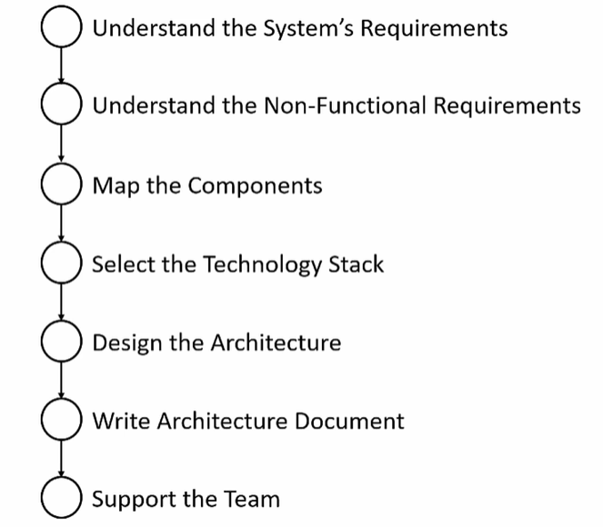

= Memi Lavi Architect
:toc: left
:toclevels: 5
:sectnums:
:sectnumlevels: 5

NOTE: NOTE

TIP: TIP

IMPORTANT: IMPORTANT

CAUTION: CAUTION

WARNING: WARNING

[cols="1,3"]
|===
| Name | Description

| Asciidoctor
| Awesome way to write documentation

|===

== The Complete Guide to Becoming a Software Architect : Memi Lavi

* *History*
** I did this earlier while preparing for Interviews
** Doing it again for Job change / Becoming Architect

* *Agenda/Iteration 2*
** Started using the following
*** Anki

** Pending Use
*** Visual Markers
*** Association
*** Link System
*** Mind Maps
*** Peg System

* *Summary*

=== Section 1: Welcome

==== Introduction

Hello and welcome to The Complete Guide to becoming a software architect cause a few years ago I had a meeting with a potential client. The meeting took place in his office at a thirty fourth floor in one of the skyscrapers in the city. He began the meeting by asking me, Tell me me, why do I need a software architect? I have a talented group of developers and a great I.T. department. Isn't that enough for building great software? I thought for a second and then told him, what would you do if I told you this building we are sitting in had no architect involved in its design and construction process. The workers came in every morning, put the cement tucked in the steel beams and went home. He looked at me for a few seconds, then jumped from his chair, got in the nearest elevator and ran for his life. Well, OK, he didn't really do that, but he did tell me, OK, maybe now I get it. And what about you? Do you want to be a software architect? Do you want to know what it means to be a software architect? Do you have no idea about software architecture whatsoever? Or maybe you just want to be a much better developer. You you've come to the right place. Software architect is one of the most interesting, rewarding and challenging jobs in the software industry and in these schools. I'll teach you everything you need to know in order to become one, a great one. This is a practical, experience based, comprehensive course that will guide you step by step towards becoming an exceptional software architect. Throughout this course, we will discuss not only high level principles, but also real world examples down to earth techniques and soft skills required for this job. This is a really back course. It contains a lot of materials, all stem from my experience of 15 years as an architect. If you fill a specific lecture is not clear enough, do not hesitate to contact me via the Q&A button. I promise to answer any question, but that's not all. Towards the end of this course, you will be able to download a real practical Sotho architecture document, which is the heart of every software architects work. You are more than invited to read it, learn from it and even use it in your own projects. Just fill in the blanks and you are good to go. Now, for those of you who don't know me, nice to meet you. My name is Mimi Lovey and I'm a software architect with fifteen years of experience. I've worked with large enterprises, big multinational companies, start ups and lots more. My technology stock is quite diverse and includes, among others, dot net, Java, Python, SQL Server, Oracle, Modiba, react, angular, azure, a little bit of awareness and lots more. I've had my fair share of successes as well as some painful failures. I always try to learn from my and others experience and during the years I've developed a simple and practical architectural process which I've been using in a lot of projects. But enough about me. Let's talk about you.

====  Join The Software Architects Discussions Facebook Group

==== Who Is This Course For?

So who is the perfect audience for this course in order to benefit the most from this course, you must have some background in programming. It doesn't really matter which platform you're currently programming with. It could be Java dot net or anything else they would be coding in this schools. However, this course might not be a good fit for general developers who take their first steps in the programming world. We will be discussing some advanced software principles which jula developers might not be aware of, and this might make it more difficult for them to grasp the concept described in this course. In addition, it would be better to have some back and experience both architectural dilemmas present themselves in the backend where performance, security, caching and other considerations are extremely important. So to sum it up, the perfect audience for this cruise is someone with three years of experience as a developer with back in development experience. However, anyone with some development experience will benefit from this course. And you are more than invited to contact me regarding any question you have about these cruise material.

==== Why You Should Become a Software Architect

Before discussing the whole let's talk about the way, why is it a good idea to be a software architect,  what's so attractive about it?  Good question.  There are three very good reasons to be a software architect.

*One*, this is a really, really very interesting job.  As a software architect, your daily routine may include talking to CXO that CIOs, CFOs, CEOs in  the mall, discussing technology with development manager and conducting some research about new patterns  and platforms.  There truly is no other role in the software industry, which is as diverse, broad and spread across  the whole organization as the role of the architect, as we will see later in this course.  Good architects work in both business, technology, methodology, soft skills and the more I can promise  you this as an architect, you are not going to get bored ever

Reason number *two* career path and visibility,  being an architect to communicate with all levels of the organization that will make you quite visible  to management and will pave the way to future promotions.  One of my friends was a developer for five years and felt it's time to move on.  He wasn't sure what kind of job to look for, and knowing him and his abilities, I recommended him  to look for a junior architect position.  After a couple of weeks, he landed a job and was amazed by the amount of communication he had with  the CEO and CIO of the company.  Today, he's a senior architect in one of the largest companies on the planet.  So, yes, being a software architect can definitely push your career forward.

Reason number three, *money*.  Everyone wants it, but few are ready to talk about it.  But take a look at these numbers.  As you can see, the average salary of an architect is almost double the salary of a developer here.  And just be quiet for a few seconds while you're crunching the numbers.  But honestly, you should not go for the money.  A good architect is someone who loves what she does.  You should love the challenge, enjoy the discussions, embrace the research, and only then think about  the money.  So to recap, here are the three reasons to be an architect and believe me, these reasons are real.  If you're looking for an interesting, promising and rewarding role.  Go be a software architect.

==== What We Will Talk About in This Course

image::memi-levi/agenda.png[]

So what are we going to talk about in this course? Well, we are going to cover a lot of materials. First is a welcome section, which we are in right now. Then we'll talk about the definition of a software architect. As you'll see, there are several types of architect will describe some of them and then focus on the types that really interest us, this software architect. Then we will discuss what is perhaps the biggest change in software architecture do in order to bring the maximum benefit to the organization, adopt a business mindset instead of a technological one. We'll talk about the meaning of this mindset and why it's so important for the architect. The fourth fiction in this course outlines the architecture process. What are the actual steps the architects should take in order to build a robust, practical architecture for the system? She's walking on the next sections deep dive into this process and detail the specifics of each step. They're walking with system requirements section talks about the importance of fully understanding the system requirements and introduces us to the concept of non-functional requirements. After we have discussed the requirements, we will turn our attention to the application itself. The first thing an architect should do is define the type of the application, and in this section we will explore the various types of mainstream application types and what are the main attributes of each type. After we have decided on the application type, it's time to select a technology stack. In this section, we will discuss the various considerations for selecting technology stack and explore various implementation options for front end backend and data store. Having selected the technology stack, it's time to start talking about the architecture. But wait. Before discussing architecture, we need to meet a set of capabilities that will help us design an architecture that fulfills the non-functional requirements. And in order to fully understand the functional requirements, we will meet this tonalities. No, they are not a family of weirdos, but a set of nonfictional requirements every architect should know about and make sure her architecture is well suited for them. And now it's time to start looking at the components of the applications, components of the building blocks of almost every application, and they must be designed correctly in order to ensure the application is fast, efficient and easy to maintain. In this section, we will deep dive into the attributes of a well-designed component. Note, this is going to be a little bit low level, but it's a must for every architect to be able to look at the code without feinting. The next section is an introduction to design. You probably heard of design patterns already, but even if not, don't worry. We will discuss the idea behind the design patterns and delve into some of them. Having talked about the micro level of the system, it's time to take a step back and look at the macro level as a system, as a whole, in order for a system to be reliable, first secure and easy to maintain. It's important to take into consideration both attributes of a well-designed system. We will discuss those attributes and understand how they affect the architecture. Every seasoned architect knows that architectural decisions are really made on a technical basis. There are always other considerations and constraints that must be taken into account. In the next section, we will explore the most common constraints and see how they might affect architecture. And then drumroll, please, we arrived. What is perhaps the most important section in discourse, the architectural document. This document is a combination of the architectural process. It is the product of the requirements, technology, components, architecture, systems, architecture, external considerations, coffee saturated meetings and long silent writing session. The document describes the architecture design for the system and contains everything the developers and team leaders need to know in order to start developing. The system in this section will go through the documents, goal audience and structure and discuss the content of each section in the document. After we have talked about the document, it's time to put everything we talked about to test. In the case study section, we will discuss the system we need to design for a fictional company, we will go together through all the steps we talked about, understands the requirements, decide on the technology stock map and designs the various components and talk about the architectural document structure. At the end of this section, you will find a very special bonus and architecture document, complete with all the sections discussed in this course ready for you to download and use. You can use it as a template for your future document or as a reference for your own document. But anyway, it's your views. Enjoy it. The software architecture is a moving, vibrant world, and there are always new trends in advances. The next section explores some advanced architectural concepts, such as medical services, securest and even sourcing. Don't worry if you don't know what this means. I'll explain it all. In the last but not the least of this cross section deals with soft skills, a good architect must practice her soft skills. You need to know how to speak to people, how to listen, what to do with criticism. And you will get a lot of this, how to deal with organizational politics and more. The soft skills section deals with those topics, and I encourage you to pay close attention to it. This might be exactly what will make you a great architect. And after all, this will conclude and reflect on what we have learned together, so brace yourself for the fascinating world of software architecture. And let's go.

=== Section 2: What is a Software Architect

==== Types of Architects

So what is actually a software architect, what is his objective, what is he actually doing?  Who is he working with?  Will, all these questions are great, but before we will answer them, let's discuss other types of  architect who was the architect in the software world is an overloaded one.  There are quite a few types of architects.  And let's take a look at the most common ones, which are infrastructure architect, software architect  and enterprise architect.  There are some more types of architects, but they are more finished and we want to talk about them.  So let's see what those types of architects are.

First *infrastucture architect*.  The infrastructural architect is responsible for designing the infrastructure of a given system, and  by infrastructure, I mean all the non software related elements such as servers, virtual machines, network  storage, etc. He's responsible for all this and also to make sure they work nicely with the system,  developed the infrastructure architecture to be familiar with the systems requirements so he can make  sure the infrastructure he designs will support those requirements.  For example, if the system is expected to grow by three terabytes annually, the infrastructure architect  should make sure the storage for the system will be able to handle this load.  The career path for infrastructure architect goes through infrastructure experts.  You have to be well versed in infrastructure, design, implementation and configuration in order to  become a good infrastructure architect.

Next, the software architect, the *software architect* sometimes called also solution architect or system  architect, is responsible for the architecture of the software, since you will be dealing with a software  architect for the rest of this course.

I'll skip to the *enterprise architect*, the enterprise architect works, with the top management of  the organization to *make sure the IT of the organization is an enabler for the business and not a  hindrance*.  In many organizations, business decisions such as starting a new sale or entering a new business field,  is held back by the IT, which needs time to adapt to the new requirements.  *The enterprise architect usually walks with the CEO and CIO of the organization to find out what are  the main bottlenecks, what holds back the waiting and how it can be streamlined to support business  continuity.  Since the enterprise architect operates at a very high level in the organization, he has almost no  work relations with development oriented roles such as developers and team leaders.  #In order to become an enterprise architect, one has to be first a senior software architect or an experienced  project manager.  As I said earlier, the enterprise architect is not very technical, and you don't always have to have  a practical hands on experience in order to become one, although it's definitely a plus#*.  Great.  So having discussed other types of architects, let's meet our protagonist, the software architect.

==== Responsibility of the Architect

So let's talk about the responsibility of a software architect, one of the questions I often asked is what is the difference between a senior developer and an architect? After all, in a lot of companies, mainly small ones, there is not a function of an architect, just a team leader. What do we need an architect at all? #The short answer is this developer knows what can be done. Architect knows what should be done.# A senior developer knows the technology very well, knows what is the best way to implement loops, how to perform operations efficiently, what libraries to use to access a database, and so on. *A software architect is also quite familiar with the technology platform, although not as much as a developer. But his main goal is to make sure the software design implements the requirements of the system. He's less interested in his implementation details of the system. This is a developer's job. The architect looks at the macro level, infuses the technology with the requirement*.

*Baseline Requirements:*

* Fast
* Secure
* Reliable
* Easy To Maintain

We'll talk a lot about requirements later in this course, but let's lay the foundations for the requirements of almost any system in these are first secure, reliable, easy to maintain. In almost every system I've been involved, *this list was the holy grail of the architecture*. This is what the architecture was made for, to make the system first secure, reliable and easy to maintain. Of course, every system has its own definition of those items. First, in a world of application working with satellites, telemetry is not the same fast of a traditional information system geared towards end users. Likewise, reliability of mission critical application, which must have an uptime of 99, not 99 percent, is not the same as reliability of a charter application of a support system which would be available only during normal working hours. But still, this list is usually the defining list of every architecture. *Now it's important to note that this list has nothing to do with technology, architectural patterns or platforms you don't see here using micro services based architecture or use Java or don't use relational database*. That's because a good architect knows the technology patterns and all the other buzzwords just means to the end result. *The technology should serve the requirements and not the other way around*. So to summarize, a software architect is someone who designed the system to be fast, secure, reliable and easy, to maintain and select the optimal technology platforms and patterns to achieve these goals.

*The Architect in the Organizational Chart*

image::memi-levi/org-chart.png[]

==== Architects and Academic Degrees

==== Career Path to Architect

==== Architects & Code

One of the most heated argument in the architecture community is whether an architect should code like really code with an idea, debugging, logging, etc. Of course, the question is not whether an architect should participate in the development effort and be one of the development team. Of course, he shouldn't do that. The question is whether an architect should have coding skills that will allow him to test new technologies, create policies or demonstrate some concepts in code. Those who claim an architect should not be coding say that he has more important things to do than punching the keyboard and producing a few lines of code. He will better be producing patterns requirement in documents, say, and they have a point, but and I'm sorry to say that they are wrong. A good architect must have coding skills. And here are the three reasons for that. Architectural trustworthiness as an architect. You are going to design an architecture which utilizes certain platforms in patterns, you have to make sure the architecture is feasible and the best way to do it is to try and implement it yourself. Yes, that's not a mistake. You have to be able to implement certain parts of the architecture in order to test them before expecting the developers to implement the unimplementable. Yes, that award, for example. Are you going to recommend using a certain dependency injection package tested in a small application and make sure it's actually do what you expect it to do? Are you contemplating whether to use analytical database or stick with a traditional RDBMS? No problem, installed both on your machine and test them out. This is the only way to make the architecture trustworthy by testing it beforehand to ensure your design can be implemented effectively and easily support the developers. One of the hardest tasks of the architect is to make sure the architecture is actually implemented. The best way to do that is to provide an ongoing support to the developers. The architect must be able to help developers when they get stuck while implementing the architecture and Ximenes, the developers work to detect deviations from the intended implementation. If the architect does not possess coding skills, he won't be able to review the code and locate those deviations. Gain respect, one of the key factors to succeed as an architect is to gain the respect of the developers. If the architect is perceived as someone who has no idea what the developers are actually doing, they will think of him as a snob, arrogant and detached, and will immediately lose respect for him. If, on the other hand, they will see you sitting with them, helping them solve problems and listening to them, they will appreciate you as a down to earth practical and an all around nice guy and will be more than happy to listen to you in the future and discussing architectural topics and tasks. But you can't really help developers if you can't, aren't you? So to summarize, keep going. After all, it would only help you create a trustworthy architecture, provide an ongoing support and gain the respect of the developers. It also fund.

=== Section 3: The Architect's Mindset

==== Introduction to the Architect's Mindset

Welcome to the third section of this course, architects mindset, in this section, we will discuss  one of the most important aspects of being an architect, which is the architects mindset.  If your current job is a technical one, such as a developer or a team leader, then you are probably  thinking about the work you do for recording and development point of view.  But as you will see in this section, this is not always the most appropriate point of view for an architect.  The architect should often make a decision based on other factors which are sometimes for rent for developer.  *#But in order to be a really good architect, you have to adapt yourself to the new point of view, which  will make you a real asset for the organization#*.  So let's talk about this new mindset.

==== Understand the Business

The biggest mindset change you have to make in order to be a good architect is to *understand the business  your client or employer is involved in*.  Now, this might sound trivial.  Supposedly, everyone in the organization know what the company is doing, right?  Well, that's usually only partly true.  I'm sure every Microsoft employee knows that Microsoft developed software such as Windows and Office  in that it has one of the largest public clouds in the world.  I'm also sure that every Amazon employee knows that Amazon sells a huge selection of items from books  to fresh food.  But that is not enough.  And let me tell you a story.  A couple of years ago, I was approached by a company in the Beautiful.  It was a medium sized company with about 600 employees worldwide.  I was familiar with this company and I knew vaguely what it was doing, but I knew it wasn't enough.  So I grabbed my PC and began reading the day after we had the meeting.  To the surprise, I was able to tell them about the founders line of product, revenue and profit.  And bear in mind, the company was not publicly traded at that time, the competitors and so on.  This blew them out of the water and we agreed to work together on this very day.  But I must tell you this story to get you marketing tactics, although it's a very effective one.  The really important lesson here is that *in order to be of any value to the organization, you have  to have a deep understanding of the organizations business*.  You have to know *what keeps the CEO awake at night*.  You have to understand what its *weaknesses and strengths are*.  *Who are they competing with in what is a growth strategy*?  All you have to understand all this.

You can start talking architecture and technology.  *One of the most common mistakes made by architects is that they are looking at the systems they are  working on as a stand alone system, isolated from the rest of the organization*.  But it can't work that way.  Every organization is a living organism with a lot of moving parts, and the architect must understand  how the system integrates into this living organism.  And what role does this play?  So to recap.  *Remember, always understand the business before you begin walking on the architecture*.

==== Define the System's Goals

After we have understood the business and learned all there is to learn about it, it's time to look  at the specific system we are going to work on.  *The first thing to look at are the systems goals.  Now, it's important to note we are not talking here about what the system should do.  These are not goals.  These are requirements*.  And it's important to distinguish one from the other when talking about goals.  *We are talking about the effect the system will have on the organization.  This effect can be almost anything, but it should be clear how this will affect the bottom line of  the organization.  The reason we should be fully aware of the system's goals is that as architects, we must always think  about the big picture.  We must know what is the environment our system is going to be operating in and what are the main tasks  it is going to tackle.*  Usually the client should tell you what the system's goals are, but it is not always the case.  I once had a client that asked me to design the architecture of a specific system.  For him, the system specifications were clear, the value services and screens were already defined  and it looked like an easy task.  However, when we began discussing the place of the system in the organization, we found out almost  no one was going to use the system as it is.  There was many other systems which performed similar tasks, albeit in the less comfortable manner.  But the users were already used to those systems and there was simply not a strong enough incentive  for them to move to the new one.  We ended up changing almost all of the systems.  Scope and functionality in the final product was a much smaller but much more focused and effective  system.  Let's take a look at some examples of goals.  First, knew our system for a product oriented company.  The goal is to streamline the recruitment process, thus attracting better candidates.  This, of course, will help the company build better products more quickly, thus growing the revenue  two new information system for reporting and mapping criminal incidents in the city.  The goal here is to improve the police response time for every incident and to encourage new residents  to migrate to the city.  Of course, there is also a hidden agenda here.  This system will help them to be re-elected in the next elections.  Next, mobile application for flash sales, the organization who is a small and young startup with only  three developers.  The goal here is twofold.  One, your money as fast as possible and to attract investors.  OK, so we've talked about the system goes in, let's go on to another important aspect of the system,  which must be the architect mind.

==== Work for Your Client's Clients

One of the most important aspects of the architects work is to identify who the client is.  Now, that may sound a little stupid.  Of course, I know who my client is.  It's the one who pays me well.  Yes, but also no.  Let me explain.  In almost every organization, the architect is part of the IT department.  It doesn't matter what the architect is an employee of the organization or a consultant who works with  the organization.  He's hired by the people.  But the I.T. guys have clients.  And these are the end users of the application and these are the guys you should work for.  What does it mean?  *It means that your mindset should be geared towards your client's client*.  It means that with every decision you make, you must ask yourself what will be the effect of this decision  on your client client?  It means that the comfort of your client's client is prioritized over the comfort of your client.  Let's see an example.  One of the recent systems I worked on was a systems that display data based on the telemetry received  from remote stations.  All of the dilemmas we had is what to do with the database during telemetry is offline.  This was a scenario we had to consider.  Some selected department could not commit to a concrete display of the database.  The solution we came up with was to display a clear message to the end user that there is a problem  with the system and ask him to try again later.  This is quite a common behavior for such a scenario.  However, the client asked whether we can find an intermediate solution that will allow him to use the  data but not make any modifications.  We thought about it long and hard and came up with a solution that made architecture much more complicated.  We have introduced a dedicated caching layer that duplicated the data.  It was used when the database was offline.  My client, which was a development team, worked much harder.  But my client's client, the end user, was extremely satisfied with this solution and praised our willingness  to help him and think outside the box.  Now, you might say that walking with a client is a systems analyst job and not the architect.  *This is usually correct, but sometimes a project is carried out without a system analyst on board.  And even if there is one, you still have to understand the client's environment in order to make the  best decisions for him*.  In this case, the architect does not replace a system on the list, but it's a very good idea to join  her for some meetings and to meet a client personally.  Sometimes you see that your client, the IT department, does not use a client as a client, they will  refer to the end users as colleagues, co-workers, or even those annoying guys that always have demands.  In this case, your work might be a bit harder.  You have to not only change your mindset, but also them

==== Talk to the Right People with the Right Language

Another important aspect of the architect's job is to know how to speak to different persons in the  organization.  Here is the rule of thumb, always keeping in mind what is the thing that really matters to the person  you are talking to.  If you can adapt to language to the best interests of the person we are talking to, you will be able  to achieve much more.  By the way, this will is right not only for architects, of course, but for anyone who tries to achieve  something for someone.  Let's look at some examples.  *Here is Sophie, the project manager.  Sophie, because only for the project success, she doesn't care what technology will be used or how  amazing the architecture is.  When you talk to her about your plans for the architectural, always emphasize how it will contribute  to the project's success*.  Avoid sentences like this is the latest and greatest pattern and will be the first to test it out.  We can write a blog post about it.  This sentence will only frighten her and she will immediately imagine how this untested technology will  cause delays and compromises down the road.  Instead, try something along the lines of this.  *New technology can help us write the code twice as fast so we can cut our schedule and budget accordingly*.  This is a language a project manager understands, and she will be more than happy to help you, assuming  you are right.  Of course.  Now let's look at the team leader.  That is a hard core geek and he just loved programming.  He spent at least one hour every night reading through technical blog posts, and he always up to date  with the recent development in software industry.  If you want to bring Dave on board and make him a strong proponent of your architectural talk to him  using a technical language, tell him.  Listen, Dave, have you heard of the latest angular version?  We are going to use it or, you know, function as a service are pretty cool.  What do you say?  We will give it a try in this project?  Just says there will be more than happy to work with.  You will approach this.  We.  The last person we look at is surely the *CEO, Chile is a very business oriented person and she always  looks for the financial bottom line*.  If you want to explain her, what are the advantages of the architecture you are working on?  Never mentioned technical buzzwords.  Chile, the kind of person that when his micro services or kissing or even Gever, she immediately  loses interest and stops listening.  *However, if you will tell her this, the architecture of design will ensure the continuity of the business  and will be able to cope with the high load expected during Black Friday sales.  Then you got her*.  She will listen to you and will appreciate the work you are doing.  So to recap, always keep in mind what really matters to the person you are talking to.  Try to be in his shoes, not yours, and then show him how your work contributes to his interests.

=== Section 4: The Architecture Process

==== Introduction

Welcome to the architectural process section in this section, we will discuss the process of the architect's walk in order to make the architecture as useful as possible and to provide the maximum value to the client, the architect should follow. *A well-defined roadmap set at the end will lead to practical and well-thought-of architecture*, which will ensure the system is fast, secure, reliable and easy to maintain. In this section, we will talk about this process. I'll give a brief overview of each step in the process and describe its importance in little sections. We will deep dive into each step and talk about what exactly should be done. So here are the steps in the architecture process. Understand systems, requirements, understanding non-functional requirements, map the components selected technology stack designs the architecture right architecture document support the development team. Let's talk about these steps.

==== Understand the System Requirements

The first thing an architecture should do when beginning a walk on a new system is to understand the system's requirements. OK, well, actually the first thing is to understand the *system's goals*, as we discussed earlier in this course. But an actual architectural process begins with the *requirements*. Remember the requirements, describe what the system should do. The *usually begin with high level tasks*, such as allowing users to view telemetry data and often describe also workflows, logical services and user interface elements. *Those requirements are usually defined by the system. Analyst works directly with the client*. So in most cases, your first walk meeting after the obligatory introductory meeting will be with the system analyst. In this meeting, you will discuss the requirements of the new system and probably set dates for future meetings on the same subject.

==== Understand the Non-Functional Requirements

The next step in the architectural process is to understand the non-functional requirements of the system, not functional requirements of a special kind of requirements that define some technical and service level attributes of the system. For example, the most common non-functional requirements are about concurrent, no refusals, heavy load volumes of data and performance. *As we will see in a later section, the client and the system analyst are usually not aware of the non-functional requirements, and it is the architect's job to help them formulate those requirements*. For us, the architects, the non functional requirements are *much more important than the regular requirements*. I never begin to work on a system before knowing exactly what it's non-functional requirements are because so many architectural elements can be affected by those requirements.

==== Map the Components

The next phase of the architectural process is mapping the various components of the system, the components of the moving parts of the system that *represent the various tasks of the system*, functional as well as non-functional. The component map serves two goals, it *helps you understand the system and its various parts*. It's a *great way to communicate to the client your understanding of the system*, thus making sure you are not missing anything. Note that the component is completely non-technical. You are yet to decide on the platform, the development tool, the database type. This is just a map that displays the various capabilities of the system.

==== Select Technology Stack

This is one of the most important steps in this process, in this step, you are going to decide, *together with the development team*, *what will be the platform* on which the system will be based. Usually, there will be *more than one technology* to be used in most systems. You will have to select *the backend platform, the front end platform in the DataStore platform*. In addition, in some systems such as walls that are based on medical services, architecture, you will often select multiple bakin platforms and perhaps also multiple data stores, as we will see in the relevant section. There are a lot of factors you have to consider when selecting the technology stack, and the selection must be very rational irungu technologies that can lead to failure of the whole system.

==== Design the Architecture

This is the *heart of your work*. You already have the requirements, the non functional requirement, the components in the technology stack. All that's left is to design the architecture that will glue all those together and will result in a system that is first secure, reliable and easy to maintain. We will learn about the qualities of a *well-designed system* such as loose coupling statelets, scaling, caching, messaging and lots more, and see how those qualities are used as the *building blocks of the architecture*. When you are done, you will have a complete architecture in place, but it would be formalized yet. Which brings us to the next step.

==== Write the Architecture Document

This is what you were waiting for. This is a culmination of all the effort you've put into the system and this is your greatest creation. The architecture document describes the whole process you have been through and gives the developers and management a full picture of the system that is going to be built. A good architecture document is relevant for all the levels in the organization, the CEO, the CIO, the project manager and of course, the developers. They will all find great value in it. We will talk a lot about the structure and the content of the document is relevant section and explain how to maximize its value.

==== Support the Team

A lot of architects believe their job is done once the document is delivered. This is a big mistake, huge sort of architectural is a living, breathing creature, and it changes all the time. You have to be there for the developers to help them to make sure they are developing according to the architecture and to be part of the dilemmas that are going to be raised. And they are going to be a lot of dilemmas, arguments and talks in the architectural will be changed and not only once. So you have to support the team if you don't want the documents to become a glorified paperweight. And remember, you are not done until the system is in production. And even then you probably will have a lot to do.

==== Conclusion

So this is the architectural process I use with almost all of my clients, and I recommend you to do the same, be a will that will almost always be some variations on the process. For example, what subject you should be aware of is who else participates in every step of the process. Let's look at the nonfunctional requirements step. Obviously, you, the architect, cannot decide what are the non-functional requirements without talking to the client and the system analyst in the architectural design phase. I was supposed to do it all by yourself or should involve the developers. The answer is, as always, it depends. If the developers are available for taking part in the architectural, then by all means, walk with them is extremely important to let them be part of the process because you will able to benefit first. If there are some scenarios you are not aware of but the developers know about, it would be better to talk about them as early as possible and not when the architecture is done. Second, since the architecture was built together with the development team, you neutralize any future disagreement. But over this way, the developers become ambassadors of as architecture and they will convince the other project members that architecture is a good one and should be used. This will make your job much easier. It will free your time to work on the really important things instead of organizational politics. In the next sections, we will deep dive into each of the steps we have talked about and will understand the ins and outs of the tasks you, the architect, has to execute in order to design a good and practical architecture. Let's go.

=== Section 5: Working with System Requirements

==== Introduction to Requirements

Welcome to the requirements section of this course in this section, we will discuss the basis of all the software systems in the world, the requirements, every softball is based on some kind of requirement, some kind of user needs to accomplish something, and the software helps him to achieve something. The requirement can be, I want to apply filters on my photos or I need to communicate with my friends easily, or even I need to be able to tune my audio recording. Whatever is that user need. These are the requirements. Of course, requirements are never left in such a high level. During the development cycle, they become more detailed, so the developers will have a clear idea of what they need to develop. In this section, we will discuss two kinds of requirements and we will see how they fit in the architecture walk. Let's go.

==== The Two Types of Requirements

We're talking about systems requirements, we usually think along the lines of what the system should do, we expect the requirements to deal with the following questions. *What are the business flaws of the system*? For example, log in storing photos, receiving and crunching telemetry data and more. *What business services should the system have*, for example, local service, data, access service, telemetry receiver, telemetry control. *What does the user interface of the system looks like*, the look and feel, general guidance, responsiveness in the more. These requirements are called *functional requirements*, you can identify the requirements from Miles if they answer the *question what the system should do*, they are functional requirements. Functional requirements are, of course, extremely important in no system should be designed and built without them. I had the pleasure of working on a system without concrete functional requirements, and I swore I would never do that again. However, for the architect, these requirements are important, but not as important as the other kind of requirements. These requirements are known as *non-functional* requirements, and these requirements answer roughly this question what should the system do with non-functional requirements? Describes the various aspect of the systems operation and are not tied to a specific behavior or logic. The most common non-functional requirements are *performance load, data volume, concurrent users and SLA*. For those of you not familiar with all these terms, don't worry, we will cover them later in this Section one functional requirements of the requirements that really interest you as an architect. I once had claimed that asked me to design an architectural system he was planning on field site. The system looked quite simple. Simple rest services that receive data make some calculations, install the results in a database piece of cake, or so I thought. Towards the end of our requirements meetings, I asked the client what would be the maximum size of the data received by the service. He looked at me with an I have no idea. He's made some phone calls, paid a little, came back to the table and said, Well, 600 megabytes boom. No architect in his right mind will expect a service to deal with such huge requests. We had to return to the drawing board and ended up with a completely different architecture. The services have gone and instead we had agents listening to a no secret database and waiting for the data to be stored. And that's just one example of an architecture that gets turned upside down because of *non-functional requirements*. So now that we understand the difference between the two kinds of requirements, let's take a closer look at them.

==== Architects & Functional Requirements

Will we just say that non-functional requirements are the most important requirements and that the architect should not under any circumstances design the system without knowing what the functional requirements are? But it is equally important to be aware of the functional requirements. Many architects feel they only need to skim over the functional requirements and concentrate on the nonfunctional ones. That's a mistake to remember our definition of the architecture. Remember that good architecture must improve the business bottom line. That won't be possible if you are not sure what the system should do. So before diving deep into the functional requirements, this is a not so gentle reminder that the functional requirements are equally important and you have to be well versed in them.

==== Non-Functional Requirements

We have already explained what non-functional requirements are, but let's go over it again just in case. Well, *functional requirements define what the system should do. Non-functional requirements describe what the system should deal with*. Systems can deal with many challenges during the operation. They can experience a large number of concurrent users. They can experience several Krush. They can suffer extremely high load of requests and so on. Nonfactual requirements basically describe what is expected environment for the *system with emphasis on edge cases*. If you will, take a look at the Wikipedia page for all functional requirements, you will see a long list of those requirements. In real life, however, there are five non-functional requirements that we will usually deal with. *Those five are performance load, data volume, concurrent users and SLA let's* discuss each of them performance. Well, that sounds like a simple requirement, right? What is the required performance for this system first? It easy. Well, not so fast. See what I did here when talking about performance? There are two things we should keep in mind. *One, always talk in numbers*. And *two, latency and throughput*. Let's talk about the first one. When the client asks for a fast system, your next question should be what is first fast can mean a lot of things. In a lot of systems I worked on, systems were first meant 30 milliseconds and on systems that were first minute, five seconds. The problem is that your client probably wasn't thinking on the exact number and you will have to help him with that. *The rule of thumb is* that when there is an end user at the end of the flow, we usually need the *task to be complete in less than a second when* walking in a *B2B environment* that the business to business, we are usually looking at faster systems that can measure even *one hundred milliseconds per task*. The reason for that is that we human beings are less sensitive to subsequent delays. And for us, a data that is displayed in one second or seven hundred milliseconds looks almost the same. Wilfork with software running on a machine with CPU cycles of few milliseconds. This would be a very long time. But again, the most important thing is to walk out this number together with a client or system analyst.

The *second* concept is about latency and throughput those towards defines the way we look at performance and give us two points of view on it. Let's begin with latency. *Latency* answers the question, how much time does it take to perform a single task in the application? For example, how much time will it take for the API to set the user data in the database? Or how much time will it take to read a single file from the file system? You can see that latency deals with the time it takes to perform a single task *throughput*.

On the other hand, until a completely different question, *how many tasks can be performed in a given time unit*? For example, how many users can be saved in the database in a minute? Or how many files can be read in a second? Now, let's look at some numbers so we can understand better the difference between latency and throughput. Let's say the latency of saving user data is one second. This is quite slow, but let's stay with it for the sake of the discussion. Now, what would be the throughput? Can we know how many users can be saved in one minute? The answer is a resounding no. If the application is well designed, deployed on a strong Hellewell and knows its way around threads, it might have its throughput of one thousand users in one minute. On the other hand, if the code is buggy and there are a lot of memory leaks and no concurrency at all, we want to be able to reach a throughput of 60, which is a latency multiplied by 60 the number of seconds in a minute. So this is the difference between latency and throughput and we are discussing performance. Both of them must be mentioned and.

Now let's talk about load the load on functional equipment defines what it is, the load or quantity of the application you have to withstand without crashing. The exact definition of low depends on the exact type of the application. For example, for a Web *API based application*, the load will usually be defined as *how many concurrent* requests are going to be received by the system without crushing. Note that this requirement *looks similar to throughput*, which defines how many requests can be handled in a specific time unit. The difference between the two is that way. *Throughput defines the time unit*. *The load defines the availability of the system*, meaning the system should be able to handle the load without crushing down. For example, the performance requirement can dictate throughput of one hundred requests per second, but the system should be able to handle 500 concurrent request without crushing, even if those requests will take more than a second to complete. This definition is important, since the worst thing that can happen to a system is to crash under heavy load. Users can tolerate a slowdown when there is a load, but they won't like it if the system will crash and burn. So the best practice here is to always look at peak numbers. For example, for an e-commerce website to regularly load might be up to two hundred concurrent requests. But on Black Friday we are looking at more than 2000 concurrent requests. In that case, we should plan for the extreme case because this is when it's more important for our system to be alive and functioning.

Next is *data volume*, this requirement defines how much data in gigabytes or terabytes or system will accumulate over time. This requirement is important for a few reasons. *It will dictate what kind of database we are going to use, since not all databases can handle large quantities of data equally*, it will also *determine what type of queries we are going to write because a query* in a table of 100000 rolls will be completely different from a query in a table of 100 million rolls. And of course it will help us plan ahead. The storage we need to allocate the data volume usually has two aspects. One, *how much data is required on day one*? *And two, what is the forecasted data growth*? For example, the system might need 500 megabytes on its first day and is expected to grow by two terabytes annually. Of course, the growth period can be different and can be weekly, monthly, quarterly and so on.

Next is *concurrent users*. This requirement defines how many users will be *using the system simultaneously*. This requirement is quite similar to the load requirement, which also defines how many requests should be handled by the system simultaneously. But with *one big difference*. The concurrent users requirement describes *how many users will be using the system*, *not how many users will be performing requests*. This distinction is important when a user is using a system. There are a lot of dead times when no action is actually taken. For example, a user is asking the system to display all the data. The system executes an API that goes to the database and retrieves the data. This is an actual action. Now the user is looking at the data. During this time, the system is doing nothing. The API is not working. The database just sits there and the network is silent. So as you can guess, systems that can hold 500 concurrent requests will be able to withstand a much higher number of concurrent users. *The rule of thumb* is that concurrent users are 10 times the number of concurrent requests. So if the system should work with 500 concurrent requests, it can support 5000 concurrent users. But this number actually depends on the type of system. And the usage pattern

*SLA*. The last functional requirement will discuss is SLA SLA, which stand for service level agreement, *describes what is required uptime for the system in percentage*. This term is widely used by almost all public cloud providers. One of the biggest competitions between them is on the SLA. For example, as customers, Deby takes pride with its ninety nine point *ninety nine percent SLA*. This is translated to *less than an hour of downtime in a year*. Take a look at the numbers. The SLA has great influence on the design of the system. For example, a system that cannot be brought down must have a sophisticated uplink mechanism that won't require tuning of the system while it's operating. This is possible, of course, but it has to be designed this way. One important thing to note about this is client expectations. If you will ask the client what is required for the system, he will usually give you an answer along the lines of one hundred percent of the famous five nines, which is ninety nine point ninety nine percent. *When this happens, I usually tell him, no problem for this, we will need to build at least three data centers in different continents with independent and dual power stations in automatic fill over between them. What do you say?* This generally brings him down to earth and we discuss more realistic SLA goals. So these were the most common, non-functional requirements you will need to have for the system. And again, never start working on the architecture before you have set those requirements.

==== Who Defines Non-Functional Requirements?

One of the biggest problems with the no functional requirements is that it's not clear who should define them. Usually we expect the client together with a system analyst, to define the functional requirements. After all, they know what the system should do more than anyone else. But functional requirements are a different story. *Most of the time, the client has no idea about what functional requirements and what the consequences of those requirements are*. In my experience, when asked what is the SLA for the system, assuming he knows what an SLA is, the client will usually say always when asked What is the required response time for the API? The answer will be someone 10 milliseconds. So we the architects have 2 roles in non-functional requirements discussion. The first is to frame the boundaries, we must explain the client that 100 percent uptime is not realistic and probably not really needed. We must explain to him that his current network will not enable completing an API call in less than one hundred milliseconds. And after we have done all this, we can talk about possible values in this discussion must be backed by real numbers. For example, when talking about concurrent users, try to calculate the real number of concurrent users. Don't pull numbers out of a hat. Also, try to set realistic goals for the performance requirement. Remember, if the system is going to be used by end users, you don't need to fight for every millisecond. The users would notice that.

=== Section 6: Types of Applications

Welcome to the application types section. in this section, we will discuss the various application types an architect will work with one of the first things an architect should do when working on a system to determine what kind of applications the system is going to be. *This decision is usually made after working on the requirements. Is a functional or nonfunctional*. In this phase, you have already learned what can be learned about the functionality of the system and the environment it will be operating in. And you can make an educational decision about the type of applications that best fit these requirements. This is an important decision since each type has its own pros and cons. Moreover, once a decision is made, it's usually not easy to switch to other types. The most common application types are Web apps, Web API, mobile console service and desktop. Let's go and discuss each one of them.

==== Web Apps

Web is probably the most common application type nowadays. Second, maybe only to Web API, Web ups, also known as websites, are basically the way the Internet worked since its inception with Web apps. There's a Web server, usually more than one, and a Web browser, though, to communicate with each other via HTP protocol. Although other protocols can also be used, the browser sends and HTP request for the server asking for a resource. The resource in this case is an e-mail page which gets returned to the proposal, which in turn renders it for the end user. Almost always the e-mail page. We use JavaScript code for implementing logic in the browser and files for the visual design of the page

*web are best for systems* that require *user interface* for end user *user initiated actions*, meaning the user is the one making the request to do something such as viewing ordinator, sitting username and so on *large scale with a large number of users* and a lot of data *short focused action as opposed to long running processes*. For example, Web apps are not a good fit for a process that should crunch billions of numbers and produce business intelligence. For this, there are other kinds of applications. As we discussed earlier, we spoke inadequate response model, which is perhaps the most important aspect of them. As a rule of thumb, if the system you are walking on can be described as a request response application, then you are probably looking at a web.

==== Web API

Web API is quite similar to Web App with two *important differences*. One, it does not serve of HTML pages, but data, usually in the form of some structure to its clients, are not Web browsers. But other applications, including JavaScript code that runs inside Web browser.

Web API has become extremely popular in the last few years, and almost every Web expose also will be API. In addition to the more traditional Web. Web API, as its name implies, exposes an API application programming interface which allows other programs to access it and execute various actions. There are various types of web implementation, but the most popular one by a large margin is definitely the REST. API REST is a huge topic with a lot of philosophy in the thinking. But for this course, it's suffice to say that risk allows us to access entities with the combination of your URL parameters and http verb. For example, the following you will be executed by the API as get me user number 17. This all means delete total number 156, as you can see, the main advantage of rest is that it does not require more than a standard. We are able to execute API and it does not require cumbersome protocols on top of the HTTP protocol, as was with the protocol. For those of you who are familiar with it, *Web APIs are used for data retrieval and receiving it should not be used for returning visual markup such as HTML*. For this reason, almost any kind of application can be a client of Web API, any code that can access Riced API. And I believe that almost every language supports that capability can access the API and use it. This is the reason that Web sites are used by Web apps, rich client apps and of course, Azel Systems. *Web applications are built* for systems that require data retrieval and Store, though not huge amounts of data. In each action, Client initiated actions, meaning the caller is the one making the request to do something such as getting all the data saving username and so on large scale with a large number of users and a lot of data and short focused action as opposed to long running processes with API. And the Web apps are built on the same concept and usually shares the same underpinnings. So as with Web apps where Beppo also works best in the *request response model* and should be used for this kind of systems, long running processes should be avoided when using Web API.
this kind of systems, long running processes should be avoided when using Web API.

==== Mobile

Well, I guess you can guess what this tape is all about, mobile apps, as their name suggests, are apps that run on mobile phones, specifically smartphones, probably Android powered or iPhones. Modern mobile apps connect with the webpages all the time for multiple purposes, logging, loading, next level, storing, user generated content and much more. Actually, there are not a lot of mobile apps, perhaps only games that can function properly without Internet connectivity. Mobile apps will be used mainly for apps that require user interaction, for example, games or social apps. Front end for Web API application for displaying various types of content, for example, news and apps that are location sensitive and will benefit from the phone's GPS.

=== Section 7: Selecting Technology Stack

==== Introduction to Technology Stack

Welcome to the technology section in this section will discuss one of the most important and loaded tasks of the architect, and that is selecting the technology stock of the system. The selected technology stock will determine what language is. Platforms and tools will be used during system development and what are the skills required for the development team. This decision is important for two reasons. One, it's irreversible. Once you've decided to use specific platform and work has begun on this platform, you can't reverse it. It's not possible to decide three months into development that actually we prefer another platform. Such a decision will result in a complete rewrite of the system and a substantial delay in schedule. There are some architectural patterns that allow some kind of flexibility in the technology stock selection, notably medical services. But even there, it's not a good idea to switch platforms between each service. Reasonable to decisions like that are often loaded with emotions and are made on a non rational basis. You will encounter situations where the development team would like to a specific platform because it's new, sexy and the team across the corridor already uses it. It won't matter that this technology is inferior for the specific task in hand, they will still want it. So this decision has to be made with a clear mind, must be heavily documented and to be a group effort. And not only was the architect in this section will discuss technology stock alternatives for the front and back end and datastore for each alternative, we will give a little background and discuss it. Pros and cons. I hope this section will help you make an informed decision about the technology stuck in your system.

==== Considerations for Technology Stack

When selecting the technology stock, there are some considerations that must be taken into account in order to ensure the best platform will be used in the systems. Let's look at these considerations. *One* can perform the required tasks. Well, this may sound trivial, but it's still important when looking at a specific platform. We must ensure this platform can actually perform what is required from it. For example, if one of the requirements to support growth platform deployment, it's important to make sure the technology we are looking at is actually a cross platform. Another example, if the requirements state that the systems user interface must be Web based. There is no point in exploring which cloud platforms *second* community. You always want to make sure there is a large active community which discusses the platform and can provide support we needed this way. You know, you want to be left alone in the dark when encountering problems and questions and you can seek help in this community. The best place to look for this community is in stack overflow dotcom. If you are still not familiar with amazing site, the time is Now. This is the largest developers oriented Q&A site which provides answers to almost any question regarding development in every platform. The most brilliant developers are helping others here. And whatever your problem is, it's probably already has been asked and answered here. So go to stack overflow click tags at the sidebar and look at the technology you are interested in. You will see a number near its name. This number will designate the number of questions on this technology. The larger the number, the more active the community is. Always ready to actually click the name of the tag and go to the platforms page. There you can see when the last questions were asked. This will give you some idea about how active the community is, not just how big it is. So if you see the last question was asked four days ago, it seems like the community is not very active. This is a very simple and powerful way to find out the community sides of the technology you are looking at. *Third*, popularity, although seems a bit superficial. The popularity factor is quite important and popular platforms will usually lead to a small community which will lead to a lack of support. The best way to test the popularity of everything on the Internet is by using *Google Trends*. So go to Google Trends and type the name of the platform you are interested in. In this example, let's look at Angular in presenter. I always like to set the search for the past two years. The default one year is often not enough to give perspective. You will see that the popularity of ANGULAR is quite flat, so there is not decreasing its popularity, but no increase either. Now let's add its nemesis to the chart. We see that react is on an upward trend and currently it's on par with ANGULAR. And now let's other Jaquie. You see Hillstrand popularity of Fujikura is decreasing and that indicates that perhaps it's not a good idea to base your web UI unit in a modern application. So these are the three factors that must be taken into account when selecting technology stock. There are more factors that relate to the development team and organization and we will discuss them later. But these are the factors that reflect the platform's impact and potential. And now let's go on and discuss the backend and service technology stack.

==== Back End Technology

So let's discuss our candidate for backing and service technology now to be clear, when talking about back in server side, web apps and Web API. So our discussion here is about Web apps, Web API, console and services. I call all of them back backend for the sake of simplicity. Now, just to set expectations, I'm not going to give you a definite recommendation about the platform you should use for your backend. That would be smart, since there are so many factors to be taken into account that without intimate knowledge of the requirements, such a decision cannot be made. What I am going to do is to lay out the main contenders and talk about pros and cons of each one of them. This will make your life much easier when selecting the platform note. Also, I am not going to talk about every technology exists. This will make the lecture too long and too boring. I'm going to discuss the most popular platforms. So you are our main candidate for backend applications in alphabetical order. Donald Classic Dotcom Java. No is PHP and Python. So let's begin with the classic or as we call it here simply doesn't it? Look, it was founded by Microsoft in 2001 as a response for Java. It's a general-purpose object oriented, statically typed platform with frameworks for desktop applications called Windows and later on WPX and for Web Apps and API called a speed of net development in dot net is done using Visual Studio. In my humble opinion, one of the best development tools on the planet, dot net is not cross platform, so it's relevant only for Windows based applications. It's performance are OK, but there are faster platforms such as Node is that it is a very mature platform with huge third party components and glogg community. However, its roadmap is not clear since it looks like Microsoft is pushing the developers towards Natcore call today. Dot net is a difficult choice for Windows based application, mainly because of its great EDEK syntax and large community. Next is Dot Netcore. You can call it next generation dot net, and it aims to fill the gaps in dot net, mainly cross platform support and performance. In my own experience, doing it is a flexible and fast platform, but as of this recording, not fully baked yet. There are some glaring omission such as web hook support, partial or data support, partial or in support. And more apps can be developed using visual studio, but also with the code and other popular ideas. The core community is not that large but is very vocal and is growing rapidly in the stack overflow development sorry. It's called second among several side from right after analogy's in the long run dot com would be a great choice right now. You should be aware about gaps, but also about automating performance and capabilities.

The third one is Java. Java has been around for a long time and looks like it's here to stay. Created in 1995 by Sun Microsystems, currently owned by Oracle, Java is one of the most popular platforms in use today. Like Net, it's a general-purpose object oriented, statically typed language. It's really forays into client side in the form of Java applets. And later, Java Fix was not a huge success, but the Android ecosystem with we can natively in Java gave it a huge boost. The server side Java is called Java. EE recently changed to Jakarta Enterprise Edition and provides everything you can expect from a server side platform, including Web apps, Web API, database access and lots more. And all this in a cross platform environment. Java has a huge community, sometimes suffering from too much self-criticism, but still provides great support for everything. Java in the last year, it looks like the interest in Java on the back end has waned and new kids on the block get all the attention. But Java is still a great platform for Web apps, and with API, NODEJS is one of the youngest platform here, second only to donate call. It was founded on 2009 by Reindl and is optimized for highly concurrent Web apps. IT syntax is based on JavaScript, which makes it dynamically typed and it quickly gained adoption because of its familiar syntax and great performance. It's probably one of the first frameworks out of fighting we don't it on the fifth place. As mentioned, logic is not targeted for long running processes, so don't try to build services with it. But for web apps that require a lot of short concurrent IYO operations, it should be on the top of the list. PHP was founded in 1994, but by Rosmus load of which makes it even more mature than Java. But in contrast to Java, which is object oriented statically, that language be very how can I call it messy? It's very easy to learn, but that comes at a cost. It sometimes looks like it was rushed out of. The gate and was not polished enough, however, it's one of the most popular languages out there and has a vibrant community which is laser focused on Web apps and webpage. So if you're planning a long running component, be to look somewhere else. Last but not least is Python, founded in 1989 by Greta Van Heusen and quickly became one of the most popular scripting language, Python quickly gained momentum as a language that can perform almost any task you can find inside applications written in other platforms, in machine learning systems. And of course, as a Web app or Web API, one of the strongest selling point of Python is its learning. It is one of the easiest language to learn, and it's also very tolerant. Python also has a large community which is known for its helpful members. You can consider Python for almost any type of application, including web of what I call a console or service. So this was a short review of the leading banking platforms. Let's summarize it with the following table. In this table, you can see the main attributes of every platform. I recommend you to use this table as a reference when time has come to select a technology platform for the backend service or console.

==== Front End Technology

Before discussing front end technology, let's have a little reminder about what front is so front end is a part of the software that is viewed by an actual user with his own eyes. This is where we will display bottomless text, dropdown list, colors, messages and more. So, naturally, when selecting a frontend technology, we would like to select something with robust visual capabilities, but something that will not make us work too hard. But first, let's look back at application types we discussed and see which one of them actually has a front end. So Web apps definitely with defined Web apps as applications that run in the browser and display it to the user. We definitely have a front end here. Web API, not so much client of Web API. Other applications such as mobile apps, which by themselves might have front end, but the Web API application itself does not mobile apps. Yep, that's the whole point, is that it console will. That is complicated. Technically there is a user interface to a console application, but it's not built separately from the console app itself. And let's face it, there isn't going to be heavy investment in any console application user interface. So for the sake of all of our discussion, there is no front end to console service. Not the whole point of service is that it does not have user interface. So no front end for Ubaidi desktop, of course, there is also desktop apps. Varies greatly. Is the common denominator of all of them is that the user can see them and interact with them. So there is a front end to the desktop app. OK, so let's go over the values front and types and see how to select the technology *first*. Web apps, web apps by definition have Web based front end, which means we are going to use a combination of JavaScript and services is the real question here is which JavaScript framework are we going to use? The most popular frameworks at the time of this recording are angular and react. There are other great candidates such as refugees, but I really want to focus on the most popular ones with the largest communities. So *first*, let's compare *Angiulo* and popularity. As you can see on *Google Trends*, they are quite similar in popularity. Looking at stack overflow dot com, we can see there are more questions regarding ungulates and those regarding the act. But since Angulo is older, it was founded on 2010 as opposed to 2013, the numbers are actually quite close. *Let's compare the capabilities*. Angular is a full blown framework with a full set of capabilities A14 framework will need, such as data binding state management, routing services and lots more learning. And will. I can take time and it won't come easy even to developers with a lot of experience in Web development. *React*, on the other hand, is more libraries than a full feature framework. It focuses on the user interface side and is great at it. If other capabilities are needed than separate libraries should be used. On the other side, react learning curve is much shorter and Web developers can get up to speed with it in a matter of days, while angular training can take a few weeks, if not more so. If you are looking for a one stop solution for all your web front needs and you have the time for training, opt for angular. Otherwise go for react. OK, let's talk about *mobile apps*. When designing mobile app, the first thing we need to do is to decide the development approach we are going to use. There are three main approaches for mobile app development, *native hybrid and cross platform*. Basically, those approaches represent a trade off between development time versus capabilities and your selection should be based on these factors. Let's discuss these approaches. Native apps as an answer. Just use the native development platform for each mobile platform. For example, native iPhone development can be done using objectivity or the swift language with the development tool and using the iOS SDK. Android apps, on the other hand, are developed mainly with Java using Android studio and the Android SDK. As you can see, AOS is native. Environment is completely different from the Android one and you will have to have developers that expertise in each one of those environments. On the other hand, native of a full access to all the field capabilities, including camera, accelerometer, Bluetooth, filesystem, text and more, you are not limited in any aspect and you can take advantage of any feature you would like. In addition, native apps are very responsive and will offer the best user experience. *Hybrid apps* of the complete opposite of native apps happy to provide native rubber, usually with tools such as a phone app. And in it you will find a regular webpage complete with JavaScript and see if you can think of it as Iglauer. Fight Browsr with limited phone capabilities, but it's still a webpage and requires Internet connectivity, accessing phone capabilities such as accelerometer or COMILLA can be a challenge without having to endure a lot of limitations. In addition, happy to provide inferior user experience compared to native apps in the graphics, performance is limited. In recent years, a new standard emerged called Progressive Web Apps, or Pittaway. This standard allows up to behave much more like native apps with offline capabilities, improve the hardware access and more. The standard look quite promising and you should definitely keep an eye on it. But it's still not mature enough. Apple added support for Pittaway in iPhone only in U.S. relation with industry, and even in this version, it's still limited and not on par with Android support. So it's definitely worth looking into. But perhaps too early to actually use. The biggest advantage of hybrid lies in the development team is from the native wrapper, which do require a bit of learning. Everything else is the regular web development. If your team knows how to develop web apps, they will know how to develop hybrid apps. It's that easy in the middle between the native and hybrid apps we find across cross platform apps. The cost platform approach works like this. The development is done in a specialized environment not linked directly to any of the mobile platforms, the leading growth platform environments. Today, al-Samarie and React Native in summary, and you will develop in C Sharp using visual studio while in real native. The development is done with JavaScript using one of the many ideas supporting REAC native. After the development is done, you compare the application and the result is the native up for the selected platform. You will be able to compensate for iOS and for Android and get native apps for both of them without writing a single line of Java or objectives. So pros of using this approach are clear. We write the code once and it was on both platforms as native apps. What are the cons? There are a few. First, there is usually a government supporting latent capabilities of the native operating system and the cross platform tools always play catch up with the various mobile platforms. In addition, cross platform apps do not work well with heavy graphics. So if that is your plan, you will have to go to native apps. Last but not least for some scenarios, you will still have to resort to native programming, especially when accessing specific sensors. So in this case, this is not your cost platform. So let us summarize in this table, you can see the differences between the three approaches. Use this table as a reference when selecting technologies for mobile apps. I hope it will help you the way it helped me. And now for the *third* and left front end up, which is a desktop. Now, let's face it, if you are developing a desktop application which will run on a PC, most chances are you are targeting Windows. So I limit the discussion to Windows based desktops on Windows. We have three options for desktop development windfarms F and you will Frome's is all this technology introduced in 2001 together with dot net introduction. It's similar in concept to older platforms such as the basics and is quite limited in its graphical capabilities. For example, try to implement rounded corners to a button. It's possible, but oh boy, it's so hard. On the other hand, developing in Wohlforth is quite easy and the a learning curve is short. We have introduced in 2006 improved the situation dramatically. It offers full control on the visuals and give complete freedom to visual designers. You literally can do whatever you want, but it's always about it's much more complicated than windfalls. In order to use WP, if you will have to learn new language. Zemel, which similar to the email, functions as a markup language to the user interface. Zemel is a very rich markup language and it's very easy to get lost in it. It's even safe to say that an inexperienced developer can cause more harm than inexperienced, willful developer. Our last contender is GWP or Universal Windows Platform. You WPEC effort done by Microsoft to unify all its screens like PC, Xbox, Windows Phone Service and more to support a single UI platform. The result of this effort is youwe which is quite similar to what was important differences. First, it runs in a sandbox, meaning it does not have full access to all the operating system capabilities similar to hybrid apps in mobile. Second, as mentioned above, it runs on all windows with screen. So if you want to develop an app for Windows and Xbox, that's the way to go. Third, it's much less mature. And so that summarizes the desktop alternatives. In this table. You can see the summary of the three alternatives you talked about with the main differences between them. As usual, you invited. We use this table as a reference for your future system. We walk on and now let's elect data technology.

==== Data Store Technology

Selecting the datastore technology is one of the more important decisions you will make in the product design. After all, this is where your precious data is going to be stored for the use of the application. So how do we do that? First, let's make an introduction with the two types of data still exist today. Note that we are not talking here about data store products such as Sickle-Cell or would whatever be, but about two concepts of data stores. And those concepts are a sequel and no sequel. Now, you'll probably have heard about those two concepts, but just to ensure we are all on the same page, let's explain what each type is. Sequel databases or relational databases, all the more traditional databases that have been around for almost 40 years and have served the industry with the most popular relation databases are Microsoft, SQL Server, Oracle and MySQL relational database that have some common characteristics. They stole the data in tables. Each table stores a specific type of entity, and each table has a concrete set of columns which represents the growth properties of the entities. For example, the following table demonstrates how a very simplified order entity will be represented in a relational database. Tables can have relationships with each other. Hence the relational is the database name. For example, if I have an order of table, it will probably have also on all the items table which will contain the items in the order. Each role in the order items table relates to a specific order in the order of table. This relationship is done with, although I do feel the of the order item. Another characteristic of relational database is transactions. A transaction represent an atomic set of actions that either executes all the actions or executes none of them. There is no way that only part of the actions in the transaction will be executed. *For example, if the customer placed an item in the order, the items stock must be decreased by one. It should never happen that the item was placed, but the stock was not updated*. This is a transaction. Transactions are defined with the acid acronym, which stands for atomically consistency, isolation and durability. Only a database that supports all this can claim to support transactions. Transactions are one of the most important capabilities of relational database, and naturally they are widely used. Of course, there are a lot to talk about transactions in relational databases, but that will be out of scope of this course. The last characteristic we will talk about is the querying language or the relational databases enable querying data using the sequel language sequel, which stands for Structured Query. Language is a very mature language that was introduced by IBM more than 40 years ago. It allows querying and modifying data in an easy to understand language and is considered the de facto standard for accessing data in relational databases. For example, here is a single snippet that demonstrates querying the audio table for all those that were generated since January 1st, 2018. And now let's look at nonsecular database. As the name suggests, lifecycle databases try to be the opposite of secure databases. One of the most significant limitations of SQL database is our performance and size. Since the relational database is maintained screamo for each record and enforced transactions, the performance, the grade of the database is getting larger and larger. This is a problem that no single movement is trying to solve. *The greatest strength of no sequel is a scale and performance*, not equal. Databases can become really huge and they are often distributed on many servers. For example, Baidu, the Chinese search engine stores more than 300 terabytes or more could be one of the most popular nautical databases. And it is not uncommon to look at multiple databases with billions of entities. These trends dictate the capabilities of large scale databases and the differences between them and traditional logical databases. First of all, single databases are in general semillas. What that means is that while SQL databases store the data in a well-defined table with well-defined columns, which defines an actual schema for the entities, no single database do not force any schema. They can store completely different entities with completely different fields in the same table. Usually these entities are stored adjacent documents, and since JSON is a fully flexible format, you are not limited to a specific field or size. This is great if your application is going to store structured or unstructured data, which does not have a concrete schema. In this case, the flexibility offered by noticable database is a great advantage. Next, let's talk about transactions. We explained what transaction is in relational databases and why it's so important. With no secure databases, transaction support is varied. Most databases support a concept called eventual consistency. Which means that the database guarantees that the action will be performed, but it will not guarantee when exactly it will be performed. Of course, we are not talking here about minutes and usually not about seconds, but it won't be immediate. This means the court must be able to cope with temporary inconsistencies in the data. Now, this might sound strange. Why would it not equal that support asset transactions? The answer lies in the commission statement size and performance. As we mentioned before, transactions are what block relational database from reaching the level of performance required today by huge data consumers and creators. In that way, not equal databases support only part of the ACA definition. Each database select its own version of transaction support, and it's important to look closely at a transaction support of the nautical database you are going to work with. Lastly, let's talk about querying relational databases. Allow access to the data using the sequel. The sequel is a universal language and can be used on any relational database. On the other hand, there is no standard for accessing data in nautical database. Each database has its own language and driver and requires its own learning curve. To be frank, this is quite frustrating and I hope it will be changed somewhat in the future. But for now, that digital. So let's summarize. If your system is not going to be huge and by huge, I mean at least 10 of terabytes and the data is mostly structured. And if data consistency is important to go for traditional SQL databases, it doesn't really matter which of them you will take. They are all doing a very good walk. Just make sure it's compatible with your development platform and off you go. If, on the other hand, you are planning to have a huge unstructured data store opt for the No sequel database. Multibeam is the most popular nautical database at this time, with support from every major software vendor. So it's a natural choice. As usual. Keep this table as reference. I'm sure it will be of use on a system you will walk on. Oh, and one more thing lately the line between sequel and equal databases has started to blur and we are seeing those capabilities leak from one type to the other. For example, traditionally nautical database were great acquiring Jason document, whereas Syckel databases, to put it bluntly, just sucked. However, we can find today great jassam Korean capabilities in databases such as SQL Server and pottery. Actually, I have a client which decided to drop be in favor of SQL Server because he really liked the combination and offered a full protection support. And Jason Query. Another example is the aforementioned transactional support. Vulgarly has added full ACIN support a few months ago, which was a great breakthrough for the nautical database. They claim it won't impact performance and it will be very interesting to see whether other logical vendors will adopt this attitude.

=== Section 8: Meet the *-ilities

* Scalability – Adding computing resources without any interruptions (Horizonal Scaling)
* Manageability – Know what’s going on and take actions accordingly (Monitoring etc.)
* Modularity – A system that is built from building blocks, that can be changed or replaced without affecting the whole system (replacing monoliths with micro services)
* Extensibility – A system that its functionality can be extended without modifying its existing code (API returning XML | JSON. It has to return CSV. Extend the code. Use dependency Injection)
* Testability – Independent modules and methods + single responsibility model for methods

=== Section 9: Component’s Architecture

==== Introduction to Components

Welcome to the components architectural section. Up until now, we discussed the various topics that were required in order to propel you to the architectural design. We talked about mindset, processes, requirements, quality attributes and more. And now, ladies and gentlemen, it's time for the real thing. In this section, we are going to discuss the architecture of software components. Now, before diving in, it's important to understand what is the meaning of software component in this context. *Software component, also sometimes known as service, is a piece of code that runs in a single process, which means it is most distributed*. Modern systems are usually distributed, meaning they are composed of independent software components deployed on separate processes and often on separate containers or servers. You have probably heard about Micro services application SOA application and more. All these systems are distributed systems that have components or services deployed independently and which communicate via some kind of network protocol. Usually HTTP. *When talking about software architecture, we actually talk about two levels of architecture. The first is the components architecture*. This is the architecture of the individual components and this is a topic of this section. The components architecture deals with the various inner components of the code, the way they interact with each other and how to make it fast and easy to maintain. *The second level is the architecture of the whole system*, this kind of architecture deals with the bigger picture and make sure the system is scalable, reliable, fast and easy to maintain. We will discuss system architecture later in this course. Now, it's important to note that some of the principles we will discuss in this section are quite loaded and some will *say fall under reponsibility the developers and not the architect*. This might be true in some organizations, but nevertheless, I strongly believe that architects should be well aware of them, too. As you might recall from earlier sections, the architect should never distance himself from the code, and he should be able to have an intelligent discussion about coding patterns and programming as a whole. *It is because of this reason the architect must be at least aware of the inner workings of the individual components*. It must be able to make sure his design supports the bigger picture of the system. And again, in many, if not most organizations, *the architecture of the component is definitely the responsibility of the architect*. And in this section we will discuss exactly that, how to make a great architecture for the code components. So let's go.

==== Layers

Those of you remember the first Shrek movie, probably remember the last in Shrek, tried to explain to Donkey that ogres, like every other living creature, have layers and they are not one dimensional evil creatures. This is one of the funniest scenes in the movie, and it makes me laugh every time I watch it and I watch it a lot. And it also holds true for software architecture because a good software component, just like every ogre's, will always have layers. So all of the little, though, is quite different in software than in monsters. *The layers in software component represent a horizontal functionality of the code in the layers*. Now what does it mean? Traditionally, software components perform three basic actions. One, expose the sort of functionality through some kind of interface. This is usually done via API or user interface, depending on the type of the application to execute logic or the data that is received from the user. Again, they are API or user interface. This logic often includes validation, processing, additional calculation's enrichment and more. In three, save the data into the data store and retrieve data from the data store. Now these reactions are usually represented as layers when every label has its own name in software components architecture. These labels are called user interface or UI. If the component has a user interface or service interface or SI, if the component exposes API, business logic or deal and data access layer all dao. Each layer consists of various classes that handles the designated task. For example, the DAL will have classes that handle opening connections to the data store, querying data, saving data, handling transactions and more the building. We have classes that performs validation, enrichment and computations. The SI will have classes that exposes API translate JSON documents to concrete objects, have authentication and authorization and more. Now you might be asking what is the purpose of the layers? Why would I want to separate the code to this level? Well, there are some very good reasons for that. First, it forces you to write code that is well-formed and focused is it's generally a bad idea to write a method that performs multiple tasks. And we'll discuss it later in this section. And by splitting the code to well-defined layers, the code will do only with its lives goal.

Second layer component is a modular component. As you might recall, we discussed modularity as one of the most important quality attributes of a software, and by implementing a component, becomes just this modular. Assuming the communication between the is done correctly, it will touch on this in a minute. It's extremely easy to substitute list. For example, if the current DAL implementation works against SQL Server and you want to switch to Mogadishu in a live component, you will only need to replace the double layer and no other layers will be affected. Which makes your code really modular in order to develop a good layered architecture. There are some concepts that must be followed. One could follow, which means a layer can call only a layer that is directly benefit in the code. What this means is that, for example, the code in the SI layer can only a code in the BL layer never occurred in the DAL layer. In addition, a code can never call a code in layer above it. For example, the code will never call a code in the BL Layer. The idea is to keep the separation between the layers as strict as possible. If it will enable skipping layers, that will mean that the SI, for example, knows about the layer and that means that if it will change the DAL Layer, it will necessarily affect the SI making the whole component much less modular.

Second loose coupling. We will talk about this concept much more in the next lecture, but suffice to say that we need to communicate with each other in a way that will have the minimum impact when there is a change. Let's see an example of this which will explain this concept. Let's say this is according to a BL that calls to the DAL. The specific code is written in dot net, but it holds true for any other language, too. As you can see, the code references directly, the DAL classes using the new keyword, although easy to implement, having a direct reference between layers will undo them strongly coupled. What this means is, is that if you try to switch to other, though, we will have to touch all the code that references it from the BL. And that's about the correct way of referencing layers is via dependency injection when the calling layer references only an interface representing the desired functionality, but not the concrete class itself. Later, when we switch to other implementation, the BL layer will not be affected since it wasn't referencing the DAL in the first place. This concept is called dependency injection and we will discuss it later in this section.

The third concept is exception handling between levels now was the first two concepts are quite known. This one is more obscure and not all architects are familiar with it. *The exception handling concept states that each layer must hide its inner exceptions and not let the layers above it to know about it, but rather let them a generic, non-specific error message*. For example, let's say DAL works with MySQL database. Now, not always. Exceptions tend to be very specific, which is good since it helps us pinpoint the problems and fix them. The problem is that this exception is known as a mystical exception and it contains data about the inner workings of the database. One of the most important concepts of the architecture is that each layer is encapsulated in does not expose info about its inner workings. If the DAL for this exception, that means the people will know the it is using mysql it to be completely oblivious to it in walking. So the correct pattern here is for the DAL to analyze the exception, write it to a log and create another exception called, for example, data exception, with a generic message that there was a problem accessing the data stored this way. The only thing the we knows is that the DAL has some problems with the data, which is fine because that's all it has to know about the doll. So these were the three concepts that make a good little component.

Now, there is an additional point I would like to cover. You might have heard about a concept called an n tier application or a three tiered application and wondered what it is and what is a difference between tier and layer? Well, it looks like those terms tier and are often interchangeable, but they shouldn't. And there is actually a big difference between them. A layer is what we talked about, a piece of code that is part of a component, a component it does already remind ourselves, is a code collection that runs in a single process. There is no networking involved with the various classes in the component to communicate with each other and they all share the same computing resource tier, on the other hand, is a distributed piece of code. It's deployed independently and communicated with other tools via network protocols such as HGP. So we're talking about a three tier application. What we actually mean is that the application has three independent components deployed across the network that communicate using the network, which is completely different from layers which are part of the same process. OK, so that concludes our discussion around layers. Keep in mind that layers are almost always a good idea and it should be your default position for implementing components.

==== Interfaces

If you are developing in an object oriented platform such as Java or .NET, you are probably familiar with interfaces. If not, then there are probably some concepts similar to interfaces in your preferred language, such as abstract classes in Python. So anyway, let's bring us all up to speed with interfaces. Basically, an interface is a contract that declares the signatures of an implementation. The interface states that given a piece of code that should do a specific task, its methods will look in a specific way. For instance, let's think about the code that performs some basic math calculations. For the sake of simplicity, let's assume it will only deal with a very basic for math operations. What would we expect the code method signature to look like? Probably something like that. Note that I'm using dot net to demonstrate the code, but it will look similar in other languages. As you can see, the interface defines the methods in the signature, but does not include any definition. Now, what's the point of interfaces and why are they so important? The answer is simple. Using interface allows us to make our code loosely coupled, meaning we do not tie one class to other. Let's use an example to make it clear. Continuing with our calculator example, let's assume we have a class named Calculator and a middle class referencing and using it without using interfaces are code will look like this. As you can see, the middle class must be familiar with the calculator class, it appears, in its code. What will happen if you would like to replace the calculator class with a different, better class, for example, with an advanced calculator? We will have to change the code in the middle class and recompile it. And that means that the classes are tied and strongly coupled. There is a saying in the software architecture field that goes like this. New is glue, what it means is that whenever you see a new keyboard, as in our code here, you know, there is a close to a strong coupling between those two classes. And this is something you want to avoid. Strong coupling classes is generally bad and will make your code less modular and much less flexible. Let's see what will happen if you will use interface, you know, code. In this case, the middle class is not new the calculator class, but rather work with an interface. The interface defines what a calculator can do, but gives no hint on what the concrete implementation of the calculator is. The calculator can be implemented by the calculator class we saw earlier or by or by a completely different class. The main class will have no idea about it whatsoever and that allows us to make our code really modular so we can switch implementation without other code blocks being aware of it. And that's the real strength of interfaces. Now, where does implementation come from? After all, there is no implementation here. The code runs and produces results. Well, as you can see, the implementation is return to forms that get instance method. This method uses a pattern called dependency injection to inject an instance, a concrete implementation to an interface. And this is a topic of the next lecture. And until then, remember, new is glue. Always prefer using interfaces instead of direct reference between classes. It will make your code much more modular and easy to modify and maintain.

==== DI

Dependency injection complements the interface pattern we discussed in the previous lecture as a reminder, we talked about interfaces as the better mechanism for communicating between classes in order to make the code more modular and flexible. We finished the lecture with an open ended topic, how to inject a concrete implementation into the interface so it can be used by the calling code. And the answer to that question is the topic of this lecture dependency. Injection dependency injection is defined in Wikipedia as a technique whereby one object supplies the dependencies of another object. Now, this might sound a bit complicated and, well, academic, but in reality it's quite simple. Let's look again at the example we discussed in the previous lecture. We had a main class that called the calculator class. In this example, the calculator is a dependency of the middle class. The middle class depends on it in order to be able to function correctly using the dependency injection technique. We are able to inject a concrete implementation or a class to the interface representing the dependency without the middle class knowing which concrete implementation is used. If you look closely at the code, we can see the dependency injection happening at the get instance line. In this line, the get instance returns a class that implements a calculator interface. Note that the middle class has no idea what class it is. It can be the class we saw previously or a completely different one. The only thing known is that this class implements the required interface. This week we created a middleman between the main class and the calculator class, or in other words, we eliminated the strong coupling between the two, making our code much more modular and flexible. Now, the real question is, of course, what is happening within this mysterious get instance method? Well, the answer is actually quite simple. This method, often referred as factory method, simply executed some logic and decide which class should be injected. An object is then instantiated from the class and returned as an interface. Let's look at some possible implementations of this method. The first implementation is the simplest. It simply returns an instance of the calculator class. This implementation has no logic at all. It always returns the same class, although seems a bit on this implementation still carries value, since even with only a single class, the use of a dependency injection helps us to create a modular code that is not tied with strong coupling and allows us to switch to another implementation without the code being aware of that. Now, let's look at another implementation, this implementation is more sophisticated in that the coding code specifies a parameter that helps the method decide which instance to return. In this case, the calling code specifies which type of calculators should be used. As you can see, the method examines the calculator type received, instantiates the correct gloss and returns it. Note again that the calling code has no idea which implementation it got. It always works with the interface. A very common variation of this example is to define the parameter in a configuration file. This way the factory gets no parameter at all, but it is the parameter from a configuration file. This is a very common pattern in data access implementations, whereas the database type to be used is stored in the configuration file in the factory method rigid from there and decide which data access implementation to Twitter. Up until now, we saw examples of dependency injection using a factory method, but there are actually other types of it. One of the most common types of injection is a constructive injection using construct or injection. The class receives instantiated interfaces in its constructor and uses it in the classes method. Here's an example of such an injection, this time in the core. As you can see, the class constructor receives and I logger interface as a parameter and can use it immediately. The framework in this case instantiated it for the class in no further action is needed. The main advantage of the constructor injection pattern over the traditional pattern is testability. A class that gets injected in its constructor is much more easy to test the test method, instantiate the class with mock objects and simply run the test. This example demonstrates that note that the test method instantiate the class with a mock logo, which does nothing in the tested class, has no idea about it from its point of view. This is a normal logo with full functionality. So this concludes our discussion on interfaces and dependency injection. It's not trivial, but once implemented properly, the result is a modular, flexible and easy to maintain and modify code. Give it a try. You may get a bit frustrated at the beginning, but in the end you will see the light. Believe me.

==== SOLID

It's now time to meet one of the most important acronyms in the software development and architecture world, the Solid, this acronym coined by Bob Martin in the year 2000, represents five code design principles that, when implemented, make the code easy to understand. Flexible and maintainable, solid stands for single responsibility principle. Open Closed Principle. Lisco substitution. Principle Interface. Segregation Principle and dependency. Inversion Principle. As we will see in a minute, all these principles are actually quite common sense and you won't find any surprises here. However, we sometimes tend to forget the obvious, and it's good to have a solid reminder, see what I did here to make sure we will still implementing them. So let's dive into these five principles. The single responsibility principle state something quite simple. Each class, module or even method should have one and only one responsibility, or in other words, a single, well defined functionality in this functionality should be fully encapsulated within this class or module. Let's look at an example. Let's say we have a system that looks all its activity now when writing to the log, there are two main questions that should be answered. First, what should be written, including the content of the message and its format, which is usually Jaiswal or XML. And second, where should it be written? Log records are usually sent to a file, a database, an event log, etc. in this should be determined in the handle as part of the logging process. The single responsibility principle states that these two questions should be answered by two separate classes. One is responsible for composing the message and the other will handle the actual writing. So instead of a single method that performs the two tasks, we will have two classes. Each performs those tasks separately. The reason behind the single responsibility principle is that when a change is required, it will affect only a well defined code module and we won't need to look for other obscure places in the code that might be affected by the change. This encapsulation will make our code very easy to maintain and quite flexible. Next, the open, closed principle. The open closed principle states that a software entity should be open for extension, but closed for modification, what this means is that in order to change behavior of a software entity, for example, class, we would need to modify its code and then recompile and redeployed. But we will have means to extend its functionality without touching the code. This principle is closely related to the extensibility quality attribute we talked about in the previous section. There are multiple ways to implement this principle. The most common of them is the inheritance capability in object oriented languages. Either inheriting a concrete class or an abstract class. We achieve the same goal, extending functionality without modifying the code. Of course, other types of extensions, such as plug ins, are also widely used and fulfill the open code principle. The reason behind this principle is quite clear. We want our code to be as flexible as possible and enable us to make changes quickly without modifying and compiling existing code. The next principle is the substitution principle. This principle might sound a bit more complicated than the other principles, but don't worry, we will explain it. The principle states that if this is a subtype of the objects of type T may be replaced with objects of type is without altering any of the desired properties of the program. On first look, this might look similar to polymorphism definition and object oriented languages, remember, the polymorphism basically states that type can be replaced by its subtype without breaking the code. But there is a fundamental difference between the two. Xalisco substitution principle does not talk about coding or compiling, but on something called behavioral subtyping. Let's explain it through an example. Say we have a code that needs to sendmail the code called a class named Sender and calls its send method, which, as you probably guessed, sent the mail. A few months later, the developers come up with a better Milson in class called Advanced Sender, which inherits from the original sender. The developers want to substitute messenger with Advanced Sender in their code. The listicle substitution principle says that when doing this substitution, the behavior of the send method should not be changed. If the original method only sent the mail, the new one should do the same. There should be no new functionality that is unexpected by the calling code, such as throwing new exceptions as a result of the substitutions. For example, if the new method not only sent the mail, but also automatically sends a copy of the mail to a central alcove inbox that will break the principle and should be avoided since it breaks the behavior of the original type. The reason behind this principle is to avoid hidden behaviors that were not intended by the calling code, thus making the code much more difficult to debug and to maintain. The next principle is the end of segregation principle, this principle states that Manicaland specific interfaces are better than one general-purpose interface. Again, let's look at an example. Let's say we have a class that handles data processing, the class begins small with two methods with data and validated data. An interface named data processor was created to define those two methods while working with the class. Additional methods were added to it that handle more tasks, such as the data encoded data and send data to external system. This method were added to the interface, too. Now what? We've got a bloated interface with five methods that must be implemented by a single class, remember, is a single responsibility principle. If you take a look at the class, you can see clearly that the class breaks this principle. It now handles three tasks handling data, the coding and coding it and sending it to the developers so it's two and decided to split the class to three separate classes. However, they now have a problem. The interface forces them to implement all of those methods using a single class. The interface aggregation principle says we better create multiple thin and well-defined interfaces than a single general one. So in our case, instead of a single interface with five methods, we would be better off with three interfaces with one or two method. This way our code can be modular, inflexible and keep the single responsibility principle. The last principle is one we have already talked about in the previous lecture, the dependency inversion principle, also called dependency injection. If you don't remember, head back to the previous lecture and watch it again. And that's all about solid Akunin. Again, the principles here are all common sense, but it's a good reminder and will help you keep the code clear, flexible and easy to maintain.

==== Naming Conventions

==== Exception Handling

==== Logging

==== Summary

=== Section 11: System Architecture

==== Introduction to System Architecture

Welcome to the system architecture section. Let me be clear right from the start, this is the most important section in this course. *Most of the work of a software architect is designing the system architecture*, and you will find yourself using the concept we will discuss in this section., in almost all the systems you will walk on. You probably already know by now that the main goal of the architect is to design a system that is fast, reliable and easy to maintain. These qualities are translated to a system that is designed using the concept we will discuss in this section. But before diving in, let's talk about the meaning of system architecture.

We already talked a lot about components, architecture, we talked about layers, logging, dependency, injection and more with system architecture. *We take a higher point of view and we look at the big picture and in the big picture*, we usually ask ourselves these questions.

*How will the system work under heavy load? What will happen is the system will crash at this exact moment in the business flow. How complicated can be the update process and more?*

These are the main questions. Of course, there could be more depending on the specific requirements of the system. Now, the answers you will give to these questions will vary depending on the system. For example, you might decide that the system crash is tolerable since the data is not sensitive and there are not many users in the system should not be redundant. On the other hand, if the system is mission critical and no data should be ever lost, plan for a massive system with a lot of queues, as you will see in the next sections of the system.

Architecture includes the following aspect. *One, defining the software components or services* that together composes the system to defining the way these components communicate with each other. *Three, designing the various capabilities of the system, namely scalability, redundancy, performance, manageability and more* in this section will focus mainly on the second and third aspects since we've already covered the software components themselves in previous sections. The topics in this section are loose coupling, which talks about the way to make our component independent from each other statelets, a pattern that allows our components to scale and make the whole system redundant. Caching a technique that helps improve the system. Performance messaging, which is a discussion about growth techniques for passing data between services and those pros and cons and logging in monitoring to make sure our system will be able to report its status and avoid surprising failures. So first, let's talk about loose coupling.

==== Loose Coupling

We already discussed loose coupling in the software components section when we talked about the need to lose a couple classes using dependency injection so that changes in one class won't necessarily affect other classes. This concept is also true for system architecture, although on another scale we're talking about loose coupling in system architecture. We talk about making sure the various components or services are not strongly tied to other components. The reasoning for this is again quite similar to the loose coupling inside components. If services will be coupled to other services, then every time the service is changed in the modern system, this happens a lot. This change might affect other services that use it. By loosely coupling the services, we ensure the independence of each of the services and make sure they can be modified with minimal impact on other services, if at all. This will make our system much more flexible and of course, very easy to maintain. Now, you might have a good question here since different services run in different processes and do not share the same code. What's the point of loose coupling? It's not that when a single class is changed in service, it will affect other classes in service. Well, that is indeed a good question. In fact, loose coupling in services or components has other meaning than loose coupling inside component. *In general, loose coupling in services means that the fact that a service is implemented in a specific platform or exposes specific API will not force other services to use the same platform*. In addition, loose coupling also means that changes in the service API, such as its URL or its parameters, will have minimal to no effect on the services. Let's look at an example. Say we have a service that exposes what the service is Java based. Now let's say we need another service that manages portfolios for customers. Naturally, this service will have to query the Stockwood service for some data. This service exposes its API as a Java RMI remote method invocation. This is a simple performant and effective method for executing API on remote object. The problem is using RMI, the calling service, *which is the portfolio service, must also be developed in Java. This is a limitation of Java RMI. So in this example, we created a strong coupling.* The implementation of this service forced to develop to use Java also for the portfolio service. *Let's look at another, more modern example*. The stock services developers understood that RMI is not the right solution for modern ups and switched to rest API, which is a de facto standard for API. Nowadays, another service responsible for creating investor recommendation was built in Python and is querying the stock service. This time, the growing is done by making a REST call to the stock. A service note that the service is implemented in Python this time and there is no problem with that.

Everything is good for a few months and then the stock service has to be moved to another. You are in for some I.T. related reasons. *What happens now is that because the stock service URL has changed all the services, working with it has to change the code to point to the new URL. That means one thing. There is a strong coupling between the services*, even though the API itself is exposed using standard platform agnostic API to make it more clear.

Let's talk about a full blown application. This application will probably have at least six services. Naturally, they are going to communicate with each other now if they communicate directly like this will have what is known as the spider web. I guess you can understand why. Now, imagine what will happen if a single service will change it. You will see how many services will be affected if your services map looks like a spider web, be ready for a nasty surprise when even one of you already changed. The spider web is a sure sign of a strong coupling system. Now, there are a couple of ways to solve this coupling. One, build a Yellow Pages directory for the service. Whenever the service needs to communicate with other service, it asks the directory for the you are ill of the service it wants to access and uses the URL. It gets this way. The URL is not hard coded into the service and when it changes, the change affects only a single service. The directory in this solution there is only a single URL. the services need to know the directories. And so if it changes, which won't happen frequently, the change will be limited to a single URL only. And there are some great tools that do just that, such as Consul. Another way is to build a middleman or gateway in this scenario, the service accesses the middleman and asks it to go to the stock service and make a query. The middleman holds an internal mapping table which maps tasks to URLs and so it knows which you are able to access in order to fulfill the task given by the calling service. The calling service has no idea what the URL of the stock service is, or even if there is a stock service. All it knows is that he asked the middleman to do something and it was done. It doesn't care how, where and by whom in this solution, although there is only a single URL in the service, need to be aware of the middleman. So changes will be limited to this single URL. Now, it doesn't really matter which solution you pick. They are both good. You will also see variations of those two and sometimes it might be even a good idea to implement both. But the important part is that you will better avoid strong coupling by using at least one of them. It's always a good idea to keep your services as realistic as possible, thus making your system much more flexible and maintainable.

==== Stateless

==== Caching

==== Messaging

==== Logging & Monitoring

==== Summary

=== Section 13: Architecture Document

==== Introduction to Architecture Document

Welcome to the architectural document section in this section will explore the most important product of the architecture, the architectural document. In this document, the architect describes the architecture that was designed as well as a various requirement functional and nonfunctional, the technology stack and more. In fact, the architecture document includes almost all the concepts and information discussed in these course. *Up until now, the architecture document is a the architecture document is a cornerstone of the application development, and no development should begin before an architectural document is created and the developer fully grasped its contents of the application development, and no development should begin before an architectural document is created and the developer fully grasped its contents* in this section. Will deep dive into this document, understand what its goals are, who is the audience and what is its structure? Remember that this growth has a very special bonus, a complete, full blown ready to use architecture document, which you can download and use as a template for your architecture. You can find this document in the resources of the next section where we will discuss a case study for the architectural process. So remember, even if you feel you don't fully understand the role of each section in the document, you will be able to see it in its full context in the actual document. Let's go.

==== Goal of the Document

So what is the goal of the architectural document? Why do we have to invest so much time carefully crafting such a comprehensive document? Well, that's a very good question. And let's try to answer it. First and foremost, the architectural document is a foundation of the development effort of the system. It describes what should be developed and how, as a rule of thumb, no lines of code should be created before the development team read through the architectural document and make sure they fully understand what should be done in the how. The document outlines the technology stack into various components and services that comprise the system and how do they communicate with each other without this knowledge, the development team. We have no idea what should be developed when following the document, the team will be able to develop a well thought of, fully documented, first secure label and easy to maintain system. This cannot be accomplished when such a document is not present. So this is the first and the main goal of the document. But actually there is more, as we will see in this section, the document also describes it, the functional and non-functional requirement in many cases. *This is the first time such requirements are expressed in writing, and this is the first time the customer is able to see it in formal form for the team. This is a great opportunity to validate the requirement and make sure, together with the customer, that he gets what he actually wants*. So these are the goals of the document. Let's move on and talk about some aspect of it.

==== Audience

Let's talk about architectural documents, audience, who are we writing this document for, who is the intended audience for our document? Well, the answer might surprise you a little while. You may think the document is targeted only for the developers. Its real audience is almost everyone involved in the system, including the project manager, the CTO, if there is any security leader and of course, the developers. The only difference is what does any team member gain from the document? Let's go through the values rules of the teams and explain. So let's begin with the development team. We already discussed the use of the document and explained the document lays out the basic concept of the system, the technology stack, the components and services and the way they communicate with each other. So it's clear why the development team is an audience for our document. Next, let's talk about management in management, a target, mainly the project manager, the CTO, and in smaller organizations, even the CEO. So what does management has to do with the architecture document? Simply put, the management will use the document to induce the team is in good hands with the project manager with his requirements are fully detailed in the architecture document. She will know you fully grasp the essence of the system and as a result that she can trust you. When the CTO will go through the executive summary and will see you are using best practices in model technologies and patterns. Even if you won't understand every word in it, you will still feel confident in working with you. Even the CEO, when he will see the system design is geared towards business goals and not architectural goals. You will know the right choice was made in working with you. Now, usually management will not go through the whole document, but only its first sections. But that enough. They don't need to be fluent in all the technical and architectural details. And frankly, they don't have time for this. For this reason, the sections targeted mainly for management will appear first in the document, as you will see later. And what about QA will secure? It should also read this document. The reason for that is that by reading it securely, they can begin preparations for the testing infrastructure when performing integration test and low test should be relevant infrastructure in place. There are several that should be installed and prepared testing tools that should be configured and sometimes so use some coding involved. The architecture document will give QA leads the essential information she needs to start preparing this infrastructure by learning about technologies, using the system ID number and type of services and matching infrastructure can be built, thus shortening the project schedule. So as you can see, almost all the team members have something to gain for the architecture document, and we as architects must try our best to make it available for anyone interested. We will begin shortly to talk about the document structure and then I'll make it clear what section is relevant for which audience.

==== Contents of the Document

One of the hottest debates in the architecture community is the format of the architecture document. There are some standards that are sometimes used when writing the architecture document that defines the various kinds of charts and diagrams to make the architecture easier to understand and implement. One of the most famous standards is *UML*. UML is defined as a modeling language that helps visualize the design of a system. It consists of four concepts such as activities, components and interactions, as well as diagrams visualizing the system design such as a class diagram and use case diagram. However, I am usually not using UML in my architectural document. The reason for that is quite simple. Remember the documents audience got? Most of the audience will not be familiar with UML and will have no idea what the meaning of the various diagrams in terms. And if the document contains a lot of the stuff, you will find yourself wasting a lot of time explaining in plain English or whatever your local languages. What did you mean and what should actually be developed? In my experience, after designing hundreds of system, the most effective architecture document is the most simple one, meaning just use plain English. Describe in simple words what the design of the system is. Don't use too many buzzwords all over the document. Try to get into the mind of your readers. Will they understand what you are trying to say now? Sometimes you will want to visualize various concepts of the design. You will see that in the document will discuss later in this course for this use the software you have in hand. It can be PowerPoint, Visio, Apple, keynote, whatever suits you. Just make sure the visualization is clear and concise and of a high quality and not cluttered with unnecessary items and shapes. Now, if your client specifically wants UML diagram in the document, and I had only one such a client in my whole career, simply go through some Google tutorials and create diagrams using tools such as Visio. If you're fluent with PowerPoint, you can quite easily use it also for these diagrams. So to summarize, the architectural document should be simple. Use plain English to describe the requirements, concept and design and use your favorite charting tools for visualizations.

==== Background & Overview Section

The first section is a background section. This is a short section, *one page of Max* and *its target audience is also the team and management members*. In this section. You should *describe briefly the system you are walking on from a business point of view*, the section to describe at minimum the *main role of the system*, for example, managing the HR of the company if it replaces an old system. *Describe why the old ones should be replaced*. For example, it requires too much maintenance and it's based on outdated technologies and what is expected business impact. For example, streamlining H.R. tasks and increasing our employees productivity by as much as 20 percent. Now, this section might seem a bit out of place after all. We can safely assume the team members are already familiar with the systems they are working on and this section will have nothing new to say about it. So why is it here? Nevertheless, the section is incredibly important and for a few reasons. *First*, it displays your point of view of the system. If someone has some comments to make on it or if an error was found, it's better to have an opportunity to correct it as soon as possible. In the first section is a great place for that after all of the other sections built on this one. And if it's not accurate, they should probably be fixed too. *Second*, it shows the management that you did your homework and that you are geared toward business results and not just a ticket. This distinction is super important and gives confidence to the CEO and project manager that you are someone they can talk to and will not ground them in a confusing techie lingo. This is a reason the section *should not have any technical details or architectural terms*. No medical services, no programming languages, no clouds, nothing. Just a simple text describing what the system should do from the end user point of view.

==== Requirements Section

The next section in the architectural document is the requirement section. This is also a short section, usually no more than *one page* usually lists in its *target audience is also the team and management members*. In this section, we are going to describe the various requirements from the system. Now, as you probably remember from previous sections, there are two types of requirements, functional requirements that describe what the system should do and non-functional requirements that describe what to the system deal with. Just a quick reminder, non-functional requirements specifies the required performance, expected load data volume. SLA in the more note that as opposed to functional requirements, these requirements do not describe what the system should do, but rather what is the environment. The system is expected to work in and with what it is expected to do. The requirements section in the architecture document describes it briefly. *Both types of requirements* note that the section should be brief and the requirements should be listed in a bullet list no more than three lines requirement. Now you might be asking yourself and me, why do we need this section? After all, similar to the background section, the team is well aware of the requirement and shouldn't be reminded of them. Well, that's a very good question and let's try to answer it. There are two important reasons for including the requirements in the architecture document. *First*, similar to the background section, this section is included in the document to allow the readers to comment on the requirements and to make sure everyone is well aware of what the system should do and under what conditions it's supposed to work. This is a great opportunity for you to validate your understanding of the system and make sure that whatever you design solves an actual problem for the customer. Second, remember that the architecture is designed against a well-defined requirement. A lot of the architectural characteristics such as redundancy, messaging, data storage and more are designed in light of a specific requirement. For example, is there is a non functional requirement that a message should never be lost no matter what. Then perhaps you will go for a queue messaging mechanism. If the requirements change and suddenly there is some tolerance towards message losses, the architecture might change and we will recommend arist API based messaging instead. For this reason, it is extremely important to lay out the exact requirements, especially the non functional ones in the architecture document. This way you make it clear what are the requirements that dictated the architecture and make sure everyone knows that. Now note that this section is by no means a replacement for a design document created by a system analyst. It gives a high level overview of the requirements and is mainly a talking point list, not a full blown document. Therefore, do not describe all the nuances and intricacies of each requirement. *Short, concise description will be enough*. So how is this section structured? *Well, first of the functional requirements provide a list of the main functional requirements, usually no more than five requirements. Remember, use a bullet list with no more than three lines for each requirement*. For example, here is a partial requirements list that can appear in a document. *Next comes a non-functional requirements in contrast to the functional requirements, it's extremely important to be extremely accurate and specific in this list. The reason is that while the functional requirements are well-documented in other design documents, non-functional requirements are usually not included in any other document other than the architecture document. For this reason, make sure the non-functional requirements list, while short and consistent, contains all the necessary details for the readers to fully grasp the requirements*. Here is a sample list of a non functional requirements. So we have talked about the requirements section. Let's move on to the next one.

==== Executive Summary Section

The next section in the document is executive summary, its length is usually a few pages, usually no more than three, and *its audience*, as you can guess, is mainly management, meaning the CEO, CTO and project manager. The executive summary presented the architectural design for the system *in a very high level that* allows non-technical people to understand what is basically going on. Now, why do we need executive summary? After all, the document itself describes the architecture in great length and contains all the details about it. *Why do we need* a dedicated section that reiterates an already existing information? Well, here is the *answer*. Remember that one of the main goals of the architecture document is to make the management confident in your work and make them feel they made the right choice walking with you. Of course, if the CEO will read all the architecture document, he will be very impressed and will definitely like your work. Same goes for the CTO and project manager. Problem is, they want to do it. The managers are usually very busy non-technical persons. They will have no idea what are the intricate differences between REST API and SIGNALER, and they couldn't care less about the status or dependency injection. They are business oriented people and they want to know how the system is in good hands yours. So if you will expect them to actually read the document, which is a very long and technical one, they will simply stop at the middle and will have no idea what they just read. They won't feel better about working with you and they definitely would be more confident about it. And this is where the executive summary fits in. The goal of the executive summary is to *provide a very high level view* of the architecture using simple words and not too many technical terms, thus boosting the management confidence in working with you. It should convey the broad idea and concept of the architecture, but would refrain from using too low level technical details. Try to get into the mind of your target audience here. This is someone who has a lot on his shoulders, has no time for reading long technical documents, and should be satisfied quite quickly with a solution presented. You should read the executive summary specifically for this person. Now a few tips for the executive summary. *First, use charts and diagrams*. They make a big impression and are really useful in creating confidence. *Usually you will already have a diagram depicting the high level architecture of the system. Use it also in the executive summary*. *Second*, the actual writing of the executive summary should take place after writing the architectural related sections. *Remember, the executive summary summarizes his architecture and it cannot summarize something that wasn't created yet*. Now don't get confused here. The executive summary appears before the architectural sections, but is written after. *Third*, use well known technical terms and use them separately. You can mention, Micro, services, cloud or scalability do not mention low level terms such as dependency, injection or signal or Fourth. Do not repeat yourself. The document already described in the background and the requirements do not write them again in the executive summary. This will just exhaust the reader and will make him appreciate you less. Remember, readers of the executive summary have limited time and patience. Do not challenge them. OK, so now that we are done with the executive summary, let's continue to the next section.

==== Architecture Overview Section

Our next section in the architectural document is the architectural overview. This section is usually a long one and can reach to up to 10 pages. Its audience is a development team and QA. The architectural overview section provides a *high level view of the system's architecture*. Its goal is to present the architecture to the team and to explain its structure and logic. This section does not deep dive into the specifics of any component of the architecture. This is saved for the next section, but it lays the foundation of the architecture and provides the context in which the various components will work. This section has usually three parts. The first part of this section gives a general description of the design architecture. This part lays the foundation of the architecture by describing its type and the reasoning behind it and the major non-functional requirements. For example, this part will explain that the system will be, for example, a Web based system and will outline the reasons for this choice. It will describe the major architectural pattern use such as micro services, rest API, stateless and so on. In addition, it can be stated in this part that this application must have an average performance of 50 requests per second. It should be clear that this part lays the foundation for the rest of the architecture that will be built on top of it. The second part is a high level diagram of the architecture. This diagram describes the general concept of the architecture using the various services, data stores and interactions so that the reader will comprehend what the various components of the architecture are and what is the responsibility of each one. As mentioned before, there is not a single formal standard for visualizing architectural concepts and I am using PowerPoint for that. Let's look at a typical architectural diagram taken almost as is form one of the recent architectural documents I've been working on. As you can see, this diagram contains three types of elements services depicted as black rectangles, interactions displayed as arrows and data, stones represented as cylinder's. The diagram shows the various parts of the architecture. It displays the services that together assemble the system. The role of each one will replace the data and the interactions between them. Don't worry if you're not familiar with every term in this diagram. For example, we did not discuss the Kyoto Protocol. This is a specialized protocol used extensively by Iot devices, but is less common in more traditional applications when the team will see this diagram. The developers will understand what are the components involved in the system and why they although this would be extremely helpful later, when will deep dive into each component. And the developers will already be familiar with the component and its role in the grand scheme. *It's important to note that the diagram is a logical one*. There is no mentioning of servers networks, which is network drives, load balancer and such. This is a strictly logic diagram displaying the logic components of the architecture do not mix physical hardware with logic architecture. *The third and last part of the overview section is the walkthrough of the diagram*. In this part you will describe the values part of the diagram in the role verbally. This part walks through the diagram and explains each and every component in it. It describes in simple words what is the exact role of the component, what is its functionality and what interactions it has with each and every other component. In addition, it describes the data that is stored in the component data store, if there is one. This part is extremely important since the diagram cannot convey all the intricacies of the architecture. It's important to include any logic details that you think will be relevant, such as the component users expected lowed future extensions. And the more you will see a complete example of this part in the architecture document, you will get on the next section of this course. Now let's talk about *technology stack*. What is the exact section in the document? Was the technology stack should be described? Is it here in the overview section or in the next section that deep dives into the various components? Well, the answer, as you might expect, is it depends if the system has a single technology stack in all its components will be built using the stack. Then the overview section is a great place to write about it. On the other hand, if the stack is different between the various components, it should be described per component, since in modern systems there are usually more than one technology stack used. I described this part in detail in the next section, so let's drill down.

==== Components' Drill Down Section

The last and the most important section in the architectural document is a component drill down section. This section describes the components that take part in the whole architecture as described in the architecture overview section. This is the longest section by far. There is no actual limit to the length of this section. And I have created documents in which this section alone was more than 100 pages. It's not that this is the recommended length. 10 pages can also be enough. *It's just a function of the number of components and the level of drilldown that needs to be reached*. The *audience* of this section is a development team. If QA, it also wants to take a look. She's welcome to do so, but it's not necessary in some situations. Some management folks would also like to take a look, but chances are that after a few pages that we understand, they have more important things to do and will leave it. So what are the contents of this section? Well, this *section goes through the various components depicted in the architectural overview and describes them in length*. For each component. There should be four subsections in the document. *First*, the role of the component in the architecture. This is basically a short recap of the description foundings architectural overview section. *Second*, the technology stuc this subsection should describe in detail what technologies will be used in developing the component. This is subsection should first lay out the various parts in the component that the technology should be selected, for example, datastore backend and front end. And then for each one of them, the selected technology should be described. Now let's be honest here. Technology stock selection is one of the most heated topics in the software world. We already discussed the problems you should expect when trying to decide on the stack that will be used in the system. For this reason, it is extremely important that the technology stack subsection will be extremely detailed and even more important include the rationale behind the selection.

For example, when discussing the data is a decision is to go with no SQL database such as Mongul. It should be clear why this decision was made for reasons such as expected data structure, developers experience performance and ease of development are all legitimate reasons and they must appear in this section. In addition, it's even better to explicitly compare it to other relational databases, such as SQL Server and explain in detail what are the pros and cons of each alternative and why the decision was made. Now note that you don't have to go into this level of detail for every component. If you make this process for the first component and the decision is valid for the same reasons. Also for other components, you can refer the readers to the selection process described in the first component and there is no need to copy paste the same section over and over. The next subsection is a *components architecture*. This section describes the architecture of the component. It complements architecture overview that describes the bigger picture by *going into each and every component and detailing what exactly it should do and how*. Remember all the architectural patterns we discussed earlier, the entry pattern, the dependency injection statelets and all the rest. This is where you are going to use it. Start with describing the APRC component. If there is any, don't be afraid of detailing the actual methods of the API. It will make the development much easier and faster. I usually include a table that describes all that is needed to know about the API, its role, your response codes and comments. It proved to be a great technique when working with the developers as they already know how the component exposes itself and sets the context for the rest of the architecture. Describe in detail the role of every layer up to the method level. This will help the developers fully understand the role of the layers and what should and shouldn't be in it. If there are important considerations that should be taken into account, mention them here. For example, if the business layer or build should take advantage of a dependency injection mechanism in its constructor, mention it here. The bottom line here is simple be as detailed as possible and use as much visualizations as possible, and that will make yours into developers life much easier later.

The last subsection is development instructions. This is usually a small subsection no more than half page containing *bulleted list of concrete development instructions*. *These instructions should point out specific guidelines that are not part of the architecture, but still relevant for the developers*.** For example, usage of specific library for specific task, or making sure the API is documented in a format that makes it usable by tools such as swagga**. It's important to keep this list short, concise and very practical. Avoid discussing patterns in the here. Don't list nothing else. Again, as with all the sections discussed here, you will find a complete, fully functional architectural document at the end of the of the next section where we will discuss a real world case study and build its architecture together. You will see this section and be able to see exactly what it looks like. So with that, we conclude the architecture document section. This document is the center of the architectural work, although not the only thing you will do. It's extremely important. This document will include all the insights produced while working on the architecture. This will help you in the future for justifying decisions that we made earlier in the process. Always try to get into your audience mind, right? The executive summary for the management and targets the components drill down to the developers. This way the document will be what it should be, the cornerstone and foundation of the system.

=== Section 14: Case Study

==== Introduction to Case Study

Welcome to the case studies section. In this section, we are going to use all the knowledge gained throughout this course by designing architecture of a real world application. This will be a great opportunity for you to test your knowledge of all the topics we discussed and see the usage in the real world. The system we are going to design is quite similar to one of the systems I've been working on in recent years. This is not a toy system specifically designed to make your life easier, but a real world application used by real customer solving real data and cost millions to design, develop and deploy. I've changed some details in the system description to keep customers data safe. But other than that, that's the real deal. In this section, I'll introduce you to the application and then we will go through all the stages in the architectural process, we'll talk about requirements, map the components of the architecture, select the technology stack, and then design the architecture of the various components and then get yourself prepared for a real treat. At the end of the section, you will have the opportunity to download a complete architectural document containing the architecture of this application. This is a real world architecture document, quite similar to the ones I prepare for my clients. You are invited to read it and even better use it as a template for the systems you are walking on. Be sure to listen closely to the usage guidelines of the document and as long as you follow them, it's yours to use. This will make your life as an architect much easier and will boost your transition from developer to an architect. So let's go.

==== Presenting IOToo

The system we are talking about is for a young, fictitious startup called Ibota, if you're not familiar with the Iot term, it stands for Internet of Things and represents those small, always connected devices that we use everyday, such as the home cameras, Wi-Fi, hotels, connected thermostats and more. Our startup develops a dashboard system that brought in almost three times the status of the Iot devices its clients are using and managing. For example, smartphones, which are becoming more and more ubiquitous, has a lot of Iot devices. Think about the thermostats, light bulbs, routers, cameras, electric switches, refrigerators and lots more. Each one of them has its own app and can be managed from a smartphone, but wouldn't be easier to get a unified view of all those devices on a single screen. This is what I go to is doing with this application. It collects Tuttle's information from registered Iot devices and formats the data to visually pleasing dashboard, allowing you, the customer to know exactly what is going on with your devices. In addition, the customer can execute some predefined queries to access more information about the devices. It's important to note that for phase one of the system, the customer is not adding or updating any data, the status info is received directly from the devices in the field. The data is just presented to the customer. Another important aspect is that the lunch customers will be entered into the system manually by the salespeople following an intensive verification process to prevent data leaks. Because of that, the system does not have to have a registration process and you can assume the devices are already registered. You are the architect of the system and it's your job to design the architecture so that your two application will boost the company's business, leading it eventually to a successful IPO. Now, remember, you have to follow the architectural process discussed earlier in order to achieve the best architecture possible. So what do you do next?

==== Defining the Requirements

So as you probably guessed, the first thing you should do as an architect is to define the requirements, these requirements are very important for your work and they dictate what architecture will look like. OK, so let's do that. You probably remember there are two types of requirements, functional requirements and non-functional requirements. The functional requirements state what the system should do while the non-functional requirements define what the system should deal with. Now the functional requirements are well defined. In this case, it looks like the system analyst did a good job and it's quite clear what the system should do. Let's summarize the functional requirements in a short bullet, at least *one received status updates from Iot devices, two store these updates for future use, and three allow end users to query the updates and present them with the relevant information*. So far, so good. Now let's go to the more interesting part, the non-functional requirements. Now, before we continue, I would like you to take a moment and to think what are the relevant, non-functional requirements for the system, what we must know as architects that can influence the architecture. So I'll give you a few seconds to think about it, even put some relaxing music for you. And I want you to write down the questions you need to ask the customer in order to figure out the nonfunctional requirements. Feel free to pose as a lecturer and take as much time as you need. Write down the questions and then hit resume. OK, great. Welcome back. So what are the questions we need to ask the customer? Will Kuzio, first and foremost, since the system is going to receive messages from an Iot devices, we should expect there will be a lot of messages. Now, the number of messages has great effect on the system design, and it will help us know these crucial, non-functional factors. The load, how many concurrent messages we should expect, data volume, how many messages should be stored in the systems data store? These factors are translated into two questions we need to ask. First, how many concurrent messages should the system expect in peak time? And second, what is the total number of expected messages per month? In addition to make our calculations more accurate? We should also ask what is the average size of a message? Now we can assume the client will need some time to figure out the answer to these questions. So let's skip a few days forward and then we will get a response, which is this maximum called messages. Five hundred total number of messages per month. Fifty million average messages. Three hundred bytes. OK, great. Now we have something to work with. Let's open calculator and do some math. 15 million messages per month with average size of 300 bytes permitted. Give us roughly 4500 megabytes per month. Let's multiply this by 12 to get the yearly number. And we are looking at fifty four gigabytes per year. This is good. Fifty four gigabytes in today's storage is not a lot, and almost every database can handle it easily. And by that we calculating the data volume non-functional requirements, which is 54 gigabytes annually. Now note that I assume the retention policy here is infinite, meaning data is never archived or deleted in data intensive application. This is usually not the case and the data can expire in our application. This is not the case. So the data volume non-functional requirement looks like a non-issue. Xeloda, however, is a completely different story with five hundred concurrent messages. This is a quite busy system. We will have to find a way to cope with this number since a regular Web application will have a harder time under this load. Of course, we can always scale out and add dozens of servers, but that's not always possible. We will prefer to design the system such that the software itself will be able to work properly until such a load. So the load on functional requirement is set and it is five hundred concurrent messages, as we will see later. The number is slightly higher, but we will leave it this way for now. OK, next. Next thing we need to know is how tolerant is the system for message laws? In other words, if not every message is received and some are lost due to network problems or other ills, is that a problem now? The first instinct is always to answer. Sure, we cannot lose any message, but let's think about it. This system receives its status updates. Each device sends updates every few seconds. What really happens when a message is lost? Not much, actually. A few seconds later, another message will arrive with new update, which will anyway make the previous message obsolete. So when thinking about it, the system is quite tolerant for messages. Does no harm is done if the message is lost and chances are the user will not even feel that. Now, of course, we are not talking here on a system wide catastrophe that drops all messages, but on a rare cases that might result single loss for every thousand successfully received messages. So the message lost non-functional requirement can be defined as 99 percent. Note that in this kind of non-functional requirement, there is a huge difference between 100 percent and 99 percent. It may look like a small difference, only a single digit, but it actually makes all the difference, as we will see later. OK, next, the next question we need to ask is how many users will the system have and how many concurrent users should we expect? These questions are similar to the first questions asked about the messages, and they serve the same purpose. They help us assess the expected load and data volume of the system. However, we can expect the numbers to be much lower than the number of the messages, since they are much more devices than users and the users do not query the system every few seconds and the numbers we get from the client reflect just that. The client expects the system to have a total of two million users three years from now with no more than forty concurrent users. Now it's important to understand what concurrent users mean. It does not mean how many users are currently using the system, but rather how many users are actively accessing the service. This distinction is important. When a user looks at the dashboard, he uses the system but does not access the Silvo. The dashboard is already on the user's screen, so the server does nothing when calculating load. We are interested only in the actual work the server is doing. So we define concurrent users as a number of users that actually access the server on the same time. And since most users. Want to just sit by the phone and hammer this over in the free time, we can comfortably assume quite a low number of concurrent users and that's the reason the concurrent user number is only 40. And that makes the load non-functional requirements to be five hundred and forty. That's a five hundred concurrent messages, plus the 40 users actions. The last question we need to ask is what is required for this system? Or in other words, what is the maximum downtime allowed for this system? Now, instinctively, most clients will say that they expect 100 percent uptime. Problem is, this is not possible. Even the largest, most sophisticated data centers in the world do not commit to 100 percent uptime. Crashes are part of the software world and we should accept that. So we need to have a more realistic figure. Now, it's also important to note that an SLA is comprised of not only software. There are a lot of factors that affect it, such as a hardware network, database servers, virtualization engines and more. Usually the architect will have no control over these factors. And you have to clarify this to the customer. I remember one client of mine that always talked about the high SLA, he demanded. I then asked for a meeting with the database team to find out what is the SLA they commit to. To my and his surprise, not only the team could not commit to any Esseily, they didn't even know what an SLA easier. Remember this when discussing SLA figures with the client. What they usually do is define three levels of Esseily silver, gold and platinum and ask the client which level he requires for the software platinum level, which is what most of the clients choose, dictates that the system should be fully stateless, easily scaled out and utilized extensive logging and monitoring. There is no point in discussing specific uptime numbers such as 97 percent versus 99 percent. There are so many other factors that make this number meaningless. I highly recommend adopting the three SLA livres method and using it with your client. It is up to you to decide what is included in each level and what is the impact on the development time and costs. But make sure you have this definition in place. So in our case, since the system shows like status updates, the client defined it as a platinum system, which means it should have all the characteristics of a reliable and redundant system. So to conclude, here are the non-functional requirements defined for the system. We worked through the exact flow of figuring them out and they are now fully documented. I want to emphasize again the importance of accurate, non-functional requirements, as we will see later in this section, these requirements have great influence on the architecture and should be thoroughly discussed and documented. Modifying non-functional requirement after the project has begun is always a bad idea. OK, great. So we have the requirements of the project. Let's move on.

==== Mapping the Components

The next task of mapping the requirement is mapping the components in this task, we decide what are the components that take part in our application, right. Remembering that the component is an autonomous piece of code that runs in its own process and has its own compute resources. *The best way to define the component is to look back at the functional requirements we see*. There are three main requirements. One receives status updates from Iot devices to store these updates for future use, and three allow users to query the updates and present them with the relevant information. And also, let's remind ourselves the expected load. We are talking here about 500 concurrent messages and 40 concurrent users. Now, there is an important distinction here. We are looking at two completely different tasks, receiving messages and responding to client requests. These two tasks perform separate actions, have different non-functional requirements and walk against separate entities because of the natural choice here is to separate these two tasks to two separate components, one that is responsible for receiving the messages, let's call it receiver and one that waits for user requests, which will be called in for provider or simply info since info provider is a little bit too long. So two components. It is, but wait, that's not all. There is a very important aspect that is hiding here. We know the receiver is going to work under heavy load, 500 concurrent requests. That means that one of the important aspect of the receiver is that it needs to release the message update requests as fast as possible, because for every millisecond it works on a specific message, there are more messages waiting to be processed. And we don't want to reach a thread starvation situation, meaning the service will not have enough resources to handle the waiting requests and it will start throwing exceptions. So we need to enter request as fast as possible. But that begs the question what should be done with the request once it received? There are basically two options here. First, simply insert a request to a data store as is not processing or validation is needed. All the messages have the same format and we all live happily ever after. This, as you can guess, is quite rare. The second option, every message needs to be validated and processed and just then can be stored for later use. Now this choice is dictated by the way the Iot devices sent the messages. We will need to go to the client and ask what is the exact format of the messages and what processing is required on them. So let's go ask her. Two days later, she comes back with the following answer. There are four types of Iot devices. Each one of them has its own message format. Three of them use JSON format and one, which is an old one, uses a fixed format string. In addition, most of the messages must be validated because the device software be might be buggy and we cannot trust it blindly. That's going to be fun. So we now know the receiver has the following tasks. One receives the message, obviously, to validate the message three parts of the message and convert it to a unified format, and four, save it to the data store. Let's talk a little on the third task. This task is super important as it makes our data independent of each source, meaning when we will create the data, it will always look the same and be of the same format regardless of its source. No matter from which device the status update was received, the data is fully accessible to the client and there is no need to formatted while querying. This concept is extremely important in systems that receive data from different sources, each with its own format, the data must be stored in a unified format, regardless of its origin, to allow fast and efficient gwilliam. OK, so back to the components, we should perform these tasks to decide on this, we have to remember that the receiver must release the request as fast as possible so we wouldn't want it to perform additional tasks. We wanted to get the message, save it for later use and and the request. So the receiver is going to be responsible for receiving the message. And that's all we are going to handle the other tasks? Well, obviously not the info service. It has nothing to do with handling incoming messages. It handles only users requests. So it looks like we are looking here at additional components. OK, so we have a new component that will handle the validation. Do we want another one to handle the passing? Oh, will we give this responsibility to the same component? Well, that's a good question and actually there is no definite answer to it. Some will say that a component must be responsible for one and only one task, and therefore there should be separate components for validation and processing. Others will say that since validation is quite a small task and it's not an atomic one, there is no value for validation. If there is no parsing, then they can both be performed by the same component. In this case, I think the latter approach is a right one. Validation in passing always go hand in hand and from a higher point of view, they are part of the same service. In addition, any additional component is another process we need to maintain and there is no justification for this in this specific scenario. So to summarize, we have three components receiver that received the message, handler that validates and processes it and then throws it for later use and info that allows users to query the data. But wait, that's not all. Remember when we talked about logging in monitoring, that is always a good idea to have a central logging service. So let's add one. This service is where all the logs are sent to, and it enables us to have a complete view of the applications activity. This is extremely important, especially in applications like ours, where there are several components and each one has its own responsibility using a central logging service. Give us a coherent view of all the flaws in the system, regardless of the specific component they will run in. OK, so we have the component of the application. One last thing. Obviously the status update should be saved somewhere. We need some kind of data. So will the handler will save the post updates and the info will be able to query for. So let's add a data store shared between those services. OK, great. Next, let's talk about the messaging between them.

==== Choosing Messaging Methods

So we left a previous lecture with four services which looked like this, and now we need to decide what kind of messaging is the right one between each of them. Let's begin with the receiver, the receiver, as its name implies, receiver to messages from the Iot devices. In this case, the messaging method is actually dictated by the way the various devices send their messages to find out how they do. It will go back to the client. After a few phone calls, she comes back to us with the answer. The devices communicate via HTP using the post Verbeke to send the update. Well, that's great. It means our receiver just became a standard run of the mill Web API application with rest API as its interface where it lets move on to the handler. Now here things begin to get a little bit complicated. As you probably remember, the handler's role is to validate and pass the messages received by the receiver. It's only reason for existence is to offload the tasks from the receiver, which should focus on receiving the messages and releasing the requests. After the handler handles the message, it should store it in the data store for later use. Now, what is the best messaging method between the receiver and the handler? Well, it looks like the best mechanism here is. We obviously want the messages to be processed in the order they were received, which is a classic feature of AQ. And we like the reliability in scaling such a mechanism offers. If we would use respite between the receiver and the handler, the receiver will have a lot of work to do since it will wait for it's a gift to the handler until it is done and will have to handle errors and glitches. This will hurt the performance, which is so important for the receiver using cue. We basically have a fire and forget mechanism. The receiver put the message in the queue and forget about it. This is exactly what we want in this case. Great. So we have rest for the receiver in the queue for the handler. What about info? Well, that's an easy one. Let's see who is going to access info. The answer is, of course, end users. How are they going to do that? Well, obviously via a Web browser or how Web browser access to others. Of course, using the HTP protocol and the de facto standard for accessing HTP service today is via Riced API. So the info will implement API similar to the receivals. Last but not least, the logging service. Remember, we need the logs produced by other services to be sent to the logging service for aggregation. How can we do that? Will instinctively we think the logging service should expose the rest API so the other services can simply access it, sending its log records. But that's not a good idea. Logs tend to be quite massive and we can expect the various services to produce a huge number of log records every hour. Now, if for every such a record the services will issue a rest API call, this will hurt the performance badly. We need a solution that will enable us to send a large amount of records to the logging service without impacting the performance. Now, one of the common solutions to this problem is using files in this solution, the value services, right to log records to a file into the logging service, these files and aggregating the content. So this is a very popular solution, but it has two major problems. One, it won't work in a cloud environment. This is not about cloud applications, but it's still important to be aware of what's possible and not possible in the cloud. And writing to files in a cloud application is a big no no. The second problem is that files have the tendency to get locked, to be scanned and removed by antivirus software or just simply be deleted by Killis system admins. In short, file is a highly uncontrolled resource which should better be avoided. OK, so what's left? There are actually two options left. First, right to look to a database and it's a logging service. Query the database in the handle the log records. Second option use queue. The various services will add a record to the queue and the logging service will pull the records from the queue and handle them. Which one is better? Well, in this case, my recommendation will be to use the queue. The reason is that using database in this case is actually forcing it to behave like a queue. The database is only a temporary storage for the records and every record that will be retrieved will have to be deleted immediately, just like with queue. So instead of reinventing the wheel, let's just use the ecumenism and get the most effective messaging. So you will. We have defined the values, messaging mechanisms of the system and we now have a full picture of the systems architecture. We map the components and reach the conclusion that we need for them. We decided what, as a messaging method between these services and we now understand what are the decision factors for each of the messaging mechanisms. We can now move on to the components drilldown. But before we do that, a word of warning note that before recommending a client to use. Q You have to make sure the client knows how to set up use and maintain the Q engine. If the it has no idea how to use it, then it might be a good idea to go for a less elegant solution, but one that has more chance to succeed. OK, we are done. Let's drill down into the field service, the logging service.

==== Designing the Logging Service

The logging service is a first service. We are going to drill down into now this may sound a little bit strange after all, it is the most boring service. Let's start with something more interesting. Well, the reason we are starting with this service is twofold. First, we want to emphasize that logging is important. Many developers and sadly, architects treat logging as an afterthought. But this is the wrong way to handle it. Logging is one of the cornerstones of every application and therefore should be treated as any other service. Second, we want to build all our services in a way that already includes logging and not adding it later. For that, we will need the logging service ready so the services can communicate with it through a specific application. The logging service reads from HQ and is not interacting directly with the other services, but still it's always a good idea to begin with it. So let's go. Here are the steps we need to take for the components drilldown first decide on the kind of application, is it Web service, desktop? Second, decide on the technology stack of the component and third, designs architectural. OK, so let's begin with the application type info that we need to remind ourselves what the logging service is supposed to do. It should read log records from queue, perhaps perform some kind of validation and then throw them in the data store. And here is the important thing. The logging service does not wait for any request. It is always own and once in a while pulls data from the queue. So let's see how this stacks up against the application types we know. So first, Web apps and Web API, they are both off the table since, as we just said, the logging service is not based on the only request response model, but is always online and initiating its own activities. It's definitely not mobile application. It runs on the server and not on the client. What about console? Well, it looks like a good fit. Console applications are best suited for long running processes while offering limited user interface. This is exactly what we need from our logging service. We don't need any UI and it is a long running process. So this is a great candidate. Next is a service. Remember that services are quite similar to console with two important distinctions. They offer no UI at all and are managed by some kind of service manager. So it looks like the local service can also be a service. Last is desktop application, which of course is not relevant for the logging service since it runs on the server. So we are left with console up and service. Which one is better? Well, actually there is no definite answer it and it depends mainly on personal taste. I would prefer to make it a service, but if you design it as a console application, you want to make a mistake. OK, so we have the application type next. The technology stack, as you probably remember, when deciding on the tech stack, we first need to define what are the elements in the component that need to be selected in all service. There are two such elements, the components code and the data store. Let's begin with a code. Since the logging service is going to be a service, we do not have a lot of requirements for the technology stock, we need the code to be able to access the AQAP and store data in a data store. This is nothing special and any development platform can do that. In addition, there are no special requirements about the performance. Of course, we want it to be fast, but there is no specific requirement that limits us here. So now it's time to go to the developers and ask them what platforms they have experience with. Let's do it. Well, it looks like the development team is familiar with the Microsoft stack, meaning donate platform and Sickle-Cell. Well, that's good, since Dot Net is a general-purpose platform that can be used in services as well as wearables. And that might be useful when we will discuss the other services. The only caveat here is that dot net is a little bit outdated and new project should use dot net, which is the new cross platform model of success or of dot net. The team is not familiar with dot net, but after a short discussion, we agree on an onboarding process and decide together the service will be based on dot net and the database will be Sickle-Cell. Now, it should be noted, if the team is familiar with, say, Java in my cycle, that's great to Python and PostgreSQL also good. Almost any combination will work as long as the platform supports council, approach service and can access database. OK, great. So we have the technology stock. Now let's design architecture. Remember our discussion about layered architecture, how we say that in most cases this is the go to architecture of every component. Good. Let's see if it fits here. As you probably remember later, the architecture has these three layers user interface or service interface, business logic and data access that right to the data store. Now, do you think this pattern fits in? In this case? Take a few moments to think about it. You can post the lecture and resume when you reach a conclusion. OK, so I hope you have an opinion about whether or not the legal architecture is a good fit for the logging service, and here is what I think about it. It fits, but not quite. The main issue here is the firstly, the UI or opilio. The logging service has no UI or API. It's a long running process and exposes nothing, no API and no user interface. The rest of the layers are actually quite relevant. We need the business layer to handle the log records and we need the data accessible to access the database. So what we are going to do is tweak the classic layered pattern and modify the top layer to be a polling layer. This layer is responsible for accessing the queue and retrieving the local code to be handled by the business layer. And this is how the updated layers button will look like in our case. So how will the component work? What is the flow it implements here it is. The pulling layer runs a timer, which pulls the cue every few seconds. If new records are returned from the queue, the polling will send them to the business logic. This layer validates them and make sure no garbage has been sent. If everything is OK, it sends them to the data access level, which sends them to the database. And that basically is the architecture of the logging service. There is another thing I would like to point out. Remember of discussion around dependency injection, how it eliminates dependencies between code components. Good. We are going to use it in the logging service to avoid coupling between the polling labor and the business logic layer and between the business logic layer and the data access layer. Lucky for us, it has a great dependency injection mechanism built in using the Microsoft extension's dependency injection package and it will do all the heavy lifting for us actually when the dependency injection is so built in. I really have to struggle hard to find reasons why not to use it. And last thing, while the code that handles the polling from the queue and the validation is a vanilla code that uses no external libraries, so data access will utilize entity framework to access the database and save the records. This library gives us all our capabilities, which basically represents database records as full blown objects. OK, great. We just designed a service. We now have an architecture for the logging service, complete with its type and technology stack. I hope you enjoyed this experience and feel ready to continue to the next service. It's going to be at least as fun as this one. Remember, if you have any questions or comments, do not hesitate to contact me and I promise I'll get back to you as quickly as possible. So let's continue to our next service.
