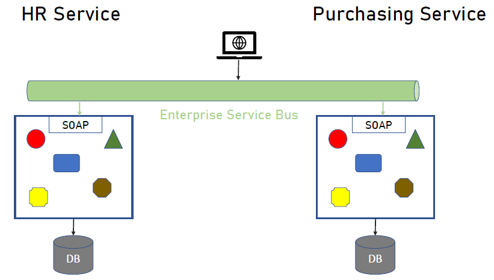

= Memi Lavi Microservices
:toc: left
:toclevels: 5
:sectnums:
:sectnumlevels: 5

NOTE: NOTE

TIP: TIP

IMPORTANT: IMPORTANT

CAUTION: CAUTION

WARNING: WARNING

[cols="1,3"]
|===
| Name | Description

| Asciidoctor
| Awesome way to write documentation

|===

== Course Name: Author

IMPORTANT: Answer Following questions while starting new course on Udemy / Pluralsight

*Specific*

* What do you want to accomplish
* Why do you want to accomplish this goal
* Who will be involved
* Where it is located
* What resources are needed

*Measurable*

* How will you measure your progress and how will you know if you have attained your goal?

*Achievable*

* The question that you should ask yourself is how can you achieve your goal?
* Is it realistic enough based on what resources you have? If not what resources will you need?

*Relevant*

* How relevant is your goal to your overall mission statement? Is it worthwhile? Is this what you really want?

*Time Bound*

* State an exact time period that you intend to fulfill this goal. State the exact amount of months.

== Course Name

*Maximizing Value*

* [ ] *Fundamentals*: Learn the concepts
* [ ] *Information*: Do POC from the course
* [ ] *Skills*: Use / Implement it in Project
* [ ] *Innovation / Expert*: Value for next 2 Years

*Objective*

* [ ] *History*:
* [ ] *Agenda-While doing this course what is the Agenda [1,2,3,4,5..]*:
* [ ] Exam Notes
* [ ] *Why OneNote Notes*:
* [ ] *What is Pending*:

---

* History:
* Agenda-While doing this course what is the Agenda:
** 18.May.2022
*** 1st Iteration. Make important information as *bold* and #yellow highlight#
*** Focus on KeyBank Interview
*** After completing the course, work with Jonathan Levi

* Exam Notes
* *Why OneNote Notes*:
* *What is Pending*:

== Microservices Architecture - The Complete Guide - Memi Lavi

=== Section 1: Welcome

==== Course Introduction

Hello and welcome to the Micro Services Architecture. The complete guide course. Another installment in the software, Architectural Series. In this course, we will learn about one of the most popular software architectural patterns, but also one that should be handled very carefully. And this is the micro services architecture. But first, let's ask ourselves, why micro services? What's so important with this pattern? That wasn't a dedicated course for it will heal all the reasons for that. Micro Services is currently the most popular software architectural paradigm in the world. As such, you must be very knowledgeable about it and you will definitely be expected as a software architect to be able to design robust architectures based on this paradigm. In addition, Micro services architecture is not tied to a specific technology. These pattern can be implemented using almost any platform you would like. Java dot net, python, nodejs, php, etc. One of the nice things about the micro services architecture is that it solves actual problems. We'll talk specifically about these problems later in this course and you will see that these problems are problems. Almost every dev team stumbles upon in almost every project, the micro services architecture effectiveness is measurable and can be easily quantified. Microservice experience is something that is in a very high demand in the job market. In fact, a quick search in monster dot com displays more than 6000 job openings requiring microservices knowledge. This is an opportunity you should definitely not miss. Another reason is the buzz that is generated by the micro services architecture. True, this is not a strictly professional reason, but when something becomes trendy in the software architecture world, you will better know what is a fuss about.

So, as we say, Micro Services is the most popular architectural and in the world. And here is a shortlist of companies that implemented it. As you can see, these are some of the largest software companies in the world. And then implementing micro services sent waves in the software architecture world, especially in the Netflix case, which was one of the first to adopt this architecture and was quite open about the process. But be cautious. Many refer to micro services as the silver bullet that will solve all the challenges in software, architecture and development into this, unfortunately, is not the case. Micro services architecture must be handled carefully and a lot of effort should be put in it. You can't just slap micro services everywhere and hope for the best. Take a look at the following quote. If macro services are implemented incorrectly or used as a band aid without addressing some of the root flaws in your system, you will be unable to do new product development because you are drowning in the complexity. This observation was made by Alexandra Noonan, a software engineer at segment. Her company did the unthinkable. They moved it to micro services and after about two years, abandoned it completely and moved back to a more traditional architecture. Needless to say, a lot of time and money was thrown away in the process. You definitely don't want to be in this position in the future and you have to make sure your MIRCO services implementation is sound and robust. Now, to do that, you have to know first if moving to micro services is a good idea for this specific system and how to do that correctly, avoiding the many obstacles in the way. Diving headfirst into the micro services architecture is never a good idea. And you better invest your time wisely. When thinking about it or this will happen. You don't want to project to be profiled for one of these articles or the contrary. You want wanted to succeed and to provide real value to the customer.

So what will you gain from this course? Well, by the end of this course, you will know what micro services architecture is, what problems does it solve. you will know how to design a robust, scalable, is it to maintain micro services architecture. You will also know when *not* to use micro services architecture. And there are definitely a few cases for this and a lot more. And also and perhaps the most important, you will become a much better software architect. But wait, that's not all. At the end of this course, you will be able to download the micro services checklist. This checklist provides the ultimate practical step by step guide to help you design great macro services architectures. *This checklist is your go to guide when design micro services architecture*. And it provides a condensed summary of all the details you need to remember when designing such architecture. This checklist will help you decide whether micro services is a good idea for your system and will guide you through all the steps you need to take when designing Micro Services Architecture. I am sure this checklist will help you in your journey to become a great micro services architect. I should know it helped me so when I. My name is Mimi Levy, a senior software architect and consultant with more than 18 years of experience as an architect. Here is a very personal list of my clients and my diverse technology stack. I am a certified Agile solution architect and an avid speaker. Great. So let's go.

==== Join The Software Architects Community

==== Who Is This Course For?

So who is this course for? Well, in order to benefit the most from this course, you should have some background in software architecture. This includes architect or anyone with some development background, the developer, team leader, development manager, etc.. Also, it's better if you have some development experience so that the terminology will use this course won't be foreign to you, although *it's important to note that there will be no actual coding in the course*. And also it's better if your experience is backend oriented, since most of the topics we will discuss are for the background. And lastly, this course is beneficial for anyone interested in micro services, architecture, whatever your role is and whatever you do. If micro services is something you want to learn about, this course is for you. So with that out of the way, let's move on.

==== An Update for Udemy Students

==== What We Will Talk About in This Course

So what is the agenda for us in this course? First, the obligatory welcome section, which we are in right now. Next, we are going to talk about the history of micro services. I know this is not a historic class, but in the case of micro services, it's extremely important to understand where did we come from? Next, we are going to talk about the problems with the monolith and so are paradigms. Big problems led to the creation of the micro services architecture. And then we are going to dive into the micro services architecture. We are going to discuss the nine factors that are the basis of the micro services and explain what is the meaning of each one of them after understanding the architectural. *We'll discuss what are the problems solved by micro services* and after deciding to use micro services. We need to understand the process of designing such architecture. And this is the topic of our next section. Then we will talk about deploying micro services. This is not an easy task. And if you have heard about containers and communities in the past, this is where we are going to deep dive into it. *Testing a micro services based system is also a challenge*, and we will tackle it in the next section and then we will talk about service. Mesh. This is quite a new concept and is gaining traction quite rapidly. Using service, Mesh. We make our communication between our services much easier and we will see how it's done. Logging and monitoring are some of the keys to a successful micro services system and we will talk about it in our next section and *then we'll see the darker side of micro services*. We are going to learn when *we should not use micro services*. As we said before, this is not a silver bullet and you should not use it automatically. Moving to micro services will force the organization to adapt to the new paradigm in this section. We will discuss whether traditional organizational chart is not suitable for micro services systems and what changes should be made, and also how you as an architect can and should help in this transition. Next, we will talk about some anti patterns and common mistakes when designing micro services architecture. You will want to avoid this. Believe me, one of the hottest topics in the micro services world is *how to migrate from a monolith to a micro services architecture*. In this section, we'll talk about some techniques for achieving that. And then we will meet our case study in this section. We will discuss a fictional system that should be designed using micro services and go together through each step in the process. And after all, this will conclude the course and talk about what's next. Okay, great. So now let's move on.

=== Section 2: History of Microservices

==== Introduction

Welcome to the history of Micro Services section. Now, you might be surprised to see a history class in a middle of a software architecture course. But believe me, there is a good reason for that. In order to truly understand where did the micro services come from, we must first understand what was before them and why it didn't work. Figuring that out will help us understand the motivation behind micro services. So let's take a walk down memory lane. *So perhaps the most important thing to know about the origins of macro services is that they are a result of problems with two architectural paradigms, the monolith and soa*. So let's deep dive into each one of them and understand what exactly are Monolith and Assoli?

==== Monolith

And let's begin with the monolith. So what is the monolith architecture? So first, monolith architecture. If the original architecture, the father of all fathers, the ancestor of all the other architectural we have today, in fact, Monolith is not just an ancestor. There are still today a lot of monolith applications. And that's not necessarily a bad thing. Some scenarios are best suited for monolith architecture, and there is no reason whatsoever not to use it in these scenarios. With monolith architecture, all the softer components are executed in a single process. That means there is no distribution of any kind. All the components. Sure, the same threads, memory, compute power. It's basically a huge chunk of code running happily alone, minding its own business. Now, naturally, when the whole application runs in a single process, there is a very strong coupling between all the classes. The code pieces are tied to each other. And there is nothing that separates them from each other. No network, no standard API, nothing. Another common attribute of Monolith architecture is that it's *usually implemented as a silo*. *What this means is that the monolith application is a stand alone up that cannot and would not share anything with other apps*. These applications does not expose anything that might help other apps, whether with data or functionality. There is no external API, no listeners of any kind. Nothing that says I know I live in an ecosystem and I would love to help. The other apps in this ecosystem know *the monolith app lives in a world of its own and keeps its data and functionality close to his chest. Nothing can go out*. So let's take a look at a typical Monolith application. Let's talk about an HR app. As we said, mono if HR app is actually a single process. This process hosts all the components of the application. Note how all the components in the diagram are enclosed. We in this process and so make this application a real monolith without any kind of distribution. Now, in fact, Monolith applications are not really comprised of one and only one process. Quite often they have a database which usually is in another process unless using an in-memory database such as SQLLite and end. That's true mainly for Web apps. The user interface is often in a different process. In Web apps, the user interface is usually a Web browser, which is a separate process installed on a separate machine. But even when we have separate processes for database or user interface, the application is still called monolith. Since the core of the application where the real work is done is in fact the monolith. Now what happens when we have another abb beside our HR app? For example, say we have a purchasing app in the organization, which in this case is also a monolith. Those two apps are running happily along, not interfering with each other in minding their own business. But then a new requirement it received and suddenly they have to communicate with each other. It can be that the H.R. system needs to know which orders were made by an employee or the purchasing system should know who is the boss of the employee placing an order. Whatever the case is, they need to be able to share data between them. Well, unfortunately, this is not possible with live application monolith applications. As we said earlier, are often silos and do not expose ways to share data and functionality. So making the two apps communicating with each other is a cumbersome, frustrating experience. It can be done, but it's not easy. Now, we focused a little bit about the problems of the monolith architecture and later on we'll talk a lot about them.

But actually, there are also advantages in the monolith architecture. Let's see two of them. *The first, it is much easier to design Monolith*. Think about it with monolithic application. There is no network, no messaging mechanisms, no cues, no cross process debugging. It's much simpler and simpler is not always worse. In addition, monolith applications, if developed correctly, are quite performant. Again, no network holes, no serialisation. And this realisation leaves. All calls are in-process. Monolith apps can be blazingly fast, much more than distributed systems. So that was it about the monolith architecture. And now let's look at the. Second, architecture that predated Microservices.

==== Service Oriented Architecture

And the second architect who we'll look at in our history class is S oa or service oriented architecture. So what do we need to know about service oriented architecture? Well, first, that the term service oriented architecture was the first coined in 1998. And the basic premise of SOA is that APS are basically services exposing functionality to the outside world. Remember what we said about the monolith, that it is often a silo? Well, with service oriented architecture, it's the other way around. The emphasis with SOA is about sharing and giving. The app is built from the ground up with sharing capabilities, usually using a well-defined API. And the way to communicate with that API is by consuming the services metadata. With SOA, every service advertises its capabilities and the way to consume them using a well-defined metadata file, which is usually implemented using soap and WSLD. Now, if you're not familiar with soap and WSLD, don't feel bad. These formats were introduced at the beginning of the millennium and they were the first standard for Web API. Soap is a protocol for Web service and it's basically a long and complicated XML document WSDL is another example document containing the meta data about the service, which method it exposes, what parameters they expect and what data they return as what we'll see later. *The fact that most SOA based apps were based on soap and WSDL was one of the key factors in this SOA eventual failure*. Another important aspect of SOA is the use of ESB.

*ESB, which stands for Enterprise Service Bus, is a family of products that were designed to mediate between the client and the services and between the services themselves*. *The ESB claimed to provide all the crosscutting concerns of the saw based application for authorisation, authentication, routing, validation, monitoring and more*. Looks good on paper, but turned out to be a huge problem. Anyway, let's look at an example. So we have an HR App and Purchase App called in accordance with a SOA concept. It's our service and purchasing service respectively in order to be wharfie services. Both of them exposed functionality through so endpoints. Using these endpoints, the services can communicate with each other using standard technology agnostic protocol supported by the majority or sort of vendors on the planet. Now note the client at the middle of the slide. *As you can see, the client does not talk directly to any one of the services. Instead, we have the Enterprise Service Boss or ESB, that ESB is a channel between the services in the organization and it is the only tool that communicate with the services. So if the client wants to communicate with the service, it goes to the ESB and the ESB knows which service is the real target here and wrote the request to the appropriate service. This way, the client has no idea what are the services that exist in the organization and it needs to know only a single thing. How to talk to the ESB. That's definitely a sound idea*.

But as you will see later, it caused a lot of problems. So what are the pros of the saw paradigm? What made it so popular back in the days? Well, the *first and obvious advantage was* that it allowed for the first time sharing of data and functionality between systems and to do so in easy standard and the platform agnostic we remember before. So we had the monolith which did not exposed anything to the outside world. If you wanted your system to grab some data from a Monolit system, you had to call the developers of that system to a meeting. Explain the situation to them. Try to convince them to develop some loophole in their precious system so that you can exploit it to grab some data and walk with a fragile interface. They agreed to provide it, but now with a SOA paradigm, all is different and do much better. If you wanted to retrieve some data from other application, all you had to do is access it with the document. Find out how its web methods are constructed. Construct your own client for that method and voila, you have access to that data without talking to anyone in the process. And what's even better? There were a multitude of tools that automated the whole process and could generate a good looking client library for every Web service just by accessing its WSDL. The field version of Visual Studio, then called Visual Studio .NET had this capability and it proved to be one of the most effective capabilities. Ever added to this idea? So this is what advantage. *The second one is polyglot*. We will talk about polyglots in length later in this course. But for now, let's just say that *polyglot allows us to avoid platform dependency*. What this means is that because the communication between services is done using standard protocol. SOAP and WSDL, it's not important. What is the actual platform? The service is developed in. And so for the first time in history, a Java service could easily communicate with a .NET service. And what's even better? They both didn't have to be aware of the underlying platform of the other. *This capability was one of the major key success factors of the service oriented architecture* paradigm. And It is considered, even today, one of the cornerstones of every successful distributed architectural. OK. So that was the service oriented architecture and that concludes our history class. And now let's move on to the next section.

=== Section 3: Problems with Monolith and SOA

==== Introduction
==== Single Technology Platform
==== Inflexible Deployment
==== Inefficient Compute Resources
==== Large and Complex
==== Complicated and Expensive ESB
==== Lack of Tooling

=== Section 4: Microservice Architecture

==== Introduction

==== Componentization

==== Organized Around Business Capabilities

==== Products not Projects

==== Smart Endpoints and Dumb Pipes

==== Decentralized Governance

==== Decentralized Data Management

==== Infrastructure Automation

==== Design for Failure

==== Evolutionary Design

==== Summary

