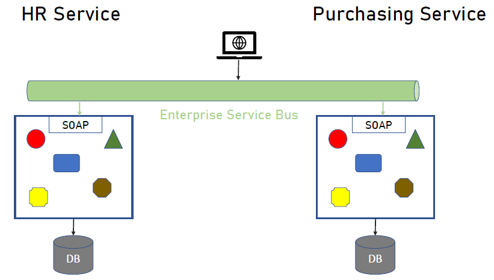

= Memi Lavi Microservices
:toc: left
:toclevels: 5
:sectnums:
:sectnumlevels: 5

NOTE: NOTE

TIP: TIP

IMPORTANT: IMPORTANT

CAUTION: CAUTION

WARNING: WARNING

[cols="1,3"]
|===
| Name | Description

| Asciidoctor
| Awesome way to write documentation

|===

== Microservices Architecture - The Complete Guide - Memi Lavi

=== Section 1: Welcome

==== Course Introduction

Hello and welcome to the Micro Services Architecture. The complete guide course. Another installment in the software, Architectural Series. In this course, we will learn about one of the most popular software architectural patterns, but also one that should be handled very carefully. And this is the micro services architecture. But first, let's ask ourselves, why micro services? What's so important with this pattern? That wasn't a dedicated course for it will heal all the reasons for that. *Micro Services is currently the most popular software architectural paradigm in the world.* As such, you must be very knowledgeable about it and you will definitely be expected as a software architect to be able to design robust architectures based on this paradigm. In addition, Micro services architecture is not tied to a specific technology. These pattern can be implemented using almost any platform you would like. Java dot net, python, nodejs, php, etc. One of the nice things about the micro services architecture is that it solves actual problems. We'll talk specifically about these problems later in this course and you will see that these problems are problems. Almost every dev team stumbles upon in almost every project, the micro services architecture effectiveness is measurable and can be easily quantified. Microservice experience is something that is in a very high demand in the job market. In fact, a quick search in monster dot com displays more than 6000 job openings requiring microservices knowledge. This is an opportunity you should definitely not miss. Another reason is the buzz that is generated by the micro services architecture. True, this is not a strictly professional reason, but when something becomes trendy in the software architecture world, you will better know what is a fuss about.

So, as we say, Micro Services is the most popular architectural and in the world. And here is a shortlist of companies that implemented it. As you can see, these are some of the largest software companies in the world. And then implementing micro services sent waves in the software architecture world, especially in the Netflix case, which was one of the first to adopt this architecture and was quite open about the process. But be cautious. Many refer to micro services as the silver bullet that will solve all the challenges in software, architecture and development into this, unfortunately, is not the case. Micro services architecture must be handled carefully and a lot of effort should be put in it. You can't just slap micro services everywhere and hope for the best. Take a look at the following quote. If macro services are implemented incorrectly or used as a band aid without addressing some of the root flaws in your system, you will be unable to do new product development because you are drowning in the complexity. This observation was made by Alexandra Noonan, a software engineer at segment. Her company did the unthinkable. They moved it to micro services and after about two years, abandoned it completely and moved back to a more traditional architecture. Needless to say, a lot of time and money was thrown away in the process. You definitely don't want to be in this position in the future and you have to make sure your MIRCO services implementation is sound and robust. Now, to do that, you have to know first if moving to micro services is a good idea for this specific system and how to do that correctly, avoiding the many obstacles in the way. Diving headfirst into the micro services architecture is never a good idea. And you better invest your time wisely. When thinking about it or this will happen. You don't want to project to be profiled for one of these articles or the contrary. You want wanted to succeed and to provide real value to the customer.

So what will you gain from this course? Well, by the end of this course, you will know what micro services architecture is, what problems does it solve. you will know how to design a robust, scalable, is it to maintain micro services architecture. You will also know when *not* to use micro services architecture. And there are definitely a few cases for this and a lot more. And also and perhaps the most important, you will become a much better software architect. But wait, that's not all. At the end of this course, you will be able to download the micro services checklist. This checklist provides the ultimate practical step by step guide to help you design great macro services architectures. *This checklist is your go to guide when design micro services architecture*. And it provides a condensed summary of all the details you need to remember when designing such architecture. This checklist will help you decide whether micro services is a good idea for your system and will guide you through all the steps you need to take when designing Micro Services Architecture. I am sure this checklist will help you in your journey to become a great micro services architect. I should know it helped me so when I. My name is Mimi Levy, a senior software architect and consultant with more than 18 years of experience as an architect. Here is a very personal list of my clients and my diverse technology stack. I am a certified Agile solution architect and an avid speaker. Great. So let's go.

==== Join The Software Architects Community

Ok

==== Who Is This Course For?

So who is this course for? Well, in order to benefit the most from this course, you should have some background in software architecture. This includes architect or anyone with some development background, the developer, team leader, development manager, etc.. Also, it's better if you have some development experience so that the terminology will use this course won't be foreign to you, although *it's important to note that there will be no actual coding in the course*. And also it's better if your experience is backend oriented, since most of the topics we will discuss are for the background. And lastly, this course is beneficial for anyone interested in micro services, architecture, whatever your role is and whatever you do. If micro services is something you want to learn about, this course is for you. So with that out of the way, let's move on.

==== An Update for Udemy Students

Ok

==== What We Will Talk About in This Course

So what is the agenda for us in this course? First, the obligatory welcome section, which we are in right now. Next, we are going to talk about the history of micro services. I know this is not a historic class, but in the case of micro services, it's extremely important to understand where did we come from? Next, we are going to talk about the problems with the monolith and so are paradigms. Big problems led to the creation of the micro services architecture. And then we are going to dive into the micro services architecture. We are going to discuss the nine factors that are the basis of the micro services and explain what is the meaning of each one of them after understanding the architectural. *We'll discuss what are the problems solved by micro services* and after deciding to use micro services. We need to understand the process of designing such architecture. And this is the topic of our next section. Then we will talk about deploying micro services. This is not an easy task. And if you have heard about containers and communities in the past, this is where we are going to deep dive into it. *Testing a micro services based system is also a challenge*, and we will tackle it in the next section and then we will talk about service. Mesh. This is quite a new concept and is gaining traction quite rapidly. Using service, Mesh. We make our communication between our services much easier and we will see how it's done. Logging and monitoring are some of the keys to a successful micro services system and we will talk about it in our next section and *then we'll see the darker side of micro services*. We are going to learn when *we should not use micro services*. As we said before, this is not a silver bullet and you should not use it automatically. Moving to micro services will force the organization to adapt to the new paradigm in this section. We will discuss whether traditional organizational chart is not suitable for micro services systems and what changes should be made, and also how you as an architect can and should help in this transition. Next, we will talk about some anti patterns and common mistakes when designing micro services architecture. You will want to avoid this. Believe me, one of the hottest topics in the micro services world is *how to migrate from a monolith to a micro services architecture*. In this section, we'll talk about some techniques for achieving that. And then we will meet our case study in this section. We will discuss a fictional system that should be designed using micro services and go together through each step in the process. And after all, this will conclude the course and talk about what's next. Okay, great. So now let's move on.

=== Section 2: History of Microservices

==== Introduction

Welcome to the history of Micro Services section. Now, you might be surprised to see a history class in a middle of a software architecture course. But believe me, there is a good reason for that. In order to truly understand where did the micro services come from, we must first understand what was before them and why it didn't work. Figuring that out will help us understand the motivation behind micro services. So let's take a walk down memory lane. *So perhaps the most important thing to know about the origins of macro services is that they are a result of problems with two architectural paradigms, the monolith and soa*. So let's deep dive into each one of them and understand what exactly are Monolith and Assoli?

==== Monolith

And let's begin with the monolith. So what is the monolith architecture? So first, monolith architecture. If the original architecture, the father of all fathers, the ancestor of all the other architectural we have today, in fact, Monolith is not just an ancestor. There are still today a lot of monolith applications. And that's not necessarily a bad thing. Some scenarios are best suited for monolith architecture, and there is no reason whatsoever not to use it in these scenarios. With monolith architecture, all the softer components are executed in a single process. That means there is no distribution of any kind. All the components. Sure, the same threads, memory, compute power. It's basically a huge chunk of code running happily alone, minding its own business. Now, naturally, when the whole application runs in a single process, there is a very strong coupling between all the classes. The code pieces are tied to each other. And there is nothing that separates them from each other. No network, no standard API, nothing. Another common attribute of Monolith architecture is that it's *usually implemented as a silo*. *What this means is that the monolith application is a stand alone up that cannot and would not share anything with other apps*. These applications does not expose anything that might help other apps, whether with data or functionality. There is no external API, no listeners of any kind. Nothing that says I know I live in an ecosystem and I would love to help. The other apps in this ecosystem know *the monolith app lives in a world of its own and keeps its data and functionality close to his chest. Nothing can go out*. So let's take a look at a typical Monolith application. Let's talk about an HR app. As we said, mono if HR app is actually a single process. This process hosts all the components of the application. Note how all the components in the diagram are enclosed. We in this process and so make this application a real monolith without any kind of distribution. Now, in fact, Monolith applications are not really comprised of one and only one process. Quite often they have a database which usually is in another process unless using an in-memory database such as SQLLite and end. That's true mainly for Web apps. The user interface is often in a different process. In Web apps, the user interface is usually a Web browser, which is a separate process installed on a separate machine. But even when we have separate processes for database or user interface, the application is still called monolith. Since the core of the application where the real work is done is in fact the monolith. Now what happens when we have another abb beside our HR app? For example, say we have a purchasing app in the organization, which in this case is also a monolith. Those two apps are running happily along, not interfering with each other in minding their own business. But then a new requirement it received and suddenly they have to communicate with each other. It can be that the H.R. system needs to know which orders were made by an employee or the purchasing system should know who is the boss of the employee placing an order. Whatever the case is, they need to be able to share data between them. Well, unfortunately, this is not possible with live application monolith applications. As we said earlier, are often silos and do not expose ways to share data and functionality. So making the two apps communicating with each other is a cumbersome, frustrating experience. It can be done, but it's not easy. Now, we focused a little bit about the problems of the monolith architecture and later on we'll talk a lot about them.

But actually, there are also advantages in the monolith architecture. Let's see two of them. *The first, it is much easier to design Monolith*. Think about it with monolithic application. There is no network, no messaging mechanisms, no cues, no cross process debugging. It's much simpler and simpler is not always worse. In addition, monolith applications, if developed correctly, are quite performant. Again, no network holes, no serialisation. And this realisation leaves. All calls are in-process. Monolith apps can be blazingly fast, much more than distributed systems. So that was it about the monolith architecture. And now let's look at the. Second, architecture that predated Microservices.

==== Service Oriented Architecture

And the second architect who we'll look at in our history class is S oa or service oriented architecture. So what do we need to know about service oriented architecture? Well, first, that the term service oriented architecture was the first coined in 1998. And the basic premise of SOA is that APS are basically services exposing functionality to the outside world. Remember what we said about the monolith, that it is often a silo? Well, with service oriented architecture, it's the other way around. The emphasis with SOA is about sharing and giving. The app is built from the ground up with sharing capabilities, usually using a well-defined API. And the way to communicate with that API is by consuming the services metadata. With SOA, every service advertises its capabilities and the way to consume them using a well-defined metadata file, which is usually implemented using soap and WSLD. Now, if you're not familiar with soap and WSLD, don't feel bad. These formats were introduced at the beginning of the millennium and they were the first standard for Web API. Soap is a protocol for Web service and it's basically a long and complicated XML document WSDL is another example document containing the meta data about the service, which method it exposes, what parameters they expect and what data they return as what we'll see later. *The fact that most SOA based apps were based on soap and WSDL was one of the key factors in this SOA eventual failure*. Another important aspect of SOA is the use of ESB.

*ESB, which stands for Enterprise Service Bus, is a family of products that were designed to mediate between the client and the services and between the services themselves*. *The ESB claimed to provide all the crosscutting concerns of the saw based application for authorisation, authentication, routing, validation, monitoring and more*. Looks good on paper, but turned out to be a huge problem. Anyway, let's look at an example. So we have an HR App and Purchase App called in accordance with a SOA concept. It's our service and purchasing service respectively in order to be wharfie services. Both of them exposed functionality through so endpoints. Using these endpoints, the services can communicate with each other using standard technology agnostic protocol supported by the majority or sort of vendors on the planet. Now note the client at the middle of the slide. *As you can see, the client does not talk directly to any one of the services. Instead, we have the Enterprise Service Boss or ESB, that ESB is a channel between the services in the organization and it is the only tool that communicate with the services. So if the client wants to communicate with the service, it goes to the ESB and the ESB knows which service is the real target here and wrote the request to the appropriate service. This way, the client has no idea what are the services that exist in the organization and it needs to know only a single thing. How to talk to the ESB. That's definitely a sound idea*.

But as you will see later, it caused a lot of problems. So what are the pros of the saw paradigm? What made it so popular back in the days? Well, the *first and obvious advantage was* that it allowed for the first time sharing of data and functionality between systems and to do so in easy standard and the platform agnostic we remember before. So we had the monolith which did not exposed anything to the outside world. If you wanted your system to grab some data from a Monolit system, you had to call the developers of that system to a meeting. Explain the situation to them. Try to convince them to develop some loophole in their precious system so that you can exploit it to grab some data and walk with a fragile interface. They agreed to provide it, but now with a SOA paradigm, all is different and do much better. If you wanted to retrieve some data from other application, all you had to do is access it with the document. Find out how its web methods are constructed. Construct your own client for that method and voila, you have access to that data without talking to anyone in the process. And what's even better? There were a multitude of tools that automated the whole process and could generate a good looking client library for every Web service just by accessing its WSDL. The field version of Visual Studio, then called Visual Studio .NET had this capability and it proved to be one of the most effective capabilities. Ever added to this idea? So this is what advantage. *The second one is polyglot*. We will talk about polyglots in length later in this course. But for now, let's just say that *polyglot allows us to avoid platform dependency*. What this means is that because the communication between services is done using standard protocol. SOAP and WSDL, it's not important. What is the actual platform? The service is developed in. And so for the first time in history, a Java service could easily communicate with a .NET service. And what's even better? They both didn't have to be aware of the underlying platform of the other. *This capability was one of the major key success factors of the service oriented architecture* paradigm. And It is considered, even today, one of the cornerstones of every successful distributed architectural. OK. So that was the service oriented architecture and that concludes our history class. And now let's move on to the next section.

=== Section 3: Problems with Monolith and SOA

==== Introduction

So we've talked about the monolith and the SOA paradigms. But in order to fully understand the motivation behind the micro services architecture, we first need to understand the problems with these paradigms. During the years, a lot of problems were found in both paradigms. These problems were related to technology deployment cost in more aspects of these paradigms. In fact, some of the problems were so acute that it made the whole paradigm disappear, as was the case with SOA, which effectively does not exist anymore. In this section, we will review these problems and understand what will the reasons for the search of a new architectural pattern. This understanding is important when learning about micro services. *Since the micro services architectural were designed with specific goals in mind*. And as these goals are closely tied to the problems with Monolith. And so we will begin our review with the problems with Monolith and then move on to the problems we saw. So let's begin.

==== Single Technology Platform

The first problem is the single technology platform. What is probably means that with Monolith, *all the components must be developed using the same development platform*. Since Monolith is by definition a single process, there is no way to develop various components of it in different platforms. And this is not always the best for the task. Sometimes it's a good idea to use more than one development platform in a single application, especially when there are specific capabilities of the platform that can be in use in the application. But with the model, it can't be done in Monolith, we can to specific platform for specific features. And we are tied to our initial choice. For example, if our application is developed using NODE JS, which is especially good at handling short Web requests, but then we get a new requirement to handle documents, which is something nodejs does not excel at. We have a problem and we will have to use nodejs. As for that, even though as a platforms such as dot net are much better for that specific task. In addition, *future upgrade of the technology* is a problem. Say we developed our up using Java eight. And now we want to upgrade to Java nine. We would have to do that for the whole up. We can't upgrade only a specific part of the application, but we will have to do that for all the components at once, which will force us to test the whole system and will make the whole upgrade process much longer. So let's take a look at our monolith up and see how this problem looks like. So this is the app, the same one we used to demonstrate the monolith concept before now because this single technology problem, we must develop all our components using a single development platform. That means that we can use, for example, .net core for the development or nodejs or any other platform you would like. But if we would want to use both meaning some components we use .net core and the we use nodejs well. That's not possible. And that's because the nature of the monolith architecture and the fact that it runs in a single process. So that was the first problem. And now let's move on to the next one.

==== Inflexible Deployment

And the next problem is inflexible deployment with Monolith when deploying the application. *We always deployed the whole app. There is no way to deploy. Only part of the application*. *Now, this means that even when updating only one component, the whole code base should be deployed. The problem with that is that it forces rigorous testing for every deployment on the whole application*. And that forces long development cycles. Think, for example, that you found a little bug that needed to be fixed and that its fix includes changing a single line of code, just one line in an application with more than million lines of code. But this little fix that took less than a minute to handle now requires full unit and regression tests and deployment of the whole application. And this process can take weeks, if not more. And all this for a fix that changed a single line of code. I'm sure you can see the problem here. So let's look again at our application. One component at the top left needs to be changed. The change itself isn't necessarily a big one. It can be, as mentioned, even a change in a single line of code. But as a result of this change, we must now test the whole application. And as a result, we find bugs in new places that on the face of it, have nothing to do with the component. *We modified, but since in monolith  there is a strong coupling between all the components*. This is something that can happen. *So now we need to go through a fixed cycle and fix all the bugs found*. And of course, just again, to make sure the bugs are really gone and only after going through the cycle a few times, we can finally deploy our system. And all this because of a change in a single line of code. So as you can see, the deployment of a model is extremely inflexible and makes the whole process long and cumbersome.

==== Inefficient Compute Resources

Our next problem is within efficient compute resources with monolith compute resources, mainly C.P.U and RAM are divided. Across all components, we have a single process, the monolith that consumed these resources and uses them for all its internal components. And this is not always the ideal case. *For example, if a specific component needs more resources, there is no way to do that. We can't allocate more C.P.U or memory to a specific component that needs them*. *We will have to allocate more compute resources to the whole monolith, which will give them to all the components*. And this is extremely inefficient. We will use more compute resources for components. We don't need them. And the one who do need them will get just a portion of these resources. So let's look again at our monolith. In our case, the process runs on a machine with four vehicles, which is a mutual cause and eight gigabyte of RAM. Now, suddenly, this component requires more compute power due to intensive computations. It was asked to perform. Our only choice with the monolith is to increase the compute power to the whole process and now make it. For example, eight vehicles and 16 gigabyte RAM. Now, this increase will affect all the components inside the monolith. So the other components will get more resources, which they don't actually need. And the one that really requires it will get to just a small portion of these resources into this. As you can see, is a very inefficient use of compute resources.

==== Large and Complex

The next problem is the large and complex problem. This problem has some similarities with the previous one, but it has some separate aspects. So the basic premise of this problem is that with monoliths, the code base naturally is large and complex, since all the software components are part of a single process. We naturally have a very large code base containing a lot of dependencies and coupling. Now, what this means is that every little change can affect other components. There is no clear isolation between the components and making sure a change in one component what trickle into other component is not easy. So naturally, we'll have to do a lot of testing to make sure the system functions correctly. But even with that, some bugs might still slip between the cracks and will not be detected during testing. This makes the whole system very difficult to maintain. When every little change requires such a long process of verification, then every little change becomes a nightmare. One side effect of this problem is that if every little change can affect the whole application, then the developers will try their best not to change anything, and that will make the system obsolete quite quickly. And this is a position you don't want to be in. So to demonstrate it, let's look at our application, say we changed a single component. Again, the top left one. We now again need to test the whole application. We find bugs that resulted from that change. We fix those bugs and just then put the system in production. And this long, complex and fragile process should be performed for every little change in the system as a direct result of the large and complex problem.

==== Complicated and Expensive ESB

So up until now, we discussed problems related to the monolith. *And now let's look at problems related to the service oriented architecture*. And the first one is the complicated and expensive ESB. As you might remember, with the service oriented architecture, the ESB or Enterprise Service was is one of the main components and is responsible for all the communication aspects between the various apps or services. *The ESB takes care of routing, validation, authentication, aggregation and more*. And without it, the services will have a lot more work to do. *The problem is that this ESB can quickly become bloated and expensive*. ESB engines were built by various companies such as Oracle and IBM and were extremely expensive from the start. *In addition, they were complex beasts and required a lot of dedicated expertise to handle them. This resulted in that only large organizations with deep pockets use them for a long time, and the young and small companies avoided them at all costs*. This definitely didn't help for the popularity of the service oriented architecture. *Now, this happened because the ESB tried to do everything, as we said before, routing, validation, authentication, everything*. And when a single piece of code tries to do everything, it usually doesn't end well. In addition, because of its complexity. Yes, these are very difficult to maintain. *And organizations found themselves investing a lot of time and money, maintaining a monstrous ESB instead of enjoying a lightweight and the faster service oriented architecture which led them to abandon the idea*. So if you look at a typical solar system like this one, our main problem is here that is being made. The whole concept not worth it, and was definitely one of the reasons that led to the demise of the service oriented architecture.

==== Lack of Tooling

The next and last problem we will discuss is the lack of tooling to link stands at the base of the service oriented architecture. And for it to be effective, *short development cycles were needed*. After all, we already saw that *one of the problems with Monolith was long development cycles*. And soa had to demonstrate improvement in this area. So we had to allow for quick testing and deployment. This was the holy grail of service based architecture and definitely one of the strongest motivations to go in this space. However, for this to happen, soa needed. Tooling to support this into such tools simply didn't exist at the time. *Testing and deployment were mainly manual processes, and it took a lot of time now since testing of services based architecture is more complicated than testing a monolith*, as we will see you later in this course, then manually testing a SOA based system took paradoxically longer than testing a monolith. And this didn't bond well with the developers. The bottom line was simple and dial no timesaving was achieved. *It was found out that creating service oriented system took much longer than building a monolith*. And this was a bottom line that no one wanted to live with. And because of that, service oriented systems were doomed. Okay, so that was an overview of the problems with monolithic and service oriented systems. And now let's see what micro services architecture is and how it deals with these problems.

=== Section 4: Microservice Architecture

==== Introduction

So we've talked a lot about monolith, service oriented architecture and the problems with them. And now finally, it's time to talk about the real thing. The micro services architecture. So where did the micro services come from? Well, the problems with the monolith and soa paradigms made it clear we need something new, something that will once and for all solve these problems. It was clear that it is something *has to be Modular* since the monolith told us what could happen when the software is not modular. And it also had to *have a simple API* *since SOA told us what could happen when the API is over complicated*. Some new ideas emerged that tried to *formulate a new kind of architecture*, one that we do follow these requirements and will solve the other problems we discussed. And then in 2011, the term micro services made its first appearance. It was in a software workshop and it was one of the first attempts to define how exactly this new paradigm should look like. But the real kick came to three years later in 2014. In this year, *Martin follow one of the most famous software architects, and his colleague, James Lewis, published their Miko's services article*. In this article, they described the ideas behind the myco services architecture. But more important, *they outlined the main attributes of such an architecture*. In other words, they say to the world, if you want to design a Miko's services architecture, this is what you should do.

* https://martinfowler.com/articles/microservices.html

This article quickly became the de facto standard for Michael Services definition, and even though it was published a few years ago, it is still considered the best description of the micro services architecture. So this is the article and you can read it by going to the link here. But you don't have to. In this section, we will go through *the nine attributes outlined in the article and explain them thoroughly, including examples*. In addition, we'll talk about where These attributes are not quite as they seem and what you really need to look at when designing Micros services architecture. At the end of the section, we will also rank these characteristics and we'll discuss which one are really important and which you can skip. So what are the main characteristics of a good macro services architecture? According to Martin Fowler's article here, they are componentszation via services organized around business capabilities, products not projects, smart end points and dumb pipes, decentralized governance, decentralized data management, infrastructure, automation, design for failure and evolutionary design. So these are the characteristics of MS services architecture. And now let's deep dive into each one of them.

==== Componentization Via Services

So the first one is *Componentization via services*. So what does it really mean? Well, let's start from the basics. Modular design is always a good idea. Everyone knows that, especially in the post monolithic era, we always want to make our system modular so that updating it requires a small code change in a well-defined part instead of touching a monstrous piece of code. Now, when talking about modular design, we also talk about components, components of the name we give to the parts that together compose the software. In other words, we're talking about modular software. We talk about software that has more than one component, and *each component is responsible for a specific aspect of the software*. Okay, so this isn't modularity, but how is it implemented? Well, it turns out there are basically two methods to implement modularity in software. *The first is using libraries*. Now, if you have even a modest development experience, you definitely use libraries. These are external code files that are used in your code. Usually after declaring them using keywords such as import require or using. We use libraries by directly calling the code in them. The libraries are executed within our systems process. Share the same compute resources and do not need any kind of mediation, such as serializer or network. *In order to be used, one of the side effects of using libraries is great performance*. Since there are no mediators between a component in the library calls are Executed Lightning Fast, *the other type of modularity is using services*. Services are out of process components and are called using out of process mechanisms such as Web API or RBC. Modern systems use mainly modern Web API such as REST. *So these are the two types of modularity*. Now what does this have to do with micro services? Well, it has a lot to do with micro services *in micro services. We prefer to implement the modular of design using services and not libraries*. The componentization, which is a process of separating the software, two separate components, thus making it modular, is preferably done using services and not libraries. *And that's why this attribute is named componentization by services*. Now, of course, libraries can and should be used with micro services. But in this case, they are part of the service. They do not represent the whole componentization of the software, just the service itself.

So let's look at an example. This is the monolith. We have already talked about the monolith, as you can see, as a model or design. It is composed of five components. *Now, as we said with Monolith, the componentization is done via libraries*. In fact, there is no other choice. Monolith, by definition, runs in a single process. So our componentization methodology must run in a single process. And only libraries meet this requirement. But what happens with micro services will hear the componentization is done via services. Every component is a service. It runs in its own process and is accessible using out of process mechanisms such as Web API or RPC. Now, if we focus on a specific service, we will see that it often has libraries in it. As we said before, using libraries is a best practice and it is highly recommended. The only thing to remember regarding macro services is that libraries are not used to make the whole system modular, but they help with the inner workings of the service itself. The modularity of system is expressed by the services and this is the componentization by services.

Now, what is the motivation of componentization by services? Why would we want to use services for the modularity of our system instead of the simple Faster libraries? So there are two reasons for that. The first, using services makes our components independently deployable. That means that if we want to modify a single component, we deploy this single component. If a component is a library, then we will have to deploy the whole application again because the whole application runs in a single process. Using services instead of library enables us to deploy separate components much easier. *Another reason is that using services as a component forces us, the architect, to define our components interface very well*. If we are going to expose a component to the outer world as a Web API, then we have no choice other than design a Web API and psychologically when designing something that the whole world can use. We put a lot of thought into it, much more than. Your library. So, in short, using services instead of libraries. Makes a component much better designed. So that was the first attribute component physician via services. Now, let's move on to the next one.

==== Organized Around Business Capabilities

The next attribute of Micro Services architecture is organized around business capabilities. So what does it mean with traditional projects? We have things with horizontal responsibilities. For example, a team responsible for the user interface, another one responsible for the API implementation. Another one for the logic in the database. And so on. So if we look at the monolith and look at what is inside, it will look like this. We see four layers. Each one is under the responsibility of a different team. Of course, the actual number of players might change. But this is a common case. Now, what is the problem with that? The problem begins when these teams need to talk with each other. Now, since the teams work on the same system, they will have a lot of opportunities to talk to each other. For example, the UI team will have to talk with the API team. So they will know how the API looks like. So the UI code will adapt to it or the logic team will talk with the database team so that they know how the database schema looks like and make a module class accordingly. Now, since we are talking here about separate teams, each with its own team leader offices, internal culture and more, every such communication is a potential for a problem. Inter-Group communication is by definition, slow and cumbersome. The teams don't use the same terminology. They don't have the same schedule. And in the worst case, they don't even have the same goals. For example, the logic team might want to build the best logically possible, but they don't give a -- about the database. Or the UI team focuses mainly on user interface and user experience aspects. But they couldn't care less about the quality of the back end of the system. And these contradicting goals can hurt badly. The project progress and interfere with its quality with micro services. We want to do it differently when designing Micro services architecture. Each and every service is handled by a single team which is responsible for all the aspects of the service. So if we look at a service, the walk on, it looks like that. As you can see, all the labels are handled and maintained by a single team responsible for everything the UI, the API, the logic, the database and in fact, for every other aspect that might be relevant. Now, when walking like that, the team has one and only one goal to make the service perform its functionality as best as possible. Since the team has a holistic view of the service, it can make decisions that affect the whole functionality of the service, such as adapt the UI to the API or changing the database schema to make it more effective. We don't see here in our politics that might damage the overall service and no short sighted decisions. The team has one goal to make the best service possible and it's aligned with this goal.

Now, that brings us to another question. How do we decide on the boundaries of the service? In other words, how do we decide what service to do? How do we know when one service ends and the other one begins? So with micro services, we do that by looking at business capabilities. *We look at the overall functionality of the system and map the various business capabilities it has. For example, an e-commerce app will probably have order management, inventory management, shopping, basket delivery, payment handling and so on*. So, for example, we might have a service for order management, which contains all of the technological layers. It is handled by a single team and thus we have a single team responsible for a single business capability. Doing it this way, instead of having horizontal teams responsible for many business capabilities, will help making the service better and with great time to market.

So what is the motivation of the organized around business capabilities attribute? Well, we have two of those. *First*, it contributes to the quick development of the service, as we demonstrated when having a single team working on the service. We avoid long and cumbersome inter-group communication and if the team is much more effective. In addition, when defining service around business capabilities, we get a service with well-defined boundaries. It's quite clear what would be included and more important, what should not be included in the service. Keeping the service laser focused on its business capabilities makes its design easier and makes working with it a lot simpler.

==== Products not Projects

The next attribute of Micro services architecture is product, not projects. So let's see what does it mean with traditional projects? The goal is to deliver a working code. This is what the team is working on. And this is the end goal of the project. The team is focused on the project and the project plan usually ends when the code is delivered. Perhaps that was sometimes reserved for acceptance testing. Walking like that, the team develops no lasting relationship with the customer. In fact, the customer involvement in the development process is minimal, if at all. Many times the team has no acquaintance with the customer at all. Only the project manager and system analyst meet with the customer and the developers have no idea who is the customer. How does he look like? And what is important to him? They probably never even talked to him. In addition, many times after the code is delivered, the team moves on to the next project and often disbanded and the developers get assigned to other projects.

And that's a problem when the team focuses on delivering code. They don't really see the customer and they don't think like a customer. And so we see many times software projects that have great code, that utilizes great algorithms and is very effective and clean, but does not deliver the product to the customer actually wanted. *And that's because the team didn't think like a customer*. But like a developer. So with Micro Services, we want to do it differently. *With Michael Services, the goal is to deliver a working product and not a working code*. The product is the most important thing we deliver and the code is just a means to an end. And if the code should be less elegant in favor of a better product, then so be it. Now a product every product needs ongoing support and requires close relationship with the customer. *No successful product can be designed without knowing what the customer actually wants and when the team understands that it develops this relationship with the customer*. And what's more, the team is responsible for the Micro service. Even after the delivery. True, they might be developing other service, but they still own the service and still feel responsible for its success. And even if the service should be handed to other team, it's done with a lot of thought. And original team makes sure the new team knows everything there is to know about the service, the code and of course, the customer. There is a famous quote by A.W.S as CTO Werner Vogels that goes like this. *You build it, you run it, meaning your job is not done by building the service you are responsible for successfully running it*. To end this mindset can change the way the team thinks about the service and make them be more invested in it, which will definitely contribute to its success. *Now, this attribute of thinking like the customer and involve him in the process might remind you of the Agile manifesto*. This manifesto, published in 2001, defined some principles for agile development. It is considered the foundation of the agile development movement. *One of the main goals of this manifesto was to increase the customer's involvement in the development process*. It is not a coincidence that customer's involvement is mentioned in the Agile Manifesto and in the micro services attributes. Over the past two years, it was recognized that such an involvement is actually a win win situation. The customer gets a better product and the developers produce better software. And because of that, you will often see Micro services based system implemented using the agile methodology. So what is the motivation behind the product, not the projects attributes? *Well, first, of course, increase customer satisfaction. When the team thinks like the customer, the end result will be more to the customer's needs and will fit its needs*. This will definitely make the customer more satisfied with the product. *Another side effect is changing the developer's mindset by adopting the product, not project attribute. The developers, change their mindset and become even better developers*. And that will greatly help the team, not only with the service but with future ones.

==== Smart Endpoints and Dumb Pipes

The next attribute we will discuss is smart inputs and dumb pipes. Now to understand what is the exact meaning and motivation of this attribute, we need again to go down memory lane and look back at this SOA paradigm. Traditional saw projects used to complicated mechanisms. The first one was ESB Enterprise, a service bus. As you probably remember, the role of the ESB was to mediate between the services in the solar system, helping with routing, authorization, validation, aggregation, and the more this made the ESB engines complex and expensive and they were one of the reasons. Soa ultimately failed. The second complicated mechanism was the WS star protocol. The WS star is an extension of the original SOAP protocol that helped exposed the method over the Internet and became the fifth Web API WS star represents the collection of these extensions. Each helps with a specific goal. For example, WS discovery for locating services in the network w security for well, secuity w. S reliable messaging for enduring messages are actually delivered and in all. *Now, while these extensions were useful in themselves, they, together with the ESB, made interservice communication complicated and difficult to maintain*. It wasn't easy to follow the extension types and what they do. It wasn't easy to keep them updated. It definitely wasn't easy to maintain the ESB. And in short, the communication between services in SOA became a real pain with micro services. We wanted the other way around. Micro services architecture. *We use dumb pipes, meaning simple protocols. We wanted to use the simplest form of communication possible and leaves a complexity to the services logic itself*. In fact, with micro services, we strive to use what the Web already offers. While the soap protocol was a new standard not based on any other standard. There are already web standards we can use, and the most common one is, of course, the HTTP protocol. And with that in mind, usually MIRCO services expose Rest API, which is the simplest API in existence. It's built on the HTTP standard and brings almost nothing new to the table. It uses the HTP verbs, the HTTP response code and HTTP protocol. Basically, it's a HTTP. You can't get any simpler than that. And so while traditional source system look like that with separate services connected using ESB, micro services application will look like that with various disconnected services. Each one exposes rest API and communicate directly with each other using nothing other than simple HTTP calls. Now there are some important things to note here, even though it's stated in the article. Direct connection between services is not a good idea. This great coupling between the services and if one service changes its location on the other, services connected to it must be updated to. A better solution is to use discover a service or a gateway. These two services offer different solution to the direct connection problem and are quite common in large micro services systems. We'll talk more about service, discovery and Gateway later in this course.

Another thing to note is that even though these attribute recommends the use of rest API in recent years, new Web API emergent that are gaining popularity quite rapidly. *These API, such as GraphQL and gRPC, are doing a great job in exposing data and functionality to MIRCO services*. But contrary to the downpipes recommendation, not that simple. In fact, they are quite complex, especially the GraphQL, but you can definitely consider them to in your micro services architecture. *So what is the motivation behind the smart endpoints in downpipes attribute*? Well, the main motivation is to *accelerate the development*. As we mentioned before, the ESB and WS star protocols made as a whole communication thing much more complex and as a result, slow. Going back to simpler method of communication can definitely help in accelerating the development. In addition, using simpler tools makes the system much easier to maintain. List engines and protocols equals less things that can break down. Hence, less and easier maintenance. Okay, so that was the smart input and the dumb pipes attribute it. Now let's talk about the next one.

==== Decentralized Governance

The next attribute of Micro services architecture is decentralized governance. So let's see what it is exactly *in traditional projects. There is a standard for almost everything in the system. There is a standard for the development platform, a standard for the database to use, a standard about logging, how logs are created, though, format, where are they stored, etc. and more and more. There is a standard for almost everything*. Not much place for the values teams to make decisions

*with micro services. The situation is the other way around. Each team makes its own decisions about the development platform, the database, the logs and anything else. The team has the authority to make its own technological decisions and implement them in the service*. The idea behind it is that each team is fully responsible for its service. Remember, we talked about it in the organized around business capabilities attribute and we mentioned that each team has the full responsibility of the service it develops. We even mentioned this famous quote. *You build it, you run it*. So it was a service is really something the team works on together and tries to make it the best possible. Now, since the team is united around the services success, it will make the optimal decisions for it. Many technological decisions. Sometimes that means it's better to use NoSQL database instead of the more traditional relational database. Sometimes it means it's better to use NODEJS instead of Java. Whatever the case is, this independence is always a good idea in the micro services world. And what even better? This independence is enabled. But by the loosely coupled nature of the micro services, with Monolith changing the underlying development platform of a component which is a library in the case of monolith, will immediately affect the rest of the monolith and all the other component libraries will have to align themselves to the new platform. However, with micro services, this is not the case. Since vital services are loosely coupled by definition, a change in one of them will have exactly zero effect on the other services. In fact, the other teams will probably not even know something has changed. And this is a great advantage of this architectural style. *Now, using multiple development platform in one system is called polyglot*. You might have heard this term before and even if not, remember it, it comes up quite frequently. We're talking about micro services and you better know what all the others are talking about. So what is the motivation behind the decentralized management governance? Well, I guess the answer is pretty clear *by employing decentralized governance. We enable the team to make the optimal technological decisions for the specific service*. Since such decisions can't fit any scenario, it's grids specific technology can be used for specific service, thus making it more efficient and helping develop it more quickly. So that was the decentralized governance. And now let's move on to the next attribute.

==== Decentralized Data Management

The next attribute is decentralised data management. So what is it? Well, *in traditional systems, we usually have a single database. This single database stores all the systems data from all the components*. Usually a typical system looks like that. So you can see here the system has many components, but utilizes only one database used by all the components with micro services. This is not the case with micro services. Each service has its own database. As you consider the values components, which with micro services are implemented as services have their own database and they are not sharing the same database with the other components. Now, there are some important things to note with this attribute. *First, this is the most controversial attribute of micro services in each and every one of the MIRCO services systems. I was involved in there were a lot of questions and challenges related to this attribute*, so much so that it is not always possible. *Sometimes you will face situations where implementing separate database for each service is simply not possible or just not making sense. And why that*? *Because forcing separate database might cause problems such as distributed transactions, data duplication and more*. Let me explain that. We said before that we want to model the service around business capabilities. Now, that usually entails that each such capability has its own data. And this data is not related to other services data and therefore we can actually separate the databases. However, this is not always the case. Imagine this. We have an equivalent system in this system. *We decided to go with MIRCO services in two of the services are orders, management and customers management*. The first one is responsible for handling the orders in the system, such as adding all those canceling orders, etc. and the second one manages the customers, their demographic data, logging details and more from the looks of it, due to services managed to complete completely different set of data. So there shouldn't be a problem to have two separate databases, one for each service. *However, as part of the requirements we need to display for each customer, how many orders did he submitted in the last six month*? Now, to save time, we want to store this number as part of the customer data and not calculate it from the orders database. So now we have two closely related pieces of data which are stored in two different databases. So when a new order is created, refills to need to update the order record to the order of database and then update the number of orders submitted in the customer database. And these two updates must occur in the same transaction in updating two databases in a single transaction is always a real pain. It makes us use ugly mechanisms such as distributed transaction and Two-Phase commit, which are extremely fragile and add a lot of complexity. And we end up with a system which is more complicated than a regular monolith with a single database. And we miss the whole idea of micro services. In addition to all of that, we also have data duplication, meaning the same data, a bit different representation is duplicated across two databases. We have a number of orders in the orders database and in the customer database. And this is always a bad idea because if one of the databases goes out of sync, the data will not be consistent. So to summarize, this is not always possible. *And you as an architect should not insist on having separate databases for each service*. *This should be decided upon on a case by case basis*. Now, what is the motivation for this attribute? We talked about why it's not always a good idea, *but why would we consider this in the first place*? So there are mainly two reasons for that. *The first, it enables using the right tool for the right task*. Not of databases are equal in some databases are better equipped for a specific task. For example, relational databases are great for complex queries of structural data. While NO SQL databases are great for storing a large amount of SIM structured data. And in modern systems you will often deal with both types of tasks. So it's good to have the ability to use the right database for what is specific service actually needs. *The second reason* is that separating the databases encourages isolation. When the team developing the service knows the service has its own database and there is no access to data stored in other services, the design of the service will become more isolated and less dependent on the data from those services. This way we will end up with a more moderate system and with more autonomous services. That can be changed without any effect on other services. So this was the decentralized data management attribute. And now let's move on to the next attribute.

==== Infrastructure Automation

And the next attribute is infrastructural automation. SOA paradigm, which we talked about in length earlier, *suffered from lack of tooling. As a result, many operations that will supposed to be quite quick ended up very slow and affected the project schedule. This is true mainly for testing and deployment, which are major parts in the systems lifecycle*. Now, automated tooling can greatly help in accelerating deployment. Exactly. in these two areas, automating testing and automated deployment. In fact, if you will look at a typical project lifecycle as depicted in Martin Follows article, we can see there are a lot of steps that when automated and take the whole deployment process to a whole new level. Through this depiction, a zoomed five types of tests. And in the real world, the number is usually loyal. But still, whatever types of testing you employ, automating it will make it complete much faster. *Now for micro services. Automation is essential. We have a lot of moving parts into manually testing and deploying. Each one of them will slow the process substantially, making it extremely inefficient with micro services*. So deployment cycles are a must. And actually it's one of the keys to a successful system. This means that deployment and testing can be done manually. We must utilize tools for that. And actually, there are quite a few of them. Here is a shortlist of automation tools that can greatly help you automate the micro services testing and deployment. Of course, you as an architect should not be responsible for choosing and integrating the tools, but you do have to make sure there is an automation tool into that. Testing and deployment are not done manually. *So what is the motivation for the infrastructure automation attribute? Well, as you can guess, our main motivation is short deployment cycles*. In fact, without infrastructure automation, you micro services projects will likely fail. *It won't be easy to achieve short deployment cycles when done manually. And when done manually, it will take much longer than with the more traditional model of application*. So this is something you definitely can't compromise on. Great. So that was infrastructure automation attribute. Now let's move on to the next one.

==== Design for Failure

And the next one is designed for failure with Micro Services. *There are a lot of processes and a lot of network traffic, which means that a lot can go wrong. A process can crush the network can go down when there are a lot of moving parts. The probability that one part will not function properly naturally increases*. So how do we deal with that? By writing the code such that it assumes failure can and will happen and it will handle it gracefully. For example, if the code calls in other service, it should assume the service is done. So when an error calls, it won't throw. And another exception. But we try to mitigate it. We will see how in a minute. In addition, extensive logging and monitoring should be in place to catch the Errors and raise alerts when they happen. Let's look at a typical micro services system. Here we see five services with the leftmost call, the middle one and the top right call the bottom right. Now, the code should assume something can go wrong. For example, we might not have a stable network connection between the yellow and the blue services. Or even worse, service might go down.

These things might happen. So what does the code do? Basically, three things. *First*, catch the exception. Do not allow and handle the exception to bubble all the way to the client. It will just confuse the user. It might even expose sensitive data. *Next*, it might be a good idea to retrieve the connection. Perhaps it was a little hiccup in the network and everything is now back to normal. It's definitely worth trying. And if nothing else looks like the exception. So the developers will be aware of it and analyze it later. By the way, later in this course, we will talk about service mission, which greatly simplifies the way services communicate with each other. So I encourage you to pay close attention when we will talk about it. *Another element* you should put in place is monitoring with monitoring. There is another service. Usually a third party product monitoring the services. This product is continuously monitoring the services for problems and is looking at various data about the services. For example, monitoring products usually look at the C.P.U end run of the machines, other lines of services and also send is electrics to make sure the service is up and running. When the monitor detects a problem it knows to raise. Alert is a dedicated console or to other messaging services such as e-mail or text. Here are some popular monitoring products. *I especially like the azure monitor and application insights*. They are dead simple to use and provide great insights capabilities. Also monitors the service it manages and raises alerts when a problem is detected. We'll talk more about k8s in the deployment section of this course. So what is the motivation behind the design for failure attribute? *Well, not surprisingly, the main motivation here is to increase the system's reliability. If the system will be able to handle errors gracefully*, it will experience less crashes. It will provide better user experience. And that's always a good thing. Great. So that was the design for failure. Now let's move on to the next and last attribute.

==== Evolutionary Design

And the last attribute in our list is evolutionary design when moving from monolith to micro services. The move must be gradual. It might be tempting to break anything apart and start from scratch. But this is really the right path when moving to micro services. The best approach is to start small and upgrade each part separately. This way we change the system gradually creating a moderate system and have a lot of opportunities to find out if we broke something. We will have a full section later in this course dedicated to moving from monolith to micro services.

==== Summary

OK, so we have reached the end of the line attributes of micro services, as outlined in Martin Fowler's seminal article. But there are some things you should note first. *These are guidelines, not mandatory instructions*. *You should not follow blindly everything that is described here. But take a close look at each and every attribute and adopt only what works for you*. Some attributes might not be relevant, and it's completely legitimate to decide not to follow them. In fact, I'm not familiar with even a single system that meets each one of these attributes. And I've worked on dozens of them. *Another thing to note is that the micro services world is rapidly changing and the concept that we're through just two years ago are considered obsolete today. So it's important to follow*. New API is new monitoring tools, new cloud services and more. In fact, even in this section, we discussed some attributes that shouldn't be followed blindly and are replaced by newer, better ones. We say that about the API, which risks are not the only option nowadays. It's also about the communication portals between the services for which we concluded that there are better options than direct communication between services. I do want, however, to highlight the attributes that in my humble opinion and in light of working on a lot of Micro services systems are the most important ones. And the ones you should try your best to meet *first* is componentization. You should try as much as possible to make your competent services. The modularity of your system should be done using out of process components also known as services, rather than in process components implemented as libraries. The ease of deployment and maintenance of system that its components are out of process services is really unmatched. *Next is the organized around business capabilities attribute*. *The importance of this attribute is that it forces the team, including you, the architect, to think long and hard about the boundaries of the service with Michael services*. We can't just say, let's begin with a small API and see where it goes. We can't change the API at will because it will make us not services working with it compatible and will make a lot of other teams quite angry by designing a well bounded service. We make our system more modular, the service more independent of other services and our maintenance much easier. *The next important attribute is decentralized governance*. This is one of the most popular attributes because it lets the teams to do the technology best suited for the services needs. No, no. Do we have a service handling documents with slow and incompatible relational database and no more? Must we use it slow in legacy technology when what we really need is élite and fast one by implementing this attribute? The teams can really use the best tool for the task and that will make the team satisfied. And as a result, the other services and the end users to *decentralized data management is also one of the most important attributes*. True. We had some reservations about it and it's still the most controversial attribute, but still when possible. It's definitely a great idea to use a separate database for each service. It makes the service more autonomous and less dependent on other external mechanisms. *The last one in this list is the infrastructure automation. This is definitely something you shouldn't compromise* on building a Micro services architecture without automation in place. We probably result in a system slow to test and deploy and the client will start to question the effectiveness of it all. So before embarking on micro service, journey talked to the I.T. and Dev guys to make sure automated tools are part of the plan. Okay, so this was the attributes of a well-designed micro services architecture. I hope this section gives you the required knowledge for designing micro services architecture. And remember, we have a case study later in this course that will show how all this comes to action in the real world system. As usual. If you have any question or comment, please let me know. I love getting questions for my students and a promise to get back to you with answers. And with that, let's move on to the next section.

=== Section 5: Problems Solved by Microservices

==== Introduction

==== Single Technology Platform

==== Inflexible Deployment

==== Inefficient Compute Resources

==== Large and Complex

==== Complicated and Expensive ESB

==== Lack of Tooling

=== Section 6: Designing Microservices Architecture

==== Introduction

So we've talked about the concept of micro services and what is the definition of local services. We discussed various attributes such as decentralized governance, infrastructure, automation and more. *But now it's time to understand where and how do we put all this together*. In other words, what is the process of actually designing micro services architecture? So this is what we're going to talk about in this section when designing Micro Services architecture. There is a process we need to follow. And what we need to know and must not forget *is that designing micro services architecture should be methodical*. Now, this, of course, is true for every kind of software and is applicable to any architecture. But with micro services, it's even more so. *The worst thing that can happen when designing micro service architecture is to rush into development*. Do not do that. Simply don't. One of my favorite phrases regarding micro services architecture. And one that they teach each and every client of mine. #*Is this plan more? Code less?*# And believe me, this phrase holds a lot of truth. It's true for every software and extremely true for micro services. *This methodology of planning first and coding later is critical to the success of the system. The more you plan, the more you think about the overall system mapping, the more you know what you are going into, the less you will code later*. And of course, the less we code, the less bugs we create and the less maintenance we have. So following this process, and I can't stress this enough, is critical to the project success. So what is this process? Well, what you see in front of you is the typical architectural process. We discussed it in length in the complete guide to become is software architect course. And actually, it's quite self-explanatory. And I don't want to dive into all of the steps. What I do want to do is focus all of these steps that require special attention when designing micro services. And these steps are mapping the components, selecting the technology stack and designing the services architecture. Now, note that I'm going to split the mapping the component step into two separate steps, mapping the components and communication patterns into service. Communication is extremely important in MIRCO services. And it's definitely deserves its own lecture. We have a lot to talk about this topic when discussing MIRCO Services. Okay, great. So this is what we are going to talk about in this section. And let's begin with a field topic, mapping the components.

==== Mapping the Components

So let's talk about mapping the components now. No pressure. But this is the single most important step in the whole process. Even more, this tip determines how the system will look like in the long run. And to top it all, once said, it's not easy to change. So in other words, mapping the components of the micro services architecture should be taken very seriously. And it's not something that can be done offhand. This step will literally shape the system and a lot of thinking should be invested in it. So what exactly is mapping this service? What should we do in this step? Well, the definition is actually quite simple. In this tape, we are defining the various components of the system. In other words, we map the various parts of the system that when working together, compose the whole system. So, for example, we might define a component that handles Ordos. Another one that handles payments and so on. Now, it's important to remember when talking about components in micro services architecture. We actually talk about services as opposed to libraries in a monolithic system. This is an important distinction because services behave differently than libraries and have their set of constraints. For example, since service is an out of process component, every access to it requires network traffic, which is a problem from a performance point of view. So we wouldn't want to design a service that the client accesses too frequently. And it is just one example. So anyway, keep in mind we are talking about services here. So how do we do that? How do we decide what our components? Well, when mapping the components, we should based it on several factors. These factors are business requirements, functional autonomy, data entities and data autonomy. So let's see what these factors actually mean. And let's begin with business requirements. So we're talking about business requirements. We talk about the collection of requirements around a specific business capability. We need to identify it involves business capabilities of the system and understand what are the requirements for each one. For example, a business capability can be orders management, meaning the system should manage orders received by customers. This is a business capability and the requirements that support it, such as add new order, remove, although update order, calculate the amount of orders and so on. Each one of these requirements relate to the orders management capability. So when mapping the component of the system, we usually use the business capability as a frame for the component and the requirements are the actions the component can do. So in this example, we will have a service that handles orders and that exposes method for adding, removing, updating and calculating orders. So this is one factor of mapping the components. The next one is functional autonomy. What this means is this functional autonomy is the maximal functionality that does not involve other business requirements. So if our business capability is, say, telemetry processing, the service should handle everything related to the telemetry processing, but should not handle functionality that involve other capabilities. For example, exporting the telemetry to ought to other systems. This should be done by other services. So let's see another example. Remember our order management services from the previous slide? So this service might include the functionality to retrieve the orders made in the last week. This functionality fits quite well inside the do the business capability, which is orders management and therefore should be included in the service. However, the functionality of getting all of the orders made by users age 34 to 45 might pose a problem. This functionality involves data not related to orders. So on the surface, should not be included in the service. However, when mapping components, you will almost always stumble upon some grey areas. It's really difficult not to say impossible to design a system where the services are really fully isolated. Requirements usually do not allow for this. And the real life or stronger than pattern and practices. Therefore, be prepared to have some functionality that rely on duplicate data and inter-service communication. As we discussed in the previous section, the real creativity here lies in having as little as possible such cases. The next factor is data entities in this factor. The service is designed around well specified data entities. This is the easiest factor to understand and to be frank, the one that is. Most by architects, and that's fine using these facts. We identify the major entities in the system. For example, orders in items and mobile components around them. So in this example, we will end up with a service that handles orders and another one that handles items. As you can see, this is really the easiest factor to work with and definitely the most popular one. Now, it should be noted that the fact that a service is designed around entities does not mean it cannot deal with other entities. But these entities should be related to buy I.D. and the service should not store the full entity. One classic example for that is when the orders entities handled by the orders service stores, the customer I.D. Now the customer itself is not stored in the services database and there are no methods in the service to handle customers. But we do need to know which customer made this order. So the database holds the customer's I.D.. Now, if you would like to retrieve the respective customer, we will go to the customer management service, which is designed around the customer entity and use the services retrieval method to retrieve the customer using the customer I.D. We grabbed it from the order entity. This is quite a common pattern and it definitely does not violate the data entities factor. Our services are still designed around specific entities, but in real life there is always relationship between entities. Now the last factor is data autonomy. This factor actually builds on the data entities factor and added to it the fact that the underlying data is an atomic unit. What this means is that the service does not depend on the data from other services to function properly. If that happens, it's a sign we missed our architecture and we should work with it again and probably include this external data in our service. For example, say we have an employees service that relies on addresses, service to return the employees data. Every request to the employees service results in a request to the AdvoServ data to retrieve the employee's address. In this example, the employees service has no life in its own. It always relies on other service. In this case, the addresses service to function properly. This is a major sign that our architecture is not optimized. The right thing to do. In this case is to include the addresses data in the employees service crew that will make the service a little bit larger, which is usually something we try to avoid. But the alternative is much worse. We really need our services to be autonomous. This is demonstrated is it organized around business capability, attribute of micro services. And it's one of the most important aspects of this architecture. Okay, so we have covered the full factors that help us mop the value services in our system. Now, let's wrap it up with an example. So in our example, we're talking about an e-commerce system. And in this system, we identified four services that follow the factors we just discussed. So the fifth service is the inventory service. The second one handles orders. Then comes the customer service. And last is the payment service. Now, let's see how these services follow the factors we defined. So first business requirements. Well, this one is quite simple. As you can see, there is a clear distinction in all services between business requirements, the inventory service managers, inventory items, the orders, service managers, the orders, the customer service managers, customers and the payment service. Not surprisingly, performs the payments. So that looks good. Next is the functional autonomy factor. Well, since we already established the services, how their own business requirement. It's quite easy to determine that each one of them is autonomous functionality wise. So the inventory service has a functionality to add, remove, update and change the quantity of items in the inventory. The orders service can add in, cancel orders and also calculate the total price of an auto. The customer service enables adding, updating, removing and retrieving customer details into the payment service. Again, and surprisingly performs the payments. So as you can see, the functionality is well-defined and the values methods are autonomous and do not rely on other services. And what about data entities will here also? It looks good. The inventory service deals with items in the inventory. The orders service handles the order and the shipping address entities in the note that the shipping address is not part of the customer entity, which makes sense since it's part of the order. It's not part of the customer. A single customer can use multiple shipping addresses. As you probably know, next, the customer service. How does the customer address and contact the. Entities note that this service does not handle the orders history of the customer. This is handled in the Ordos service. So if a customer wants to view his orders history, he will go to the audio service with his customer I.D. and retrieve the history of his own I.D.. That bodes well with what we said before, that data in one service can relate to data in other services. As long as this relationship is done using the identify of the entity and not the entity itself, the last service is a repayment service which is stored. The payment history entities. So again, we have a clear separation between the services when come to data entities. The last factor is the data autonomy. And let's see where we stand here. So the inventory has no related data and other services. So we're good here. The data in the audio service is related to two other services. The audio items are related to the items in the inventory by item I.D. And the customer who made the audio is part of the customer service and is represented in the orders data bytes. Identify the customer I.D.. So it looks like there is no problem who the all data is related to data and other services. But this relation is represented using identifiers, which is not a problem. Next, the customer service and its data is related to the orders data. By order, I do now note that this relation is not enough and the opposite direction when customers are related to orders might be good enough. But there are cases when we will want it both ways. And what about the payments? Well, the data here is not related to anything. This is service only holds data about the payments themselves. And it does not contain data about other services. So all always good. So it looks like our mapping is good and that we can move on with the development. And this is a good example of how a mapping should be done. We should focus on the business requirements, functional autonomy, data entities and data autonomy and the map our components according to these factors. Note that nowhere in the process did we talk about technology development platform or similar. All the time will come. But it's simply too early to consider him and they won't have an actual impact on the mapping. These steps involved mainly business and functional related considerations into the mapping should be done using these factors only. Now this is all fun and games, but in reality, systems tend to be more complicated than this and you will probably stumble upon some edge cases which you will have to consider. So I want to discuss two such cases. Both are quite common and see how do we deal with them. So this is the field case. We need to retrieve all customers from New York City with the total numbers of orders for each customer. This is what we should end up with. So in this table, you can see we have two cones. The first is the customer name. And the second is the number of orders. This customer made. This poses a problem because this data is spread across two services. The customer's name is stored in the customer's service and the number of orders is stored in the order of service. Now, this situation of driving data from two or more services is extremely common and you will definitely will have to do with it someday. So what do we do? Well, to solve this problem, we can use one of three approaches. The first one is data duplication in this approach. We have the two services orders and customers. But the number of orders is stored not only in the orders service database, but also in the customer database. This means that whenever a new order is created or when an order is canceled, these numbers will be updated in the customer's service. These might pose a problem when the numbers go out of sync. But the update action itself is quite simple in this approach. We have data that is duplicated in appeals twice in the orders service and in the customer service. The second approach is service query. In this approach, again, we have the two services. Only this time they talk to each other. Well, querying the customers. This means that when the customer's data is retrieved, the customer service goes to the audio service and retrieves the number of orders for each customer. Remember the orders service told the customer ideas that made the audio. So this query can be done. Now, the problem with this approach is that it loads the network into the service. If we are going to retrieve 200 customers, we are going to access the orders service 200 times. And that's a lot. Of course, we can do it in batches, but then we have a lot more coding to do. The third approach is aggregation service in ÉDITH approach. In addition to the two services we already have, there is another service that aggregates the result of the queries. What this service does is querying the customer service and then querying the audio service with a result of the customer's query. The main advantage of this approach is that data in service are not mixed. The audio service deals with orders only. The customer service deals with the customers only, and they don't know each other. The results merging is done by additional external service. OK, so we saw the three approaches. Now, which one should we choose for our specific scenario? Well, my personal recommendation is to go for the first approach. The data duplication is not a perfect one. And it has its own flaws, but it's better than other two. The service clearly has a serious potential for performance problem. And if the aggregation service requires additional service and additional development for something quite small. Now, this recommendation is specific for this case, and I like it more because we are dealing here with very little data duplicated and this data is also read only. So no synchronization is required, but in other scenarios, the recommendation might be different. But anyway, this is the recommended approach for this scenario and this is how you should deal with this edge case. And now let's talk about this second case. In this case, we to retrieve all the orders in the system. Now, on a first look, this looks like a no brainer. It's a simple query related to a well defined entity can definitely be implemented using only the audio service. So what is a problem here? Well, the problems light is the volume of the data retrieved after. If you use the number of orders in the system, will be huge. And retrieving it all in a single request will bring the service Internet talk to their knees. The load will simply be too big. And the service won't stand it. Services are best used for a well-defined amount of data processing, an amount that can be handled quickly and efficiently. But retrieving Jaegers of data in one request. This is not something a service is designed to do. So what should we do? Well, first, find out what is the purpose of this query. Why would someone want to retrieve the list of all the orders made from the very first day of the system? Usually such a query is used for reporting. Reports are often used to show trends, and the trends are based on past data. Now, if that's actually the case, you should recommend using a report engine for this query. All report engines out there can work directly with the database, bypassing the service API and performing efficient querying against the database. This way the customer will have the data he wants whenever he wants it, and the service will not suffer from this query. Okay, great. So these were the two edge cases I wanted to cover. Now, another topic you need to be aware of is crosscutting services. Now, crosscutting services are services that provide a system wide utilities, meaning utilities that are not tied to a specific business scenario, but ones that almost every service can benefit from. Some common examples of crosscutting services are logging, caching, user management. And of course, there are more. Now, the most important thing to know about these services is that they must be part of the mapping. These services can greatly simplify the design and development of other services. And in fact, they usually should be developed early in the project. So make sure to include these in your mapping. Okay. So that concludes the components mapping step in the process. And I hope you now know how to approach this very important task. And now let's move on to the next step.

==== Defining Communication Patterns

==== Selecting Technology Stack

==== Design the Architecture

