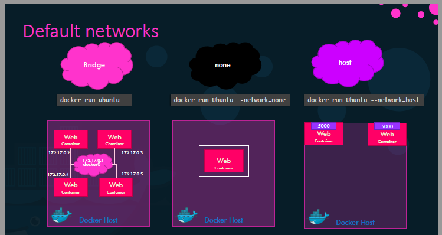

= DevOps - Mumshad Mannambeth
:toc: left
:toclevels: 5
:sectnums:
:sectnumlevels: 5

NOTE: NOTE

TIP: TIP

IMPORTANT: IMPORTANT

CAUTION: CAUTION

WARNING: WARNING

== Docker for the Absolute Beginner - Hands On - DevOps - Mumshad Mannambeth

*Objective*

* [ ] *History*: I have done this course 2+ times. I should be able to revise this with minimum efforts.
* [ ]  *Agenda*: Here the pictures tell the entire story
* [ ]  Exam Notes
* [ ]  *Why OneNote Notes*: Too many screens as notes
* [ ]  *What is Pending*:

=== Section 1: Introduction

=== Section 2: Docker Commands

* Containers are not meant to host an operating system. Containers are meant to run a specific task or process such as to host an instance of a web server or application server or a database or simply to carry some kind of computation or analysis task.

* Once the task is complete the container exits a container only lives as long as the process inside it is alive.

* If the web service inside the container is stopped or a crash then the container exits.

* This is why when you run a container from an ubuntu image it stops immediately because Ubuntu is just an image of an operating system that is used as the base image for other applications. There is no process or application running in it by default.

----
docker run hello-world

docker run ubuntu sleep 5

#background/deteached mode
docker run -d ubuntu sleep 5

#interactive and terminal
docker run -it ubuntu bash

docker ps

docker ps -a

# remove stopped container
docker rm <id>

# remove container image. before removing image, you have to remove all associated containers
docker rmi <id>

# view all the images
docker images

docker exec -it <container name> /bin/bash
docker exec <running-container> cat /etc/hosts

#Attaching back to container.
docker attach <docker-id/name>
----

=== Section 3: Docker Run

* If it is an application which is accepting input, then you have to run image in `-it` mode
[source,shell script]
----
docker run -v /opt/datadir:/var/lib/mysql mysql
docker inspect <container_name>
docker logs <container_name>
----

* Get the IP address of the container. When inside the container host, I can use this IP.
----
docker inspect <docker_name>
----

* After stoping a container, you can start the container.
----
docker stop <container_name>
docker start <container_name>
----

=== Section 4: Docker Images

* Command V/s Entrypoint

*Ubuntu + Java*

* /root/connect2nareshc/FirstImage/Dockerfile
[source,dockerfile]
----
FROM ubuntu:18.04

MAINTAINER Naresh Chaurasia <message4naresh@gmail.com>

RUN apt-get update && apt-get install -y default-jdk
----

[source,shell script]
----
docker build -t connect2tech/ubuntu_java .
docker image ls
docker run -it connect2tech/ubuntu_java bash
docker push connect2tech/ubuntu_java
----

*Python Flask*
* /root/connect2nareshc/PythonWeb/Dockerfile

[source,dockerfile]
----
FROM ubuntu

RUN apt-get update

RUN apt-get install python -y

RUN apt update -y

RUN apt install python3-pip -y

RUN pip3 install flask

COPY app.py /opt/app.py

ENTRYPOINT FLASK_APP=/opt/app.py flask run --host=0.0.0.0
----

[source,shell script]
----
docker build -t connect2tech/python_flask .
docker run -p 5000:5000 connect2tech/python_flask
docker push connect2tech/node_js_app
----

*JPetStore*

[source,dockerfile]
----
FROM ubuntu:18.04

MAINTAINER Naresh Chaurasia <message4naresh@gmail.com>

RUN apt update

RUN apt install -y openjdk-8-jdk

RUN apt install -y maven

RUN apt install -y git

RUN git clone https://bitbucket.org/connect2tech/connect2tech.in-jpetstore

WORKDIR /connect2tech.in-jpetstore

ENTRYPOINT ["/usr/bin/mvn","jetty:run"]
----

[source,shell script]
----
docker build -t connect2tech/jpetstore .

docker create volume jpetstore_m2_repo
#/var/lib/docker/volumes/jpetstore_m2_repo/_data

#docker run -d -p 8080:8080 connect2tech/jpetstore
docker run -d -p 8081:8080 -v jpetstore_m2_repo:/root/.m2/repository connect2tech/jpetstore

http://centos:8081/jpetstore

docker push connect2tech/jpetstore

----

—
*Section 5: Docker Compose*

[source,shell script]
----
#Setting up docker compose
curl -L "https://github.com/docker/compose/releases/download/1.26.0/docker-compose-$(uname -s)-$(uname -m)" -o /usr/local/bin/docker-compose

chmod +x /usr/local/bin/docker-compose

docker-compose --version
----

*Voting App*
* /root/connect2nareshc/docker_compose/example-voting-app
* https://bitbucket.org/connect2tech/connect2tech.in-devops-cloud-architect/connect2techin.in-Voting-App

____

URLs
https://docs.docker.com/compose/gettingstarted/

____

[source,shell script]
----
cd /root/connect2nareshc/docker_compose/python_web

docker-compose up
----

http://centos:5000/

=== Example1: Modified Application

* build image connect2tech/python_web
* Push to docker hub
* Run from the image

----
working dir: /root/connect2nareshc/docker_compose/python_web

docker build -t connect2tech/python_web .

docker push connect2tech/python_web

docker-compose up
----

*docker-compose.yml*

----
version: '3'
services:
  web:
    image: "connect2tech/python_web"
    ports:
      - 5000:5000
  redis:
    image: "redis:alpine"
----

—
Section 6: Docker Registry

'''

*Section 7: Docker Engine, Storage and Networking*

* CLI, REST API, Docker daemon. Now CLI can be on different machine
* cgroup (control group) to allocate resource to container
* 3 Networks: Bridge, none, host
'''

Section 8: Docker on Mac &amp; Windows

Section 9: Container Orchestration - Docker Swarm &amp; Kubernetes

Section 10: Conclusion

