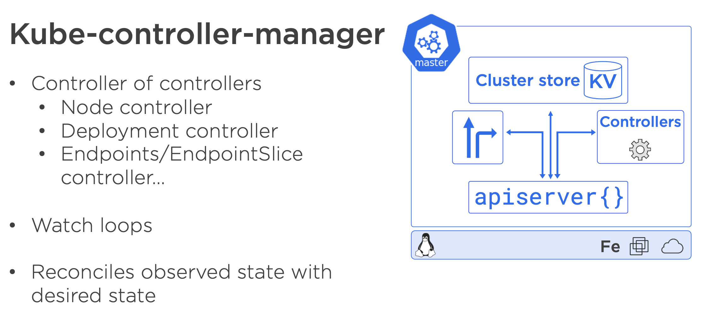
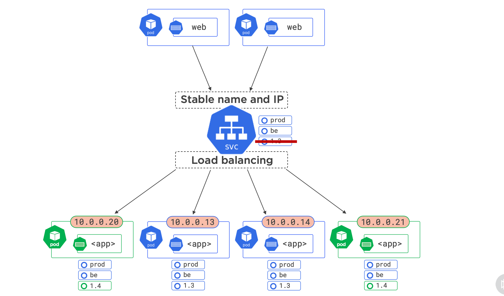

= Kubernetes Nigel Poulton
:toc: left
:toclevels: 5
:sectnums:
:sectnumlevels: 5

== Getting Started with Kubernetes By Nigel Poulton

* https://github.com/kubernetes/community/tree/master/icons
* https://github.com/nigelpoulton/getting-started-k8s

=== Course Overview

==== Course Overview

Getting Started with Kubernetes. This is going to be one heck of a ride. Well, I'm Nigel Poulton. And if you don't already know me, I am a bit of a container geek, but I've done everything from programming to sysadmin to technical architect in some of the most high pressure and demanding environments in the world. But, these days I am all about cloud and containers. I'm a Docker Captain, author of Docker and Kubernetes books, and, of course, I have got a ton of courses here on Pluralsight. But enough about me. What about the course? Well, whether you've got an immediate pressing need to learn Kubernetes for your job or maybe you're just looking to add a string to your bow and stay ahead of the curve, this is the course for you, and no prior Kubernetes experience necessary. It is fast paced, heavy on the demos, crystal clear on the theory, and a lot of fun. And by the end, you absolutely will have everything you need to take your next steps with confidence and power forward in your career. Honestly, your mind is going to be blown with how much you learn. *Speaking of which, we'll deploy an application to Kubernetes, expose it to the internet, scale it up and down, test self healing, and perform a zero‑downtime rolling update and a version rollback*. And when you're done, you'll be itching to take your next steps. So, containers are hot, Kubernetes is hot, and I am excited to get cracking with this Getting Started with Kubernetes course, at Pluralsight. Let's do this.

=== Course Introduction

==== Course Outline

All right, Getting Started with Kubernetes. Now, trust me when I say this, you are at the very start of something amazing with potentially far‑reaching implications for your career. But all good, because make no mistake, the tech world is changing in some really positive ways, and Kubernetes is at the very center of it. Now then, if you're totally new to this stuff, like maybe you're still a bit unsure what a container actually is, then you might want to hit this course first. Now, it's up to you, of course. It's just that I'm going to be assuming for this course that you've already got your head around what a container is and maybe how to spin one up. So if you haven't, maybe hit the pause button here, find this course, and then jump back here when you're all done, because that course covers all the basics and gets you spinning your first container up. Now it's your call, of course. I'm just saying the option is there. Okay, assuming that you're cool with containers, this is how we're going to do things here. We'll do a quick intro to what Kubernetes is. Now for me, this is vital background info that anyone with any experience with Kubernetes has to know. Like, what is Kubernetes, and where did it come from, and what are some of the reasons that we have it? Plus, we'll level set with a bunch of terminology like, what do we mean when we say things like cloud native and microservices? Oh, and as well, what does the name Kubernetes mean and where does it come from, and all of that kind of background stuff. Well, then we'll dive into Kubernetes architecture. Now, this is a full‑on theory module, but I promise it will be absolutely epic. And if you've taken any of my courses before, then you'll already know that I bust a gut, making the theory fun and entertaining. So I highly recommend you watch all of this module. I mean, the whole point is to lay the groundwork for all the hands‑on stuff that's coming later. And then I promise, as you gain experience, you'll find that a solid understanding of how everything fits together and the likes is invaluable. Anyway, then we'll take a look at how to get Kubernetes. The thinking here is just a few quick and easy ways to get your hands on Kubernetes and kick the tires and maybe follow along with the examples. Well, after that, we're up and running. *We'll look at how to deploy apps on Kubernetes using pods, we'll expose an app to the network with services. In fact, we'll even hook it into a cloud load balancer for access over the internet. Then we'll round things out with scaling, self‑healing, zero‑downtime, rolling updates, and a version rollback*, plus, I don't know, any other buzzword that I can think of. But you know what? On the topic of buzzwords, I am well aware that the tech world is littered with them, and I don't know about you, but I hate it when people throw jargon around and assume everyone knows what they're talking about. So any time we hit a buzzword, you'll be getting a crystal‑clear explanation. And actually, if I forget to explain something, or maybe my explanations aren't great, call me out on it, and I'll see if I can fix it. Well, last but not least, we'll wrap the course with a few ideas of what you can do do next. And the amazing thing is, once you have reached this point, you will be well up to speed with Kubernetes and properly prepared to take all of your next steps, like the transformation from what you know now to what you'll know then is going to blow your mind. Now, before we crack on, some really quick housekeeping. All the code and examples that we're going to be using in the course are in the course's GitHub repo here. Now GitHub, fair play, right? You might not be sure what it is. If that's the case with you, no sweat. We're not going to be using it heavily, and when we do, I'll be sure to explain how to use it. *Also, throughout the course, I'm going to be using the Kubernetes icons from here*. These are pretty much the industry standard for Kubernetes diagrams these days, so I want to give a big shout out to the folks behind them. And this is always an interesting one. Usually I recommend that people listen to me at probably at least 1.2 speed, but maybe even up to 1.4 or 1.5 speed. That way you get to listen to my annoying voice a bit less, but it also helps you tick through things more quickly. Though I will say, sometimes if concepts are new to you. Listening to me at 1.5 speed doesn't always give you a lot of time to let things digest. So the option is there. You can by all means play me at a faster speed. Just be aware that sometimes if something's new to you, it might be a bit better to listen to me at normal speed. Your call, though. And I think with that we are good to go, though I'll say this one last time. Feel free to reach out to me if you get stuck, and I will do my best to help, Well, let's get this show on the road.

=== What Is Kubernetes?

==== What Is Kubernetes?

All right, So what even is Kubernetes? And I'm going to split this into two. We'll start out with, like, I guess the DNA. I mean, I don't know if that works, but I mean things like where did Kubernetes come from and what does the name even mean and stuff like that. And I know it's not the fun technical detail, but it is a vital part of any journey to Kubernetes mastery, so stick with me and learn it. Well, after we're cool with all of that, we'll talk about what Kubernetes actually does and why we have it. So first up, Kubernetes came out of Google, which kind of has this movie trailer ring to it, yeah? Duh‑Dun, Kubernetes, spawn from the bowels of Google, rising from the depths of the most hyperscale datacenters in the known universe, duh‑d‑d‑duh‑duh, d‑d‑duh‑duh, d‑d‑duh. You know? No, probably not. Never mind. It is true, though. Kubernetes was born out of Google. But in the summer of way back in 2014, like before I had gray hairs in my beard, it was open sourced and handed over to the Cloud Native Computing Foundation. And honestly, since then, it's been nothing short of a meteoric rise to the top. *Like, love it or hate it, there is no doubt that it is one of the biggest and most important open source technologies on the planet*. Like I don't know, it's burning so hot and its future so bright, if you stare at it for too long, you're going to damage your eyes. *Well, look, like most cool cloud infrastructure projects, it is written in Go, or Golang.* And actually it lives on GitHub at kubernetes/kubernetes. And if you're hands on with code, you should definitely get involved. *Anyway, it is also actively discussed on the IRC channels, you can follow its account on Twitter, this here is a pretty good Slack channel, and there's tons of meetups and gatherings all over the planet*. Oh, yeah, and of course, there's yours truly here and the other Pluralsight authors that also have courses. Okay, well, there's a good chance you'll hear people talk about how Kubernetes relates to Google's Borg and Omega Systems, so what's the crack with that? Well, it's no secret that Google's been rocking its own infrastructure on containers for years. I mean, it's widely known that Google churns through billions of containers a week, running things like Gmail and Search and pretty much most of their apps. And yes, you did hear that right. That was billions with a b. Well, pulling the strings at Google and keeping all of those billions of containers in check are a couple of in‑house projects called Borg and Omega. So I guess it's not a huge stretch to make the connection. After all, *Kubernetes is also about managing containers at scale*. However, and this is important to know, Kubernetes is not an open‑source version of either of those, but they are related, so it's more like, well, actually, yeah, it's more like they share a bunch of DNA and family history. So let's say in the beginning was Borg and Borg became Omega, or spawned the idea or genesis of Omega, and then Omega led to the idea of Kubernetes. But the three of them are separate systems; they just share that common DNA and heritage. So, and I'm waffling, but to be clear, Kubernetes absolutely was built from scratch from the ground up. It just happened to leverage a ton of stuff learned from Borg and Omega. And as well like you might expect, a bunch of the people that built Borg and Omega also built Kubernetes. Anyway, what else? We've got that it came out of Google, got a lot of its DNA from Borg and Omega, it's open source under the Apache 2.0 license. And, oh, yeah, version 1 shipped, wow, way back in July 2015. So it's not exactly young these days. Now, I get that it has this feel of being shiny and new and all bleeding edge and stuff, and well, it is, but it's not like it's some 1‑year old project or anything. Oh, yeah, the name Kubernetes doesn't exactly roll off the tongue, well, not like Borg and Omega. But the name is rich in meaning. So the word Kubernetes, and that's how we generally pronounce it. Well, it comes from the Greek word meaning helmsman. That's the person that steers a ship. And the logo here, obviously, that is the helm of a ship. And the more you get into this, the more it'll make sense because you'll start to realize the entire container ecosystem seems obsessed with nautical jargon and nautical references. Now then, uh, oh, now, I love this. Way back in the early days, Kubernetes was provisionally named Seven of Nine, which, if you know your Star Trek, you'll know that Seven of Nine is a rescued Borg drone. Link to Borg? Well, copyright laws put a stop to that ever being a thing. But the seven spokes in the logo here are a tip of the hat to Seven of Nine, which is a pretty nice touch, in my book. Anyway, look, time is important. So the last thing I'll say before moving on is that you'll often see Kubernetes shortened to this, pronounced as K8s, the idea of being the number 8 here replaces these 8 characters in between the K and the s. And that's it. And look, I know some of it might feel a bit like waffle, and you might be wondering if you really need to know this. But like I said at the start, I really think you do. There are no Kubernetes experts out there that don't know all of this. That all said, though, there's no point knowing this fluffy and admittedly less important stuff if we don't know the more important stuff as well. So next up, what actually is Kubernetes, and what does it do?

==== Kubernetes What and Why

Okay, what is Kubernetes, and why on earth do we have it? Now like I said in the intro, I am assuming at this point you know a bit about containers. If you don't, I highly recommend you take this course here. What I'm also assuming is you've got an idea of some of the challenges that containers bring, as well as many of the impacts that they're having on how we think about the data center and its resources. Well, generally speaking here, containers make our old scalability challenges seem pretty laughable, and I'm putting that mildly. I mean, we've already talked about Google's billions of containers a week madness. But I know, I know. I'll hold my hands up straightaway and say, yeah, Google is Google. And true, the vast majority of companies are about as much like Google as I am like Cristiano Ronaldo on a football pitch, so not even remotely similar. Well look, it is true that if your legacy apps had tens or hundreds of virtual machines, there's a pretty solid chance that your modernized containerized apps are going to have thousands of containers. And if that's the case, I can tell you right now you're going to need something to help you manage them. Well, say hello to Kubernetes. Now another thing I want to mention is that we've kind of abandoned this traditional view of the cloud and of your data center as a collection of computers in favor of the more powerful idea that the cloud or your data center is a computer like a giant one. So if we look at a computer, and I'm keeping it high level, but it's got processing cores, high speed memory, slower persistent storage, and networking. And for the most part, application developers are not bothered which CPU core, for instance, or memory DIMM that they're application is using. We just let the operating system look after all of that. And you know what? It works an absolute treat, and the world of application development thrives on this principle. So it's only natural to take it to the next level and treat your cloud or your data center in the same way. So what am I saying? Well, instead of caring which VM or compute instance to run all of your application bits and pieces on, instead of that, let's have something like a cloud OS to take care of all of that for us. Well, I'm sure you get this. Say another hello to Kubernetes. So what I'm saying is we can basically say hey, Kubernetes, I've got this app, and it consists of whatever, these different services. And you know what? Just run it for me, please. And Kubernetes does that. It goes away and does all the hard stuff for us. Now, I don't know, if you like analogies, it's a bit like sending packages via a courier service. So in that situation, we pack up whatever we're sending, obviously according to the courier's packing specifications, we label it with some information, and we just hand it over to the courier, and that's us done. All the decisions of which routes to use or routes and which planes and highways and all that kind of jazz, all outsourced to the courier. *Well, it's kind of the same with Kubernetes. We package our apps as containers, describe them in a declarative manifest, and just give it to Kubernetes. Then, of course, behind the scenes, Kubernetes does all the hard work of look whatever, deciding what nodes to run stuff on and how to pull and verify images and start containers and attach to networks and all that complexity*, right? I'm not bothered. Kubernetes just takes care of it. And as we'll see as we crack on with the course, it is a beautiful thing. Now we're super high‑level right now, but yeah, that's pretty much it. *Kubernetes is the leading tool for managing containerized applications at scale, what we sometimes call, here we go, cloud‑native microservices apps*. And on that note, I am fully aware that there are a ton of buzzwords in the industry, and they can be confusing. So next up, we're going to define what exactly is a cloud‑native microservices app.

==== Quick Jargon Busting

Okay, let's do this, and it's going to be quick. Back in the day, like before I had gray hairs in my beard, we built applications as monoliths. In fact, that's probably what gave me the gray hairs. Anyway look, a *monolith* is just techno jargon for a massive honking application with all of the code and clevers bundled into a single giant program. Well, that model had its issues, and it is being replaced by cloud‑native microservices apps. Only and actually let me flip that, and I'll mention the microservices bit first. So the monolithic app did lots of different things, maybe reporting, logging, authentication, inventory, you name it. It just all happened to be built and shipped as this single monolithic unit. Well, each of those little different things that it did is called an application service or just service for short. Well, microservices just takes all those different services and breaks them out into their own little apps, hence the name microservices. Now the overall application experience is the same. I mean, it's the same features as before. They just happen to be a lot more loosely coupled in this model. Now on the positive side, each of these little microservices can be developed, built, and shipped independent of all of the rest. Plus, they can be scaled independently, updated, and even patched independently. The overall model just offers way more flexibility. But I'll be honest, there can be a cost in complexity. I mean, keeping all these things connected and talking and even keeping the different development teams talking and on the same page, well obviously that's going to have its challenges. *But in a nutshell, that's microservices. Now the cloud‑native bit, that means it's all scalable, dynamic, loosely coupled via APIs. But really importantly, it means it can run anywhere. So I always stress this. Cloud native does not mean an application that will only run in the public cloud. In fact, I'd even say a core tenet of cloud native is the ability for an application to run anywhere that you have Kubernetes. So that can be a public cloud, of course, it can be a private cloud, or even a more traditional cluster of Kubernetes nodes in your own on‑premises data center. So cloud‑native apps run anywhere that you have Kubernetes*. And you know what, that'll do for now. If you feel like you need more detailed information, go and check out this course. Now then, look. If some of this seems a bit out there and, I don't know, maybe you're like, what is this guy on about? Trust me. Stick around because I promise you, by the end of the course, you'll be like it all makes total sense to me now. Okay, well, I'll tell you what. Time for a quick disclaimer. Kubernetes and the cloud are both moving frighteningly close to the speed of light. And if you snooze, you'll lose. So crack on with the course, get on the Slack channel, get along to a local meet up, reach out to me. But most importantly, crack on with the course and then get your hands dirty and just play with it. It is a skill that will pay you huge dividends in the future. Anyway, look. Next up, this is where the real learning starts. Next up, we're going to dive into Kubernetes architecture. And I'm telling you, you're going to love it.

=== Kubernetes Architecture

==== Module Overview

Okay, this is the good stuff. And I hope you're excited because at the end of this module, you will absolutely know the major components of both a Kubernetes cluster and how it manages apps. Anyway, here's the plan. We'll start off with a view from 100,000 ft because I think it's really important to have a proper big picture view of everything before we dive in deeper. Anyway, once we've got that bigger picture, we'll start looking at things a bit closer. Maybe, I don't know, 50,000 ft or whatever. But we'll start out with the infrastructure bits first, so masters and nodes. Then, we'll switch tack a bit, and we'll look at the bits of Kubernetes that we use to deploy and manage apps. And seeing as how Pods are the most fundamental and atomic unit of scheduling work on Kubernetes, we'll start out with those first. Then, we'll look at how we expose apps on the network with services, and we'll look as well at how Kubernetes deployments let us do cool and important stuff with our apps, things like scaling and rolling updates and version rollbacks. And I know we haven't even started, and I'm already throwing the buzzwords around, but don't worry. We'll explain every one of them as we crack on with the course. And we'll finish up with a quick chat about what the heck the Kubernetes API is and the API server. Oh, and of course, we'll wrap the module up with a quick fly‑by recap. It'll be a great way to tell whether you grasp the concepts we've covered so far, so don't skip that out. Now, okay, go on then. One last thing before I go. This is a getting started course here so we're not going to be covering everything that Kubernetes can do. I mean, not even close. But we absolutely will cover more than you need to get on your feet and taking your first steps. You're going to love it honestly. So listen, get a pen and paper, flip yourself into learning mode, and let's get our heads around the big picture architecture stuff.

==== Kubernetes Big Picture View

So at the highest level, Kubernetes is an orchestrator of microservices apps, and like we said a minute ago, microservices app is just a fancy tech word for an application that's made up of lots of small and independent services that work together to create a useful application. And, yeah, that's fine, right, but what is this orchestrator buzzword? Well, tell you what, let's draw a picture. In fact, actually, as I hate PowerPoint, let me just steal one from one of my Docker courses. Okay, here we go. In the real world, a football team or a soccer team, right, depending on where you live in the world, is made up of individuals. Now, no two are alike, and each one has a different skillset and a different role to play in the team. So, maybe some sit back and defend, some push forward and attack, some are great at breaking down plays, some are creative, some are quick, you know the score. Forgive me, that was bad, the score. Anyway, right, the point is, there's a bunch of individuals with different skills and abilities. Well, along comes the coach, and she or he gives everyone a position and a responsibility. Basically, they organize all of these individuals into a team, and we go from this absolute mess here to this average formation, something that at least looks like it's got a fighting chance of winning a game. Well, you know what, as well as that, the coach also makes sure everyone sticks to plan, so holds the formation and does their job. Plus, they replace injured players and make other on‑the‑fly decisions as they react to a constantly changing situation. Well, guess what, and I'm not kidding here, but microservices apps in the Kubernetes world, they are just like that. Seriously, stick with me, okay. We start out with an app made of multiple services, each packaged as a container, and we're massively high level at the moment, right, but each one is different with a different job in the overall app. So we've got, like, load balancers, web servers, logging, the whole picnic. And Kubernetes comes along, a bit like the coach in the football analogy, and organizes everything into a useful app, so on the right networks and ports, and with the right secrets, credentials, you name it. And what we end up with is a useful app made up of lots of small, specialized parts, and we call this what Kubernetes is doing orchestration, so it's orchestrating all of these pieces to work together, kind of as a team. There you go, told you. Anyway, look, I know big pictures are easy, so how do we actually make this happen?

#High Level. How it Works. Commit to Memory#

image::nigel-poulton-k8s/k8s-architecture.png[]

Well, we start out with an app, and we package it up and give it to the cluster, the cluster being Kubernetes and being made up of one or more masters and a bunch of nodes.

So let's just say the masters are like the brains of the cluster, like they're always making the scheduling decisions and things like that. And, I don't know, if you're like me and you like to try and sound intelligent, then the stuff that runs on the masters make up what we call the cluster control plane. Very intelligent sounding. Anyway, look, it's just clever talk for the stuff that monitors the cluster, makes the changes, schedules the work, responds to events, all of that jazz, right. It is all done by the masters that we sometimes call the control plane.

Well, the nodes then are where we run our user or our business applications. And, of course, they do stuff like report back to the masters and watch for new instructions. Now, look, we're in kindergarten right now. It really looks like this. I love the detail and we'll cover it all later, but I think for now this is enough. That's our physical infrastructure stuff, masters and nodes.

#*But, at the start we said something like, we package the application and give it to the cluster. So to do that, we take our app code and containerize it, like make it run as a container. Well, then we wrap that in a pod, seeing as Kubernetes needs containers wrapped as pods, detail to come later. But then if we want things like scaling and self healing, we further wrap that pod inside a deployment*#. Head‑spinning stuff, yeah? Don't worry, though, you're not supposed to understand it all yet. I mean, look, if you do, magic, but if it's all feeling a bit much, don't worry, stick around, it is early days yet, and I'm just seeding ideas for later.

For now, *I'm just going to say we define all of this kind of stuff in Kubernetes YAML file, which is basically just a way to describe what the app should look like to Kubernetes, so things like what container image to use, and what ports and networks, how many replicas, all of that kind of stuff, in a file. We then give that file to Kubernetes on the master here, and the master makes a persistent copy as a record of intent, and goes to work making it all happen, and it's incredibly powerful*. Well, you know what, look, that's the 100,000‑foot view. Should we start digging a bit deeper? Heck, yeah, let's do it.

==== Kubernetes Masters

TIP: For now don't stress too much about it. Just highlight what is important and keep moving.

Okay, masters. Now, on the terminology front, like we've said before, we quite often *call the masters the control plane*. So, masters, head nodes, control plane, it is all just jargon for the same thing, brains or the intelligence of the cluster. Now, as the masters are effectively in charge of running the cluster, you can guess it's kind of important that they're always available. *So, multi‑master control planes are most definitely a thing. In fact, you should never deploy Kubernetes to production without a highly‑available multi‑master control plane*. Now, Kubernetes is cool and all, but it doesn't change the normal rules of high availability. So, you pick an odd number, and you most definitely stick them in different failure domains that are connected by fast, reliable networks. I mean, sticking them all in the same data center rack under the same dodgy air con unit, that is an automatic nomination for a Darwin Award, and you should, at the very least, expect to lose your job. *Now, on the topic of how many masters to have in your H/A config, for the most part, three is the magic number*. Five is an option, though if you're really paranoid, but going more than five, that can start to increase how long it takes the cluster to reach consensus. Which, if you're not familiar with consensus, just think about being out in a group and deciding where to eat. If there's three of you, it's easy, right? But if there's like 23 of you, you probably spend half the night trying to decide, and it's not massively different with cluster consensus.

So, three is the magic number for most people. Five's good if you need a bit more resilience, and one is better than two, actually. So, yeah, wait a minute. One is better than two? Oh, yeah, well, let me explain. This comes down to avoiding a condition called *split brain and deadlock*. So, imagine a control plane here with four masters, and if the network between them goes down or partitions like this, we've got a deadlock. So, all four knew there used to be four, but none of them can reach more than two, which is a problem because if none of them can be sure that they can communicate with the majority, then the cluster goes into read‑only mode. I mean, look, your apps will continue to work, but you won't be able to change or update anything. Now, if you had three masters in this scenario, then this side over here knows it has a majority. So it'll elect a leader, and the cluster carries on at full throttle with this one over here, obviously knowing it does not have a majority. But, this is a rabbit hole. I mentioned leaders. So, despite the fact that multi‑master H/A control planes are a thing, *Kubernetes operates an active‑passive multi‑master model. So, loaded jargon there, right*? This is just where only one master is ever actively making changes to the cluster. We call that one the leader, then the others are followers, and they proxy any connections or requests across to the leader. Then, of course, yeah, if the leader goes down, then these followers come together and elect a new leader. *Anyway, right, if you're building your own cluster, you need one or more Linux machines to run your masters*. Now a couple of things to mention. They do need to be Linux machines, by the way, yeah, but they can be pretty much anything anywhere. Like Kubernetes couldn't care less if they're bare metal physical servers in your on‑prem data center or virtual instances in the public cloud. So long as you use a modern version of Linux and you connect them with good, reliable networks, then Kubernetes is cool with it. Now, the other thing to note is that every master actually runs a bunch of smaller services that's each responsible for a single control plane feature. It's microservices, yeah. Now, as things stand, every master runs every master component. So, an H/A setup with three masters, then all three are running every control plane service. Now then, in a cluster that you build yourself, you get to choose how many masters, and where they get located, and all of that goodness. But in a hosted Kubernetes platform, the masters are hidden from you, and they're out of your control. So, let me back up for a second. *Hosted Kubernetes is where your cloud provider runs Kubernetes for you as a service*. You basically get an API endpoint, and the mechanics of how the control plane is built, and all the performance, and the H/A, and sometimes even the upgrades and the likes are taken completely out of your hands. It's a service, right? So, you must understand, in this situation, you are making a conscious decision to outsource your Kubernetes control plane to your cloud provider, and for a fee, of course. But, in return, you get a so‑called production grade cluster with pretty much zero effort on your behalf. And for a lot of people, it is a great model. *So, Google Kubernetes Engine, GKE, and Azure Kubernetes Service, AKS, and AWS Elastic Kubernetes Service, EKS, are the big ones, right*? But loads of others exist. Now then, it is generally considered a good practice not to run user or business applications on the masters. And in fact, if you're using a hosted Kubernetes service, you've got no choice in the matter because you can't even see your access to masters. But, yes, generally speaking, you should run user apps on the nodes or the worker nodes and leave the masters to concentrate solely on looking after the cluster. It's about lines of demarcation, and you know what, it keeps things clean and simple.

So, tell you what, after all that blabber, let's look at the specialized bits that make up the master.

And first up is the API server, and this is a biggie, right, as this is the gateway to the cluster. In fact, actually, it's the only master component that anything should be talking to. So, when we issue commands to the cluster, yeah, we're sending them to the API server. But even cluster nodes and the apps that are running on the cluster, if they need to communicate with anything on the control plane, they come in through the front door just like the rest of us by talking to the API server. In fact, you know what? Even the different bits of the control plane here, so all the different control plane services, when they talk to each other, they do it via the API server. Well, okay, like all good things these days, it exposes a RESTful API over a secure port, and it consumes JSON and YAML. And in the case of us as users deploying and managing apps, we send YAML manifest files describing our apps to the API server. The API server authenticates, authorizes, and validates it, and then it instructs the other control plane features to deploy and manage it.

---

---

Oh, okay. Alright, next up, the cluster store. Now first up, this is the only persistent component of the entire control plane, right? And, as the name suggests, it is where the config and the state of the cluster itself, as well as any apps running on it gets stored. Now, right now, it's based on the etcd distributed NoSQL database. Those words again, gosh. Now, you can swap it out for something else if you want, but that's a pretty advanced thing to do. Anyway, look, it is super critical to cluster operations, and you know what? In large, busy clusters, it's probably going to be the first thing that's going to come under pressure. And believe me, that's no disrespect to etcd. It's just a fact that doing distributed databases at scale when there's lots of changes going on is hard. So, okay, if you plan or expect your clusters to be large and busy, like lots of change going on, then you will definitely want to look at splitting out the cluster store bit onto their own set of highly‑available infrastructure. Oh, and, of course, you should have things in place for backup and recovery and be regularly testing them.

---

---

Alright, what next? Oh, yeah, the controller manager. So, this is like a controller of controllers, if you will, a bit of a mini monolith, actually. Anyway, look, inside of it, we've got a bunch of controllers that are each responsible for something different. So, there's like a node controller in charge of nodes, yeah. A deployment controller in charge of deployments, endpoint controllers, namespace controllers. There's pretty much a controller for everything in the cluster. And you know what? We'll be looking into this in more detail in a second, but each one basically runs as a reconciliation loop, watching the bits of the cluster that it's responsible for and *looking for changes with the aim of the game being to make sure that the observed state of the cluster matches the desired state*. And right now, like we said, they're all managed by the overall controller manager. Well, last but not least, we've got the scheduler. This watches the API server for new work, applications, yeah, and it assigns it out to nodes.
---

Only, we are doing it a huge injustice because it's actually pretty complex, and it has to chew on a lot of things when making scheduling decisions, so things like affinity and anti‑affinity, constraints, taints, resource management. The buzz words I know, but the point I'm making is there's quite a lot for the scheduler to consider. But you know what? That's enough for now, right?

The masters or the control plane are the brains of Kubernetes. #*Commands and queries come into the apiserver here, usually via the kubectl command line tool. Well, they get authenticated and authorized, and then, well, let's say it's a command to deploy a new application. The desired state of the app gets written to the cluster store as a record of intent, yeah, and the scheduler farms the work out to nodes in the cluster. Okay, brilliant. Once that's done now, various controllers sitting in watch loops, observing the state of the cluster, and making sure that it matches what we've asked for, and that is the crux*#. Now, there's loads more detail and plenty of examples coming as we crack on with the course. Right now, though, let's go and take a look at worker nodes.

==== Kubernetes Nodes

Okay, well, straightaway we can see that nodes are a bit simpler than masters. So there's basically three components that we care about, *kubelet, the container runtime, and the kube‑proxy*. So first up the kubelet, and let me be really clear about this. The kubelet is the main Kubernetes agent that runs on every cluster node. In fact, we sometimes use the terms node and kubelet interchangeably. Anyway, you start with a Linux or Windows machine because, yes, nodes can be Linux or Windows these days. But they can be physicals, VMs, cloud instances, you name it. You just install the kubelet. This registers the machine as a node in the cluster and effectively adds its CPU, RAM, and other resources to the overall cluster resource pool. Net net, the scheduler can intelligently assign work to the node. Now speaking of work, and we'll get to this shortly, but work on a Kubernetes cluster comes in the form of pods and detail to come remember. But right now, just think of a pod as one or more containers packaged together as a single deployable unit. Well, it's the job of the kubelet to constantly watch the API server on the master for any new pods assigned to it. When it sees one, it pulls the spec and it runs the pod. But it also maintains a reporting channel back to the API server to keep the masters in the loop. No pun intended, right? Remember control loops. Anyway, it's the kubelet's job to keep the masters appraised of the state of the cluster and any running apps. Okay, well, we said that the kubelet runs pods and that pods are one or more containers, meaning if we strip everything away, it's all applications running in containers. Only Kubernetes and the kubelet don't know how to run containers. They don't know how to pull image layers or talk to the OS kernel and build and start containers.

---

---

So for all of that stuff, it uses a container runtime. Now in the beginning, this container runtime was always Docker, and quite often it still is. But this whole component is actually plugable via something called the Container Runtime Interface or CRI. So to cut a long story short, for the most part, this container runtime that's got all the smarts on how to start and stop containers and the likes, for the most part, it's going to be Docker or containerd. But it's plugable, and there's plenty of others out there that support Kubernetes and the CRI. In fact, as a homework assignment, grab a notepad or something because I recommend that you Google gVisor and Kata Containers. Now look, other container runtimes exist, but these are a couple that'll give you a decent idea of some of the features and differences between the different ones out there. That all said, whichever container runtime you use, they are what takes care of the low‑level sort of stop and start container stuff. Sweet.

Well, the last piece of the node puzzle is the kube‑proxy, and *this is like the network brains of the node*. So for one thing, it makes sure that every pod gets its own unique IP. And yes, that is one IP per pod. *So if you're running multi‑container pods, so pods with multiple containers in them, all of those containers share the pod single IP*. Now I may be getting ahead of myself a bit here, but this means you're going to have to use ports if you want to reach individual containers inside the same pod. But like I say, I'm getting ahead of myself. Though, actually, you know what? Yeah, let's do that. Let's get a bit ahead of ourselves.

---

---

So the kube‑proxy does lightweight load balancing across all of the pods behind a service. I can tell I'm going to regret this already, right? So a service is a way of hiding multiple pods behind a single stable network address, a bit like a load balancer. So let's say we've got a bunch of web pod servers here, and they're all talking to a back end down here. Only we put the back end behind the server, so a single IP and the likes. Well, we configure the front end to talk to the service, and the service balances incoming requests across all pods behind it down here.

Well, the kube‑proxy plays a major role in load balancing that traffic. And you know what? I reckon that's nodes. So the kubelet is the main Kubernetes agent on every node. It registers the node with a cluster, and then it watches the API server on the master for new work assignments. Sitting next to it is a container runtime that does all the heavy lifting of building and starting containers. And for the most part, we said that's going to be containerd or maybe Docker, but others do exist. Now, oh actually, yeah. While there's work running on the node, it's the job of the kubelet to maintain a reporting channel back to the control plane. But then last but not least, there's the kube‑proxy, which does all the networking magic.

But there's actually something else, and this might blow your mind. I know what did with mine when I first saw it. And we'll talk about it actually a little bit more in the getting or installing Kubernetes section when we cover hosted Kubernetes. But for now, you need to know that some *cloud services provide nodeless Kubernetes*. So that is Kubernetes without any nodes. So yeah, nodeless Kubernetes. And if you're like me, you'll be like you what? How is that going to work? I mean, I've just spent the last few minutes telling you that nodes are where business apps actually run. Well, a lot of cloud platforms these days already have a hosted container platform, so a service where you just run container workloads and you don't have to spin up any VM instance or anything like that to run your workloads on. You literally just have a containerized workload, and the cloud runs it for you. And from a developer and an admin perspective, it can be a pretty sweet. You literally forget all about that low‑level infrastructure stuff, and you just let your cloud provide a service to run your work. And of course, you only pay for what you run. So no more paying for nodes when they're not running any work on them. Well, as I'm suggesting, some clouds provide that for Kubernetes. You post your app configuration in standard Kubernetes YAML files to your Kubernetes API server on their cloud, and the cloud just runs them. And it most definitely can be brain melting stuff, right? But if it is hurting your head, put it on your shelf for now. We'll come back to it when we look at how to build Kubernetes. Oh yeah, good stuff. Well, I reckon that's the clustery sort of infrastructure bit done, and we're about to flip our attention to the stuff that actually runs our applications. But I want to do kind of a halftime show first on desired state and the declarative model of Kubernetes users because, let me tell you, this is absolutely vital to Kubernetes and all this cloud‑native microservices stuff. So here goes.

==== The Declarative Model and Desired State

Right, like I said, I want to stress the absolutely fundamental nature of two things in Kubernetes, like without these, Kubernetes is nothing. Well, I am talking about the declarative model, and the concept of desired state. So, first and foremost, Kubernetes operates on a declarative model; I love it, jargon, but all this means at a high level is that we give the API server a manifest file that describes an end state. Now, for us, that's going to be what we want the cluster and our apps to look like, and we call this end state desired state. Now then, it's important to understand this manifest is not a long list of commands to run to get to the desired state. No! It is a description of what things should look like. Now, I don't know how clear that is, right, but it will become clear as we crack on. For now, we post that manifest or the desired state, yeah, to the API server. Then, it's up to Kubernetes to do whatever is necessary to get us to that desired state or end state, yeah? Well, look, maybe a quick, cheesy analogy. It's a bit like getting a building contractor in and saying, right, we want, I don't know, a new kitchen at the back of the house. We want it to be open plan to the eating area, and let's hook it into the under floor heating. We want a load of glass on the south‑facing wall overlooking the garden. We want a door to the garage. I don't know, we want a big island in the middle, and you know what? Let's have a roof garden on the top as well, right? I'm just making this up, right? But it's pretty high level, and it's describing what we want, desired state, yeah. Well, what it is not doing is saying, okay. knock down this load‑bearing wall here and slap a steel support beam in, and dig a foundation of like 3 feet deep or whatever, we'll have 30 courses of bricks on a double‑skinned wall with pins every, like 18 inches. We'll have 25 ml pipes for the under floor heating; blah, blah, blah, blah, blah, blah, blah. It's not saying any of that. It's just describing what we want. In fact, long job lists like that are what we call the imperative way. Anyway, look, that analogy only goes so far, right, but you get the point. You describe what you want the cluster or the app to look like, and Kubernetes takes care of all of the hard work of, I don't know, choosing which node to run stuff on, pulling and verifying images, starting containers, building networks, protecting secrets, all of that jazz. We don't have to care about that. *We know what we want, yeah? But we don't want to care about how to get there*. *Now, this method of describing desired state is called the declarative method*. So you're declaring what you want. The method, like we said, of providing long lists of commands and actions to perform, is called the imperative method. Now, while Kubernetes does actually support both, it strongly prefers the declarative method, as do I, and you'll see why soon. Anyway, right, look, to do all this declarative stuff, we post manifest files to the API server that describe the desired state of applications in the cluster. It's a record of intent, yeah, and that's good and all; only, after things are up and running, things can still go wrong, or maybe something changes, yeah, and when that happens, it is totally possible for the actual observed state of the cluster to vary your drift from that desired state. Who knows? I mean, maybe a node fails, or maybe even we intentionally change the desired state. *The point is, any time observed state diverges from desired state, Kubernetes gets all panicked, like, ah, this is not right, I must reconcile*! And it doesn't rest until observed state is back in sync with desired state. So what you've got is what you want. Now, maybe a quick example. Let's say we've got a desired state that says we always want three instances of a web front end Pod running, and right now we've got three nodes with one of those three Pods scheduled to each, and that's magic, right? We want three and we've got three. So Kubernetes is all relaxed and chilling out. But, what if, horror of all horrors, one of those nodes goes down? Well, desired state still says three Pods, please, but observed state is like, uh‑oh, only two Pods. And I'm telling you, this is like torture for Kubernetes, because Kubernetes is obsessed about observed state matching desired state. So, it leaps into action and fires up another Pod on one of the two surviving nodes, or maybe it brings up a new node, and it puts the Pod on there. The point being, observed state is brought back into sync with desired state, and Kubernetes can chillax again. And look, I totally get that that probably sounds simple, but I'm telling you, it is outrageously powerful, and it's at the very core of how Kubernetes operates. So make sure it sinks in. We never interact imperatively with Kubernetes, or we shouldn't, right? *We give it a declarative manifest that describes how we want the cluster and our apps to look. This forms the basis of the cluster's desired state, it all gets persistently stored in a cluster store, and the work gets scheduled to the cluster. And boom! Desired state is both recorded and implemented*, but then in the background, the control planes running all of these controllers that are basically reconciliation loops, constantly checking that the current observed state of the cluster matches the desired state, and when the two match, it's all peace and bliss, but when they don't match, it is all hands on deck until they do. But, I mean, all Kubernetes hands on deck, yeah, because the whole point is, Kubernetes does this without even involving us, and with that firmly stored in our heads, let's go and look at the most fundamental unit of working Kubernetes, the mighty Pod.

==== Kubernetes Pods
Right. In the VMware world, the atomic unit of deploying is the virtual machine; in the Docker world, it's the container. Well, in the Kubernetes world, it's the Pod. Now let's be 100% clear about this. *Yes, Kubernetes runs or orchestrates containers, only those containers must always run inside of Pods*. So thou canst not deploy a container directly onto Kubernetes. You see, a container without a Pod in Kubernetes is a naked container, and Kubernetes has pretty strict views on the nudity. Now, obviously, I'm kidding, and I don't know, maybe I'll edit that out. I just thought maybe it will help you remember. Now anyway, look, you can absolutely run multiple containers in a single Pod, and in fact, you'll do this a lot as you increase in your experience and your skill. In fact, look, I've got this course here that goes into all of that in glorious depth, right? So maybe take a note of the name of that course when you want to take your skills further, and I know, literally the longest name ever for a course, yeah? Don't ask. *Anyway, what is a Pod? Well, at a really high level, it's just a thin wrapper that Kubernetes insists every container needs, but more technically speaking, a Pod is a shared execution environment. So let's unpick that. An execution environment is basically a collection of things that an app needs in order to run. So maybe an IP address in a network port, and a file system, and I don't know, some shared memory. Well, every Pod gets an execution environment, or actually, every Pod is an execution environment*. *Then, the containers running in it share that environment. So if you do happen to be running multiple containers in a Pod, they all share the Pod's environment*. *So I don't know, let's say you have two containers in a Pod. They both share the Pod's IP, so they have the very same IP address, which means if you want to connect to either of them from the outside, because they're both on the same IP, you're going to have to map to them using unique ports*. *And as well, inside of the Pod, if those containers need to talk to each other, they can use those same unique ports over the Pod's localhost interface*. Look, the same obviously goes for volumes and everything else, yeah? All containers in the same Pod share the same resources. So if you've got a use case where two containers need to share maybe the same volume, or maybe the same memory, yeah, go ahead, whack them in the same Pod. However, right, if they don't absolutely need to be tightly coupled like this, then stick them in separate Pods and loosely couple them over the network. And I'll say, for the most part, that's what you're going to do, because running two containers in the same Pod is usually for specialist use cases.

Well, let me be extra crystal clear about something here, right? The unit of scaling in Kubernetes is the Pod, so if you want a scale part of your app, you do it by adding and removing Pods. Like you never scale by adding more of the same containers to an existing Pod. No, that's not how it works. You want to scale up part of your app? Add more Pods. Want to scale it down? Remove Pods. So multi‑container Pods are for two different, but complementary containers that need to be intimate.

In fact, a really common example these days is a #*service mesh*#, which at a high level, typically injects an additional container into every Pod deployed to a cluster. It's then the job of this injected service mesh container to sit in between the main app container and the network, so that it can do things like encrypt and decrypt traffic coming in and out of the Pod. Plus, it connects both telemetry and does other cool networking stuff. Point being, though it is all done by injecting an additional container into a regular application Pod for the purposes of providing enhanced services. So, a different, but complementary container that augments the main application container. Well, let's tie this back to the idea of Pods being atomic, and again, there are two things I want you to know here.

*First up*, Pod deployment is an atomic operation, so it's an all‑or‑nothing job, and by that, right, I mean that the Pod only shows up and running and available for service once all of the containers in it are up and running. So it's never going to show as ready and start accepting connections while maybe only some of its containers are up.

[.line-through]#Well, the *second thing* I wanted to mention, now I remember, I nearly forgot;# the second thing is that containers in a Pod are always scheduled to the same node, and that makes sense, yeah? Remember, we've just said it is a shared execution environment. So shared IP volumes, all of that stuff, which would be kind of difficult if it was distributed over multiple nodes. So, yeah, scheduling Pods is an all‑or‑nothing atomic operation to a single node, just like a VM, actually, yeah.

Now as well, Pods are mortal, they're born, they live, and they die, and that's it. There's no Lazarus coming back to life fantastically going on, right? And I will say, that's even true when we're deploying Pods through high‑level controllers like a deployment that does self‑healing. See, in those cases, and look, I'm getting ahead of myself again, but the deployment controller spins up a new Pod identical to the one that just died. It's not the dead Pod brought back from the other side; it is a brand new Pod that just happens to look, smell, and feel identical to the one that failed. So Pods, they're atomic and mortal. I love the lingo. Now for the most part, we deploy Pods via some higher‑level controller, like a deployment or a stateful set, because these bring the really useful stuff like scaling and self‑healing, and maybe ordered startup and persistent network IDs, and we'll cover some of these later in the course, so don't stress. But it does beg the question, like if Pods don't bring anything obviously valuable over and above a standard container, like we've just said, they don't self‑heal or scale, right? Then why do we bother with them? Why don't we just deploy containers? Well, it's good question, actually. No, I'm just kidding. See, Pods let Kubernetes do a bunch of accounting and management‑type stuff. So, for example, right, they're a great way to annotate and label apps with custom metadata that Kubernetes plus other applications can then use to add value. As well as that, though, they're are a great way to apply policies and things like resource constraints and requirements. *So, no, Pods don't bring any of the blockbuster features of scaling and rolling updates and stuff, but they do allow Kubernetes to augment containers in plenty of useful, almost behind‑the‑scenes ways,* yeah? Well look, remember, we're covering the theory here. We've got plenty of examples coming up that put all of this theory into practice. However, let's flip gears a little bit now, and we'll take a look at what Kubernetes service objects bring to the networking party.

==== Stable Networking with Kubernetes Services

So we've got applications, and we said that in a Kubernetes world, they're going to be made up of containers running in Pods. But, we just learned that Pods are mortal and can die. And even if we bolster them with high‑level controllers that replace them when they die, any new Pods arrive with new IPs, which is obviously challenging from a networking perspective. Only, you know what? It's worse than that, right? It's not only when they die. Like if we're scaling up and we throw more Pods into the mix, well, they all arrive with new IPs. Then if we scale it down, we're shutting down Pods with IPs that clients might be using. And you know what? It doesn't even stop there because if we do like a rolling update or something, you know, where we iterate through shutting down the old Pods and replacing them with new ones on the new version, well, it's an absolute buttload of IP churn. *So, the crux of the issue, we just can't rely on Pod IPs*. So, as an example, let's assume you've got some microservices app with a service that other parts of the app connect to and use. It's pretty standard. Only, how's it going to work if you can't rely on these Pod IPs here? I mean, it's pretty inconvenient if the IPs change every time that we push an update or do a scaling operation or something, right? And, of course, nobody wants to code the intelligence to track stuff like that directly into their app code. *Well, playing captain obvious here, this is where Kubernetes service objects come into their own*. So at the highest level here, let's say this is a much simplified view of an app. There's Pods hosting a web front end needing to talk to a couple of Pods down here.

*Well, we slip a service object in front, and a service object is just a Kubernetes API object like a Pod or deployment or anything else, meaning we define it in a YAML manifest, and we create it by throwing that manifest at the API server. But, once it's created, and we'll see what this looks like later, but for now it sits in front of these Pods down here, and it provides a stable IP and DNS name, so, a single IP and DNS name here that then load balancers requests it receives to the Pods down here. Then if one of the Pods here dies or gets replaced by another, it's all good, right? Because the service is watching, and it just updates the list that it holds are valid, healthy Pods. But importantly, and I need to stress this, it never changes the stable and reliable IP and DNS name here. That never changes, right? In fact, part of the contract we have with Kubernetes is that once this service is defined, that IP and DNS will never, ever, ever, ever change*.

Do I need another ever? I don't think so. But look, obviously the same goes if we scale the Pods down here. All the new Pods with the new IPs and the likes get added to the list of valid back‑end endpoints. And look, as if by magic, we're now load balancing across four Pods. Well, if we're rolling update the Pods, the old ones get dropped from the service, and the new ones get added, and it is all business as usual the entire time. *And, you know what? At a high level, that is the job of a service. It is a high‑level stable abstraction point for multiple Pods. Oh, and it provides basic load balancing*. *Now then, the way that a Pod belongs to a service or makes it onto the list of Pods that a service will forward traffic to is via #labels#*. And, I'm going to take a second here just to pause and give a worthy tribute to the role of values and labels in the Kubernetes world.

*Because let me tell you, labels are just the simplest, yet most powerful thing in Kubernetes*. I mean, the power and flexibility that they bring is truly something to behold. So labels, if you happen to be listening, thank you for all that you do. I'm pretty sure that probably sounded weird, but you know what? When you've done a thing or two with Kubernetes, trust me, you're going to have a moment where you're like, yeah, alright, I see why he did that. Anyway, look, time, time, time. Let's move this on. Okay, yeah. We roll this picture back, and we'll throw some labels on as you do. Yeah, everything in Kubernetes gets labels. So we can see we've labeled the back‑end Pods down here as prod, be is probably for back end, and the right version, 1.3. And up here on the service, see how we've got the same labels. Well, it's those labels that tie the two together. In fact, like if we had some other Pod up here, which was totally different, like running some entirely different code nothing to do with the other two Pods, right? But, if it was labeled the same, then the service is going to balance traffic there as well. Now, we wouldn't do that, obviously, okay? But you see where I'm going. When deciding which Pods to load balance traffic to, the service uses a label selector that says, okay, all Pods on the cluster with these three labels are mine.

Well, let's say we're going to update the application on the back end here to maybe version 1.4. Well, one way to do that is to say, okay, just these two labels here as the label selector. Then, as we add new Pods here, these are going to match and get load balanced to. So as the new versions come online on the old ones stick around, we end up balancing across them all. So now, of course, in this kind of a scenario, connections are going to hit the new version, as well as the old version.

---

So, you might not do it this way. I'm just giving you an example. But let's say, then after a while you might be confident in the new version of the app and decide to remove the old 1.3 versions. Now, you could just terminate those old Pods, yeah? But if that fails, I don't know, it may be a bit risky. Another way might be just to change the label like this. And then all of a sudden, only the new Pods will match, and the older ones, even though they still exist in a running, they won't be getting any traffic. And I guess a good thing about doing it this way is that we can flip back easily enough just by dropping that label again, yeah? Well, as well, and I always struggle knowing where to draw the line on a getting started course like this, but a couple of things that I'll throw at you just before we move on. *Services only send traffic to healthy Pods. So, if you've got health checks configured and they are failing for a particular Pod, no sweat. Services are clever enough to drop it from the list and stop sending it traffic*.

They can also be configured for session affinity. You can configure them to send traffic to endpoints that are outside of the cluster. And, oh yeah, they default to TCP, but UDP is totally supported as well. So, yeah, services, a cracking way to bring network stability to the turbulent and the unstable world of Pods. Well, next up, oh yeah, let's see how deployments bring the game changers like scaling, self‑healing, and zero‑downtime rolling updates. Sounds good, yeah? Well, that's because it is.

==== Game Changing Deployments

Okay, then. We've got our infrastructure at the bottom, the masters and nodes, and we know that the smallest unit of work we can deploy on them is the pod and that every pod is running one or more containers. But, I think we threw it out there that we don't usually work directly with pods. *I mean, on their own, they're just not that snazzy. Like, they don't self‑heal, they don't scale, none of that good stuff. So, we normally deploy them via high‑level controllers that do do that good stuff*. Now, Kubernetes supports a bunch of high‑level controllers. Now we'll be looking at deployment that are for stateless apps, and they do self‑healing, scaling, rolling updates, rollbacks, and a bunch more. But stateful sets are similar, only for stateful apps, and they add things like guaranteed startup ordering and persistent network IDs. The thing is, though, there's loads more, DaemonSets, jobs, cron jobs, you name it. There's a bunch, and they're all for different use cases. *Only, on the control plane back end, they're all implemented via controllers. So, for us looking at deployments, there is a deployment controller running on the control plane that watches for deployment configurations that we post to the cluster. That's our desired state.* *Well, anytime it sees one, it implements it, and then it sits in a loop, and it makes sure that observed state matches the desired state, so a reconciliation loop, basically*. But like I said, the same goes for stateful sets in the REST. They all operate as reconciliation loops on the control plane. Anyway, deployments. As a quick example, we might use one to deploy an app with the desired state of, let's just say, four replicas. So, desired state is that we always want four instances of the app up and running. Well, we define that in a YAML here, and we throw it at the API server. And before you can say Kubernetes, there will be four pods on the cluster running the app. But then if a pod dies, for whatever reason, the desired state is still 4, but observed state is down to 3. And the deployment controller that's sitting there, remember, closely watching things notices the discrepancy, declares a DEFCON 1, and everything kicks into action and gets to work rectifying. And like we've said before, this is all hands on deck for Kubernetes You and me, as developers or IT people, we can just sleep through it all.

*Now, behind the scenes, deployments work together with another controller called a replica set controller*, and it's actually the job of the replica set to manage the number of replicas. Then, the deployment kind of sits above or around the replica set and manages them. So, we've got a bunch of nesting going on here. There's the app in the container, which is in the pod, which is managed by a replica set, which in turn is managed by a deployment, which when I was first getting my head around this stuff was kind of brain melting.

But, you don't need to understand it all now. I'm basically seeding the concept so that when we see it in action later on, you'll be like, oh, I see. Now I get it. Anyway, a deployment object blocks something like this, and for now, all we care about is that it's asking for 5 replicas, and a replica is a pod and that we want each of those pods or replicas to be running containers based on this image here and then on this network port. That's our desired state. But you know what? As well as that, the whole thing is self‑documenting. You can version it, and it's great for repeatable deployment, so kind of spec once, deploy many. And that's a bit of a gold standard because it's just really transparent, and it's really easy to look at and get your head around. And you know what? It can be massive for cross‑team collaboration and maybe even onboarding new hires. But there's more. Here in the Kubernetes world, it makes rollouts and rollbacks game changingly simple. And who doesn't want that, right? But you know what? Look, I'm blabbering. Back on track. *Just like pods and services, deployments are first‑class REST objects in the Kubernetes API*. So, we define, then any YAML files or JSON, if that's your thing. I'm just a YAML guy, but we define them in these standard Kubernetes manifest files, and then we deploy them by throwing those manifests at the API server. Then, like we said a bunch of times already, the desired state gets logged in the cluster store, the scheduler issues the work to the cluster nodes, then in the background, there's control loops, making sure observed state matches desired state. And I reckon that'll do for now, right? Deployments are where it is at for stateless apps on Kubernetes. Other controllers exist, yes, for stateful apps and other use cases. But for deployments, they enable self‑healing, scaling, versioning, rolling updates, concurrent releases, and simple version rollbacks. Have some of that. But the good thing, we're only setting the scene here. We'll be getting our hands dirty pretty soon. Though, time for one last thing before doing a recap. I've mentioned the Kubernetes API and API server a few times now, and I've not defined it, so I feel it's only right to explain what I mean.

==== The Kubernetes API and API Server

Now then, and this can be especially true for people from an ops background, okay? But, the concept of an API and an API server can be a bit confusing. So, here goes with a quick primer. *Kubernetes, under the hood, is lots of independent moving parts that work together to deliver the infrastructure and the features to deploy modern cloud‑native applications*. So far, we've mentioned pods, services, replica sets, deployments. Pods provide the mechanism for running containers, replica sets and deployments bring self‑healing, rolling updates, and a bunch more, and services let us expose everything on various networks. Well, each one of these is an object in the Kubernetes API. Pods are an object, services are, deployments are. In fact, you know what? Pretty much everything is an object in the Kubernetes API, even a node. So, you know what? Maybe think of the API as like a catalog of features or services with a definition of how each one works. So, I don't know, if you need to expose a pod to a network or to the internet, you pick and use a service object. If you need a stateful app component, no worries. That'll be a stateful set object. Now each type of object has a bunch of features and capabilities that are defined in the API or the catalog. So, look. We looked at this a minute ago. It's the definition of a deployment object. We said it's asking for 5 pods running the app in this image, and it's listening on this port. Magic. Well, all of these fields are properties of the Kubernetes deployment object as defined in version 1 of the apps API subgroup. Oh, confusing, right? Anyway, listen. Older versions of the deployment object defined in older versions of the API might not support all of these properties, and likewise, future versions might support more. But the point is, the API contains the definition and feature set of every object in Kubernetes so that when we post this here manifest to the API server, it knows we're defining a deployment object in this version of the API, and it knows what all of these fields are and how to build what we need. Now, the Kubernetes API is mahoosive, and it's a moving target, though, to be fair, all of the objects and things that we're looking at in this course are stable. Well, anyway, look, the API server is a control plane feature that exposes the API over a secure, RESTful endpoint, which, of course, is more jargon. So, in layperson terms, the API server, it's just the way that we reach and communicate with the API. So, when I've said things like before that we post maybe a manifest to the API server, well, for the most part, we use the Kubernetes command line tool called kubectl to do that. That's going to be all configured to know how to find the API server and authenticate and all that goodness. But then, when we want to deploy new apps and the likes, we use it to send manifests containing a new desired state to the API server. So we use kubectl to send our new desired state to the API server. And then, when things are scheduled and running, we can use kubectl to query the API server for the state of our objects. So, the API is where everything's defined, pod services, deployments, you name it. They're all objects in the API, and the API server is how we access the API. Well, like I said, it is a RESTful API over HTTPS. So, it supports the major HTTP verbs like POST, and GET, and all of that. And again, just fancy jargon for saying it is a web‑native API that supports the common methods for making updates and querying state. It is also versioned and split into multiple subgroups. Now, I'm starting to think this might be getting pretty heavy going, so I'm not expecting you to remember all of this. But, do you know what? It's a video course, so you can rewind and rewatch as many times as you want, but we will cover a bunch of all of this when we start working with the apps in the hands‑on bit. So again, I'm just seeding ideas at the moment. Well, *in summary, the Kubernetes API stores object definitions such as pods and services. It's versioned, and it's divided into subgroups, making it easier to find things and use them. It's also exposed as a REST interface over a secure HTTPS endpoint via the API server*. And that, I'm telling you, will do for now. And I'm fully aware, this has been a load of theory, so I do recommend you watch the recap next, and I promise I'll make it as concise as humanly possible.

==== Epic Recap

All right then, we started out by saying that Kubernetes is all about running and orchestrating containerized apps. And we made the comparison to a football team or a soccer team, depending where you from. But you remember, we said that football teams are just like modern cloud‑native apps in that both have individuals or specialized members that come together to form something useful. Anyway, then we started getting into the weeds of how Kubernetes works. We said that a Kubernetes cluster is made of masters and nodes. The masters run the control plane, which is basically the brains of the cluster, and the nodes are where we run our apps. *Masters have to be Linux*, but you know what? These days nodes can be any mix of Windows and Linux. In fact, some of the cloud‑hosted Kubernetes solutions offer an entirely abstracted or virtualized back end. Anyway look, as the control plane is the brains of the cluster, it needs to be highly available. Also, under the hood, it's actually a bunch of small, specialized components. And first and foremost among those is the API server that exposes the API. Jargon, jargon, jargon, but we just said the API defines every possible Kubernetes object, and the API server is the front door into the API. There's also a cluster store, which is where the state of the cluster and apps are stored. This is the only stateful component on the control plane, and you most definitely want to have plans for protecting it and recovering from failures. As well as that, we mentioned the scheduler and a bunch of controllers. So the scheduler does what it says on the tin. It balances work across cluster nodes. The controllers though, these sit and watch the apps that we deploy and make sure that observed state matches desired state. Well, then there's the nodes. This is where user apps run, and they comprise a kubelet, container runtime, and the kube‑proxy. The kubelet is responsible for cluster membership, and it does all of the talking with the API server. So it watches the API for new work assignments, and then it reports back on workload status. The container runtime does these heavy lifting of interfacing with the operating system and starting and stopping containers, and the kube‑proxy handles networking. And we kind of said that that's all of the sort of infrastructure bits. Well, then we talked about workload objects, such as pods, services, and deployments. The pod is the atomic unit of scheduling in Kubernetes, and in and off itself, it's not the star of the show. I mean, yeah, it's important. But it is not where the big money features are implemented. Those tend to be in higher‑level controllers. Speaking of which, we said that deployments bring scaling, self‑healing, updates, and rollbacks. Then services bring stable networking for pods, which by design are unreliable. I think we said things like scaling, self‑healing, updates, and even rollbacks all add and remove pods from the network, which can be kind of a pain for apps wanting to use them. So we stick a service in front of them and then as if by magic, we've got a reliable IP address and DNS name that we can reliably use to access a dynamic set of pods. And I reckon that's the theory, and hopefully at least some of it is settling in. But if it's not, that's totally fine. It is absolutely normal for new stuff like this to take a while to settle in properly and especially as I know some of you hate my voice and crank me up to 1.5 speed. Though just be aware of playing me faster, that obviously gives you less time for stuff to sink in. So don't come to me saying, hey Nigel, something's not clear and then say oh yeah, I listened to you at 1.5 speed by the way. I mean, come on. But seriously, if this does all feel a bit vague, well I guess there's always the option of playing the module again, maybe at a slower speed so you've got more time for stuff to digest and sink in. But you know what? Honestly, my advice is just crack on, and let's see if things clear up as we go. But at the end of the day, the choice is yours. Just don't stress out if you're feeling like you're drinking from a fire house right now. We all feel like that at times. And if you persevere, it usually comes good. So don't give up. Anyway, next on the cards, we're going to take a look at how to get Kubernetes.

=== Getting Kubernetes

==== Module Overview

All right, then. Videos are great. I mean, it goes without saying. But there is no substitute for hands‑on experience. So the aim here is to show you a few simple and easy ways to get a Kubernetes cluster so that if you want to, you can follow along with the examples that are coming later. Now this is going to be far from war and peace on getting Kubernetes. The aim is really just to show you some quick and easy ways. Anyway, I'll divide it like this. First up, we'll look at how to install and use *kubectl, the Kubernetes command line tool*. Then, we'll look at how to get a local development Kubernetes cluster on your desktop or laptop. Then, I'll show you a couple of easy options for getting Kubernetes on your cloud. And like I said, the idea being if you fancy following along in the examples that come later in the course, well then you can. Now I will say in some of the later examples, we'll be exposing apps to the internet through a cloud load balancer. And if you want to follow along with these, you'll need Kubernetes on a cloud. So local desktop clusters will not cut it for that. I mean, everything else in the demos will be fine, but hooking it into a cloud‑based load balancer and accessing the app from the internet, nah, that's not happening on a desktop install, just so you know. Anyway, look, let's go and get kubectl.

==== Getting kubectl

Alright then, the Kubernetes command line tool is called kubectl, though actually, you'll probably hear a million different ways of pronouncing it. Like I said, I say kubectl, but I've heard other people say kubectl, and kubectl, kubectl, even kubectl like it's some furry animal you want to stroke or cuddle, I don't know. The thing is, it doesn't matter. The point is, it's a program you can run on your laptop or wherever and access and manage your Kubernetes clusters. Now, of course, there is a million ways to install it. So, on a Mac with Homebrew, it is as simple as brew install kubectl. Give this a minute, of course, but then when it's done, you can verify the install with this command here. Oh, now the second line is just because I'm not configured to point to a cluster yet, but the top line shows that kubectl is installed. Now, of course, you can install it manually with cURL and all manner of different ways, right? But, for us, I don't know, Homebrew's just such an easy option. Well, on Windows, I reckon these are the three easiest options. Now the PowerShell one here works out of the box on any Windows install, right? Obviously, for chocolatey and scoop, you need to install the relevant package managers first. But, choose your poison, and then run the same command to verify. Now, again, yeah, I guess for both examples, we've not been connected to a cluster, and we'll see how to do that later in the upcoming sections. But I do want to point out now that kubectl has the concept of contexts. So it's got this config file in a hidden directory called kube in your profile. And it's a YAML file that lets you define a bunch of different Kubernetes clusters, plus a bunch of user accounts, and then it groups clusters and users into context. So, a context is basically a cluster to manage, plus a user account that is valid on that cluster. And there's loads of cool stuff we can do with this, right? But for now, that is how to install kubectl. Let's now move on and see how to get Kubernetes.

==== Getting K8s on Your Laptop

Okay, it's never been easier than it is now to get Kubernetes on your laptop. Now for me, Docker Desktop is the slickest. Of course, other options exist, most notably Minikube. But for me, especially when you're just getting started like we are, Docker Desktop is the smoothest. However, three important things before we go any further. Firstly, any desktop in store like this is for test and dev only. So you generally get a single‑node cluster that is super convenient, but it is most definitely not for production apps. Also, you're going to need virtualization enabling in your BIOS and on your operating system. Now that's a given on most modern laptops and OS versions. But if it's not the case for you and you have no way of enabling them, then I'm sorry, this isn't for you, and you're probably going to want to look a cloud option. And then the last thing before we crack on, over time the way that you install some of the stuff we're going to see is going to change, meaning what I show you here might look a bit different to how it actually is when you're watching the video course. But the thing is, the diffs are usually minimal. You know, I'm talking maybe the installer UI looks a bit different or something. But the thing is, they're usually minor changes, so don't stress. Anyway, after all of that Docker Desktop. Well, look straightaway, we can see it's available for Mac and PC. So I recommend you just follow the latest links to the download. Right now we can see it's offering a stable and an edge channel for the different platforms. I think the names say it all, and I'm a fan of edge. But once you have downloaded that, it is literally a next, next, next, install. You probably need to input some admin credentials, so be aware of that. But that's it. And when all said and done, you will have a whale icon in the bottom, right of the task bar in Windows or the top right of the menu bar in a Mac. And then whichever your platform is, clicking it gives you options like these. In fact, Kubernetes down here let's you flip between contexts that we were just talking about. So as we can see, right off the bat, the installation has created a context for the local Docker Desktop install. But then any other clusters you manage, they will also appear in the list here as well. Anyway, on to preferences. Well, look, you can say things like whether or not you want it to automatically start, but also whether to even use Kubernetes. And for us, that's obviously a yes. Now at this point, we've installed Docker Desktop and enabled Kubernetes. And actually, if this is the first time that you're enabling Kubernetes, it can take a minute or two to spin up. But once we are here, you can fire up a terminal and you are ready to rock and roll with Kubernetes. Now this is actually a good point to mention. The recommendation is that this middle number here, that it be no more than one version higher or lower than the version of Kubernetes you're managing. So see how the versions here are 1.18 on the client and 1.16 on the cluster. Not recommended of course. They should be just one version apart. But you know what? For now, I'm not bothered because I'm not actually using Docker Desktop for the demos. So actually later on, I'll be spinning up something in the cloud on a newer version. But do you know what? I just love it. A few easy clicks, and you've got a full and certified Kubernetes environment on your local machine. And if you've been following along, to be honest, now might be a good time to hit the Pause button and have a bit of a poke around with some of the different Docker Desktop options. Anyway, next up, we're going to look at a couple of cloud options.

==== Getting K8s in the Cloud - Pending

It's no secret that Kubernetes is everywhere, and that obviously includes every cloud. So what I'm going to show you here are just two examples. We'll start out with a Linode Kubernetes Engine because I am telling you, it is outrageously simple. In fact, at the time of recording, I would go so far as to say it is the easiest Kubernetes cloud service that I have seen. And as well, I'm using it for the examples in the course. Now, of course, you don't have to. Kubernetes is Kubernetes. So any of the cloud options and probably plenty of the non‑cloud ones will work just fine. Now before diving in, in the last module, we introduced the idea of a hosted Kubernetes service. So this is where your cloud provider does all of the control plane stuff and presents you with an API server endpoint. Plus it gives you control of the nodes. Well, Linode Kubernetes Engine does just that. So taking this route, I'm basically saying that I trust Linode with my Kubernetes infrastructure. So I suppose I'll manage the app‑related bits, put the control plane magic like performance and high availability, I can't be bothered with that. So I'll just let my cloud provider do it. Well, as long as we've got an account, this is what Linode looks like. And on the left over here, I'll just go Kubernetes and Create Cluster. And then it's literally whatever this is, four options. Now, of course, this might look different in the future, but that's okay. You'll still get the gist here. So I'll give the cluster a name, I am based in the UK, and obviously I'll be having the latest and greatest. But you know what? That is it as far as the control plane goes. So I don't have to make any hard decisions about performance or HA. My cloud is taking care of all of that, though down here I do get to decide the number and the spec of the nodes for running my apps. And for the examples in this course, I'm just going to go with three of the cheapest. Now it is important to understand that this is a pool of three nodes, and it forms part of my Kubernetes cluster spec, meaning if any of these three nodes goes down or breaks or whatever, Kubernetes and Linode will work together to fix things and make sure that I always have my desired state of three worker nodes. And actually, I think we might see this in some of the demos later if I remember. Anyway look, nothing is free in the cloud. But I do like how obvious it is, how much this is going to cost me. But then it's just Create Cluster. Now Linode is pretty quick, actually. Normally a couple of minutes to build a cluster. But time is valuable, so let me bend some space time here, and there we go. So a quick summary at the top and then a node pool with three nodes down here. But actually interestingly, this here is the kubeconfig file to hook up kubectl to talk to this cluster. So this is the cluster itself defined here, basically how kubectl can connect to it. This is an admin user for the cluster. And then down here, the two of those are defined in this context here, so combining the cluster and user account into a context with this name. Now you can either download that whole file, or you can cut and paste the sections into a larger kubeconfig file that maybe you use to flip between various clusters that you manage. Well on my machine here, I have copied those sections into my own kubeconfig file so that if I use the Docker Desktop widget here, see how I've now got two in the list. Well, this one is the Linode one. So just clicking that switches my context, meaning if I run this command here, boom. That is my three‑node Linode Kubernetes Engine cluster, and I am ready to crush it with some demos. Though I will say there's like a million cloud‑based Kubernetes services. And while they're all pretty similar, some of them do offer more features and certainly more configurability than others. So just as a quick example, this here is Google Kubernetes Engine. Obviously, you need an account on the Google Cloud. But on the left again, I go Kubernetes Engine, Clusters, and I'll have a new one. And then the options all look the same, right? Well, I'll call this one gke‑1. I would like my redundancy to be regional, and I'll pick somewhere in Europe. Now then, I want gke to manage my updates, please. And of course, I'm feeling brave. So I'll have the rapid channel because, well, what the heck? It sounds cool, doesn't it? And at this point, that could be it. You could click Create right here. Only over here, there's a bunch of configurability that you don't currently get with Linode. So just as an example, you can choose your nodes. And honestly, there's plenty of options to configure here. But I think as well under Features here, look, you can enable the Istio service mesh with just the click of a button. Now I don't actually want to, but although this was the Google Kubernetes Engine, it was very similar to Linode. And what you'll find is that most of them are very similar. Like I say, it's Kubernetes at the end of the day. Well, do you know what? When all of this is complete, if I click here and I copy this long command here, so long as I have the gcloud tool installed on my machine, if I run this command in my command prompt, it automatically merges all of the cluster and the user details into my existing kubeconfig file. So that if I click up here on Docker Desktop now, Kubernetes, there we go. I've now got three clusters, so docker‑desktop, my Linode Kubernetes Engine cluster, and my Google Kubernetes Engine cluster. I always use that. Well, you know what? That is pretty much an intro to hosted Kubernetes. A really simple way to spin up Kubernetes clusters in the cloud. But remember, the cloud costs money. So anything you spin up is likely to have a set of associated running costs. Now they're not usually a lot, but, and I'm speaking from experience here, if you leave things turned on and forget to turn them off, let's just say it's pretty effortless to rack up a decent‑sized bill. Anyway, like I say, we're only scratching the surface here. There are so many more ways to install Kubernetes, but what we've shown you should be enough to get you on your feet and ready for a few examples.

==== Recap

Okay, super quick recap time. I think the big picture here is that there are just loads of ways to get and install Kubernetes, and we haven't got time to show them all. However, I am running Docker Desktop here, so a single‑node Kubernetes cluster. It is a pretty solid choice for DevTest. And I reckon if I'm being honest, I use it most days. In fact, I love this option up here just to be able to flick between clusters. It's so easy. I've also got a couple of three‑node clusters running in the cloud. For the examples in this course, I'm going with Linode Kubernetes Engine. But do you know what? For our purposes in a getting started course, they are all much of a muchness. I mean, I'm always saying Kubernetes is Kubernetes no matter whether you're running it on AWS or Azure or even in your on‑prem data center. The core fundamental bits are the same. *Though I guess the one thing I would say is that Docker Desktop isn't going to let you hook up to a cloud‑based load balancer for some of the examples that we'll do later*. So the easiest option for that is a Kubernetes cluster on one of the clouds. But do you know what? I'm desperate to get started. So strap yourself in and get ready to rock and roll with Kubernetes Pods.

=== Working with Pods

==== Module Overview

Alright, time for some proper hands‑on. And this is how we're going to run with this module. We'll start out by looking at the overall process for taking an app from source code all the way through to running on a Kubernetes cluster. Once we're cool with that overall picture, we'll look at how to declaratively describe an app in a Kubernetes YAML file. Then, we'll deploy that to the cluster and do some checks. After that, we'll take a really quick look at what a multi‑container pod looks like, and then we'll do a quick recap. So come on, let's get this show on the road.

==== App Deployment Workflow

*My Commands*

----
docker image build -t connect2tech/getting-started-k8s:1.0 .

docker image push connect2tech/getting-started-k8s:1.0

cd Awakening-The-Giant-Naresh-Chaurasia/technical/k8s-code/getting-started-k8s/Pods

kubectl apply -f pod.yml

kubectl get pods

kubectl delete -f pod.yml

kubectl expose pod hello-pod --name=hello-svc --target-port=8080 --type=NodePort

kubectl get svc

NAME         TYPE        CLUSTER-IP      EXTERNAL-IP   PORT(S)          AGE
hello-svc    NodePort    10.106.225.20   <none>        8080:30591/TCP   7s
kubernetes   ClusterIP   10.96.0.1       <none>        443/TCP          47h

kubectl delete svc hello-svc
----

Alright, the process for building and deploying an app to Kubernetes is pretty much this. You start out with app code, build it into a container image, store that in a repo, define it in a Kubernetes manifest, and then post that to the API server. And at that point, that what's done. Kubernetes, then does the rest. Now, we're going to be focusing mainly on these latter parts in this course. But you know what? I want to give you a proper rounded picture, so I'm going to really quickly run through these earlier bits. Now, listen, they are kind of out of the scope of this course, so, for a proper look, I highly recommend these courses. Right now, I am literally going to just fly through these bits. So, the course, GitHub Repo, has this App folder here with some app code in it. In fact, this here is the main piece of app code. Now, look, we're not really bothered about the detail. We just need to know that it is a node web app, and it's listening on port 8080 here. Oh, and I suppose it has a view or maybe a web page defined here. Well, magic. Look, that'll do, right? It's app code. Well, I am going to clone this to my local computer, so I better get this link. So let's get this cloning. Now, look, if you've never done this before, all I'm doing is making a local copy of the repo. So I need to switch into the directory with the app code. Okay, so that's the app code and this file here called Dockerfile, which, actually, if we take a dead quick look here, let's make this a bit bigger, this is just a set of simple instructions that tell Docker how to build our app into a container image. So, starting at the top, we will be grabbing this image here, we'll ignore the label, we'll copy everything in the current directory into src in the container. So, that'll be all of our app code from our local machine gets copied into the container. Then we'll install the app in the container. This is the port we'll be using, and this will start the app whenever the container starts. Now seriously, don't worry about this. Check out these courses here, again remember, for the full detail. Anyway, so from within the App directory, okay, remember, I've cloned the app to my local machine, and I've got all the source code here in this directory. Well, I've also got Docker running here, so I can just docker image build, so building a docker image, yeah. We'll tag this one as belonging to my repos, and we'll call it getting‑started‑k8s. Make it version 1, and then this final period here says my Dockerfile plus all of the app code and dependencies I need is in my current directory. Details, I know, but like I say, I wasn't planning to include this. I just thought it might be useful, like, help round out the picture, yeah. Anyway, look, that's building, but time is short, so I'm going to mess with physics and bend some space time here, and there's that done. Okay, so we've taken some app code, and we have built it into a container image. Now to push it to a registry. And look, for these examples, I'm going to be using Docker Hub; however, in the real world, probably especially production environments, there's a pretty decent chance you'll be using your own private registry, so either in your on‑prem data center or your own virtual private cloud. Well, anyway, at this point in the flow, the image is stored on Docker Hub and ready to be used. In fact, do you know what? Here it is here on Docker Hub. Now, from a developer and an ops perspective, this image contains everything the app needs, so all the code and dependencies to run the app, like, literally everything's in there, code, libraries, the whole shebang. Well, the next step is to declaratively define what we want this app to look like in a Kubernetes YAML manifest file. Now, in this module, we're going to define it as a standalone Pod. Later in the course, we'll give it superpowers through a deployment. But yeah, we define it in a YAML file, post that to the API server, and at that point, we're done. It's then over to Kubernetes to persist it to the cluster store and schedule it on the cluster. Well, are you ready to do all that? Come on.

==== Creating a Pod Manifest

image::nigel-poulton-k8s/pod-manifest.png[]

Okay, so straight to the good stuff. This here is our very first Kubernetes manifest file. And it's a nice, easy one to ease you in. Well, going from the top, apiVersion is 1. Now a couple of things worth knowing. Anytime you see a 1 like this, it means the feature is GA and considered stable. So pods are GA. And you'd hope so, right? I mean, they're a core construct, and they've been around since the very beginning. But this is as good a time as any to mention the different stages that any object goes through before it is considered generally available and stable. So new stuff comes in as alpha. And believe me, this is the proper Wild West. In fact, you've got to manually enable a feature gate on your cluster just to even use an alpha feature. So as you'd expect, they're mainly for testing and prototyping, and you should definitely expect a lot of stuff to change before the feature goes GA. So here's a couple of examples of what it might look like, v1alpha1 and v1alpha2. So the v1 bit at the beginning says that this particular alpha feature is being targeted for eventual releases of v1. And then the 1 or the 2 at the end here tells you which iteration it is. So in this case, v1alpha1 is the first alpha release, and v1alpha2 is the next release. Anyway, after alpha is beta or beta, and this is where things are really starting to take shape. So not only are they more stable at this point, but there's also an expectation that the final GA release will look a lot like the later beta releases. Well, after beta comes GA or stable. And this is basically the Kubernetes project saying this feature is ready for production in the real world. Now of course, as always, you have to make your own decisions as to what is production ready in your environment. Well, I think I said there were two things to say, right? So the second is that pods, they are literally so old that they're in the original monolithic API. And what the heck does that mean, Nigel? Well, in the early days of Kubernetes, the project was so small, we literally just bundled everything in a single API group, the core group. Only back then, we didn't call it the core group. We just called it the API. Anyway look, as things grew like crazy, it became obvious we'd need to partition things up. Otherwise, it would just be a huge old mess. So we started putting newer features into API subgroups. And look, I'm not going to pretend this is simple if you're new to it, but it doesn't take long to get used to. So this here is the Kubernetes API, and it's fronted by the API server. Well, objects like deployments and stateful sets are defined in the app's API subgroup. It's just a grouping of objects within the overall API. And actually, quite nicely, these are all GA, so stable. Well for any of these, we would define them in YAML files like this. So for the top one here as a deployment, we say kind is Deployment. And then it's defined in the app's API subgroup, and we'll have the v1 version of the object. Now the API might have older versions in there as well for backwards compatibility, but we'll have the v1 stable version, thanks. Now give this a second to sink in okay. It is a deployment object in the app's API subgroup and well our version 1. And look, it's the same for the others, right? It's pretty simple. Well, there's also a batch API subgroup. And look, the cron job is a decent example here. So at the time of recording at least, and this might be different when you're watching the course. But right now, the cron job object is v1beta1. So it is not GA yet, meaning we would define this one like this. Again, that simple. The kind is pretty obvious. But this one is defined in the batch API subgroup, and it's currently v1beta1. And look, you know what? There's the loads, right? And like we said, they're just a way of grouping similar objects to partition the overall API. Oh, and look. You'll sometimes here us refer to even higher‑level groupings like the workloads API here. But don't worry about that because it doesn't impact how we address objects. However, the elephant in the room is this little monster here, the original core group, which, to be fair, isn't really a group. So like I said before, when we were starting out on this journey, all the early stuff just went in the API, right? I mean, there was no grouping. Well, then things exploded, and we figured we should start breaking things out. But the problem was, by that point, we already had a bunch of stable stuff just in there in the main API address space. And the easiest option was really just to leave all of that in there, but then start putting the new stuff in neat little subgroups. So long story short. We've got a ton of core features in what we now call the core API group. And it's so original and hip, it doesn't even need a name. So we're just referenced stuff in here like this. So look at that, just v1, no need for a subgroup. And remember, these are all just snippets of YAML files I've been showing you. Well, as we are talking about pods, or at least we're supposed to be, this is what the pod object definition looks like in the API. Now any of these fields we can define in a pod YAML manifest, which we're going to do in a second. But before we did that, I wanted you to grok the relationship. On the left here, we're looking at the object definition in the API. And then on the right is how we define it in a YAML file. So anything we define in the YAML on the right has to be defined in the v1 pod object in the API on the left. You know what? I'm not kidding you. That was like 50 times longer than I'd planned for. But look, this here is the pod YAML that we'll be using in this example, and it's called pod.yaml in the pods folder of the course's GitHub repo. Anyway, we know by now that pods are stable in the core API group. We're giving it a name. And honestly, knock yourself out here. You can pretty much call it what you want. It's got to label, which we'll use later. And labels are just key value pairs. But then this is the containers spec. Now this pod is obviously a single container pod. This is what we're calling the container, this will be the image we'd like it to run, and this is the port that it listens on. Now tell you what, bringing this back to some of the pictures we looked at before, this block of code here is the container running our app. This is our container. But then we are wrapping the container in the, whatever it is, five or six lines of pod code. Marvelous. So that's our nesting, the container inside the pod. Now actually, just a couple of really quick things before we actually deploy it. This port here has to match what the app listens on. So actually, our example in the source code here on GitHub, we can see, it's the same. It's port 8080. So if we set that to something different here in the pod manifest, it's not going to work. They've got to match. And the other thing I wanted to say was how does Kubernetes know where to find this image? Well, by default, images are always pulled from Docker Hub. So if you don't stick a DNS name on the front here like this, then I'm sorry. It is going to pull from Docker Hub. In fact, if I swing over to Docker Hub here, look, this is the image. All right, sweet. But you know what? Talk is cheap. Let's do this.

==== Deploying a Pod

All right then, I am on a machine here with kubectl installed and fully configured to talk to a Kubernetes cluster. Now as I'm fond of saying, Kubernetes is Kubernetes or at least for the most part, so it literally doesn't matter where my cluster is. All that matters is I have a Kubernetes cluster. Now if you haven't been following along and you need to know how to get one, go and see the Getting Kubernetes module. As well though, in an earlier lesson, I cloned the GitHub repo locally. So all that means is I've got all of the YAML files and stuff already here on my local machine. If you have not done that step and you've got Git installed, just run this command here and then switch into the Pods folder Anyway, to post this pod.yaml file to the cluster and actually look, the file could be called anything you want. We don't have to include pod in the file name. But look, to get this to the cluster, we just kubectl apply. We go ‑f to tell it we're deploying declaratively from the manifest file, and then it's just the name of the file. Now when I hit return, kubectl is going to post that file there to the API server. The request will be authenticated. and authorized. The config will get persisted to the cluster store, and the scheduler will assign the Pod to a node. Well, off it goes. Now then look, two commands that will literally become your best friend's, kubectl get and kubectl describe. So kubectl get pods here with a watch on it. This shows us the state of all of the Pods on our cluster or in our namespace. And look, a namespace is just a way to logically partition a cluster. Anyway, we can see that the hello‑pod is currently in the ContainerCreating phase. So I don't know, it's probably pulling the image from Docker Hub. Well look, now that's running. So if we run that command again, but this time I'll slap the ‑o wide flag on, and we get these extra columns, which can be pretty useful, right? In fact, actually, this node here is the node that the Pod is running on, and this is the Pod's IP. Now okay, real quick, just to be clear. #*Nodes are virtual machines or cloud instances running Windows or Linux. Pods are our applications. So Pods run on the nodes.*# I**n fact, think of Pods as apps and nodes as infrastructure**. Anyway, for really detailed info, kubectl describe is what I'm talking about. Now look, I'm not going to go through every line. Just trust me when I say this is the Pod in all its glory and in a nicely laid out format. But the take home points are these. We used kubectl apply to post the Pod definition to the cluster, and then as if by magic, Kubernetes just made everything else happen. Only if you've been following along, you know it's not actually magic. You've actually got a pretty decent idea of some of the stuff that went on in the background. What else? Oh, yeah. We also saw that kubectl get is great for getting the state of an object on a single line. But the good stuff is behind kubectl describe. And well, actually, we'll soon find this out. But both of these commands work pretty much with all Kubernetes objects. Anyway, that's how we run an application inside a container wrapped in a Pod on Kubernetes. Good stuff. Well, I'll tell you what. We're going to leave that iPod running for something we'll do later on.

==== Multi-container Pod Example

Okay, so a super quick, multi‑container pod example, and the YAML for this is in the Pods folder of the GitHub repo, and it's called multi‑pod.yaml. Now, like I said earlier, though, for sure, multi‑container pods offer more advanced scenarios than we're teaching in this getting started course. So, I'm just going to rattle through this quickly to give you an idea. Remember, I've got that more advanced course with the horrific name, if you need more detail. Anyway, this here is a multi‑container pod YAML file that I've literally lifted directly from that course. And straightaway, we can see in the containers section here, we've got two containers. Now, there's loads of detail that we're not going to go into here, but there is a main container here, and then down below, we've got a helper container. Now, we can see the main container's listening on port 80 and the helper on 9113. So, this means the main app container can talk to the helper by opening a connection to port 9113 on its localhost adaptor, and then vice versa, the helper can talk to the main app on localhost 80. Now remember, this is because both of the containers are wrapped by the same pod up here. So I'll tell you what, if we throw a quick picture up here, this here is the pod definition, which we have said is like a wrapper, and then we've got the main app container and the helper. Now in this example, the main container here is running some nginx stuff. I honestly can't remember the specifics, but the helper here is taking the nginx logs, and it's exposing them in a format required by a third‑party tool called Prometheus. So, the important thing, it is a complementary relationship. The nginx one here is the main container, but Prometheus, which we may have running somewhere else in our cluster, can't actually read nginx logs. So we've got a sidecar container here that watches the nginx logs and then exposes them in a different format, so a format that Prometheus likes. And then, of course, if you wanted to deploy it, it's just the usual kubectl apply ‑f and then the name of the file. In fact, yeah, go on, why not? There we go. So, if we look at kubectl get pod with a ‑‑watch, okay, ContainerCreating, but look here, 0/2 ready. So straightaway, a single line representing a single pod, but it's got two containers. And, yeah, I mean that is a multi‑container pod. Now loads more detail, of course. We were just getting a big picture here. But you know what? We don't need this one for later, so we'll clean that up. Now, we can go either kubectl delete pod and then the name of the pod, or we can kubectl delete ‑f and give it the same file we deployed from. That should be gone, but, yes, look. Remember, we've still got the old hello pod from earlier up and running, and we'll come back and use that one again in a second. But before we do that, though, let's do a quick recap.

==== Recap

Now I'm going to keep this quick because I am king to crack on. We know that Pods are the smallest deployable object in the entire Kubernetes API and that while Pods can absolutely have multiple containers, that Pod and all of its containers are always scheduled to a single node. We saw how to define them in a YAML manifest file, and we used the kubectl command to post those manifests to the API server. Now, while the kubectl command is the main way that you'll deploy and manage Pods and other objects, you can, obviously use other tools to talk to the API. I mean, after all, it is just a REST API over HTTPS. And that was those. But you know what? Even though we deployed a couple of Pods and we checked them with kubectl, we never actually connected to them to see if the apps inside them were actually working. Well, that's coming up next where we'll find out how Kubernetes apps are exposed to other apps on the internal Kubernetes Pod network, as well as to the internet through a load balancer. See you there.

=== Kubernetes Services

==== Module Overview

Alright, then. In this module, we're going to look at the Kubernetes service object, so, *the way in Kubernetes to expose applications, both on the network and to the outside world*. And we'll slice it like this. We'll cover off the necessary theory. Then, we'll apply a service to an app that we've left running, and we'll do it two ways. First, the *imperative way*, so the way that Kubernetes does not prefer, but then we'll do the same again, but this time, the *declarative way*. And I'm going to do this because as much as you should prefer the declarative method, it is often useful to see multiple ways of doing things. Anyway, then we'll create an internet LoadBalancer service, and we'll wrap the module with a quick summary, so let's get cracking.

==== Kubernetes Service Theory

Okay, if you've been following along, you'll already have a Pod running. If you've not been following, then clone the GitHub repo like this, jump into the Pods directory, and deploy the Pod from the pod.yml file with this command. Now, obviously, you'll need git installed and kubectl configured to talk to a valid cluster. Anyway, look, I've got the Pod running here, and it's running the code from in here, which is a web server, right? Only, is it? I mean, you're taking my word for that right now. Like, as good as kubectl commands are, we've not actually seen anything, have we? Like, we've no evidence that it actually is a web server. Well, okay, look, we can see that the Pod here has got an IP address, but that is an internal cluster IP on the Pod network. And my cluster happens to be several 100 miles away from me, and this machine that I'm on right now is not part of that cluster. Plus as well, we've already had the conversation about Pod IPs not being reliable, yeah? *Well, how the actual heck then, Nigel, do we connect to our app? Answer, services*. Now, I want us to think about a couple of common scenarios. One, accessing the app from outside of the cluster like from a web browser on your lappy or something, but two, accessing it from inside the cluster, so, maybe another Pod or application on the same cluster that's talking to it. Well, guess what? Yep, services nail both of these. So, backing up a little bit, a service in Kubernetes speak is a REST object in the API. So just like Pods, and nodes, and deployments, and we'll see it in a minute, but we define services in YAML files that we post to the API server, and Kubernetes does all the creating magic. But the thing is, for us right now, what we care about is that services are an abstraction. And, of course, we're big picture at the moment, but let's assume a bunch of Pods. So they are deployed, and running, and they're happy, but us, we're not happy. I mean, we've no reliable way of connecting to them because, remember, here I go again, Pods are unreliable, here today, gone tomorrow. So, we never connect to them directly because what if we're connecting to maybe this one, and then suddenly, poof, it's gone. Well, not ideal, no. So, slap a service in front of them like this, and boom, that is your reliable endpoint right there. Now, I always find it useful to think of services as having a front end and a back end. The front end is a name, IP, and a port, and the back end is a way for the service to know which Pods to send traffic onto. Well, that front end gets an IP, a DNS name and a Pod, and Kubernetes cast‑iron guarantees these will never change. Now, for sure, it can be party time down here, and the Pods can come and go as much as they want. So, whatever, right? Some of them might crash. We can scale them up and down. Rolling updates, rollbacks pretty much all change, but the service fronting them? Nuh‑uh, that never changes. So obviously, then you throw your requests at this, and no matter what kind of chaos and complexity is going on down below, it is all hidden by the nice tidy service. Now then, the IP on the front end is automatically assigned by Kubernetes, and it is called a cluster IP. *And the name kind of gives it away. It is only for use inside the cluster, cluster IP*. *But then the name is the name of the service, and that gets registered with DNS. So, backing up a bit again, every cluster gets an internal DNS service based on a technology called CoreDNS*. Behind the scenes, this is a control plane feature that runs a watch loop watching the API server for new services. Anytime it sees one, it registers the name of the service in DNS against the cluster IP. Then every container and every Pod gets the details of the internal DNS in its own /etc/resolv.conf file.

Net net, every service name gets registered with DNS, and every container knows about the clustered DNS. So long story short, *every container in every Pod can resolve service names. Well, that's the front end.* *On the back end, services need a way of knowing which Pods to forward traffic onto. And look, there is a bunch going on here, but it's mainly about labels*. So, in fact, see how this Pod manifest got a label. Well, yeah, just put the same label in the service manifest under the label selector, and the service is going to send traffic to that Pod. But, so much to go through. As well, every time you create a service, Kubernetes automatically creates an endpoint object or an endpoint slice, depending on your version of Kubernetes. Either way, it's just a dynamic list of healthy Pods that match the service's label selector. Yeah. Anyway, look, bringing this back to the two access scenarios that I mentioned, access from inside the cluster and access from out, yeah, well, we'll look at internal first. We already said that a service gets a cluster IP, and as the name suggests, that is for inside the cluster. And we also said that the name of the service gets registered with the internal DNS service, and every container uses this DNS service when it is resolving names to IPs. Well, four Pods inside the cluster wanting to talk to other Pods, so long as they know the name of the service in front of the Pods, and that's your job as a developer, okay? But as long as your app knows the name of the service, it fires that off to the internal DNS service, and it gets back the cluster IP. And then from there, it just sends traffic to that cluster IP, and the cluster takes care of getting it to individual Pods. Now, there is more detail and machinery going on here. For a very detailed look into the mechanics of it all, check out this blog post. Okay, well, anyway, accessing from outside the cluster comes in a few different shapes and sizes. We've hinted that a service also gets a network port. Well, that port can be mapped on every cluster node to point back to the cluster IP. So, in this example, the service has a port of 30001, and that's mapped on every node in the cluster, meaning we can sit outside of the cluster and send requests literally to any node on that port, and Kubernetes makes sure that it's rooted to the cluster IP and eventually the Pods behind it. And we call this a NodePort. Again, it's in the name, yeah? Every node gets the port mapped. As well, though, and this I'm telling you is a thing of sheer beauty, there is a third type of service. So, so far we've seen cluster IP for internal access and NodePort for external access. Well, this third type is LoadBalancer, and it seamlessly integrates with your cloud provider's native load balancers to provide access from over the internet. And the beautiful part, Kubernetes literally does all the heavy lifting, and I mean all, right? You literally just define a YAML file that says type equals LoadBalancer, and Kubernetes does the rest. Honestly, I promise, you will love it. Now, look, there's a few more niche types of services, but that'll do for us. The take‑home point is that services provide reliable networking for Pods. Time to see them in action.

=== Creating Services Imperatively

Okay, I know I said earlier that the imperative way is not the Kubernetes way, and it's not, but I do want you to see it, and I think you'll learn something. Anyway, we deployed this app in the last lesson, and it's running a web server packaged in this image here. Only, there's an element of trust, because we've not actually seen it, and the reason is it's just a pod right now, and we don't trust pods, do we? We need to front it with a service. Now, look, being honest, the simplest way to do that is just to go kubectl expose. We're exposing the hello‑pod, and let's call it hello‑svc, and this is the name that will be registered with DNS, remember. The target‑port is going to be 8080, that's what the container is listening on, and we'll expose it as a NodePort. Remember, NodePort is the option that creates a port for the service on every cluster node. Now, this is the imperative way because kubectl expose is the command to create the service, and then all the config options are listed here on the command line. We're not pulling them from a config file that we can keep and store in a code repository where it can be versioned. Anyway, kubectl get and kubectl describe are our friends again. Oh, not pods, what am I doing, services. So this kubernetes one here is a system service, right, it exposes the API inside of the cluster, but this one's ours, hello‑svc. Now we can see that it is a NodePort type, and I'm pretty sure I said this, NodePorts also create a cluster IP that they build on top of, because traffic hitting the NodePort here, this 31 whatever 1000 number, eventually gets passed on to the cluster IP. But anyway, we can now hit any node in the cluster on this port and reach the web server. And this is the cloud back end for my particular cluster. Yours is going to be different depending on where your cluster is, but all you're looking for is the public IP of any of your cluster nodes, and by public IP, I mean any IP address associated with one of your nodes that you can reach from wherever you're running your browser. Now, if you're running on Docker Desktop or minikube maybe, you can probably just use localhost. Anyway, a reachable IP of any node plus the NodePort, and there we are. It is actually a proper running web server. Now one quick thing, by default NodePorts are allocated by Kubernetes between the range of 30000 and 32767, and then that port is mapped cluster‑wide on every node so you can hit any node on the NodePort. Magic! Well, coming up next we're going to see how to do it all again, but this time with a declarative YAML file, so the proper way.

=== Creating Services Declaratively
Alright, no more messing about, let's do this properly. Well, let's get rid of this one first. Did we call it? Oh, yeah, of course, anyway, please go away. Alright, now, obviously, actually, we've still got the app running. Yeah. So, this here is a Service manifest. Now, this isn't our first rodeo, we've seen a YAML or two already, so I'm kind of hoping you might be getting comfortable with the structure. So services, like pods, have been around since forever, so they are defined in the v1 core API. We're telling Kubernetes we're defining a service object, and then we're giving it a name. But do you know what, look, that's all meta stuff. This is where we start defining it. So, we set the type to NodePort. Now, I suppose this is a pretty good time to mention the three types of service again. I mean, repetition is the mother of learning. Well, yes, there's three major service types, and each one is useful for a different requirement. At the bottom is ClusterIP, and this is the default, right, so if you don't explicitly set a type, that's what you'll get. Now, it is a stable IP within a cluster, so a ClusterIP only makes the service available from inside the cluster. Next up, there's the NodePort that we're going with. This takes this ClusterIP, which is needed for routing within the cluster, and it adds a cluster‑wide TCP or UDP port on top. In fact, it's what we just saw when we assigned it a random port above 30000 and tied the service to that port on every node in the cluster. And, to be brutally honest, it's pretty crude, right, because the port numbers are long and you need to know the name or the IP of a healthy cluster node. Yeah, a bit of a pain. Anyway, last up, we've got LoadBalancer, and these are the piece de resistance of services. So these build on top of ClusterIP and NodePorts, and they add an extra layer that seamlessly integrates that with your cloud provider's load‑balancers. And, believe me, they are slick as heck, and we'll say one in a minute. But, I do want us to understand the layered nature of the three on the screen and how they build on top of each other. So at the core or at the lowest level is ClusterIP. That's how you get to a set of pods from inside the cluster or once the traffic is inside the cluster. On top of that, we can add a NodePort that allows access from outside the cluster, and then you can add a LoadBalancer type on top of that to expose your pods to the internet via one of your cloud's load‑balancers. But, I've got to be super clear about this. If you're going with a LoadBalancer service or even a NodePort, you don't need to create the ClusterIP in anything else below it first. No, you just create the service type that you want, and Kubernetes does the hard work of stitching everything back to the ClusterIP and then to the pods. Super simple. We're going to see it in a second anyway. Well, yeah, we're going with NodePort, and then, okay, what are these ports all about? Well, first up, the port value is the port that the service listens on inside the cluster, so tied to the ClusterIP, meaning, if another app on the same cluster is connecting via the name here, which is registered with DNS, yeah, well, this is the port it needs to use. TargetPort here is the port that the app inside the container is listening on, and the nodePort is the external port that'll be mapped on every cluster node. Now we're picking an explicit value here, but it's got to be between 30000 and 32767. And, look, honestly, I know that's quite a lot. So the picture here shows our cluster nodes. They expose the NodePort, which we can hit from an external client. Traffic arriving on that NodePort gets forwarded to the ClusterIP on port 80 inside the cluster, but the app itself is working on port 8080 inside the pods and containers. Whoo! Give that a second to settle in. And you know what, maybe do it in your own environment and then replay the clip, because it is important that you understand this. Anyway, we're telling it TCP, which is the default actually, so we could have left that out, but yes you can tell it UDP here if you need to. And then last, but most definitely not least, is the label selector. Now this is the list of labels that has to match the labels on the pod that we deployed earlier, but hopefully we're good with that. So before we deploy it, let's just run this here to make sure our selector is going to match the label on our pod. So if I run this command with the ‑‑show‑labels flag, yeah, okay, so we both got app=web. Well, then it's just the usual kubectl apply, we're deploying from a file this time, and we'll give it that svc‑nodeport file, and we're good. So we can throw our usual get and describe commands at it, and I think we'll go with the describe this time. Right, yeah, that's pretty sweet actually. So this is a nicely formatted view of what we put in the YAML file. But we can see the type is NodePort, this is the ClusterIP, and this one is the internal cluster port if you're accessing from inside the cluster. This one is what the app is listening on inside the pods and containers, and then this is the port we can hit nodes on from the outside. Ports, ports, ports, too many, my head's going to explode. Well, oh, actually, yeah, look, we can see the Endpoints here as well. So, this is a list of healthy pod IPs that the service will send traffic to, so it's basically any pod in the cluster that matches the label selector. Now, yeah, for us right now it's just one, but later on maybe we'll look back at this when we've deployed multiple replicas. Anyway, look, see how the port here matches the TargetPort as well? Marvelous. Well, same as last time, we grab the name or the IP of a cluster node. Yours is going to look different, and if you're on Docker Desktop and minikube, then it's probably going to be localhost again. But we just whack that in a browser on the NodePort, which was 3 and then all the 1's. And the same as last time, yeah, only this time we did things the proper Kubernetes declarative way. Alright, pretty sweet. Well, last but most definitely not least, let's see how unbelievably simple it is to hook all of this into a cloud LoadBalancer.

=== Creating Internet LoadBalancer Services
Okay, we're about to integrate a service with a cloud load balancer, so create an internet‑facing load balancer with a high‑performance and highly available public IP, and have it route traffic all the way back to our app, running in a cluster inside a pod. And I promise you, it is the easiest of the three service types. It is proper magic. However, it's only going to work if you're following along on a supported cloud. So if you're on Docker Desktop or minikube or something, sorry, I mean, just take a break from following along and watch. Well, of course, we're going to go YAML style again. This stuff at the top, we already know, but then for type, we're saying LoadBalancer. Then configure the LoadBalancer to listen on port 80 and map traffic all the way back to the app listening on port 8080, and then, of course, these selectors are the same. So, we're configuring another service object, but we're pointing it back to the same set of pods, only this one's exposing them over the Internet. So, let's see it in all of its glory. Okay, quick check here. Alright, now, because I'm running this on a public cloud with a supported load balancer, this here shows the public IP of the LoadBalancer that's already created, and I promise you, on this particular cloud back end, it's fast, so there was no video editing to make that go quicker. Now wait, hold up just one freaking second here, right. From this outrageously simple yml we've already got a fully configured, all‑singing, all‑dancing LoadBalancer with a public IP? Yeah we have. How outrageous is that? I'll tell you what, let's have that IP and see if it works. Oh my goodness! Now let me be clear about a couple of things, actually. This only works on clouds with supported loud balancers, but all the major clouds work, AKS, EKS, GKE, DigitalOcean, Linode, you name it, right, they all work. And what's happening is that you post that yml to Kubernetes, Kubernetes sees that it's requesting a load balancer service, so it goes and talks to the cloud it's running on, and then it does all the hard work of provisioning the load balancer with the public address and all. And that includes building everything required so that traffic hitting the load balancer on the right port, which for us was port 80, gets routed all the way to the app running on our private Kubernetes cluster. In fact, flipping heck, yeah, let's go and have a look at my cloud back end actually. I am on Linode Kubernetes engine here, but like I keep saying all the time, it could be anywhere, GKE, EKS, you name it. Anyway, this is my LoadBalancer here, and I did not create this, Kubernetes did. And I'm glad, actually, because if we look at the config, I'd rather Kubernetes do all of this than me. But you know what, actually, we see stuff that we know. So we come in on port 80, and, I don't know, some health check stuff there, but then down here, these are my three cluster nodes. I'll make this a bit smaller, yeah, three nodes, and all three on port 31972. Well, guess what, that'll be a node port. So the LoadBalancer has this highly available public IP, we hit that, traffic gets forwarded on to any one of these nodes on the node port, and then from there, it's to the cluster IP, in the cluster, and onto the pod. And like I said before, I freaking love it. And something else I love, we are done with services, but stick around while I do a quick recap.

=== Recap
Okay, what have we learned? Well, I think the two take‑home points are that services provide a reliable network endpoint for unreliable pods and that they're an abstraction layer. So we know that every service gets a name, IP, and a port, and that Kubernetes gives us this cast‑iron guarantee that these will be stable and never change. Fabulous. But, we also know that pods are unreliable, and they can be coming and going like crazy. So instead of pointing clients and other apps directly at pods, we point them to the service, and then the service is clever enough to watch the pods and know which ones are present and healthy and send traffic to just those. And the beauty is you never have to think about the pods down here. In fact, it's all hidden like there's all kinds of crazy going on in the unreliable pod world, but the service here hides all of that and presents us with a calm and peaceful view of the world. Now, we also said that there's a few types of service, ClusterIP is for accessing pods from within the cluster, NodePort enables external access via a report on any cluster node, and then LoadBalancer exposes pods to the internet via cloud‑based load balancers. And I'm telling you, that's us done for now on services. Next up, though, the last module, and we have definitely saved the best for last, Kubernetes deployments.

=== Kubernetes Deployments
Module Overview
All right, then. This is the good stuff. This is where I think we really start to see what Kubernetes is about. Anyway, so far, we've nailed the theory and architecture of Kubernetes. We know how to run containerized apps in pods and expose them to the world. And I suppose we've talked about as well about the declarative model and desired state. Well look, that's all good and important, and honestly it is. But this right here is where the rubber meets the road or where we put the pedal to the metal and see all the self‑healing and scaling and rolling update magic that I have been hinting at throughout the course. But I'm waffling. This is how we're going to do this. We'll do a quick bit of how does this all work theory? Then we'll be into the examples. I reckon we'll start out with a proper look at a deployment YAML, and then we'll deploy it. Then we'll break some stuff, and we'll see what this self‑healing and scaling is all about. And then we'll go out in a blaze of glory, performing a zero downtime rolling update and a version rollback. And then, oh, I'm telling you, we will celebrate and power into a future filled with endless containers. Sound like a plan? Let's rock and roll.

=== Kubernetes Deployment Theory
So, Kubernetes deployments. We've talked a bit already about Pods and services and things being objects defined in the Kubernetes API. Well, the same goes for deployments. They are full‑on objects in the Kubernetes API. In fact, they're in the apps API subgroup. Anyway, the reason for them is the stuff that I've been banging on about throughout the course, so self‑healing, scaling, updates, and rollbacks. Okay, well, at the center of everything is the application. Like it breaks my heart to say it because I just love technology for the sake of technology, but there is actually no point to any of this amazing stuff if we don't have an app that does something useful. So, everything revolves around the app. We wrap the app in a container, wrap that in a Pod, then we wrap Pods in deployments. Only, actually, like we've hinted at before, in between the Pod and the deployment is another object called a replica set, and the responsibilities are divided like this. So, it is actually the replica set that does the self‑healing and the scaling stuff, and I think it's in the name, yeah? The replica set takes care of Pod replicas with basically the deployment, then being in charge of updates and rollbacks. But, the thing is, oh, actually, before I say that, though replica sets are also full‑on API objects. So there's a replica set controller on the masters, running a watch loop, and taking care of all of the self‑healing and scaling. So it's like, hey, Kubernetes, I need five replicas of such and such a Pod, no matter what, and it's the replica set controller that makes that happen. And we know the drill by now. It's reconciling observed state with desired state. But, the thing is, we'd have to deal directly with replica sets because the way a deployment wraps around them, we just deal with the deployment. So, then the deployment handles all the replica set stuff behind the scenes. And it is kind of easy to forget that replica sets even exist. So, in a way, replica sets are an unsung hero in the Kubernetes world with the deployment taking all the glory. Anyway, look, this is what the architecture looks like with replica sets doing stuff behind the scenes, but we interact with the deployment. Alright, well, look, this is the flow. We create a deployment YAML with the desired state of an app. We post that as a request to the API server where it's authenticated and authorized and maybe some policies checked and applied and the likes, right? But once that's done, the config is stored in the cluster store as a record of desired state, and then the five Pods, or whatever we asked for, get scheduled to nodes in the cluster. Then, in the background, there's a replica set controller watching the cluster, making sure that there is always five Pods of the right spec. And when there are, we know the drill by now, it's all peace and harmony. Only, things always change, right? Maybe you want to push an update like a new image or something with an update to the app. Well, all you do is you make changes to the same deployment YAML file and you post it to the API server again, and we'll do all of this in a minute, so bear with me. But in the background, Kubernetes creates a new replica set, so we've got two now, right? One defines five Pods with the old version of the image and the other defines five Pods with the new version. Then, Kubernetes winds the new one up while at the same time it winds the old one down, maybe one Pod at a time. And what we get is a nice, smooth rolling update. And then, you can keep doing that with more and more updates. Just keep updating that same deployment YAML, which in the real world, you're going to want to be managing in a source code repository. But, and this is important, in the background, all the old replica sets stick around so they don't get deleted. I mean, they're not managing any Pods anymore. They're wound down, remember. But, the fact that they still exist means they're a great way for us to revert to previous versions. So, real quick, for a rollback, we just do the opposite. We wind up one of the old replica sets, and we wind the current one down. It's magic. And, look, there's loads more, right? Like you can say, wait 10 minutes or whatever after each new pod's up before marking it as healthy and moving on to update the next one on. And then, there's liveness probes, readiness probes, startup probes, all kinds of things, and all proper good stuff. But that's enough talking. Let's go and do this.

=== Creating a Deployment YAML
Okay, we're going to create a brand‑new Kubernetes deployment from a YAML file. Now, we've already got some stuff running. So, there's two services here that are ours, and then we've still got the Pod. Now, actually, I want the services for this demo, so we'll keep them, but I'm going to get rid of the Pod. Okay, well, we've got a YAML file again, and it's in the course repo called deploy.yml in the Deployments folder. But look, it's same old, same old. We've got that. We're creating a deployment here from the v1 spec in the apps API subgroup. If you've been following along, you'll recognize that, yeah? Now, actually, older versions of Kubernetes, like much older versions, might have the API version as something like extensions/v1beta1 or maybe extensions/v1beta2. But you know what? That is super old stuff. Now I reckon anything more recent than maybe as far back as like 1.9 or 1.10, that'll have it like how we've got it in the apps API subgroup. Anyway, we're giving it a name and a label. Now, this label here that I'm highlighting doesn't actually have anything to do with selecting on Pods. We'll get to all of that in a minute. Next up, though, replicas. Now this is how many Pods this deployment should create. We're saying 5, and to be clear, that is going to be creating five Pods running this image here, so five identical Pods running the same application. And actually, it's just the same one that we've been using throughout the course so far. Oh, interestingly, actually, this line here says to always pull the image from the registry. So, if you know any Docker, you might know that any time a node runs a container, it makes a local copy of the image, which can be good in development scenarios, and, I don't know, it can save network bandwidth and probably download times, right? But, it opens you up to malicious code. So, think about it. Anyone could've put an image locally on a node and given it this name that we're trying to use, right? So by saying always go and pull it from the registry, we're a little bit more sure that we're getting the right software, especially if you're signing and verifying images when you pull them. In fact, yeah, see this course here for information on doing that. Anyway, we were saying, oh, yeah, labels, weren't we? Well, deployments have a label selected just like services. And again, this is how the deployment knows which Pods to work on when it comes to do things like rolling updates. Now we'll see all of this in a second, but right now, we need to know that the selector here has to match the labels in the template here, which can be kind of confusing when you're new to it. I know that, so let me, in fact, we'll make this a bit smaller. Okay, so the container section down here, this is our containers spec. These few lines above it are the Pod spec, and then everything up here is the deployment spec. And if you compare that to the image that we've just drawn, that's our nesting or wrapping that we've been banging on about all throughout the course. So, anyway, the labels selector here in the deployment spec must match the labels down here in the Pod spec. The whole point is that the deployment knows which Pods it's managing when it comes to do, I don't know, like we said, updates and rollbacks and stuff. Whereas, this label up here, I mean, it's great if we want to like filter command line stuff or maybe high‑level tools use it for grouping and the likes, but for us in our demos, we don't care about this label. In fact, you can delete it if you like. Well, from the top real quick, we're defining a deployment, giving it a name and a label. We'll have five Pod replicas, please. This bit tells the deployment which Pods on the cluster that's going to be managing it, and then the labels here have to match the selector, and then this is the app or the container to run. Boom, love it. Let's go and deploy it.

=== Deploying a Deployment
Okay, I'm in the Deployments folder of the repo with the deploy.yml file here. Run this command here if you need to get the code, and then cd into the Deployments folder. Anyway, look, same old, same old, we'll just kubectl apply that file, and away it goes. Now, it's a pretty small image, so it won't take long before we've got five pod replicas running our app. Magic. But you know what? Deployments themselves are full‑on objects in the API, so we can inspect them as well. Great, so five copies or pods running. But remember we mentioned replica sets, well, check this out. There's our replica set. We want five replicas, we've got five and five already, only we didn't create this, or we didn't create it directly. The deployment did that. In fact, look, see how its name is based on the name of the deployment. And then this bit on the end here is a cryptographic hash of the pod spec. So, actually, yeah, and see here in the YAML, this bit is what we call the pod spec, right? It defines the image in the pod and all that kind of stuff. Well, this bit here is a cryptohash of that pod spec, but you know what, complex stuff, we'll come back to that a bit later. Right now we have got five pods running, but to connect to them, we know that we need a service. Well, lucky for us we kept ours running. Actually, if you've not been following along, shame on you, no, just kidding. If you've not been following along, you won't have the services running, so just run this command here. And it's assuming that you're running it from within the Deployments folder where I am currently at the moment, so this bit here at the end is saying just back up the folder a bit and then use the file from within the Services folder. Anyway, look, that is going to get you this service here. We've got other ones, right, but I'm only interested in the LoadBalancer one for this lab. So if we describe that, the Selector line here says, send traffic on to all pods in the cluster with the app=web label. So if we check the labels on the five replicas we've got running, we've got app=web here as well. So, long story short, even though the service was running, like way before we deployed the pods, labels are dynamic, so the service, by watching the API server, yeah, saw the new pods arrive and added them to the list of healthy endpoints in the endpoints object here. Actually, this will look better if I describe it. Right, there we go, boom. So, we said before that any time you create a service, you automatically get an associated endpoint object or endpoint slice object. Basically, it's a list of healthy pods that match the label selector. Well, that's this here, and these are the IPs of our pods, our five replicas. Anyway, let's have that service's public IP, and we should be able to reach our web service again. Magic. Okay, so we deployed five web servers via a Deployment object. We saw that we got five, and we've also proved that the old services from the previous lessons worked with the new pods because the labels matched. Well, top stuff, only, nah, no really, we've not actually seen anything cool yet, have we? So let's change that by looking at some self‑healing and scaling.

=== Self-healing and Scaling
Okay, so by now I'm thinking that you grok the fundamentals and we can start rattling through things. So we've got five running pods, and they're managed by a deployment controller and a replica set controller, so stuff on the control plane watching cluster and making sure it matches our desired state of five pods. Lovely, but you know what, let's turn the world on its head and obliterate one of those pods. Okay, so desired state says 5 pods please, but we just wiped one off the face of the cluster, so we're down to 4, and like we've said, that is nightmare time for Kubernetes. Only, if we run the get pods again, I don't know about you, but that looks like five to me. And you know what, it is. That replica set controller is literally no slouch, so it observed the actual state of the cluster varied from desired state, and it fixed it, dead simple. In fact, if we look close, this pod here has been running way shorter than the other pods. So those other four are the originals, and this one here is the new one that the replica set just spun up. And that, ladies and gentlemen, is called self‑healing. Now the thing is, right, the same goes for all kinds of other scenarios, pod crashes, you name it, right? So I tell you what, what if I take a node out of the game? Well, tell you what, first up, this command here shows us which nodes the pods are running on. Now, here on my cloud back end, yours will look different of course, but the point is, on my back end I am about to drop a node that's running some pods from my cluster. Now, it'll take a few seconds for this to process, but in enough time, that node's going to disappear and we'll drop to less pods than we asked for. Well, we know the crack by now, the replica set controller is going to see that, and it's going to fire up however many new pods it needs to get us back to five running the desired config. And look, there we go, we asked for five and we have got five. And if we look at the nodes here as well, we're back to three. So Kubernetes and my cloud platform worked together to recover my desired state of three nodes. And look, I did nothing. Well, I mean, I broke some stuff, but breaking stuff's easy. Kubernetes did all the hard bits of fixing. Well, okay, switching gears a little bit. On the topic of scaling, we've got five pods right now, but if we're about to run, I don't know, right, a promotion or something, and we know that we'll need more capacity, dead easy. We' just open up the deployment yml file here, which, of course, we should be keeping in source control in the real world, right? But we crack that open, change this value here to whatever you want, I'll go with 10. Give it a quick save and we will repost that to the cluster. And as if by magic, this better work after I've said that, yeah, we are at 10 pods. And, you know what, the same goes for scaling down. Edit the same file again, maybe drop things to just a couple, save and reapply again, and there we go, two replicas. And it couldn't be easier. Only, actually, it could, and it is. So Kubernetes supports auto scaling based on various metrics. The simplest metrics are CPU and memory usage, but you know what, you set upper and lower limits, and you have Kubernetes react to demand. Now, unfortunately this is beyond the scope of this course, but the Horizontal Pod Autoscaler and the Cluster Autoscaler let us scale pods and nodes up and down depending on need. And the beauty, after some initial configuration, we just sit back and let Kubernetes do the work. I mean, that's becoming a theme, but yeah, self‑healing and scaling are baked right into Kubernetes, and they are simple enough for a getting started course. But, time for one last demo, rolling updates and version rollbacks.

=== Rolling Updates and Rollbacks
Right then, let's finish in style. We've currently only got two replicas of a Pod based on this 1.0 image version here. So first things first, to help with the demos I'm going to crank this up to 10 replicas and then redeploy. Give me a second. Okay, back to this YAML file here. I said a while back that ReplicaSets handle replicas and self‑healing, and then that deployments are in charge of like update stuff. Well, in the Deployment YAML file here, I'm going to add a chunk of code right at the bottom of the deployment spec above the Pod template. Okay, now, actually, the full code is already in the repo in a file called deploy‑complete.yml, if you don't fancy cutting and pasting text. Anyway, you know what, I'll start with the strategy RollingUpdate here. This basically says any time we update the image down here, or I think anything in this container spec, actually, but instead of deleting all the existing Pods and replacing them lock, stock in one go with 10 new ones, instead of that, let's do it in a more methodical rolling update fashion, which, actually, with these settings here says, well, actually, we need this value here. This is our desired state of 10 Pods, so that's our baseline. Well, maxUnavailable here says when doing an update, we can have at the most 0 less than 10, so never drop below 10. And maxSurge: 1 says during an update, again, remember, these are all about controlling updates. But during an update, we're allowed to surge 1 more than desired state, so we can go up to 11, but just during the update. So what'll happen is, Kubernetes will deploy 1 new Pod on the new version, taking us from 10 to 11. Once that's up and running for minReadySeconds: 5 here, so up and running for 5 seconds, after that, it'll terminate an old Pod and take us back down to 10. Then it'll fire up a new one, taking us to 11 again, wait for 5 seconds, delete an old one. And it'll rinse and repeat that process until it cycles through all 10 Pods. Magic. Well, let's rev this image down here from 1.0 to 2.0 and give that a cheeky save. Okay, so let's deploy it. Oh, actually, no, first up, I've got another terminal here with a split view. At the top we're running a watch on Pods, so we'll see old Pods terminating and new ones creating. Then at the bottom here, I will run this command and we'll see the update through the eyes of the kubectl rollout status command. And apologies if this is a bit small on some devices. There's not really a lot I can do about that. Anyway, back here as always, we post this with kubectl. And if I jump straight over here, fire this off, okay, wheels are in motion. And yeah, there's kind of a lot to take in here. In the top half, we're seeing new Pods creating and old ones terminating. Then in the bottom, we've got a rolling ticker of sorts of how many out of the 10 Pods are finished. So if you look closely, and I know there's kind of a lot going on, but Kubernetes is going through that cycle of adding a new Pod, wait for 5 seconds, terminate the old one, add another new one, wait 5 and terminate the old one. And it keeps going until they're all up to date. And actually, if I refresh this browser page here, we'll start seeing responses from the new version, like this. Clearly a different version. And that's rolling updates. Only, haha, we are not done yet. Remember we said before that old ReplicaSets from the old Pod versions stick around and make it easy for us to roll back? Well, here we are here. Now, this one is obviously managing the 10 new replicas and this one managed the old replicas. And even though it's got no Pods under management right now, it is still present on the cluster. So, actually, if we grab its name here and describe it, well, oh, scroll up a bit to this bit here, this is the full config of the ReplicaSet, by the way, but this line shows us which version of the image it was managing replicas for. It's the old 1.0 version, making it super simple for us just to flip back. So, actually, yeah, a quick look at the rollout history here shows us two revisions. We're on the latest, and the old one is the previous, or the original version. And to roll back, it is as simple as kubectl rollout undo this time, and give it the name of the deployment and then ‑‑to‑revision=1, and away that goes. And the process is just a rollout in reverse. So these commands here again, let's get them going. We can see the same process of adding one new Pod of the desired version. Now, this time that desired version is going to be the old one. That'll take us to 11, we'll be waiting 5 seconds and then shutting one down. And like we said before, rinse and repeat, and in the fullness of time, thanks to my powers of bending space time, we've got 10 Pods back on the previous version. Although actually, let's just make sure, yeah. And one last thing, if we run that get ReplicaSets again, see how this time it's all flipped with this one having all the Pods under management and this one having none? Well, yeah, that's because rolling back was a simple case of winding this one down, one at a time and then this one up, one at a time, dead easy. Then, of course, right back in the YAML here. If we set these values differently, we can get it to do all kinds of different things like roll through the update faster or slower or more or less Pods at a time. And that, legends, is rolling updates and versioned rollbacks. And of course, look, there's literally so much more. We're just exploring the tip of the iceberg here. But that said, for sure you've got the gist now and definitely enough to take in next steps. Speaking of which, coming up next, we've got a quick module on where you might want to go next in your epic Kubernetes journey. Don't miss it.

=== What Next?
What Next?
Wooooo, haha! We have done it! We've reached the end. And, for me, this has been months of hard work, so I feel like lying down and sleeping for a week. But I'm hoping you're the exact opposite. Like, I'm hoping you're stoked and all fired up to keep powering ahead with containers in Kubernetes. But, before we talk about how you might do that, right at the outset, I said that when you get to this point, your mind would be blown with how much you've learned. And I genuinely hope that is the case, and it should be because if you came into this with little or no Kubernetes knowledge, well, now you know all the theory of what Kubernetes is, what desired state and declarative methods are all about. You've learned about masters and nodes and even a bit about hosted Kubernetes, and that's not to mention pods, and services, and everything that deployments bring. But the thing is, we didn't learn just the theory. We've also done a bunch of demos, and what a ride it was. So, seriously, pat yourself on the back for making it this far. And actually, I'd love to know if it's lived up to expectations, so let me know. But, although it's the end of the course, I am hoping that this is only the start for you. And, you know what? Taking your next steps could not be easier. Now, more than anything, I always recommend getting your hands on. And actually, a great part of hands on is making mistakes and fixing stuff. Like, I've got this mindset these days that making mistakes is good. Well, as long as they're not in production, of course, but mistakes are opportunities to learn, and the more you make, the more you learn. As well, though, check out the other Kubernetes courses and paths here on Pluralsight. We've got more and more great content all the time. I've got this course here, but you know what? There's so many more. Honestly, a Pluralsight account is like a ticket to the golden age of learning Kubernetes, so make the most of it. Now, if books are your thing, I've got this one here you might like, and there's even an audible version. But, of course, only if you feel like punishing your ears with more of my voice. Now actually, I am reliably informed it's pretty decent, which I never thought I'd say about a technical book. I also recommend you attend and support your local cloud native meetups and things like KubeCon, if you can get there. You see, these events are literally packed to the rafters with great people that are passionate about this stuff. And I'm always there at things like KubeCon, which, actually, if you see me somewhere, please come and say hi. I mean it. I don't want any more of this messaging me after the event saying, hey, Nigel, we saw you at KubeCon or whatever, but we didn't really want to bother you. Sack that! Come and say hi. I'm honestly not as miserable as I might sometimes look. And, I reckon that's probably about it. So let me finish out by saying it has been my absolute pleasure teaching you, and feel free to reach out and connect. I am genuinely grateful that you've spent your time with me, so the least I can do is say hi and thanks. But on that note, go and rock the world with Kubernetes.