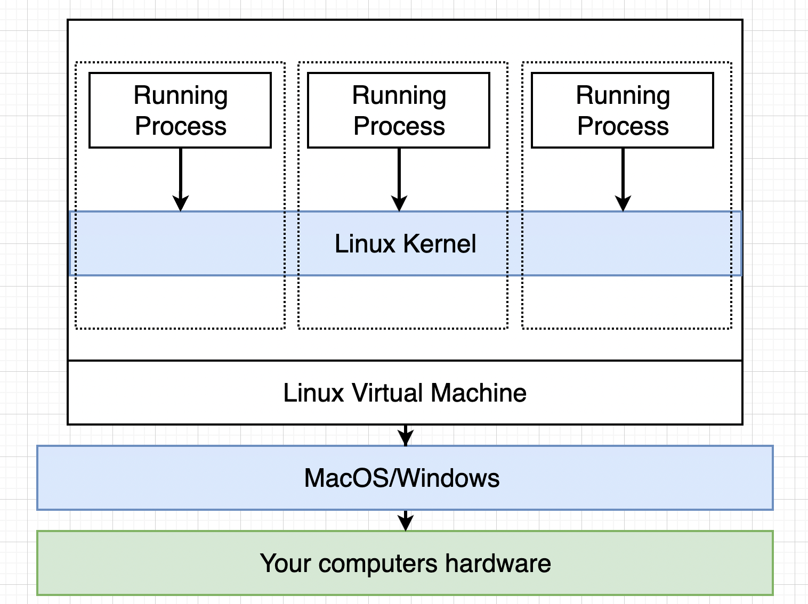

= Docker and Kubernetes - Stephen Grider
:toc: left
:toclevels: 5
:sectnums:
:sectnumlevels: 5

NOTE: NOTE

TIP: TIP

IMPORTANT: IMPORTANT

CAUTION: CAUTION

WARNING: WARNING

== Docker and Kubernetes: The Complete Guide - Stephen Grider

=== Section 1: Dive into Docker !

==== What is Docker !

In the last section, we tried to answer the question of why use Docker? And we eventually said that we use Docker because it makes it really easy to install and run new software on our computer. We're not going to try to answer the other big question here, which is what is Docker? Well, this question is a lot more challenging to answer. Any time you see someone refer to Docker in a blog post or an article or a forum or wherever it might be, they're kind of making reference to an entire ecosystem of different projects, tools and pieces of software. So if someone says, Oh yeah, I use Docker on my project, they might be referring to Docker client or Docker server. They might be referring to Docker Hub or Docker Compose. Again, these are all projects, tools, pieces of software that come together to form a platform or ecosystem around creating and running something called containers. And so your immediate question might be OC, well, what's a container? That's a good question, and that's a question that we're going to be trying to answer throughout this entire course. Just a moment ago, when I ran that command at my terminal of Docker run Redis, it went through a little series of actions behind the scenes, and we're going to examine that entire series of actions very closely over time. But right now, let me give you two important pieces of terminology. When I ran that command, something called the Docker CLI reached out to something called the Docker Hub, and it downloaded a single file called An Image. An image is a single file containing all the dependencies and all the configuration required to run a very specific program. For example, Redis, which is what the image that I just downloaded was supposed to run. This is a single file that gets stored on your hard drive, and at some point in time you can use this image to create something called a container. A container is an instance of an image, and you can kind of think of it as being like a running program. We're going to go into great detail over time, over behind her to learn exactly how a container works. Exactly. *But right now, all we really need to understand is that a container is a program with its own isolated set of hardware resources. So it kind of has its own little set or its own little space of memory as its own little space of networking technology and its own little space of hard drive space as well*. So I didn't really answer the question here of what Docker is, but we did learn at least that a reference to Docker is really talking about a whole collection of different projects and tools. And we also picked up two important pieces of terminology a Docker image and a container. Now these images and containers are the absolute backbone of what you and I are going to be working with throughout the rest of this course. So let's take a quick pause right now. We're going to come back the next section, and we're going to start talking a little bit more about how we work with images and containers. So a quick break and I'll see you in just a minute.

==== But Really...What's a Container?

image::stephen-grider-docker-k8s/os-kernel.png[]

---

==== How's Docker Running on Your Computer?

In the last section, we had a long discussion about the relationship between a container and an image.We had said that a container is a running process, along with a subset of physical resources on yourcomputer that are allocated to that process specifically.We also spoke a little bit about the relationship between an image and a running container.Remember, an image is really kind of a snapshot of the file system, along with a very specific startupcommand as well.Now, one thing that I want to mention very quickly here in the last section, we spoke a little bitabout the separation or the kind of the isolation of these resources through a technique called namespacing.And we also said that we could limit the amount of resources used by these control group things as well.Now, this feature of name spacing and control groups is not included by default with all operatingsystems, even though in the last section I had kind of specifically said like, Oh yeah, your operatingsystem has a kernel to these features of name spacing and control groups are specific to the Linux operatingsystem.So name spacing control groups belong to Linux, not to Windows, not to Mac OS.So that might make you kind of question or wonder, how are you running Docker right now?You know, we are running a Docker client and we are running Docker containers on a mac OS or a Windowsoperating system.How is that happening if these are Linux specific features?Well, here's what's happening behind the scenes.When you installed Docker for Windows or Docker for Mac just a moment ago, in the last couple of sections,you installed a Linux virtual machine.*So, so long as Docker up here is running, you technically have a Linux virtual machine running onyour computer.Inside of this virtual machine is where all of these containers are going to be created.So inside the virtual machine, we have a Linux kernel and that Linux kernel is going to be hosting running processes inside of containers.And it's that Linux kernel that's going to be in charge of limiting access or kind of constraining accessor isolating access to different hardware resources on your computer.You can actually kind of see this Linux virtual machine in practice by opening up your terminal rightnow*.And if you run that Docker version command again and look at your server, you'll notice that there'sactually an OS entry on here and you'll notice that it probably doesn't have your operating system listed.Mine, for example, right here says very specifically Linux as the operating system.So that is kind of specifying that I'm running a Linux virtual machine and that's what's being usedto host all these different containers that you and I are going to be working with.So just a little bit of interesting trivia.Now, let's take another quick break right here.We're going to continue the next section and start digging into the Docker client a little bit more.So a quick break and I'll see you in just a minute

=== Section 2: Manipulating Container with the Docker Client

